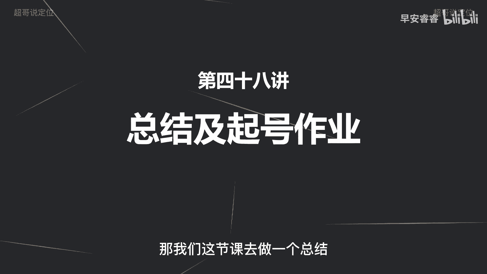
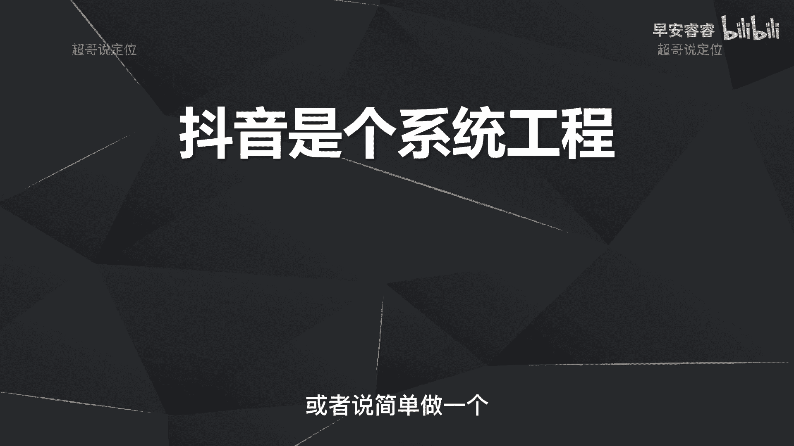
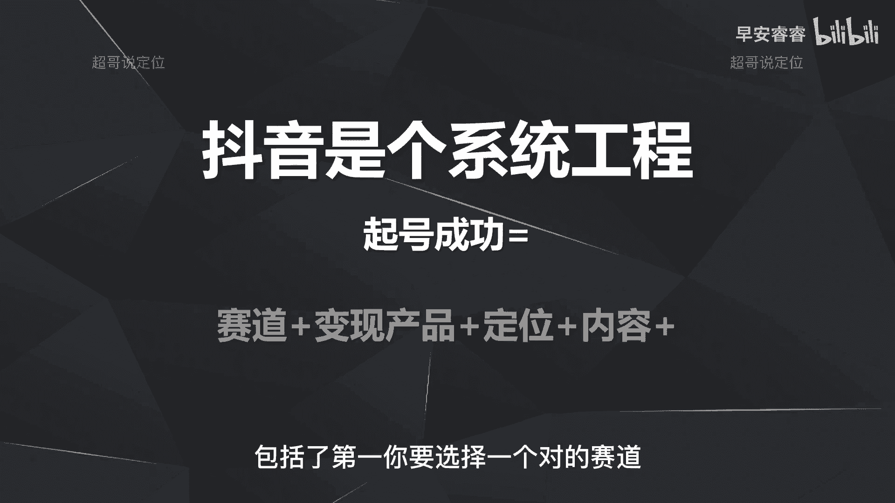
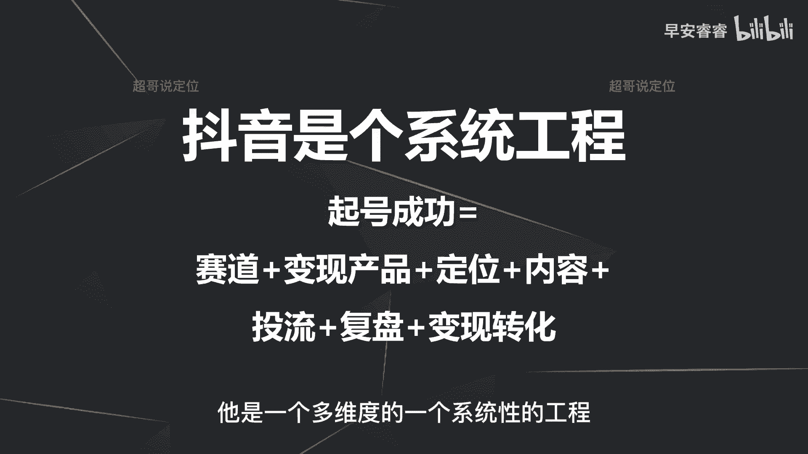
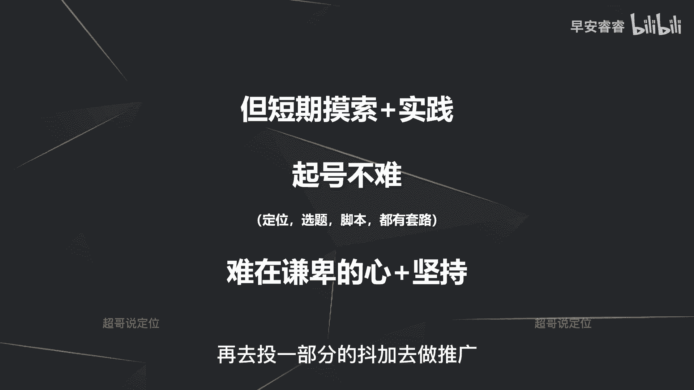
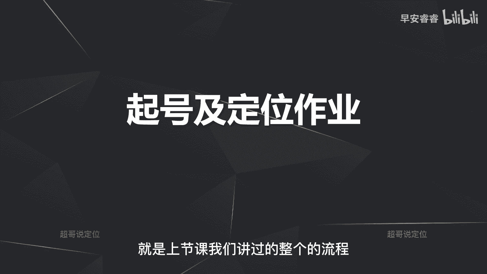
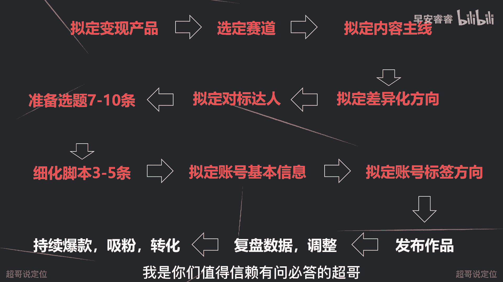

# 085 2023短视频起号·差异化定位课：0~1做懂抖音（定位+内容+投流+运营） - P48：第48节48 总结及起号作业 - 早安睿睿 - BV1Am421T7br

好大家好，进入到我们最后一节课程，那这节课的话主要是两个方面，第一方面就是我们所有课程完了以后，上节课也复盘了整个的旗号的一个流程，一个思维导图，那我们这节课去做一个总结。

以及去布置一个作业，那总结的话我想去说一个东西，就是我一直在强调抖音是一个系统工程，而且我一直在强调抖音比做生意还难，因为做生意你只需要去选址，然后去准备好自己的菜品，然后去招人，然后直接去推广。

然后就会有稳定的客流进来，但是抖音是一个系统课程，它会比做生意更难啊，他不是说你简单做一个推广就能解决，或者说简单做一个产品的定位就能解决的。

抖音它包括了哪些呢，包括了第一你要选择一个对的赛道。

第二你要去提前构思，你要通过什么产品去变现，第三再去做你的账号的定位，第四再去想你的内容怎么样去做，第五呢再去配合一部分的投流策略，然后有了投流，有了内容之后有了数据，然后你去做复盘。

然后最后再去吸引粉丝去做精准的转化，所以说抖音会比你做生意会更难，它是一个多维度的一个系统性的工程。

但是呢抖音也没有想象中的那么难啊，因为什么呢，因为之前呢46节课都已经说过很多东西了，就是你只要短期的摸索加实践之后，你就会发现定位旋踢脚本都是有套路的，所以我想说包括头牛也是有套路的，这些套路呢。

在前面的46节课都已经讲的很清楚了，所以为什么我会说短期的摸索和实践之后，你会发现起好发作品啊，让一条作品能够报有个5万甚至10万，以及更高的播放量，实际上并不难，但难在哪里。

难在的是你要有一个谦卑的心，以及要持续的坚持，谦卑的心怎么理解，就是你一定不要太主观的去做这件事情，就觉得我精心准备了一条作品不好，就是因为系统的问题，而不是我的问题，再比如啊你看那个博主。

你觉得啊内容你不喜欢，你就会觉得很撇，不想参考，而不是这个逻辑一定是谦卑的心，任何比你做的好的账号，任何比你变现能力强的账号，都是你要去参考和学习的目标，而且如果说你的作品数据不好啊，质量不好。

那一定多从自身找原因，因为抖音是一个很公平的平台，不公平在哪里，就是超能力，可能别人比你钱多，他头流比你成本大，可能你一个人在做账号，可能别人十个人同时在做一个账号，团队比你强大，那就是这就是超能力。

但是除此之外他是相对公平的，就比如说你也是一个人做好，另外一个人也是一个人做好，那他能做起来，一定是因为他的作品数据反馈给系统，系统知道他的作品数据更好，就会给到他更多的播放量。

那这个逻辑在第一节课就讲过，因为抖音要的是用户的停留时长，谁能够让用户在抖音上面停的更久，系统就会给谁给到更多的播放量，所以说作品的数据反馈了你的作品的质量不好，多从自身去找问题，五秒完播率为什么不好。

然后互动数据为什么不好，有了点赞，为什么没有分享，没有收藏，有了点赞，分享和收藏，为什么吸粉吸不上来，一定要从自身去找问题，然后多去看，多和别人好的作品去对比，然后去总结去调整，第二呢就是要坚持。

因为变现没有那么简单啊，也没有那么难，这个难在哪里，难在要构思变现产品，那简单在哪里，简单在有套路可循，就比如说你是做知识付费IP的，那你一定是靠课程变现，那如果是靠课程变现的话。

你实际上不需要特别大量的粉丝，你只要有个几千的粉丝，你就可以开始卖课变现了，那如果你要是做的其他的一些垂泪赛道，比如说美妆美食，亲子或者说呃数码种草等等，那这些赛道它的变现方式又分两种了，第一种带货。

第二种广告，那除了知识付费的IP之外，如果你要做一些其他垂类赛道，比如说美妆美食，然后亲子教育以及啊种草测评等等，那这些赛道它的变现相对来说会略慢一点，因为他对粉丝量会有一定的要求，因为我之前已经讲过。

通过橱窗带货不是一个很好的选择，但是直播带货是一个很好的选择，所以前期要去看一下自己能不能提早的去开播，然后去卖货，如果做不到这一点，那你呢变现的方向就是通过广告，那如果是通过广告变现。

那你就要去沉下心来好好的去打磨作品，而你只需要一条作品能够爆掉啊，有个几10万50万以上的播放量，那你的粉丝一下就会上来啊，上来以后就自然会有合作方找你进来，去做一些付费的合作。

包括我们给一些客户做账号定位的时候，在梳理他们对票达人的时候，就会发现很多账号都是18年一九年起，到现在也才十几万的粉丝，慢慢的才开始接广告啊，所以我就说第二点就是一定要坚持。

只要你的作品还可以的情况下，那你就要耐得住寂寞，然后去坚持，然后争取快速的能有一条作品去爆掉，那你就能够快速的上道，因为有了变现以后，你做这个第一是信心更足，第二是变现产生的收入，你可以再去追投啊。

再去投一部分的抖下去做推广。

然后这就会形成一个良性的一个循环，那整体的这个旗号和定位的这个课程，我们就已经讲完了，那最后再来布置一个作业，那这个作业是什么呢，就是上节课我们讲过的整个的流程啊。

自己去梳理一下，尤其把标红的这一部分梳理清楚，然后可以发给我，我们来帮你做一个诊断啊，就是我们的课程你整个看完以后，不是说不管了，你看完我们的48节课之后，你可以根据我这个逻辑整体的梳理一遍呃。

举个例子，如果比如说你在梳理到差异化方向这一方，你自己卡壳了，那你就反过来再去看一下，差异化的那五节课程，去看一下差异化怎么做，比如说如果你在做选题的时候，你又卡壳了，那你去看一下我选题的课程。

然后去看一下选题怎么样去做，然后把这红色的部分全部都准备好，可以发给我，我们来给你做一个诊断好，我们的整个的所有的课程就已经结束了啊，然后除此之外，你们在过程中有什么问题都可以找我来沟通。

我是你们值得信赖。

有问必答的超哥啊。