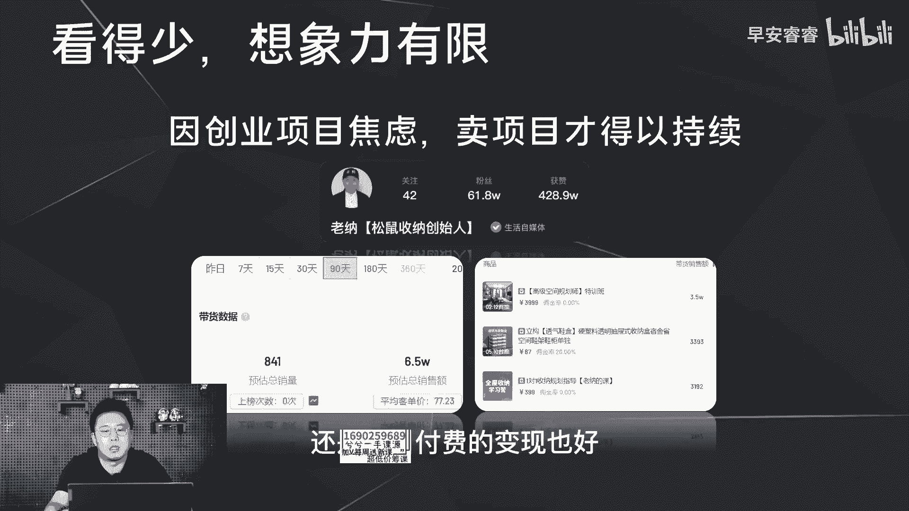

# 085 2023短视频起号·差异化定位课：0~1做懂抖音（定位+内容+投流+运营） - P4：第04节4 起号的四种思路 - 早安睿睿 - BV1Am421T7br

那上节课我们讲完了选择赛道的两个竞技点，两个坑不要去踩之外，我们今天去讲一下旗号的四种思路，第一种的话就是根据你的兴趣和你的特长出发，但这里面还是要再去赘述，还就是一定要去做能变现的兴趣和特长。

那左边这些那相对来说就是你做，但是他也没有好的变现模式和变现模型，所以你千万不能去做，那右边呢你就可以去做，就是这些是你的特长，然后你把它作为内容去输出之后，一定起号会起的更快。

那变现的话相对来说可能也会比较良好，但是像左边这一类的爱好，它不能有一个好的变现方式，不代表你需要去摒弃它，那你可以保留它，因为这是你的加分项，怎么去保留呢，第一种方法就是在内容上面去做加法。

举例如果你现在是选择了去做美食这个赛道，那你可以用你的特长，唱歌去作为一个内容上面的加法，比如说你的每一期的内容就可以边唱歌边做饭，那这样你的账号在内容上面就会有一个，新的差异化。

那比如说你如果是做美妆赛道，然后你平时的兴趣爱好呢就是看电视看电影，那你可以去结合你这一块的特长，在美妆赛道里面去做内容上面的加法，比如说你的每一期的视频内容呢。

就可以去解说影视剧里面一些人物的妆容特色，然后去分析去测评，除此之外，你还可以在人设上面去做加法，比如说还是在美食赛道，那你可以去做一个啊会打游戏的厨子的，这样一个人设形象。

就是你每一期的视频可以是挑战，边打游戏边去做菜，或者说结合游戏里面的装备，然后去做一些游戏里面的食谱，这样去做，那你的人设的差异化也就出来了，那也是一样，那如果是在美妆这个赛道，然后你的爱好是旅游。

那你可以每一期的视频内容呢，就是去结合不同的景点的景色，然后去搭配不同的妆容，这样去拍定妆照，那你的差异化也出来了。

那以特长和兴趣爱好出发去起好呢，它的变现模式主要是三个方向，第一种方向呢就是知识付费，比如说画画，你可以去做画画课程的输出，第二种方式呢就是一些广告植入，第三方面的话就是呃带货，第二种的起号思路呢。

就是根据你的职业和职能出发啊，这里的话就想去重复去说一件事情，就是任何职能在抖音上面都值得去放大，比如说如果你的职业是律师，那你在抖音上面可以去做法务服务，一对一的这种服务的变现以及课程的变现。

如果你的职业是一个插画师，那你在这上面可以去输出插花课程的变现，那英语老师啦，营销专家啦，摄影师都是以此类推，所以说任何职能在这个平台上面，都都值得去放大，也应该去放大。

那很多人没有意识到这一点的原因，实际上就是因为自己平时刷抖音的时间太少，看的号太少，所以自己的想象力有限，那我这里面去举一个例子，像今年2月份才起的一个号。

叫做IPPT的房金，他现在目前三个月，他通过卖PPT的课程，这一块的卖课收入就有200多万，所以说因为认知差，就是你所在的这个职能，很多人不懂，那他又有这个需求，然后因为这个认知差。

所以知识付费就有了空间，那除了卖课之外。

还有一种变现方式是什么，还有一种方式就是卖项目，就现在目前很多人都很焦虑，都想去做一些创业项目，但是很多创业项目动辄二三十万甚至更高，那有一些小本的创业项目，目前在抖音上面就相对来说变现的会比较良好。

比如说这个号，这个号是一个做收纳的这样一个号，他会讲一些收纳技巧，然后以及创建自己的一个品牌叫松鼠收纳，那他通过卖这样的特训班，然后现在三个月的话基本上变现在67万左右。

所以说你的这项职能的专业能力够突出，以及你有很强的经验沉淀，你应该去在抖音上面去做你的个人IP，去做知识付费的变形也好，还是项目付费的变形也好。

那以职能的角度出发去起号，它的变现方式实际上也是四类，就是知识付费，项目付费以及广告和带货，第三种巧巧思路就是你如果你既没有特长，然后你的职业也比较平平无奇，那你不妨去选择一些大的流量池。

就我们上一节课已经说过，哪些是大的流量池，但是你选择这些大的流量池，一定会遇到一个问题，就是你一定是从不懂到懂的过程，那这一定是一个学习经验积累的过程，而且一定是痛并快乐着，就据我所知，很多美妆的头部。

实际上他们起号的过程就是他们学习的过程，他也是专门去报了很多的系统班之后学习，然后有了经验之后，然后再去起号，那这样的话他在这个赛道里面，它就会出来的更快，第四种起号方式呢。

就是根据你的变现产品变现模式去反推，这地方的话有两种方向，第一种方向的话就是以你的消费人群去反推，就是你的产品的顾客是谁，然后围绕这部分的客户的画像去反推，你怎么样去喜好，比如说如果你是一个卖车的。

那你要考虑你的消费群体，在抖音上面喜欢看车的用户主要是男性，那你在内容上面，可能就可以去植入一些美女的元素，一些数码的元素，然后一些测评的这种内容形式，因为更符合男性用户的这种喜好需求。

那如果你是一个卖水果的，那它的消费群体可能是女性为主宝妈，然后和年轻的女性，那你在内容上面，就可以围绕这部分用户的画像的标签，去做内容的植入啊，就我之前举过一个例子，为什么一个亲子类的账号。

然后他做了二次元的这个内容植入以后，让他的粉丝画像变得极为年轻，然后最终没办法达到很好的变现。

实际上也是这个意思，所以说以变现去反推你的旗号思路，你的内容上面不能去做主观的意向，就举个简单例子，你在亲子的赛道，那你在内容上面，你不可能莫名其妙的去加游戏这个符号吗，因为游戏可能辐射到了男性为主。

但男性并不是亲子赛道最主要的消费人群，那你这样做的话，就算你有粉丝量，你也没办法去做到很好的稳定变现，所以说在内容上面。

一定要去贴合你自己的消费群体，第二种的起号思路是什么呢，第二种的旗号思路就是以你的卖点去反推，就是你产品的卖点，比如说你的车的产品卖点是足够大，那你的内容点就可以去落脚，比如说挑战宅车生活的100天。

就是这100天，我睡在车上，吃在车上，然后去展示这个空间的大啊，目前有一个特斯拉的一个女神账号，她就是这样做的，比如说你的产品卖点呢是减脂的效果比较好，那你可以去做记录减脂的全过程啊。

整体就是这样。