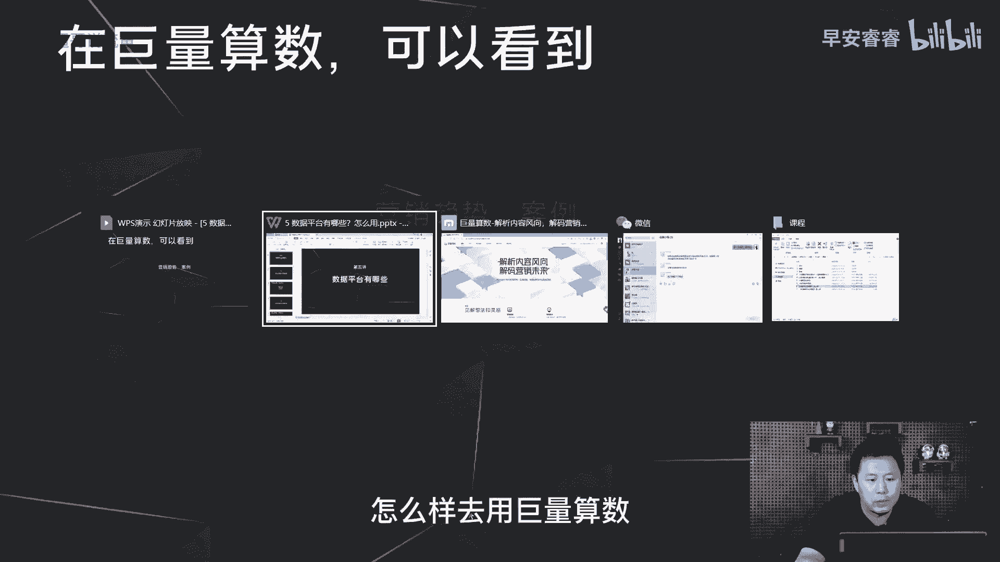

# 085 2023短视频起号·差异化定位课：0~1做懂抖音（定位+内容+投流+运营） - P5：第05节5 数据平台怎么用（1） - 早安睿睿 - BV1Am421T7br

大家好，我是超哥，今天我们去讲一下，做抖音有哪些数据平台可以去使用，那第一方面呢就是在巨量算数这个平台，我们可以看到大盘数据，这个大盘数据呢，不光可以看到每个赛道的基本数据，包括它的播放情况。

包括它的内容的情况，以及它的用户画像，以及也可以看到每个词条之下的这些数据分析，那在巨量算数这个平台里面呢，首先我们看到营销的一些趋势，包括一些案例的分析，我这边就实操给大家来分享一下。

怎么样去用巨量算数。

这是巨量算数的首页啊，一方面可以通过PC端口登录，第二方面的话可以在你的抖音，然后点开搜索之后，选择巨量算数，然后在手机上面也可以实现这些功能，第一方面的话就是在洞见这里，可以看到一些营销的趋势。

包括一些抖音，给到我们的一些案例分享。

以及一些垂类赛道的案例，那在这个算术报告里面也是一样，以月为单位，平台会更新一些新的垂类赛道的分析报告，那这样的话我们根据这些报告，其实就可以了解到，每个锤类现在整个的发展的进程。

包括一些呃可以去复制的一些经验，那第二方面的话可以在巨量算数，看到各个词条基本的一个情况。

在这里去输入我们想搜索的关键词，比如说减肥这个关键词，那这里可以看到第一个，他的抖音上面的基本的一个指数情况，你比如说搜索指数60。8万，然后综合指数37。2万，相对来说就代表了这个词汇的内容。

在抖音上面的声量，就流量池大概是什么样一个水准，那第二方面的话，在这三个维度可以看到这个词汇相应的内容，在抖音上面基本上是利于传播的，还是搜索高的，那这款就可以看到哈。

减肥这个词汇在抖音上面搜索量比较高，然后呢这种内容也会比较好传播，但是关于减肥相关的内容，相对来说还是属于一个有空间的状态，那这样去判断的话，那减肥相关的内容在抖音上面是值得去做的。

而且一定要去做好你的关键词，因为后期会有很多的主动搜索，这一块的流量进来，我再多加一个词汇，这样的话会更直观地看出来，这个词条之下的内容，到底是什么样一个指导价值，那这地方可以看到绿色这个词条是装修的。

蓝色这个词条是减肥的，那这就可以对比出来了，那绿色这个词条装修的内容，在抖音上面，相对来说没有减肥的内容的流量之大，这地方就可以基本可以看出来，以及拿两个词条去对比，这里就可以看到减肥这个词条。

在抖音上面的搜索量就会很高，那装修这个词条和减肥这个词条，在抖音上面都是比较利于传播，而且内容相对来说都比值较少，所以就是我们在选择做一个内容的，主方向的时候，可以用巨量算数的这个词条分析。

先去看一下这个词条的内容，本身在抖音上大概是什么样一个流量情况，那第二步呢我们去看一下这个词条，相应的关联分析，还是以减肥取例，那这里可以看到有两个维度，第一个是内容关键词，第二个是搜索关键词。

内容关联词就是减肥相关的内容关联，还有哪些其他词汇，比如说美食瘦身，跑步好身材，那这里要去多说一下，其实我们判断一条作品，到底AI系统会给我们推送给什么样的人群，实际上跟这个内容关联词有一定的关联。

因为系统推流取决于几个方面，第一你这条视频里面随机抽几帧，然后就是每一个定帧之内，你的画面里面有什么样的文案，以及你的画面里面有什么样的元素，那根据这些去判断到底要去推流给哪些人群，除此之外的话。

他还会去判断你的封面里面的内容，以及你的呃标题里面的内容，你的标题里面的话题绑定，根据这些去决定推送什么样的人流，来看你这条作品，那怎么样能够让你的这条视频覆盖到，你想去推送的人群呢。

那实际上就是在内容上面去做多关联，比如说你这条视频是讲减肥相关的视频，那你在内容里面可以多去植入，这些相关联的内容关联词，比如说瘦身跑步，那第二个维度就是搜索关键词，搜索关键词是指导的。

是你的标题应该怎么样去写，就代表了这个简单来说就是在抖音上面，关于减肥相关的搜索，基本上都会去搜索这些词条，所以说在你去做标题的时候，可以去用这些词条去做组合，就跟小学生去做造句一样。

那举例如果这一条视频是讲减肥相关的内容，那我的标题可以用这些词语去造句，那我就可以组合成爬楼梯，真的能减肥吗，还是喝黑咖啡，还是吃全麦面包，还是跳绳，就你这样写完标题以后，其实后期搜索相关词条的用户。

都可能因为你的这条标题而产生一些，搜索的流量进到你的这条视频里面，那第三个维度呢，就是去看这个词条之下的人群画像是什么样，一个结构，包括了地域分布，就是哪些城市的人对于减肥的内容会比较的care。

然后以及的年龄分布，以及了男女的性别分布，以及了兴趣标签的分布，那这个兴趣标签呢，就可以指导我们在减肥这条内容上面，怎么样去绑定其他的内容标签去做加法啊，举个简单的例子。

那很多的用户可能在减肥的逻辑上面，还关注的一个标签是舞蹈，那我就可以在内容上面去做一部分的舞蹈，加减肥的这种形式，那更符合减肥人群画像的兴趣分布，那在巨量算数上面，整体的内容词条怎么样去看。

就是通过算术指数里面去输入关键词去看，那第三方面的话就是去看赛道的情况，举例我们去看时尚这个赛道，首先可以看到这个赛道里面的热门关键词，热门事件以及一些潜在的热点，包括热门的话题。

当下的热门饰品又有哪些啊，第二方面的话在内容生产分析里面，我们可以看到第一个叫做内容生产比，内容生产比是什么意思，我以半个月来看，内容生产比代表了每天平均有多少个用户，发出了多少个视频。

那时尚赛道呢就意味着像7月10号这一天，平均每一个创作者都会发12。32条作品，这个数字呢就相对来说比较的夸张啊，去看一些优质的赛道，比如说美食，每个用户每天最多发两条视频，那就代表时尚这个赛道。

创作者每天发出来的视频很多，所以你就要去跟他们去做量的堆积，然后去取胜，这就证明了这个赛道确实会比较卷，那除此之外，在内容生产分析里面也可以看到，这个赛道目前的内容输出大概是什么样，一个时长分布。

这地方就可以看到，做长视频的创作者相对来说就会比较少，这是一个空白点，以及创作者的画像，但创作者的画像实际上没有太大的参考价值，那我们去看消费分析，消费分析就是需求量的分析。

首先第一个也是可以看到绿色这根线，就是目前的消费需求，就是有多少用户想看时尚相关的内容，那蓝色这根线呢就是供给需求，就是有多少内容在输出，那这地方就可以看到以半年为周期，那时尚这个赛道整体的需求量。

是没有大的变化的，你像今年1月份是在这里，现在是在这里，但是呢供给量就是生产量，内容的输出量是猛增的，像今年1月份的时候是在这里，那但是像6月底和7月初的时候，基本上在这样的一个高位。

也就意味着这个赛道本身用户发的视频又很多，然后呢需求又没有增加，但是视频的量增加了以后，就导致这个赛道越来越卷，那第二方面呢，可以看到这个赛道目前的完播率和互动率，基本的一个指标情况，那这里就可以看到。

而在时尚这个赛道来说的话，30~60秒，是一个相对良好的时长分布的选择啊，因为互动率的指标相对来说会比较低1。3，那完播率呢7。03，也就意味着我如果在时时尚赛道里面去做视频。

那我选择去发30~60秒的视频，我的完播率如果能够达到9%，或者10%，或者我的互动率能够达到3%甚至更高，那我这条视频大概率就会突破更高的流量池，那底下的话就是这个赛道的画像分布，包括了性别的分布。

年龄分布以及地域的分布，那巨量算数的话，整体就是可以看到这三个方向的内容，在我们选择一个赛道之前，有必要先去在巨量算数去看一下这个赛道的，基本上的竞争的情况，以及它现在竞争到底是属于个红海蓝海。

以及它的时长分布到底机会点是在哪里，然后在这之下我们在构思内容的时候，去看一下，我们这个内容在这个平台上面到底是什么样，一个内容的声量，它是利于传播呢，还是搜索量比较大，以及这个内容之下。

我的内容关联到底应该怎么样去做，这样才能让我们的视频更容易去突破流量池啊。

