# 085 2023短视频起号·差异化定位课：0~1做懂抖音（定位+内容+投流+运营） - P6：第06节6 数据平台怎么用（2） - 早安睿睿 - BV1Am421T7br

上一期我们分享了大盘数据怎么样，看之后，我们接下来去讲一下，如何利用一些自由的平台和第三方的平台，去看对标账号的数据，因为这个在我们选择对标达人，以及在选一些内容参考的时候，会十分的有价值。

那第一个平台呢就是巨量星图，巨量星图和巨量算数一样是抖音自身的平台，所以他的数据极为参考价值，那在这个平台上面的话，我们可以看到几个东西，第一方面的话就是这个对标账号的基本数据啊，以及它的变现情况。

以及他的完播率和互动率，这个会很重要，因为你在其他平台看不到你的对标账号，他的完播率的情况以及他的粉丝画像，那接着我来实操给大家分享一下。

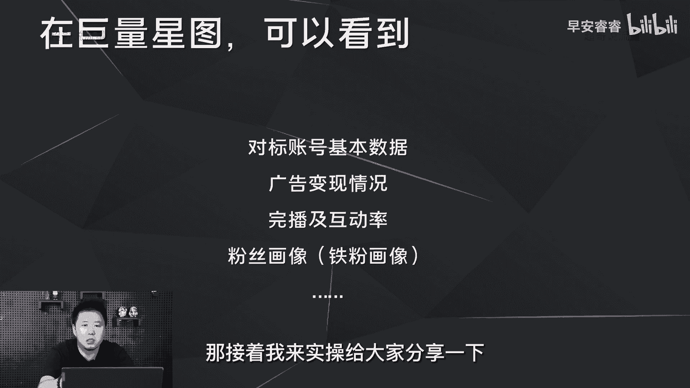

首先打开巨量星图这个网站，这个网站的话是需要你有营营业执照，以商家的身份去登录，然后再选择达人的时候，才能看到这些达人的数据，那后续如果你们想去看一些对标，达人的数据的话，你可以直接跟我联系。

我来帮你查，那首先我来讲一下怎么操作，比如说我们随便点开一个账号，那首先在传播表现，这里我们可以看到这个达人近30天，90天它的完播率，互动率是多少，以及发布了多少条作品。

以及他的每条作品的平均时长是多少，互动数据是多少，以及在这里呢，就可以很清晰的看到每条作品的播放量，以及互动的数据啊，包括这地方可以点开视频来看，那除此之外还可以看到这个作者他这30天。

90天接了多少条广告，每条广告的报价是多少钱，接着呢，在受众分析这里，可以看到这个达人他的观众画像，就推流推出去的画像是什么样一个情况，那粉丝的画像是什么样一个情况，以及铁粉画像，那这地方比较关键的。

就是你在这个对标达人的粉丝画像里面，可以看到他的粉丝画像的兴趣标签是哪些，那在前期的时候，如果你的兴趣标签和你的对标达人的兴趣标签，基本上是一致的，那你的账号实际上就被打上标签了。

那在巨量星图里面其实可以看到一些数据，在第三方平台是看不到的，不管你是在馋妈妈还是在飞瓜还是在星斗，有一些数据你是看不到，但这些数据对你选择对标达人来说是极为重要，比如说第一个方面就是完播率和互动率。

那第二个方面呢，就是他每一条作品的播放量到底是多少，以及互动数据，因为什么呢，因为你们在选对标达人的时候，如果自以为某一个账号看上去数据比较漂亮，而且你觉得它内容你喜欢，你去选择对标达人。

那极有可能你会做翻车，举个简单例子，如果你在选择一个对标达人的时候，完全靠自己的主观，就是你觉得他的内容做的很漂亮，然后数据啊，赞呀，粉丝呀，包括他的呃互动啊，这些都很漂亮，你以为就很好。

你就想去对标它，然后最后你不知道，它的完播率可能只有1%到2%，你一比一去复制它的内容，或者复制它的脚本逻辑，那意味着你做出来的视频，完播率肯定是在1%到2%，那这样之下的话，你怎么样去突破流量池呢。

我们要知道，目前来说很多达人的做法都是靠投流，或者说做数据出来的，也就意味着你在外部看到的很多数据，实际上都是假的啊，所以在你选择对标达人的时候，如果不在星图上面去看他的这些完播率的情况。

以及他的基本的互动数据的话，那你极可能选择对标达人的第一步就做错了，然后导致你最后做了两三个月以后也出不来，流量，出突破不了，慢慢自己就没有信心，所以说巨量星图在选择对标达人这件事情上，是极为关键的。

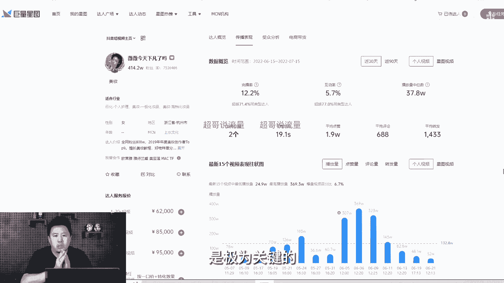

那接下来我们去看第三类的平台啊，第三类的平台的话就是一些第三方的平台，包括飞瓜查妈妈星斗，那在第三方的平台呢，我们除了可以看到账号的基本数据之外，还可以看到他的带货变现情况，这里我实操一下。

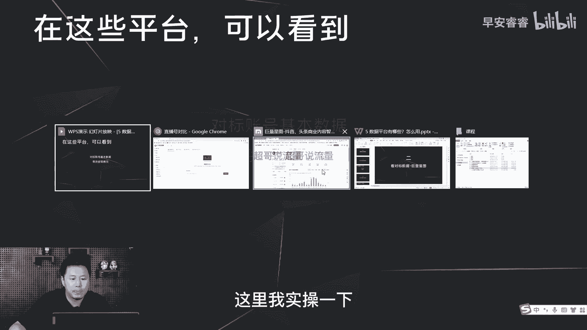

我们选择飞瓜打开以后，选择达人搜索，这里随机点开一个博主，比如说小杨哥，这地方可以看他30天的涨粉情况，他30天的更新视频的数据情况，以及在这里可以看到他带货情况，以及每一个产品的销量。

以及到底是哪一场直播或者哪一条视频。

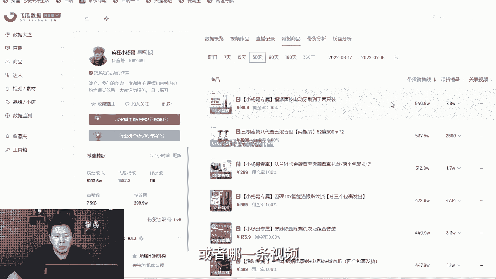

把这个产品带出去的，在这里我们都可以看到很详细的一个数据，那除此之外。

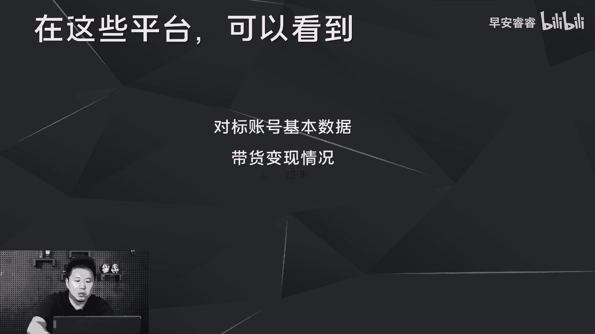

我们还可以看到其他的一些大盘数据，比如说在达人排行榜这里可以看到以日为单位，每天的涨粉排行，那在视频素材这里面可以看到热门的素材，最近热门的视频是哪些，最近热门的音乐，最近热门的话题。

以及在热门视频这地方可以选择低粉爆赞，就是有一些可能粉丝量并不大的博主做出来的，这种高赞的视频，对于我们前期起号做参考来说是十分有价值的，包括点开上面的数据大盘，这里可以看到整个的直播大盘分布。

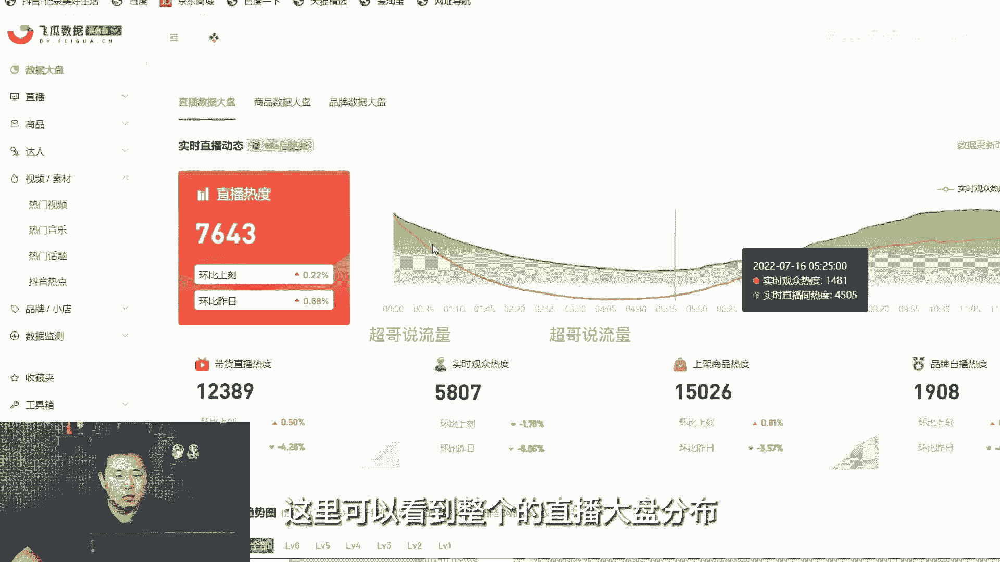

包括每个赛道的直播的情况，那第三方的平台，实际上大概就是看到这样的一些数据，那对我们来说的话，我们实际上基本上在选择对标达人之后，我们一方面在新图上面去看它的，基本上的一些完播数据。

那在第三方的平台呢就去看他一些带货的数据，这样的话我们选择对票达人的时候，可能才会更加的精准，除此之外，我们平时在做抖音的过程中，还有两类的平台会比较好用，一方面是像青岛这样的小程序。

一方面的话就是抖音自己我们自己的后台，那首先我就想去讲一下我们自己的后台，我们可以得到哪些东西。

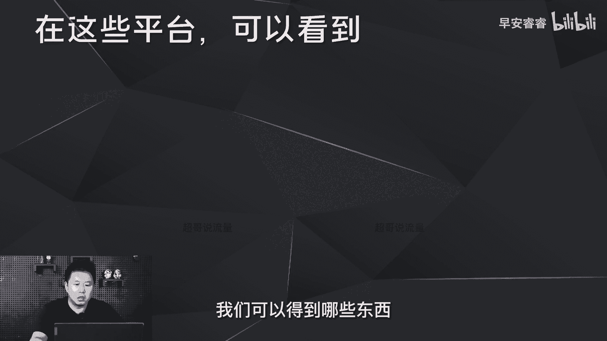

那打开这个后台以后，我们首先第一方面在创作灵感，这地方也是可以看到每个赛道之下，他的创作热点话题搜索词是什么，我们在创作热点，这里面可以看到一些潜在的热点是什么，就每个赛道里面潜在的热点是什么。

以及可以看到同城的热点榜是什么，在活动日历这里面，我们就可以看到每个月，平台推出来的哪些流量的活动，这一块的话我们就可以去复盘，比如说我们可以看去年的8月份，平台推出了哪些活动。

然后来指导我们8月份提前去预备哪些内容，选题啊。

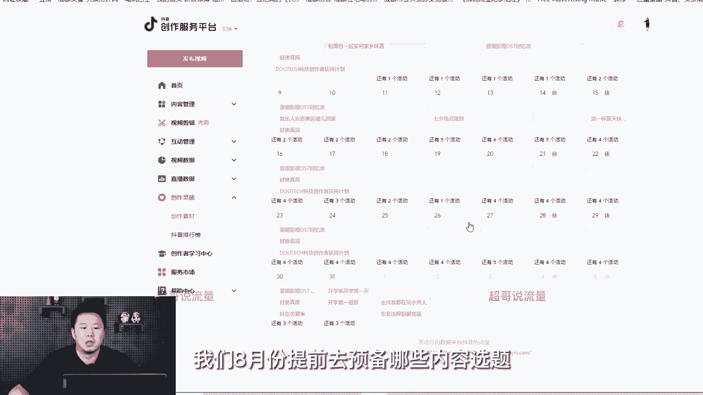

这一块对于我们做选题来说的话是十分有用的，那第二类的软件呢，就是比如说青斗这样的小程序，那依托于青斗这样的小程序，我们可以得到什么东西。

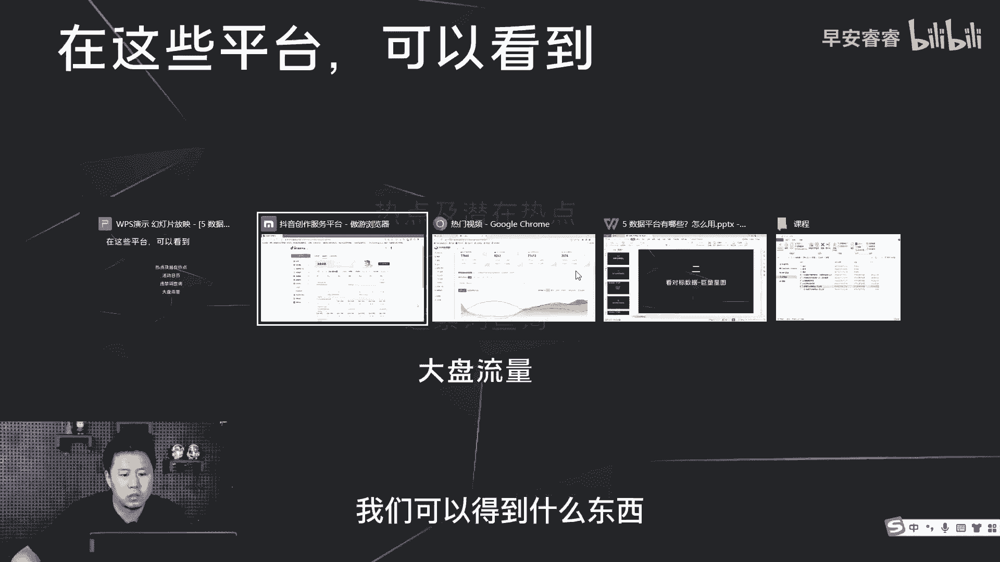

那这里我也是去实操一下，那这个就是轻抖小程序的页面，首先我们可以去看一下自己账号的权重，而且可以阶段性的去看自己的权重，到底有没有提升啊，或者有没有哪些方面，比如说你的活跃分还是内容分。

相对来说会有上升还是下降，第二方面的话，就是我们如果想去copy1些好的文案，或者一些好的视频内容，那点开文案提取之后，把链接复制进来，然后整个的文案就全部出来了，那除此之外。

可以看到自己的视频内容到底会不会过审，你把一条内容文案写完以后全部复制过来，然后立即检测，检测出来的结果，就会告诉你哪些词汇可能是违禁的，你就需要用拼音去把它替换掉，第四方面呢就是之前说过。

在抖音大盘这里面，可以看到每个流量池基本的一个分布情况，直到我们到底去选择哪些大的流量池去做。

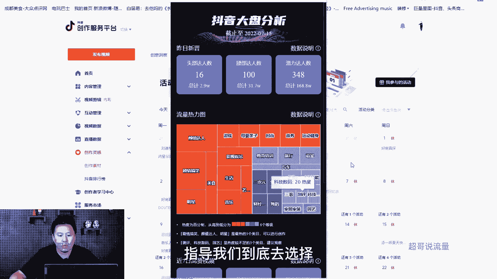

那最后我们来整体总结一下，在选择赛道，在选择一些内容方向的时候，需要去通过巨量算数去做这些内容，那最后去做个总结，那就是在我们去选择一些赛道，和选择一些内容选题的时候。

可以在大盘里面去看到这些数据的情况，那选择完赛道，选择了我们的内容的输出的基本的点之后，我们可以再去张新图，以及在飞瓜蝉妈妈这种的第三方数据平台，去看到对标达人的基本的情况，那选完对标达人之后。

在输出内容的时候，我们可以借用这两个平台，第一去看你的内容到底能不能过审，第二在这些平台去看到一些好的选题，到底是什么，然后一些潜在热点到底是什么，以及一些热点的音乐，热点的话题。

热点的搜索词到底是哪些，然后去做我们的内容的植入和搭建啊。

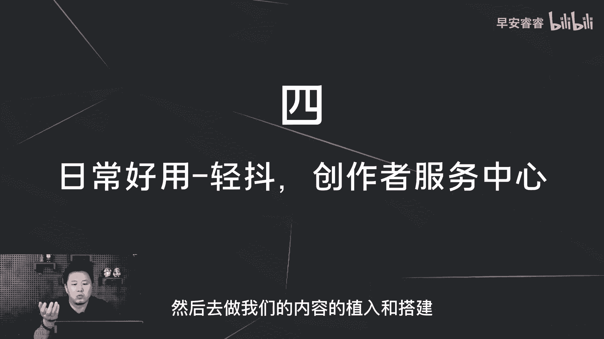