# 085 2023短视频起号·差异化定位课：0~1做懂抖音（定位+内容+投流+运营） - P7：第07节7 如何看懂数据（1） - 早安睿睿 - BV1Am421T7br

今天我们来讲一下怎么去看懂抖音的后台数据，那首先我们要清楚，在抖音上面能看到哪三类的数据，第一类的话就是账号数据，就是我们账号的一个基本情况，第二类的话就是我们的粉丝数据，看我们的粉丝画像结构。

第三类的话就是看我们的作品数据，看完每一条作品的复盘数据之后，我们才清楚我们的作品内容应该怎么样去调整，往哪一个垂类继续去做深挖，那这些数据在哪里去看到呢，首先在我们的手机后台可以去看到。

第二的话就是在你的PC端口，搜索抖音创作服务平台也可以看到这些数据，那首先我们来说第一类账号的数据，账号的数据的话相对来说是最基础的，而且也是最宏观的，它给到我们分析数据没有太大的指导意义。

所以这里我就快速的过一下，首先怎么样去看我们的账号数据。

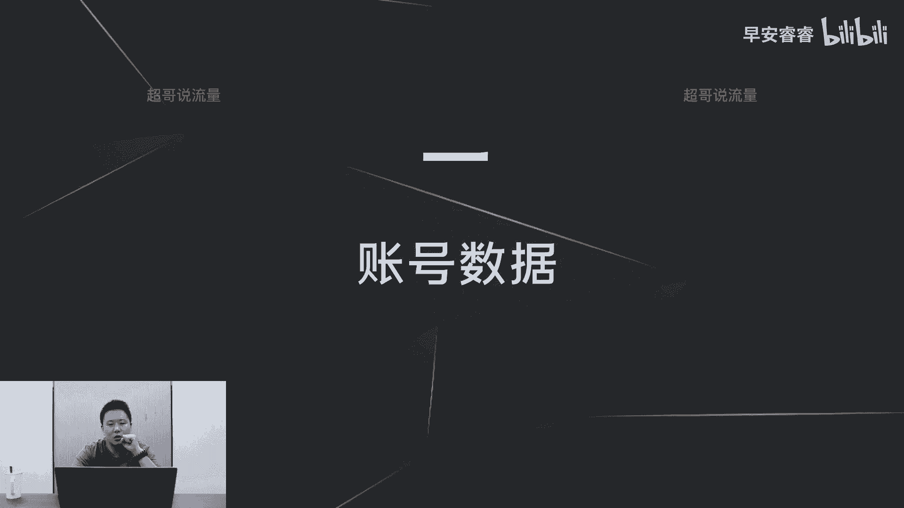

在我们的首页点击右上角的三条杠，接着点击创作服务中心。

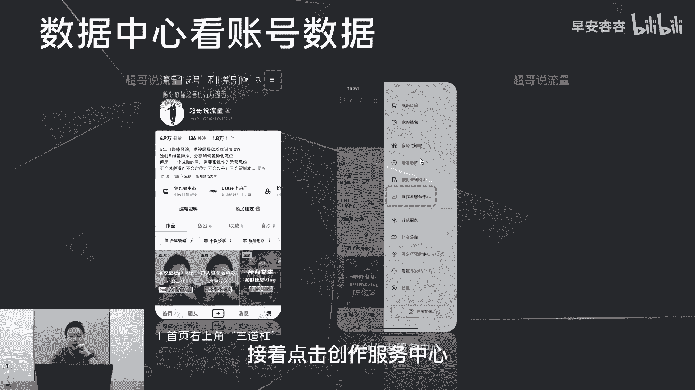

接着点击数据中心，接着我们就可以看到第一个五维图。

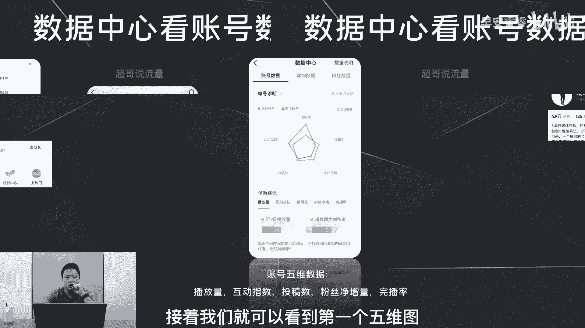

可以看到我们在这五个数据维度之下，和同类账号的对比，我们就可以很清楚，这七天我们究竟比同类的账号。

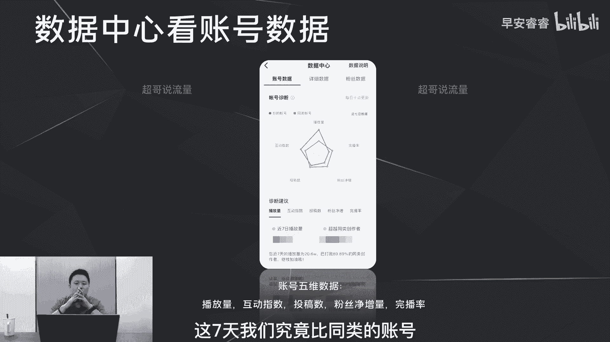

到底是播放量差了还是粉丝的增量差了，然后接着的话第二部分，我们可以看到这每个维度以日以周，以月为单位的一个曲线变化，这样我们就可以很直观的看到，我们每一个数据维度，每一天的一个变化到底是升了还是降了。

接下来怎么样去调整，那整个的账号数据，就是这些它相对会比较宏观啊，接下来看第二方面的话就是粉丝数据。

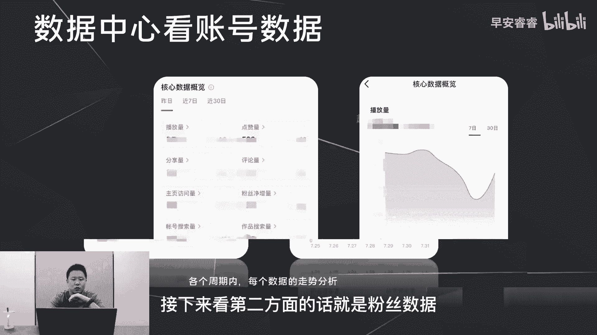

那在哪里去看我们的粉丝数据呢也是一样，进到我们的数据中心之后。

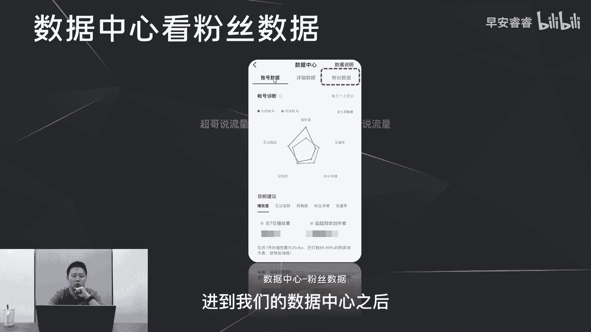

点击右上角的粉丝数据，点开我们首先可以看到我们的粉丝的画像。

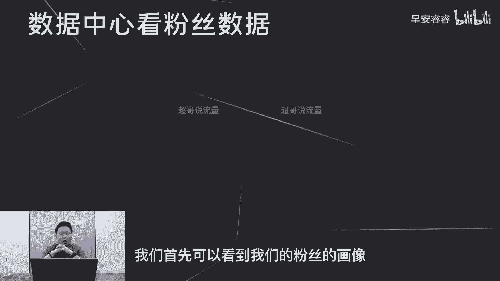

就是性别的分布和年龄的分布，接着可以看到我们粉丝热门在线时长的分布。

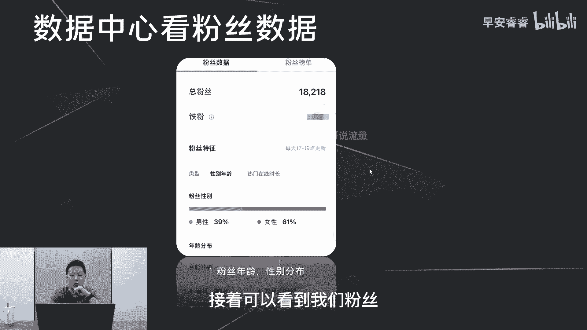

这里要重点去说一下，假设你的粉丝的活跃时间是十点到11点，那如果你发布作品的时间是在下午的五点，那你第一波的自然流300~500，肯定会在你发完之后的两个小时左右就会走完，也就意味着你的粉丝。

大概率不会刷到你的这条作品，他就不会给你贡献任何互动数据的推动，所以我会建议你们无论是发短视频还是做直播，最好去匹配粉丝的活跃时间，这样你会事半功倍一点。

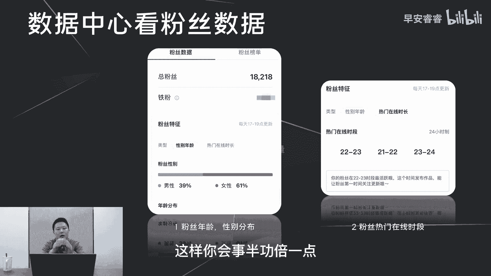

第二类的话我们可以看到粉丝的地域分布，以及他们所用的手机的设备分布，去判断他的消费能力啊，那这地方比如说你是一个做奢侈品销售的，那你的粉丝如果集中的设备是在红米上面，那你这个粉丝画像极可能就是偏了对吧。

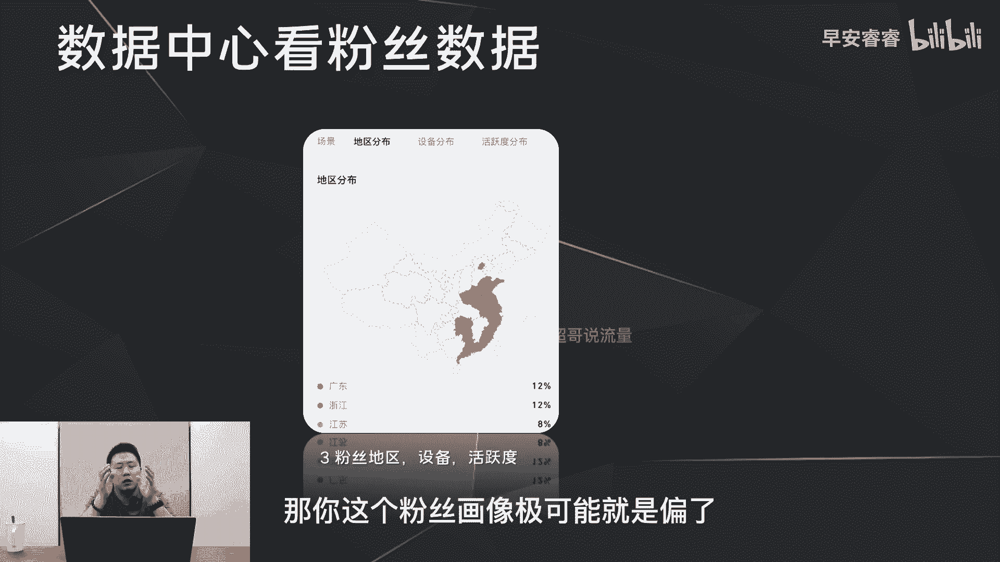

然后第三的话就是看活跃度的分布，今日这张图呢至关重要，他可以看到你的粉丝的兴趣分布，也就可以指导我们的账号到底有没有打上标签，那首先我先解释一下什么叫做随拍的这个兴趣。

它包括了啊我们看到的VLOG或者一些风景，或者一些颜值达人的唱唱跳跳，他都归类在随拍的这个大类别，所以不用过多的去纠结，我们每个人的第一兴趣标签都是随拍，所以这个可以忽略不计，你只需要去看后面的标签的。

它的一个分布是什么情况，那举个例子，如果你是一个美食账号，那你的粉丝画像的第一位，除了随拍之外的第一位是音乐，第二位是美妆，第三位是个人管理，那你大概率你的这个账号的标签没有被打上。

你的推流极可能还是偏的，因为你的粉丝画像偏了，那怎么样去修正呢，我们后面去说，所以说我会建议你们以周或者以15天为单位，去拿笔记录一下，你这个阶段到一定粉丝量级之后。

你这个阶段他的粉丝的画像到底是什么样，一个分布，慢慢的你就可以看得出来，你的账号到底的这个标签建立的过程，有没有更加的精准，那除了这些最基础的粉丝分析之外，其实还有一部分的分析叫做铁粉的数据的分析。

那需要你至少达到1万的粉丝量，有了铁粉之后，你才能够看得到你的铁粉的画像到底是什么样，一个情况，去指导你接下来的内容应该怎么样去做，这个的话后面会单独去说，就不在这里赘述了。

所以这一期我们整体先把账号的数据说清楚，粉丝的数据说清楚，下一期的视频我们会花较多的时间去说清楚，怎么样去看你每一条作品的数据好。

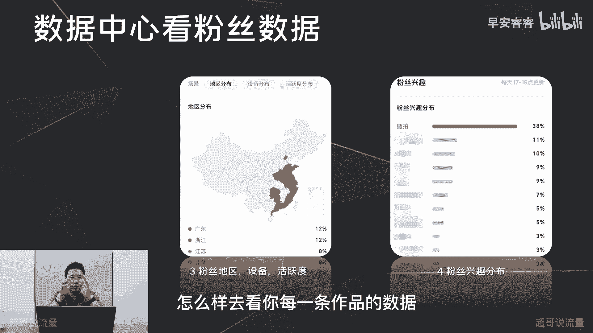