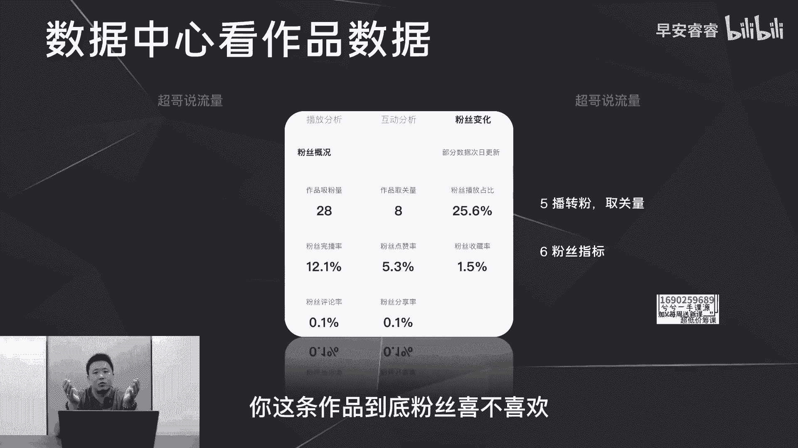

# 085 2023短视频起号·差异化定位课：0~1做懂抖音（定位+内容+投流+运营） - P8：第08节8 如何看懂数据（2） - 早安睿睿 - BV1Am421T7br

那这节课呢我们去讲一下，怎么去看我们的每条作品的数据，我建议你们可以拿个本子去记录一下，这样的话，你更清楚接下来怎么样去做视频的数据复盘。

首先点开你的数据中心，点开作品数据之后，你可以看到你这条作品的一些基本数据，包括了你的这条作品的时长是多少，平均播放是多少秒，就是每个人平均看了多少秒，然后以及你的五秒完播率是多少，整体完播率是多少。

那在这里的话，首先第一你要去关注军波市场的占比，一般来说均波时长的占比要大于30%，你才有一定的机会去突破流量池，这个怎么去算，就是你的平均播放的时长除以你作品的总时长，这个占比就出来了，第二方面的话。

你需要去关注你的五秒完播率，就是每100个人里面，到底有多少人看完你的前五秒，因为五秒完播率决定了你这条作品的生死，就像我们平时刷视频一样，如果这条作品的前两面你不会看完就划走了。

那大概率你不会看完这条作品，也不会跟这个博主产生任何的互动，或者去关注他，所以前五秒至关重要，那第三部分的话就是去看整体完播，但是这些所有都不会直接决定你能不能上热门，如果说哪一个最重要。

那一定是五秒完播，我刚说过就不再去赘述，那决定你怎么样去上热门，实际上除了这些播放数据以外，还有一部分就是你的互动数据，那我们来看互动数据，那第二张图的话，可以看到你的这条作品之下。

点赞评论分享收藏分别是多少，但是在这里你需要去计算它的转化率，就是每一个播放量分别带来的转化率是多少，转赞的转化率是多少，转评论的转化率是多少，转分享转收藏的转化率分别是多少。

因为达到一定的转化率的指标之后，你这条作品才有机会去上热热门，比如说我们通过一系列的测试之后，基本上播转赞要达到3%，也就意味着100个播放量出去以后，至少有三个赞，你这条作品的互动数据。

在赞这个维度上的互动数据才是合格的，那比如说评论呢，那就是0。02%，就是1000个播放量出去，有两个评论，那算是正常的，那分享和收藏呢就是0。6%，也就意味着1000个播放量出去，你至少有六个分享。

六个收藏，你这条作品才有机会继续往流量池去突，所以说这些的转化率至关重要，那第三部分的话，就是可以看到你这条作品之下的粉丝的情况，吸粉多少，取关多少，以及粉丝的指标，包括你的粉丝的完播率是多少。

粉丝的互动率是多少啊，这些也可以给到我们一定的参考，就是你拿这些数据对比之后，你就可以很清楚的看到你这条作品，到底粉丝喜不喜欢。

你才清楚接下来的选题方向到底怎么样去做，那接下来的话我们在这两张图可以看到，我们这条作品推流出去，他的受众人群到底是什么样的情况，包括性别和年龄的分布，以及他的兴趣分布，那兴趣分布这一块呢，还是那句话。

你需要去时刻关注你每一一条作品，推流出去的受众人群的变化，那如果你的兴趣分布越来越精准，那你就不用过多的去担心，那你的账号已经被慢慢打上标签，如果你的兴趣和分布越来越偏，比如说你是一个拍美食的视频。

推出去以后，受众的兴趣分布的第一位是音乐，那你这条作品大概率去推偏了，那你就需要去投流。

把你作品的推流给修正过来，分析完这些所有之后，我们一般会把这些数据腾到一张表格之上，那这个表回头如果你们有需要也可以私我，我可以发给你们，在这个表上面，我们就可以很清楚的先看到第一。

你的作品的均播时长的占比是多少，五秒完播率是多少，这里都是带公式的啊，每条作品记录下来以后，实际上你就可以去横向的对比，到底好的作品是因为哪些指标做得比较好，那坏的作品是因为哪些指标做得比较差。

所以你才更清楚，接下来你的选题和脚本怎么样去写，那一般来说你的五秒完播要高于50%，均播时长占比呢要高于30%，那第二部分呢就是你的各项互动的转化率，那在这里的话包括转赞转评论，转分享，转收藏。

转主页转粉，我这里理了一个基本的一个数据参考，这个是我们经过一系列的测试，包括从去年测试到今年之后，我们得出来的一个比较中肯，客观的一个指标参考，也就意味着，如果你的五秒完播和均播时长的占比比较高。

你的这些互动的转化率还比较好，能达到这些的指标，那你的视频基本上就可以满足上热门的条件，那举个例子，如果你这条作品有1000个播放量，那你至少有30个赞，两个评论六个分享六个收藏进主页八次。

以及转粉转三个，虽然这些指标看上去你用1000的播放量去算，你觉得比较的OK，但是如果上万上10万把大数据滚起来以后，你就会发现你很难达标，比如说我的这条作品啊，五秒完播率比较高啊，均播时长也还可以。

然后整体完播12。3也不算低，但是这里你就可以很清楚地看到，比如说波转赞是达标的，拨转评论不达标，就说白了评论不够，那波转分享呢也不达标啊，分享率比较少，波转收藏接近，那转主页呢达标，转粉呢也不达标。

也就因为我这条作品发出去以后，给人带来的分享欲不够，吸粉率不够，以及你的收藏率不够，所以你这条作品，不具备往下游流量池去推的可能性，所以这条作品最终只有3万1的播放量，你做每一条作品。

除了想办法要去提高五秒完播以外，你需要去想办法提高你的赞评，分享收藏转主页和转粉，那怎么样去提高呢，我在后期的视频里面去分别去说，这每一个指标怎么样去提高，接着的话去看你的推流的受众啊。

记下来你这条作品推流出去以后，到底大概是什么样一个兴趣标签和人群的分布，你有个五六条作品去滚出来以后，你就可以看得出来，你的作品的一个动态的一个变化，那第四部分的话你就去看你的粉丝的播放数据。

为什么要去看粉丝的播放数据，因为你才能清楚粉丝到底喜欢看什么样的作品，举例来说，这条作品他的大众的完播率是12。3，粉丝的完播率是12。1，也就意味着粉丝对这一条作品，不是特别特别特别的倾向。

好一点的数据会体现在哪里呢，如果这条作品大众的完播率是12%，粉丝的完播率是20%，那你就很清楚了，这个选题是粉丝喜欢看的，我接下来要去多做这个垂类选题，或者这个内容的选题。

所以说看粉丝的数据要去和总的这个数据，转赞转评论这些一一去对比，看你的粉丝的数据和这些数据对比之后，你才更清楚粉丝到底喜不喜欢这条作品，那你像这条作品刚说完粉丝的完播率，那你看一下他点赞率。

粉丝的点赞率5。3，大众的点赞率是四，也就意味着，粉丝觉得我这条作品还是相对有用的，所以说如果我们动态的拿这个表格，长时间累积五条作品，十条作品一个一个去记录，然后你只需要一个星期。

找那么一个小时的去整体的复盘通看一下，你就很清楚粉丝到底喜欢看什么样的作品，不喜欢看什么样的作品，那你接下来的选题和内容的方向。

就不会那么的主观，你一定是根据粉丝的喜好去做，那接下来最后一点呢，重中之重就是去看你这条作品的时长分布，这个的话也是在我们的后台里面也可以看到，可以看到这个曲线图，首先这个红色的曲线是代表我们这个作品。

每一秒还留存了多少的用户，这是百分比，那蓝色这条线呢是你发出来这条作品之后，同时长同类型的作品，他的基本上一个留存率的分布，那举个简单的例子，比如说在第九秒的时候，我们可能是在50%多的这样一个停留。

就100个人里面还有50多个人在看这条视频，那大盘的话，100个人里面只有30多个人在看这个图呢，一方面是去跟大盘对比，如果你好于大盘的这个曲线，那你大概率会上热门，至少流量池的突破没有太大的问题。

第二步呢就是你需要去花一定的时间，看清楚你每一条作品到底在什么时长，有大概率的跳出，所谓的大跳出，那比如说这条作品，我们可以看到红色的曲线，在这一块儿会有一个很夸张的跌出，就是在这一块还在这个位置。

在这一秒的时候到了这个位置，那就证明在这个时间段很多人跳出了，那包括这个时间段也是一样，就在这儿到这儿你也可以看到也有很大的跳出，那以及在这一块儿，你也可以看到有一个明显向下的态势。

所以说拿曲线图出来以后，你就需要去反过来去看你这个视频，分别在这些秒到底说了什么，画面到底是什么，到底是什么样的原因，导致了用户不看你这条视频了，那我们把这条视频再放一下，我放到第九秒。

第20秒和45秒。

我们去看一下到底是什么原因，用户给跳出了温产姐妹一条广告58万，田姥姥一条广告38万，尽管如此，我还是不建议你们去做搞笑剧情号，为什么呢，因为你坚持不到变现的那一天，就拿在这里就会有大的跳出。

你知道为什么吗，就我们看了很多的短视频，包括我们做过很多的视频，其实总结出来的规律就是你在开头，如果你的核心观点前置是成立的，那你分支论点的第一点说出来的原因，一定是一个反认知或者说很猎奇的观点。

你像我说的这个，因为你坚持不到那一天，就这句话，可能很多的博主已经说过这个观点了，所以很多用户可能会觉得这句话他听腻了，或者他觉得，你本来以为你要说一个很牛逼的东西，但是你说出来的东西还是听过的。

所以就跳出了，这是第一个原因，那我们接着再去看第20秒，我的王七叶来说，他的第一条广告呢是6月10号，带你体验姐姐的浪漫，但是当时他都已经有223万的粉丝，这背后啊不是一条爆款，两条爆款能够支撑的。

而是需要持续输出爆款的能力，不就需要专业的拍，就在这一块也会有大的调出，就是有点太啰嗦了，因为就是我说了王七叶，他的呃粉丝涨得很好，然后接到一条广告，但是我只需要去说清楚啊。

他是是有专业团队在做的就可以了，这个逻辑上面有一点赘述，所以也会有大概率跳出，就是用户是没有耐心，他不会听你讲的那么的细，那么的碎，你只需要把这个东西给它点到即可啊，接着我们再去看最后面发生了什么问题。

就是在四十五四十六秒的时候，又有跳出拍摄专业的编导，专业的剪辑，毕竟搞笑剧情后对粉丝量的要求是极高的，但是再去看一下美妆种草美食，在你起号的过程中，有个几千上万的粉丝以后，你就可以开始带货广告变现了。

但如果你就是比较搞笑，自带沙雕属性怎么办呢，那就去做一些离电线近的赛吧，比如说以搞笑的方式去拍美食与喜剧的元素，去拍美妆，这样不仅做出了差异化，看在这里也会有跳出，就是因为什么，因为我打了总结。

就是你们记住啊，你们拍口播的视频，你最后一定不要去总结，就是如果你的这条视频的框架是总观点前置，然后分观点123去赘述，那你说完123以后，你其实就可以直接结束了，你没必要再去做我们所谓的总分总。

因为总分总逻辑在抖音上面是不适用的，尤其你最后一般会受到什么，所以啦那么啊这些的就你还是说用户听过的话，那他一定会有大大跳出。

所以我会建议你们要去看这个曲线图，你们才更清楚知道脚本到底应该怎么样去写，去满足符合抖音的说话逻辑，而不是自己的说话逻辑，这样你们在做脚本的时候才能够举一反三，然后事半功倍。

然后更快的去走上正确的内容输出的道路。

那整个怎么样去看数据，到这里结束，如果有需要上面这张表的。

都可以私信我。