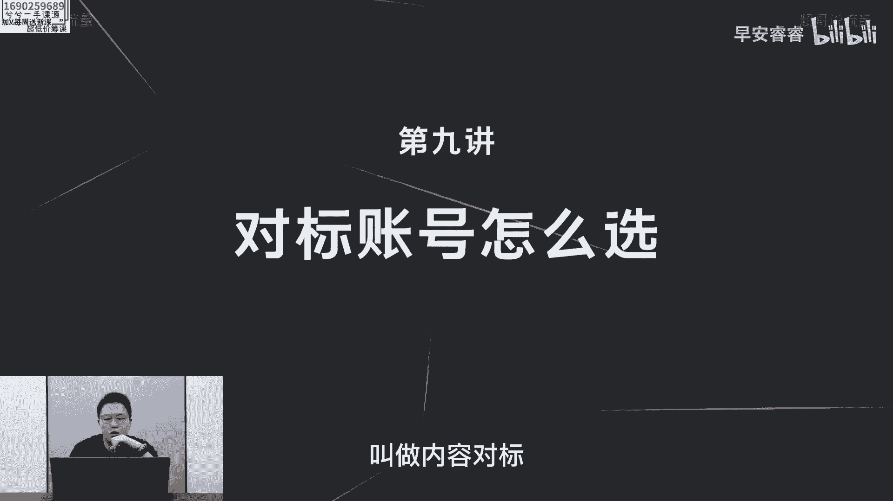
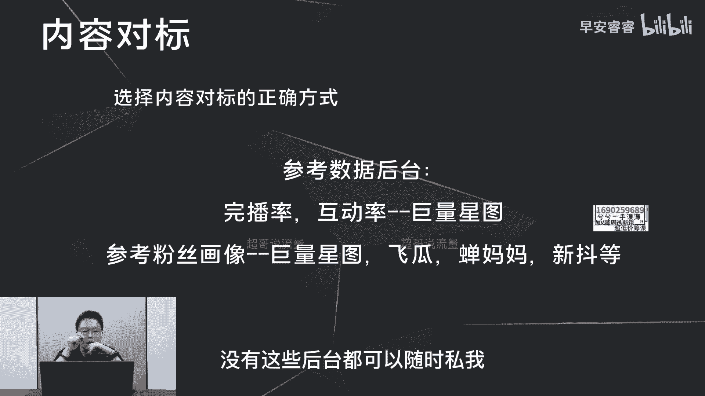

# 085 2023短视频起号·差异化定位课：0~1做懂抖音（定位+内容+投流+运营） - P9：第09节9 对标账号怎么选 - 早安睿睿 - BV1Am421T7br

那今天这节课呢，我们讲一下怎么样去选择对标账号，对标账号这四个字，严格意义上来说的话，应该有两个层级，第一部分呢叫做内容对标。

顾名思义，就是我们在做内容产出和内容选题的时候，有哪些账号，他们的内容是值得我们去做参考的，这一部分就叫做内容对标，那第二部分呢就是投流对标，就是你在你起号的过程中啊，无论你是做投流去给账号打标签。

或者你去投流去积累第一波的精准粉丝，你去选择20个左右的对标账号，这一部分叫做投流对标。

那我们先来看一下内容对标到底怎么样去做，那内容对标呢。

我们初步的理解都是认为这一部分账号，他们的内容选题和我们是极为相似的，以及对我们来说是有参考价值的，但是这里我们往往会忽视一个问题，就是你认为的这个对标账号，它究竟是否值得你去对标。

因为在这里面我们往往会忽视掉一些数据，那一方面我们会忽视这一部分所谓的对标账号，他们的内容到底优不优质，因为我们在选择这一部分做对标账号的时候，我们是过于主观的，认为它的内容是OK的。

但是没有在数据后台，去看他们的完播率和互动率之前，我们没办法去判断他们到底值不值得，我们去做对标，第二部分我们往往会忽视这一部分账号，他们的粉丝画像，对我们来说到底有没有对标的价值。

接下来我举两个例子去说一下，为什么一定要去看这些对标账号的数据，才能判断到底对我们来说有没有对标价值，那第一个例子呢，如果一个账号它的完播率连5%都没有，你确定它值得你对标吗。

就是在你在做前期的账号定位的时候，如果你选定的这个对标账号，它的完播率连5%都没有，你觉得它内容是很好，你照着它的内容脚本框架逻辑去写你的内容，那请问你能够超过5%的完播率吗，因为我们都知道。

抖音是一个内容和算法兼容的一个平台，内容会占到很大一部分的比重，所以说这个账号它的完播率和互动率的拉垮，已经说明了他这个账号的内容不行，那在不行的逻辑上，你还去对标他的内容。

你觉得你的账号有活下来的可能性吗，那为什么你会去选择他的账号，去做内容的参考呢，还是因为你自己看的内容太少，所以说它的内容对你来说很新颖，但是放到这个平台上的8亿用户面前。

那他的内容可能大家就已经看腻了，所以才会导致只有这么低的完播率，所以我们在选择对标账号之前，一定要先在新图这个后台去看一下，你所谓的这一部分对标账号，他们的完播率和互动率到底多少。

值不值得你去参考，那第二个例子呢去看粉丝画像。

比如根据你的变现产品，你希望你的粉丝画像是在九五后偏女性，那你在做内容产出的时候，那难免逃脱不了，在网上去选择一些热门的稿件去做洗稿，那这一部分稿件，你有没有去看过他们账号的粉丝画像。

到底来说跟你匹不匹配，如果他的账号是男性居多，35岁以上的男性居多，你觉得他的内容对你的账号来说有参考价值吗，那这个内容可能具备洗稿的这个价值，但是你这条内容发出去以后，大概率也是一样。

会吸引到这一部分的用户画像，那跟你想变现的这个用户画像是极为不匹配的。

因为最近这一段时间，我们有一个粉丝就遇到这个问题。

他希望他的粉丝画像是偏中产，35岁的男性为主，但是他洗稿的这个对象，账号的粉丝画像呢就是偏下沉啊，一方面呢小镇中老年都市银发小镇青年啊，都市蓝领为主啊，他想要的呢白领中产为主。

所以这部分的消费力完全偏了，第二部分呢，他选择的这个内容，对标账号的粉丝画像偏下沉啊，三线为主，四线为主，所以说我们在选择对标之前啊。

一定要先去查一查数据后台，比如说去看看他们的完播率和互动率，究竟有个参考价值，那这一部分的话可以在巨量星图上面去查到，第二呢就是在巨量星图，飞瓜蝉妈妈和星斗这些第三方的平台。

去看一下这些对标账号的粉丝画像，是不是你想要的粉丝画像，如果粉丝画像匹配，那他的内容对你来说就有参考的价值，因为你参考他的内容啊，你想吸引的粉丝大概率不会太偏，那内容的对标怎么做，这里就说完了。

我们接下来去说一下投流的对标，那如果后期你们想去查找这些数据，没有这些后台都可以随时私我。

我来帮你们查找，那讲完内容对标之后呢，我们来讲一下头流对标怎么样去选择。

那头流对标是什么意思，就是我们在选择一条作品投抖家之前，会梳理差不多20个左右的对标账号，然后把这条作品推给这20个账号的用户画像，来让系统给我们账号快速的打上标签，但是究竟什么样的达人。

值得我们去做投流的参考，你在投放之前你也不清楚，我也不清楚，那怎么办，只有测试，那我们一般会树立几个达人包，分别去测试，那第一部分的话就是内容比我做的好的，那内容好和坏不是主观意愿上的好和坏。

而是你去看他的完播率和互动率，跟你的作品去对比，如果这两个数值比你都做得高，那你可以把它们归类为内容比我好的对标达人，梳理出来20个，那第二部分呢就是内容比我差的，那第三部分呢就是近三个月起号的。

因为这一部分账号，他的粉丝相对来说活跃度还比较高，对我们前期喜好吸引第一波的精准粉丝，具备较大的参考价值，第四部分呢就是绝对头部的账号，那梳理出来这四类的达人包之后，分别怎么样去做。

那第一步呢去选择一个作品，同时段同预算分批次去测试，举个例子，如果你想在八点钟去做投流，那你选定这个作品投流之后，你分别投四个100块钱，每个100块钱选择都是24小时，然后四个达人包分别选择之后。

走个30块钱到50块钱的头流，就是头流差不多都到30块钱左右，你把这四个100块钱全部都停了，把作品隐藏掉，最终拿一个本子，把这四个头流的数据分别记录下来，去看哪一个达人包，它的相对转化数据比较好。

去看什么呢，波转粉，波转赞，五秒完播率，这些，你去对比到底哪一个达人包的转化数据比较好，那测试一次够吗，肯定不够，我们一般的做法呢会选择不同的作品，至少测试五轮，也就意味着你至少要拿五条不同的作品。

分别去测试，然后根据五轮测试之后，你才能够横向的直接对比出来，到底哪一个达人包相对来说转化比较好，那你就把它记下来，后期就可以作为你投流对标的选择，但是头流对标达人它是一个动态变化的过程。

意味着这一段时间可能这些达人对你来说，转化数据比较好，但是过一段时间，可能又会在这个赛道有一些新起之秀，新起的号，那你可能要定期的去梳理，定期的去测试，阶段性的去淘汰更新，新增一些对标达人。

这样你的投流效果才能够事半功倍，这期课程到此结束，我是值得你们信赖。

有问必答的超哥。