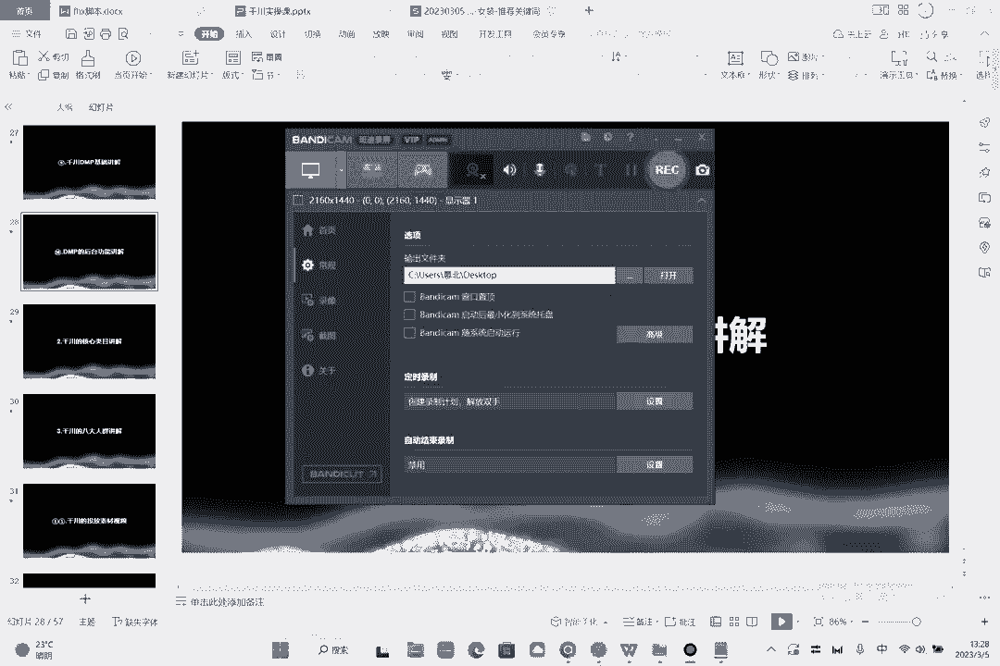
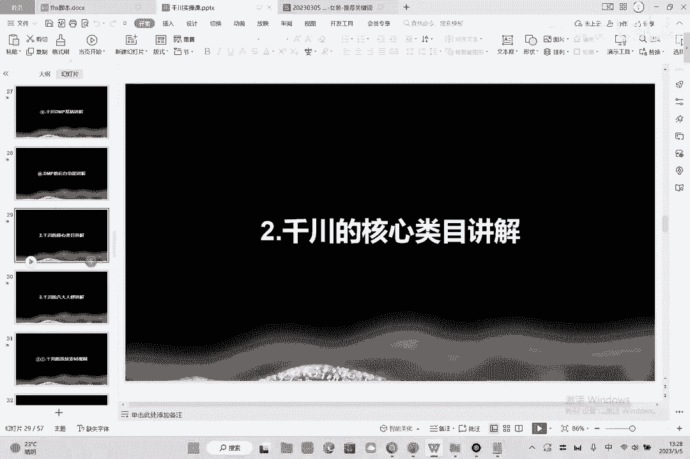
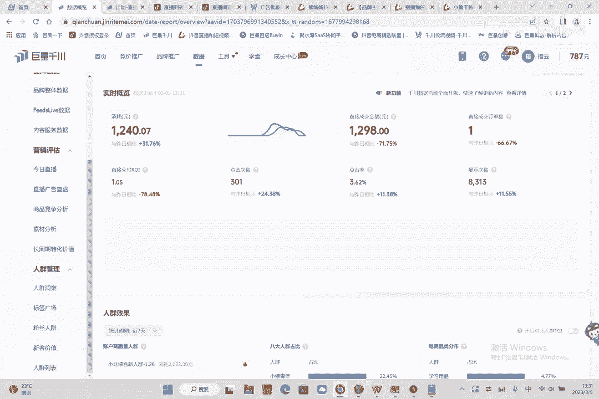
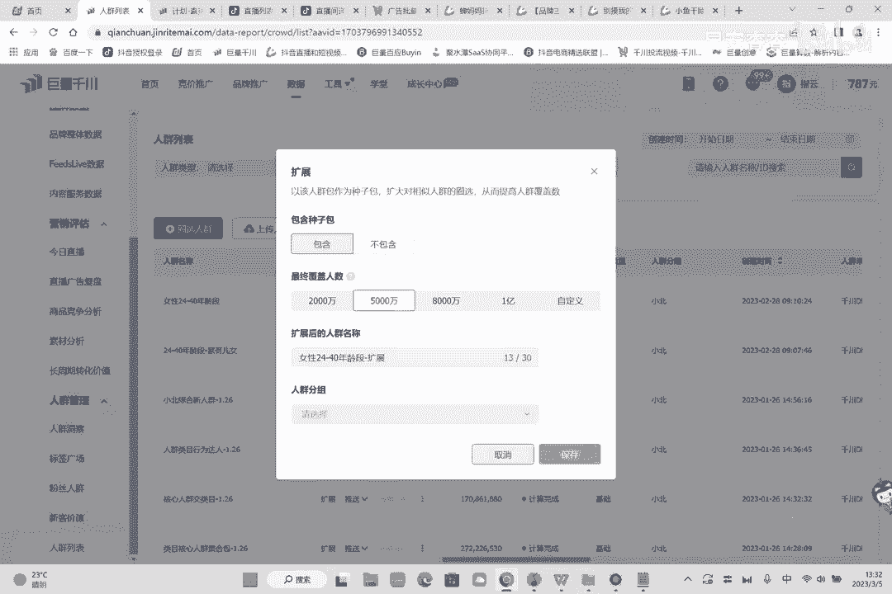
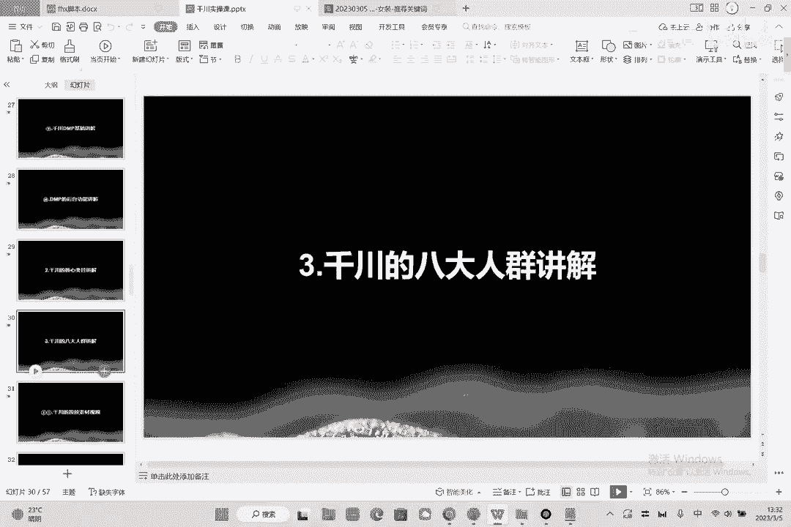
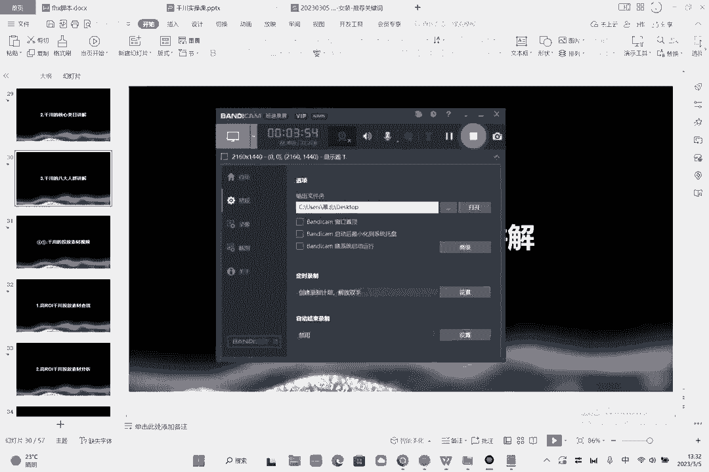

# 086 2023抖音千川运营训练营，起号期+增长期 的搭建计划详细实战课！ - P10：10.10.DMP后台功能讲解 - 早安睿睿 - BV1e7421Z7KB

呃然后第十节的话呢，我们讲一下达摩盘的一个后台的功能啊，就是达摩盘后台有哪些功能呢，我们刚才讲了，对不对，然后达摩盘怎么能够缺人呢。

好看两个东西，我们用的比较多的东西就是在这个地方，在这个地方我们来看它的标签广场里面啊，刚才给大家看了人群洞察嘛，好就是在这个标签广场里面，这里面一个首次的成交效果，你找定直接支付好，你找一个支付。

主要是要这两个东西，一个是什么，一个是你的啊，核心人群，比如说什么，你的支付的人群是什么啊，都市蓝领资深中产精致妈妈，小镇壮年跟小镇青年，对不对，这是你的五个人群，你可以圈下来，应该把它圈起来好。

左边是什么，左边是类目对吧，哪些类目的东西会买你的，像这些啊，服饰鞋包15。9%，美妆16。3，然后珠宝文玩10。48，亲子生活，那你就知道了，四大类目是哪四大类目，你的四大类目就是食品饮料。

美妆服饰鞋包跟亲子生活，对不对啊，美妆看下美妆里面其实彩妆占比4。19，就你的人群更关注什么，就是之前的话呢，我们给这个人群打上标签的时候，可能你看到的就是年龄性别。

但现在的话我们能够给他打上更深的标签，就是我们能够知道这个人到底是谁，那是哪一个人，他是一个有孩子没孩子，他是男的女的，她多大岁数，他用什么样的手机对吧，然后呢嗯然后他在哪一个城市。

他喜欢他除了买我们的产品之外，他还买哪些类目的产品，然后呢他是哪一类的人群，他是都市蓝领啊，他还是小龄中老年呢，还是精致爸妈呀对吧，他是哪一类的人群，对啊，这个的话我们要我们要去深刻的去，而了解到它啊。

然后我们怎么用看一下，这里有个人群列表对吧，圈选人群，我举个例子，假如说啊这些人群呢，我们不建议大家去做交集，因为这两个人群是没有交集的，一交就是零啊，要是有交集，他就不是人群了，好这里有个交集。

有一个并集，那么交集是两者取，中间并集呢是两者全取，那也就是说如果交集，你要是想把它做的精准一点，我既是小镇中老年好，我又买美妆产品，这里有个核心人群好，你选美妆好，又是美妆产品好，这就是交集了。

对不对啊，400多万不够怎么办，不够的话，亲自生活好不好，刚才的四大类目是什么，四大类目是什么，四大还有一个家居吧，还有一个服饰细胞，对不对啊，是不是1300多万了啊，是不是1300多万了好。

那么我们可以把它拉出来去，针对于这个东西去打一个包，或者说我们小镇中老年好，我优势，我有卡消费能力，好，玩法很多，玩法很多，我们这个东西都有一个具体的玩法，我说31~49岁，性别又是一个女性对吧。

那我现在这个产品，可能产品可能就是价格也比较高，而且是卖儿童产品的，我把人生年龄人生阶段放进来，我需要你有孩子对吧，然后呢，另外我把你的消费能力放进来，把消费特征放进来，小微特征哎啊。

点一下小微特征放在消费能力预测，换来好中高消费，我今天消费也行吗，我的产品看价不高吗，好那这是卡了一个人性船是2374万，对不对，然后有人说老师这个人群是不是小了，你你之前不是一直卡5000万吗。

没错啊，他是小了。

但是在你圈好的人群里面，他有一个办法，他有什么叫做扩展，如果人群真小了的话，你就往前扩，你扩到5000万就行了，你不够5000万可以可以拓展到5000万，前期的话为了人群能够精准，我们不要去圈大人群。

因为圈一个亿，圈两个亿的，不要这样啊，不要这么去圈，前面的话就圈个5000万可以啊，5000万可以，然后呢，目的呢是为了去打上一个啊精准的这样的一个。

什么这样的一个呃标签啊，目的是达成一个精准的标签，这个就是千川的基础的应用后台的达摩盘啊。

