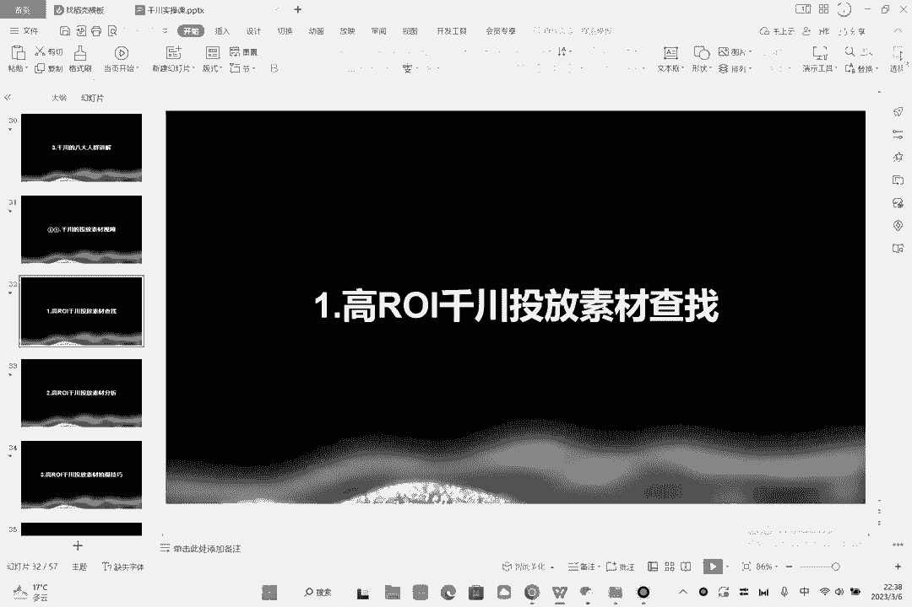
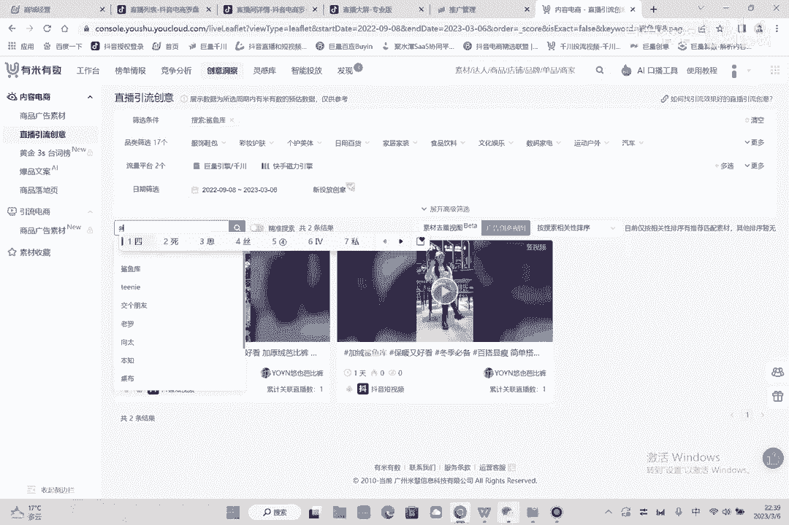
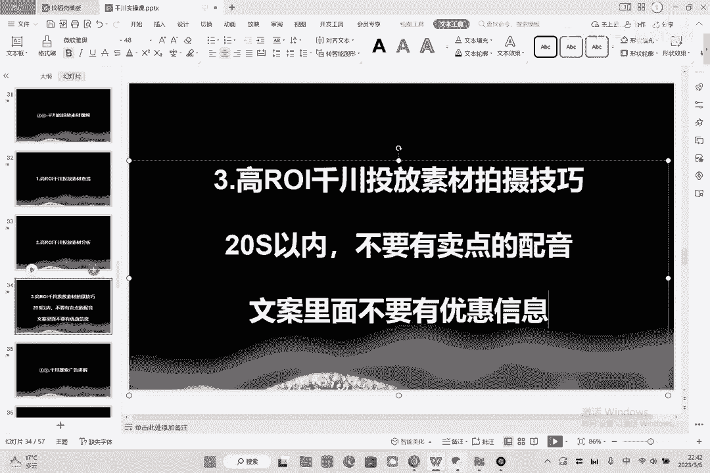

# 086 2023抖音千川运营训练营，起号期+增长期 的搭建计划详细实战课！ - P11：11.11.直播间的投流素材.mp4 - 早安睿睿 - BV1e7421Z7KB

然后我们讲一下第11节啊，就是千川的素材投放啊，这节没什么好讲的，其实这节其实挺简单，就第一个我们要去汇总高ROI的，千川投放素材的一个查找，我们应该怎么找到一个高RI的素材呢，来我们来看一下啊。

那打开这个时候就有个软件啊。

这个软件呢叫做有米云啊，有木有树啊，这个时候呢这个时候呢点击创意洞察，然后呃点击直播间的引流创意啊，看到没，这里头就有了啊，就是你的类目的，比如说我搜一个东西叫做鲨鱼库，就是你们这个类目最好的素材啊。

鲨鱼库看到没嗯，搜了下异库之后呢，你就会看到他的各种各样的一个类型了，或者说你搜达人啊，比如说我搜我的达人叫新起。

这个时候我能看到他所有的，这个时候，我们就是所有的这样的一个这样的一个内容好，然后呢按照总包方降序好，然后点一下这个就是他的全网最好的素材，看到没有，总曝光106。35万啊，Guy guy，Well。

I don't leave，I'm touching kins，I'm kina girl on the perfect type for one one night。

好这个呢就是咱们的一个整体的一个思路啊，然后有了思路之后怎么办呢，你知道了，视频有米云这个软件，如果你没有，你可以来找我啊，这个可以给你三天免费试用啊，你可以自己去搜一下自己的一个好的东西。

然后就是一个好的素材，好的素材的分析啊，还有就是那个嗯好的素材应该如何来拍摄，呃，分析的话基本上就是这样，你看我们会给他定下鲨鱼口感，靴子真的绝绝子，No no。

Don't catch me anymore，Don't tn，咦呀咦well，I don't leave，I'm touching kins。

I'm kina girl on the perfect type for one one night，鲨鱼裤配靴子，那我们会去思考一下，就是说这个视频下来，我们一共有多少个分镜，能不能理解。

那我刚才数了一下啊，有多少个分镜呢，有这个这个这个有这个这个15个分镜来，我们再换一个换这个，也许我凝成这对，第一个看到没改成颠簸，然后他在这个分镜里面拍了什么，我付出什么的多，那只有一个分镜。

这个就是对照着别人拍数分镜属内容属表现，对不起，给您道歉了，我们的服务三了晚了，现在拍两条送两双袜子，来得早，不来的巧，快来直播间入手吧，七个八个，有了这个好，对不对，你数分镜。

你看他每个分镜拍的什么东西，你照他的拍就行了，如果你不会没关系，你找一个拍摄好的素材，你找一个拍摄好的团队，你就去copy他就OK了，这个其实就是拍高RI的产出的一个素材。

那么素材呢大家我告诉你们有几个规定，你们自己要记一下啊，第一个素材不能高于20秒以内，这个要20秒以内，听到了吗，以内20秒以内，第二个啊，第二个就是分镜啊，不要太多，太多的话就容易花里胡哨的。

20元以内是核心，然后就是不要有卖点配音，不要有卖点的一，因为如果你有卖点的配音的话，那么这个东西就很容易违规啊，审核跑不动，知道吗，好然后第三个啊，第三个是什么啊，不要有卖点配音啊。

第三个第一个是20秒以内，第二个不要有卖点配音啊，第三个就是在文案里面，文案里面不要有优惠信息，也容易跑不动，就这三个点，三个点满足，我们就能够去正常投放，而且他能跑量好不好啊，这个都记清楚了吧。

这个就是我们的一个签证素材。

