# 086 2023抖音千川运营训练营，起号期+增长期 的搭建计划详细实战课！ - P12：12.12.千川的搜索计划.mp4 - 早安睿睿 - BV1e7421Z7KB

呃然后第12节的话呢，我们来讲一下千川搜索广告的讲解。

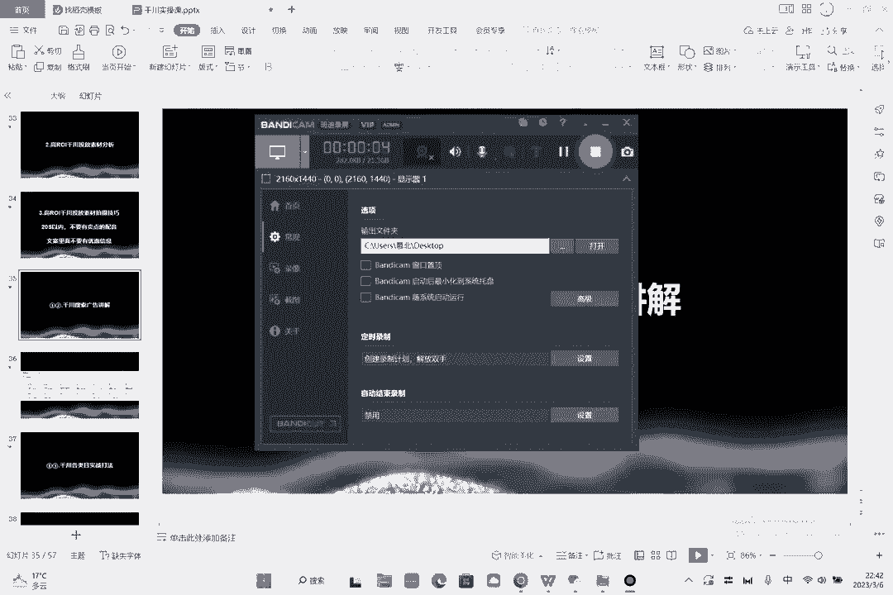

就是搜索应该怎么投呢，啊这个时候呢给大家讲一下，可以看一下，这个是我们一个搜索的数据，看到没，这是搜索的数据啊，这个整体的产出比是非常高的啊。

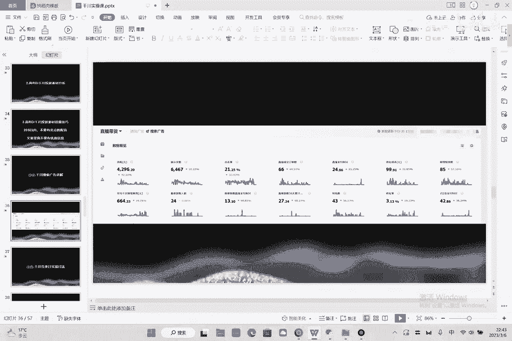

为什么会有这么高的一个产出比呢，是这样的，我们打开搜索好，打开搜索之后新建计划啊，新年进行专业推广搜索广告啊，这个号是没有的啊，我告诉你们怎么建，举个例子，那这里有搜索，是不是那么有搜索的话呢。

你先把你的关键词全部都删掉。

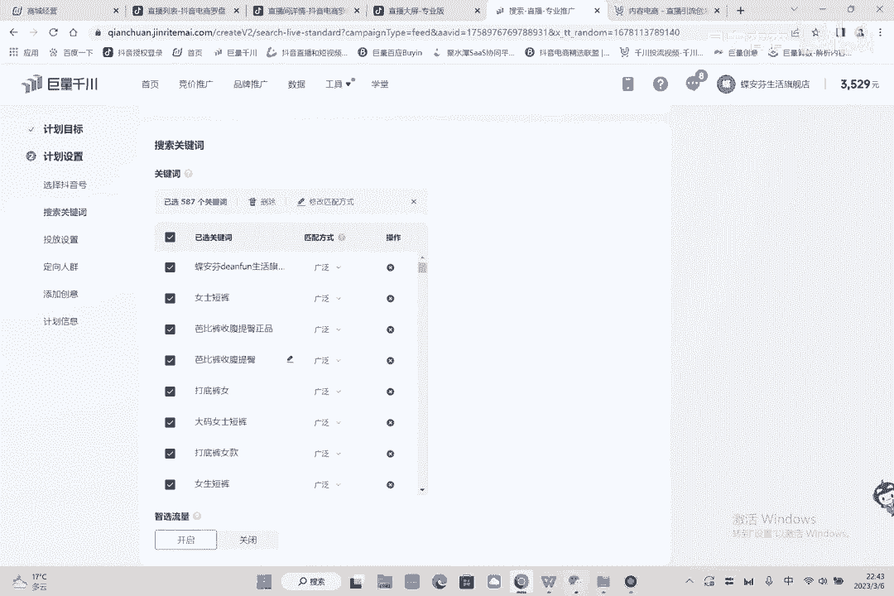

这里有个泛关键词啊，把关键词全部删掉啊，删掉之后呢，点击添加关键词，比如说我是什么裤子，我是呃打底裤，对不对，我还是以鲨鱼库来举例子啊，鲨鱼库啊，好鲨鱼库，这个时候你就要去看，那么鲨鱼裤裤子打错了好。

这样就好了，看那个太离谱了啊，然后这个时候呢怎么样呢，下载这个打开你不可能用所有的词吗，因为他现填啊对吧，你不可能用所有的词啊，呃然后，啊然后然后这样，然后呢把它前面这个进行是吧。

进行一个横杠这个词筛选好，筛选搜索量哎，给它进行一个降序，另外搜索量卡一个数字卡多少呢，大于数字筛选额大于多少呢，大于5000就行了，好的好，这个时候是你筛选出来这个东西的量啊。

一个月搜索量它不能低于5000，低于5000就不行了，然后你要看哪些词是你要的，比如说这个阔腿裤是你要的对吧，然后比如不要的，这里面不要的词怎么样，你就给他删掉，比如拖鞋跟我没关系对吧，我就删掉上衣。

没关系，删掉啊，这个没关系，删掉男装没关系，删掉这个删掉对吧，你就把你要的词留下啊，你就等你的要的词留下就行了，好加厚白绒白裤，你觉得跟你词相关的，你就留下啊，你词不关，没有相关的，你就你就给他怎么样。

你就给他哎，你就给他这个删了。

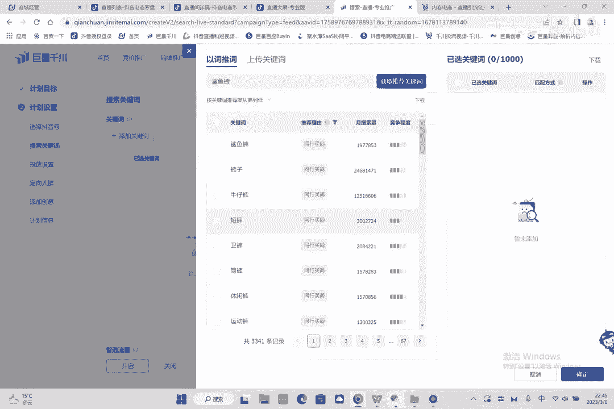

然后这个时候呢你有了一批词吗，有了批词的话，如果一个词不能开那么多的流量的话，你就再加一个词进来，整体来讲它的搜索的方式是一模一样的啊，跟我们日常的之前大那条这都是一样的啊，定价人群价格都是一样的啊。

按照成交都是一样的啊，智能开启。

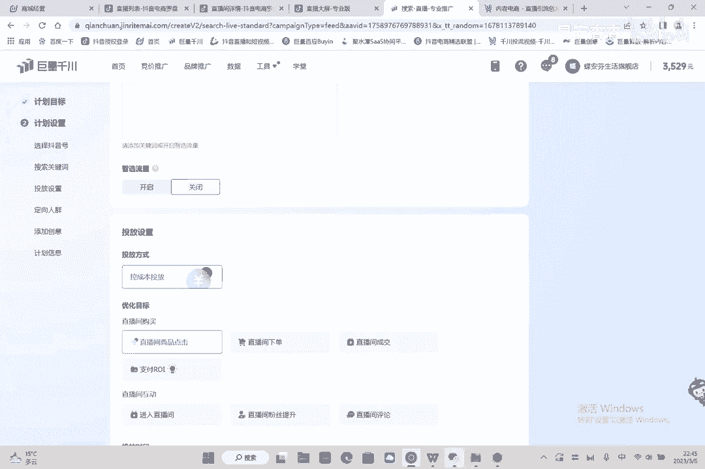

智能肯定要开启的，对不对，然后你添加词在这添加添加词之后呢，这有一个下载，你这有个上传词表，看到没上传，上传之后呢，你点击桌面就行了，给人分手的桌面词表C表示，OK诶不是这个文件夹啊，上传点击上传啊。

不对，你先下载一个关键词模板啊。

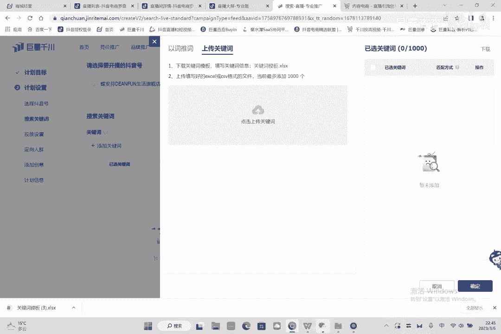

我点错了，好打开这个关键词模板好吧，然后刚才不是有词吗，是鲨鱼库的词吗，好把词拉下来，OK其实不拉也行，不拉也行，拉拉太费劲了啊，拉太费劲了，点这个复制对吧，好复制，复制完之后呢，在这然后粘贴。

把关键词这个词删了，然后后面的话呢有精准短语跟广泛，你就先选短语，统一选一样的啊，这个往下拉就行了，但你先选，你肯定不会选这么多，这个词太多了，啊这个词有点多，没了啊，差不多，反正就全是短语啊短语。

然后这个时候你保存它，保存它文件给它另存为运存于到哪，运存一到桌面，确定确定之后呢。

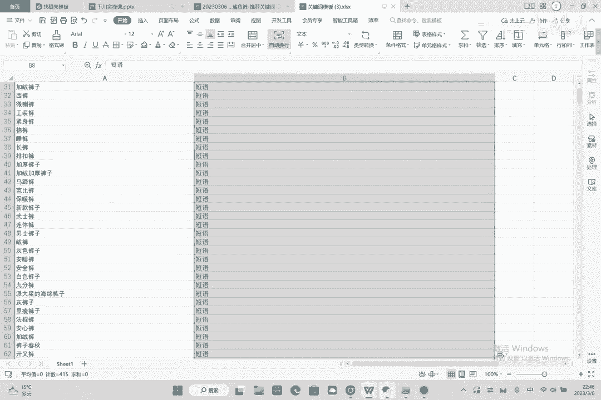

你这个东西因为你都是搜索量比较高的词，然后你给他上传在桌面啊，这个关键词模板啊啊保存它啊，打开，看一下找个550一个词，看到没，把1000个字填满，这个时候呢就是这些词呢你都选择什么，选择短语啊。

全部都选择选择短E，因为你如果你选择精准的话啊，它的量太小了，这个量就会跑不动，如果你选择广泛的话呢，它又太大了啊，这个的话都可以选择短语，这个的话呢也可以选择什么呢，你可以进两条计划。

这个也可以选择精准啊。

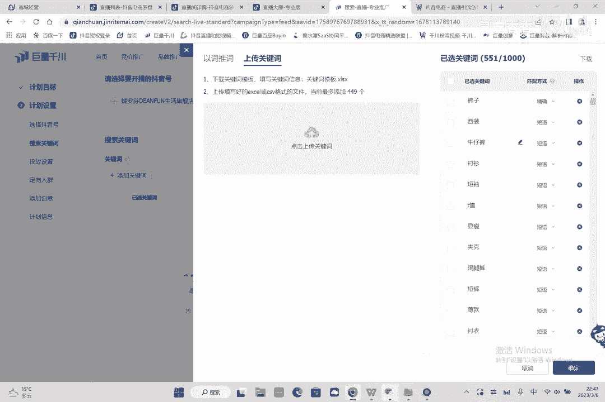

这个可以选择精准，知道吗啊，可以选择精准，然后对于有一些核心词对吧。

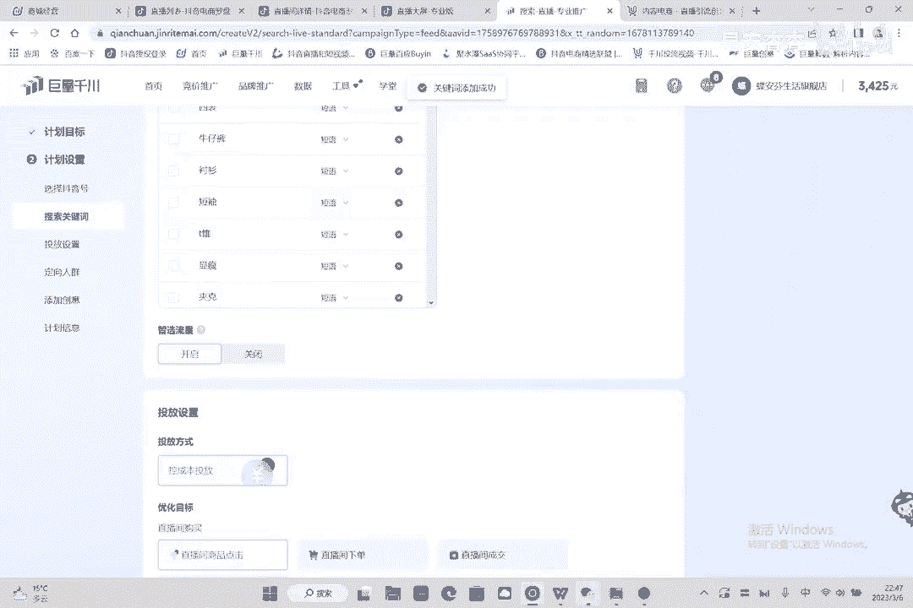

什么叫核心词，比如说鲨鱼库本身这个词，比如说本身这个词，比如说鲨鱼库本身这个词这个词看到没好，先把这个词哎好填上了，这个词就可以选择精准，为什么啊把这个加上来啊。

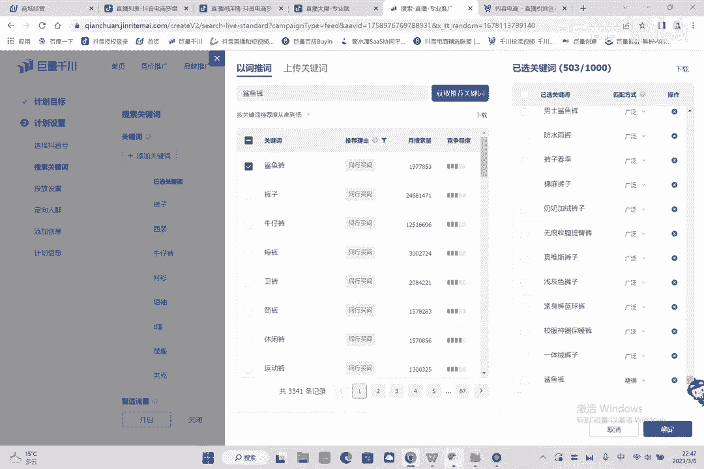

为什么要选择这个东西，选择精准是因为啊不对不对不对，这个词可以选择广泛，这个词可以选择广泛，因为词精准，词越精准，你选择范围就可以越大，如果词越大，你就可以选择越精准，你懂我意思吧。

就是这个词因为它小嘛，因为它小嘛，鲨鱼词又是你的核心词，鲨鱼库又是你的核心词，你的核心词就可以选择广泛和短语选择大一点，而那种本身就是一个长尾词，你让它再广泛也没有意义了。

你长尾词呢这里其实就可以选择精准一点啊，因为这个词就可以覆盖他的那个更长次，比如说什么鲨鱼库，比如说紧身鲨鱼库，是不是就已经被这个广泛所覆盖了，而那个就可以选择精准来投，然后你点开起量智能放量。

还是选择成交啊，还是选择成交，除了成交跟RI其他的不要选啊，听我说其他的千万不要选，因为这些东西都不准啊，选择成交，成交的话，你出个价就是日预算3000对吧，嗯出价出价啊，20块钱一单啊，20块钱一单。

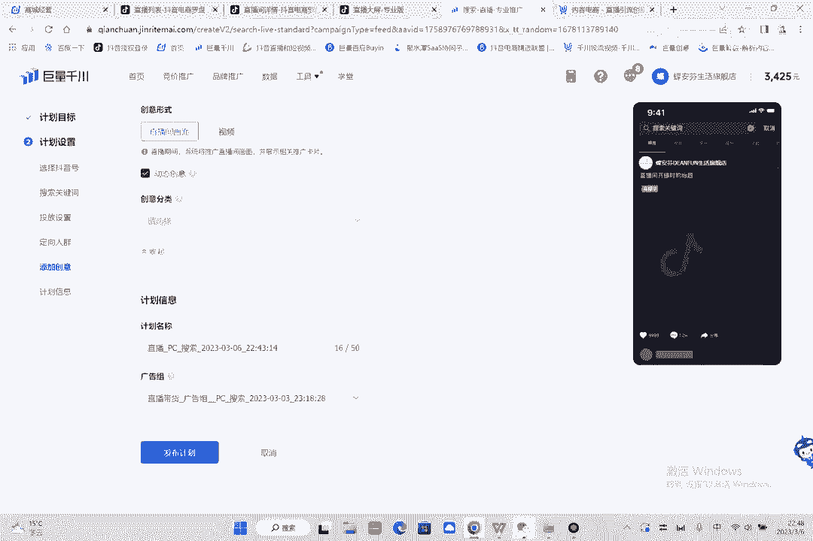

人群一样的人群不用卡啊，人群不用卡，因为是搜索搜索不用卡，人群的搜索不需要看人群。

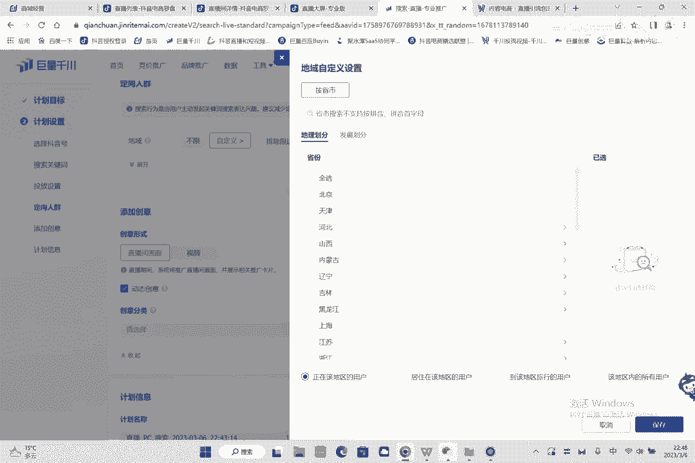

你搜索再卡一个人群的话，就你看这里也没有人群可以卡，对不对，为什么，因为搜索你在卡人群的话，是不是就这个量就没了啊。

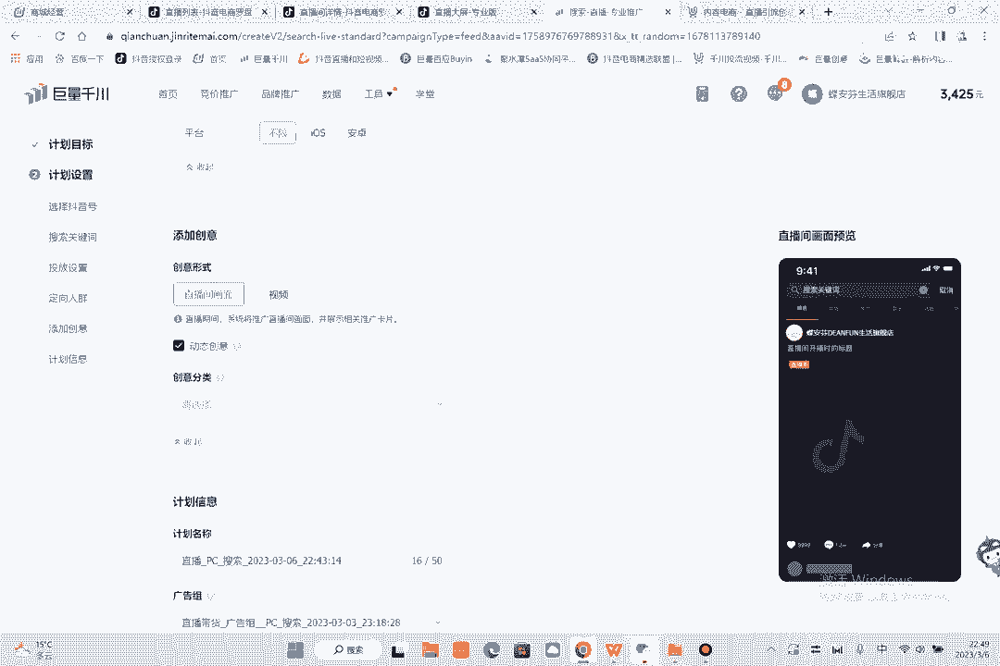

这个人因为太小了，就跑不动了，所以这个就是搜索计划啊。

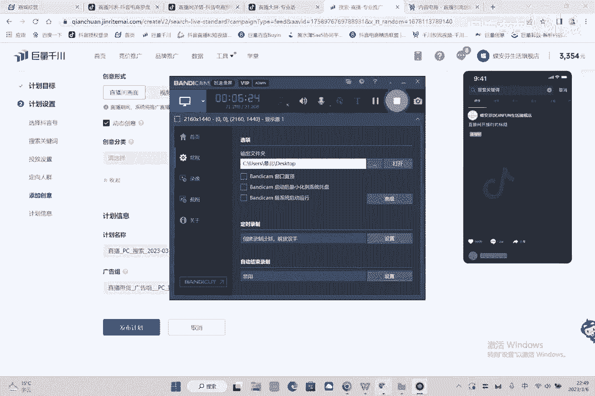