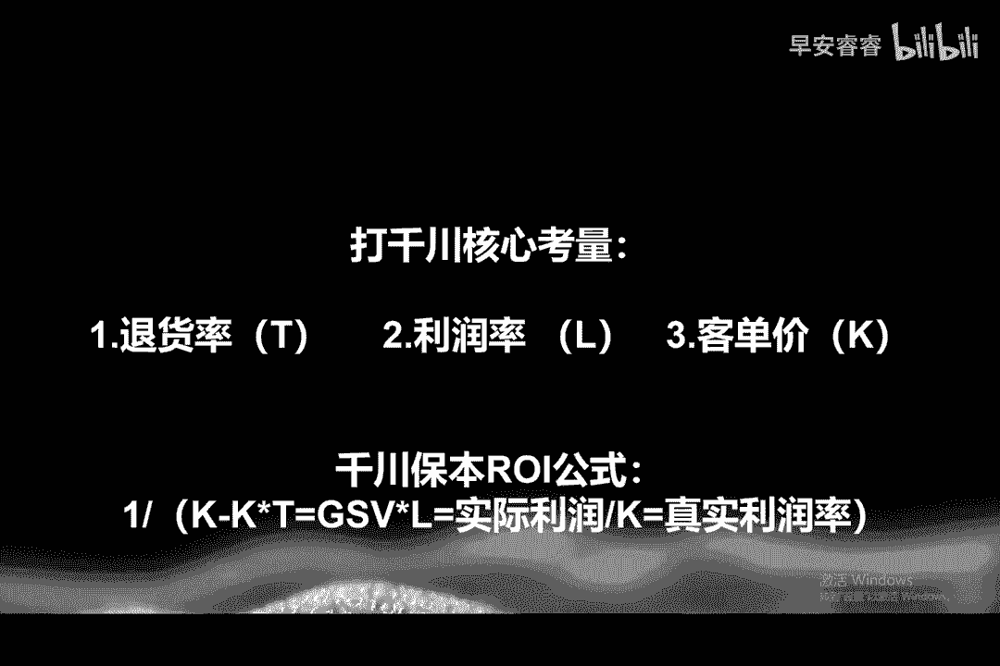
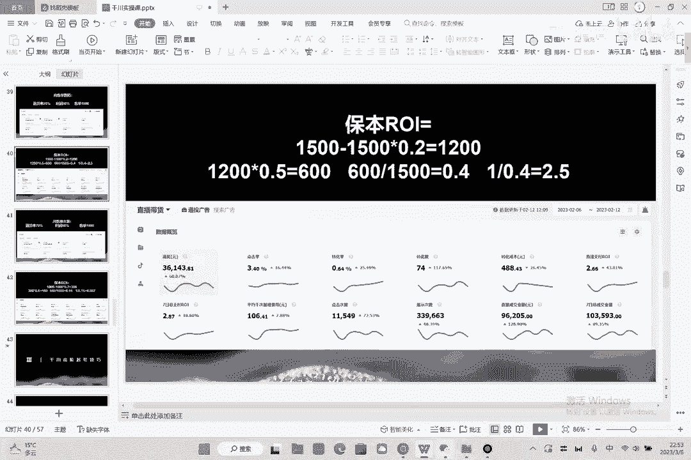

# 086 2023抖音千川运营训练营，起号期+增长期 的搭建计划详细实战课！ - P13：13.13.千川各类目起号投流.mp4 - 早安睿睿 - BV1e7421Z7KB

好，然后今天这一节呢给大家讲一下，千川的一个各类目的打法。

好吧，呃千川格雷姆打法里面就是打千穿，主要考核的指标有三个，一个是退货率，一个是利润率，一个是客单价，而千穿的RI的保本公式啊，形成的保本公式就是一除以啊，一减掉你的退货率呃，一减掉你的退货率。

就是你卖一块钱的真实GSV，再乘以你的利润率啊，等于实际的利润，再除以一就是你的真实利润率了啊，我这个公式太复杂了，因为这个公式1K可以用一来代替啊，因为K也是一个额定量。

K可以用E来代替我，只不过用K的话，你们可能会算的更明白一点啊，给大家算一下，像我们这个高客单的数嘛，就退货率是20%，利润是50%，客单是1500，算一下的话，那就是1500-1500乘以0。2。

等于1200，1200减乘以0。5，等于600，600÷1500=0。4，1÷0。4，就是2。5，它的ROI是2。5，理解吧，就做到2。5就保本了啊，我们的女装你们可以自己算一下，自己的这个保本RI。

就只要RI保本了，你就能够去怎么样，他保本了，你就可以去放大，因为只要你放大它的流量应该就是回，如果你能够达到这个RI，说明你RI是千穿是不亏损，是盈利的，千穿盈利其他东西就会更盈利，对不对。

高客单女装这个退货率70%。

利润50%，客单价是1000好保本，RI等于1000，减去1000×0。7，就是300，300×0。5=150，150÷1000=0。15，1÷0。15，等于6。67，好，这是女装的宝宝马RI。

然后我给你们讲一下怎么出价，怎么调价啊。

出价跟调价讲一下啊，首先建一个计划，如果你是一个新号，对不对，前面建计划你已经会了，前面这句话你已经会了，对不对，好，你先把保本RI算出来，比如说我的保本RI是二对吧，我的客单价是100。

那这个时候你应该出价多少，知道吗，这个时候你的预算是1000，我说了吗，20倍嘛，好，你的出价应该是50成交啊，还是那句话，成交看到没好，成交50对吧，它显示48嘛，我就出50嘛，好我的客单价是100。

我的保本RI是二，那我就应该出50，那么如果刚才像刚才这个产品。

像刚才这个产品，像这个高高客单的数码1500，利润50，退货率2。5，需要2。5对吧，需要2。5的RI。

那我需要出多少钱呢，我这个价格想一下，我这个价格就是600理解吗，然后上面那个数字就该是9999。

能不能理解就应该是600好。

那600能不能跑跑得动呢，说实话我不知道你新号开跑的时候，600能不能跑动，我不知道，但是你可以怎么样，你可以逐步往上加价，懂什么意思吧，就是600跑不动，你每次提价提5%就630，660，690。

每15分钟复制一次计划，不要去改价，因为改价改两次就没有保障了，看这啊，改价改两次就没有保障了，你要怎么样，你要去复制新的计划，把这个区哎复制一个新的哎，再复制一个新的，能不能理解，每次去复制计划。

我们告诉你们，就是我们通过你看今天还起了一个账号，今天我们还偷溜起了一个账号，就是起号就是这么起的，如果计划飞了，比如说这个计划我投多了怎么办，好，投多了没关系，复制往下调，能不能理解，复制往下再调。

像我们一个户，像我们随便一个户，你看我们看这个货啊，这个月像我们这个户这个月跑了多少钱，看到没看到没多少钱，这个货161万，看到了好，怎么跑的，就是往下调，跑不动就往下调，跑不动就往下调，往下调。

每次也要调10%，能不能理解啊，这个希望大家能够好好的去理解一下调价，涨价就是这么调的，然后下一节课我会讲具体应该怎么来建计划，我讲的没有什么太多的废话啊，讲的都是干货，你们自己去体会一下啊。

