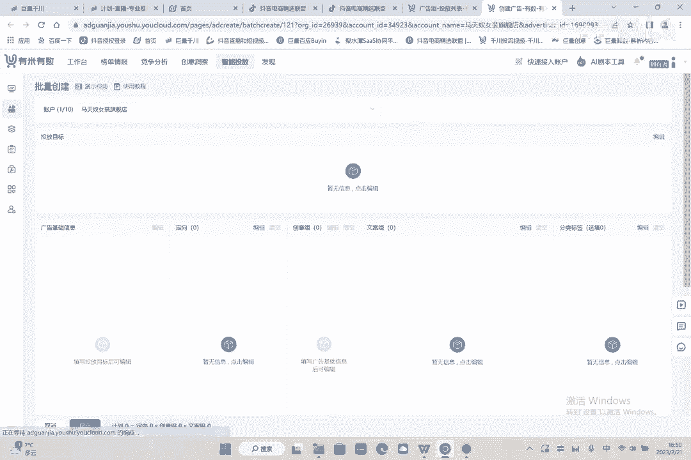

# 086 2023抖音千川运营训练营，起号期+增长期 的搭建计划详细实战课！ - P14：14.内部课：起号期搭建计划.mp4 - 早安睿睿 - BV1e7421Z7KB

嗯哈喽啊各位这个同学们大家好啊啊对，然后能听到这节课的话，应该都是自己人啊，这个因为我们这节课的话主要是对内的，199的课程不对外嗯，千川的高阶起量的一个技巧啊，就是我会给大家嗯实操一下啊。

都是针对于我们自己的一些小伙伴，包括我在去服务客户的时候的一些心得，然后呢也会在这里传递给大家好吧，先来看一下千川的建模期的一个投放方式，就应该怎么投，其实千川在建模期是非常难的一件事情啊。

因为嗯没有数据啊，如果说在这个过程中有任何不懂的东西呢，你们都可以整理下来，然后发给静静啊，让让让静静来问我好，就是建模期的话呢有一个比较大的问题啊，就是呃由于没有数据支撑，所以说千川再去跑量的时候。

他可能就是你说这个价格它跑不动，那这个时候我们应该怎么办呢，第一个啊就是我们先来讲一下它的步骤啊，那第一步的话就是核心是人群要精准，然后由浅带深可以放量啊，然后这个地方的话呢就是很多人可能不了解。

就千川到底要圈成什么样子这块呢，其实我们有跟小二明确的了解过，你说千穿的话，那至少一个核心点是，他最少得需要五个相应的人群啊，单计划最少5000万，因为如果达不到5000万的话呢，这个人群太窄。

他探索起来的就会就是会比较麻烦的，然后人群精准由浅到深，然后就是慢慢的去放量，嗯是什么意思呢，就是我们大致上来讲的话呢，会有十条左右的计划，举个例子啊，比如说你同时跑这十条一起跑。

也就是说我们通过软件啊，通过这个有米有数也好啊，还是通过其他软件也好，我们自己建也好，要跑要放十条计划，就十条计划里面呢让看哪个计划先动，因为他这个计划不可能都不动呃，低客单价的好跑。

高客单价的会相对也难跑一点，尤其是新账号啊，账号没有模型的时候是特别难跑的啊，那么十条计划以及跑的好处是什么，就是这十条计划里面，有可能有一个计划会先出单，或者说有一个计划先探索出来他一个人群。

但十条计划里面，总有一条计划是有可能会跑量的啊，前期不要用放量去投啊，前期不要去跑放量，一会我会给大家建计划啊，那么这是第一个他的理念，这是他的核心，然后竞争对手的人群分析是干什么的。

就是前期的话呢你一定要去看看什么呢。

呃在这个地方给大家签去找找一下啊，如果你的这个店铺中有数据的话，就在这看，在这个地方啊，哎网有点差，在这个数据，然后呃呃人群洞察当然不太准啊，这人群动态不准的地方，但是不重要，在这个地方呢调成30天啊。

调成30天。

然后呢按照数据来调，按照数据啊嗯按照一个数据来调整，等于就是14天的对，1月份的你想看你的人群是哪个人群的话，就在这看好吧，接着看，然后这个这个这个这个都选上，把他选满额。

选满之后的话呢，我们点一下确定好，确定了，你就能够看到你的人群，对不对，然后在这个人群这里呢，不要选择这个进入，要选择额支付，那支付的话，你就能知道你是哪些人群在买东西了吗对吧。

来我们来看一下这个账号啊，这个呢是我们马天奴的账号，这个账号的话呢就是小镇中老年新锐白领，资深中产跟都市银发没问题吧，所以说意味着什么，意味着你就只要这四个账号。

意味着只要这四个人群就OK了啊啊新锐白领呃，资深中中产，然后呃都市银发跟小镇中老年好吧嗯对，然后就是这个四个账号，然后左边是类目啊，左边是类目，类目的话呢就是有各户加青，有珠宝文玩呃。

携智能家居鞋服饰鞋包，你点进去都可以看到他的，但是呢就是比如说就是跨境跟汽车，你给他取消掉，然后呃美妆也是可以用的，然后在这里面的话呢去找这个就比较细了啊，就是把这个什么人群不要呢，就说哎这些0。

45的啊，小人群不要以大人群为主去打个包，像什么宠物这些东西都不要啊，以这种三点几四点几的东西去打个包啊，打包的话呢一会会给大家会给大家去看好吧，然后年龄层也能看到对吧。

年龄层的话是第一是41~50的啊对吧，然后第二个是50岁以上，你看啊，那你就投这两个人群就行了嘛，其他人群投都不用投，所以说你的基础模型就有了小镇，中老年新锐白领，资深中产额都市银发。

然后A12这两个人群对不对，这两个包，然后其他占比就不管它了，然后再加你的类目，你的类目你也看到了，好这时候我们再开一个号啊，再开个号去打包啊，好那么打包之前呢给大家看一下，那这是一个老货。

就是你知道了你账号的模型，你可以这么投，那假如说你不知道怎么办呢，不知道没关系，我们可以在精选联盟，还在这找啊，进联盟，然后在这找人合作啊，找男人合作，我有点卡好，那在这呢我们就搜一个账号嘛。

我们就搜纳尔斯嘛，啊我们竞争对手这是拿女装来举例啊，啊我们搜纳尔斯好，纳尔斯的账号，那这是这个号对吧，这个号他这边是没有达人授权的啊，我先把微信退去，也是叫叫的好，能看到这个地方呢他是没有授权的。

所以说但是我们能够看到他的直播详情啊，另外的话能看到他的粉丝粉丝分析在这里，在你没有任何数据之前，我们来看他的流量是这样的，好直播间观众要选择直播间，观众粉丝团观众跟直播间观众应该是类似的。

你看是类似的，我们选直播间观众就行了，就是他直播间进哪些人啊，然后女性95，50岁以上，四四十五，41~45，对不对，41~55岁以上，这是他的人群，跟我们人群是相似的啊。

好然后哎小镇中老年资深中产都市银发哎，就懂了，我们一下是不是就明白了，就我们是不是就知道他的人群是哪个人群了，然后你们来看这个地方有它的类目，看到没啊，58的58的女装，然后生鲜类目，美容护肤类目。

还有啊这个柴米乐泪目好，其他类目我们先不管其他类目，先不管它，然后我们先管这三个类目啊，地区不用看啊，地区不用看，城市不用看哈，好我们只看我们只看这三个人群好，自身中产都市银发小人，中老年41~50岁。

对不对好，那只要跑，只要跑这个人群就OK了啊，这三三大人群跑这个人群就行了。

好我们现在根据他来进行计划，后期类目的话能建类目会更细啊，在这个地方打包啊，这时候我们没有这个人群列表格了，我们去全选它，假如你现在什么都不知道好，那么你就在这找到三个啊，他的三个是什么。

第一个是呃都市银发对吧，嗯都市银发交集，都市银发的人均差1。616511啊，这是他的都市银发好，就是这里呢建议啊，就是都市银发呢可以自己打一个包啊，如果你想打小包的话，都市银发自己可以打一个包。

那么都市银发跟什么交呢，你看啊都市银发跟这个东西交好，都市银发，然后这是他单独的一个包啊，这是他单独的独市印发的包，然后我们在基础水印包里面可以去打它，好年龄性别这些东西我们都不在这里打啊。

年龄性别我们不在这里打，我们可以跟什么相交啊，你可以看一下在人生的阶段，在消费等级这里，消费等级这里有一个消费能力预测，看到没好，那么经济性消费肯定不属于马天奴的人群，对不对。

所以说你就可以通过这个东西啊，就是卡他一个高消费跟中消费，就能够卡出它的一个基础包啊，基础包，然后这里呢我们先去都市银发先打一个包出来，然后打一个包出来之后呢，我们不点进行点下经济型的话。

就是哎那说明什么，说明这是他有消费能力的，那还有就是没有消费能力的，对不对，然后我们把性别卡一下啊，性别叫女性，然后女性3100多万啊，女性3100多万，然后年龄年龄好，所以的设计50啊。

这个时候你的这个包已经非常的，已经已经非常的窄了啊，这个时候已经非常的窄了，但是整体来讲的话是2739。8万，我们打出来的这个包，还会比这个包还能稍微的大一点，还会比这个包稍微的大一点。

所以说让他在这个阶段去做探测理解吧。

好这个时候我们标标标一个也是都市引发，都是英法呃，呃多少呃，呃三十四十一加41乘加嘛对吧，然后就是中高中高，然后再告诉他这是一个嗯年龄中高性别女好，没了没了好，这个人群就是你的其中一个核心人群，知道吧。

你没有说说能够说准确，到时就能打到这个人群暂时打不到。

但是呢你可以去打它，打出这个包会比会比你想象中这个包要大好，那这个包已经出来了啊，这个包已经出来了，然后呢然后呢再用另外的两个去打包，再用两个另外两个人去打包，再再用中资深中产去打个包。

再用小镇中老年去打包，就是这三个去打包啊，就只用这三个去打包，因为他的人群比较特点是比较大的好，这就只有这三个人群，所以说这个单子会非常好跑啊，会非常好跑，就这三个是核心人群啊，核心人群。

然后核心人群之后呢，你再去，如果到了后期的话，你有了一定模型的情况下，你可以把类目圈上，但是如果你没有人群的情况下，你就先不要圈圈圈你的类目好吧，到了后期跑量的核心，大家一定要记一下前期跑量的核心。

还会去看一看你的这个类目啊，人群圈的准不准，到了后期跑量的核心，你会看什么呢，会看你的素材啊，后期的话是素材为主，那你这样的话，我我举个例子，那现在这样的话，你是不是有三个人群，对不对。

那那你有三个人群的话，是不是你可以卡不同的视频，不同的文案啊，不同的视频，不同的文案，你就至少能卡出很多个计划对吧，那三个人群是已经确定了的啊，那么你单卡类目人群行不行，我们来看一下啊。

就你先不卡不卡这个就行了，你卡你卡这个偏好好卡偏好卡什么偏好呢，就卡这个啊，在这辅助细胞里面，对不对，全选把这个东西啊，哎女装内幕了，嗯哼搞下，刚才打出了三个包，你先不做交集，在这个地方打一个女装。

在这好对吧，女装那个，呃这么少吗，这个人群嗯放在并集这里啊，呃复式斜包，对吧一状这是一个，然后呃这是潜在人群，还有核心人群啊，核心人群也是一样的，核心人群对不是血包卡掉他，逆风对吧，那现在女装的话。

现在就有2000多万了，是不是，然后我们再再再别着急啊，再把这个东西弄取出来，这个是你的最核心的主人群，因为看到了他，因为在我们是怎么看到的，我们不是自己判断的，对不对。

我们是在这个地方看到了别人的泪目是吧，这个东西很干了，对不对，这东西很干了，女装类目对吧啊，核心的女装类目好，我们在这个地方再打个包哎，服饰细胞啊，它只有一个单辅助细胞，没关系好，那90天高频次对不对。

90天高频次中高频次都行，我们都要中国瓶子都要，那现在成了6000多万人了是吧，对辅助细胞感兴趣的，我们还没考，你要把这个包打出来之后再去教他啊，现在暂时先不卡它好额，然后复试线宝把这个东西打出来。

对不对，复制细胞90天冲刺高频次对吧，这都是对女装哎，对对这东西感兴趣的人，包不能打小了啊，包可以稍微打大一点，没关系，就你打个8000万一个亿都没关系，但是你不能打小了。

你打小了的话会存在一个比较大的问题，就比较尴尬，就是用户其实他探索不到，他，探系统探索不到你这个人群就比较麻烦了，是吧，然后这个是90天的一个购买的，中高频次的一个人群啊，行业中高嗯。

AARPU就是支付订单金额，其实如果说是它高的话，你看到没有，他是特别高的，他这个单人群特别大，就是如果我上我上面这些东西都不打，我们上这些东西并集的包全都不打，就只打这个东西。

那这个东西相对来讲是是盲包，就是大包，那么大包的话呢，我们看一下90天，他自己的90天自己的高频次，中高频次人群是吧，他自己就是1。43亿好的，那说明他自己就够大了，那他自己够大的情况下。

我们单独给他打一个包，理解吧，我们单独给他打一个包，就是他只要到到达三五千万，我们就单独去给他打一个包，现在刚才三个人群三个包了，对吧好，那这个包是一个包，然后我们再看。

我们再把潜在人群跟核心人群打个包，对不对，我们再把潜在人群跟核心人群打个包，好，辐射细胞里面的，呃逆装人群，这个这个现在来讲千川很智能，它不会打不出来这个包的啊，我们把他先打个包，看到没好啊。

2000多万不够啊，不够多啊，不够不够，它减去行业单品次的混活跃度，把它减去对吧，哎把这个90天的中高频次全部剪进去，复制细胞嗯，减去6000多万了，哎6000多万了是吧，好就是这个包也可以不打进去。

因为这个包单独的这个包就有6000多万，理解吧，可以不打进去，他也可以不打进去，就是单独的它哪怕它高它高，只要他高，他就可以不打进去，因为你建的计划越多，说白了我们后期在服务的时候。

用户就更看不明白他这个包是怎么来的，啊这个有5800万，也就是说这是一个包，这个是一个包，这个是一个包，他们两个打在一个包里好，打完包之后呢，打完之后包之后呢不要停啊，不要停。

就是打完包之后给他进行下一个操作，下一个什么操作，就是你的人群有一个主操作嘛，然后就把你那包拖进来，也有人群，比如说这个包对不对，我把这个包推进来好，2700多万是我们刚才打好的啊，我们打一个没打好。

就核心人群包，对不对，任何一个包大家记住要交一个点，就是教他的，教他的这个东西，教他的品类人群，品类人群，这里一个呃不对，教他一个基础人群，就是你的消费特征，你得你得交好消费能力预测你得交，对不对，好。

高品类中，品类中什么经济型的消费肯定不属于你啊，对你马天奴的人群肯定是不属于，肯定是不属于你的经历性的人群，对不对，那经济型人群马天奴肯定不买嘛，但是如果价格便宜点的东西就可以买嘛，好把年龄卡进来啊。

41~50加好，把性别卡进来，女完事儿，对不对啊，这个包的话应该是我已经卡过了，这个核心人群包应该是已经卡过了，好卡过了也没关系，然后我们现在在这个包怎么打，包，已经打出来了，对不对。

现在至少能打个6~7个包，如果你现在听到现在你还不懂怎么打包好，没关系，你去问你的主管对吧，我你不有主管吗对吧，那你就去问问你的主管，然后我现在针对这个包给大家去操作一下，怎么进行计划好。

这是先进的计划，专业推广往下拉啊，然后投放投放，投放，这里前期在起量的时候不要投其他的就成交，记住因为ROI太深层次了，ROI后期的话可以作为放量的探索，但是它太深了。

他前期的话你跑这个东西肯定跑不动的啊，不要去选择放量，因为你选择放量的话，他会以跑量为主，就是成交额就是成交，然后你可以做一个接着总成交，或者你做直接成交就行了，然后这个地方日预算我说一下。

如果你的产品出价是100块钱一个成交的话，像马前卒100一个成交对吧，那日预算应该是多少呢，就是3000单，3000加，为什么，因为这个东西小二明确说过，要有30单以上的预算，小于30点以上以上的预算。

他不跑量好，然后在定向人群这里选择自定义定向啊，女不要就是你不要觉得在定向里面卡过了。

这个地方就不卡了，也要卡，为什么，其实道理很简单，因为如果你在这个地方它不卡的话。

他这个东西前面还有遗漏，好女41~50啊，50加这两个人就卡起来好，这两个人卡起来好，行为兴趣可以不卡。

达人可以不卡啊，当然可以不卡好，更多人群要卡一下啊，核心人群保定消息来再定向，能定向你的定向，你的核心就定向保存。

阿玛拼多核心进去了多少万，7441万够不够够用啊，然后大家知道这个地方智能不要选，智能不能选，为什么，因为智能一旦选了，他就会给你拓展这个包以外的人，但是你知你，我们要知道。

我们这个包已经胆子量已经足够大了，看懂没有，我们用这个用这个后台的包已经挡住了，7000多万还不够，你用吗，7000多万已经够用了，理不理解嗯，所以说这个地方就可以先不用了，所以说现对于现在现阶段来讲。

千川的优化程度来讲，就是大磨盘，就是达摩盘，以什么行学行为兴趣啊，来看什么自定义达人呢，其实现在来讲都是比较弱鸡的啊，比如弱鸡的，如果你想把它囊括进去，其实很简单，你信不信，现在我这7441万人群里面。

是囊括你所有的新闻兴趣，囊括你所有的达人的人群呢，啊达人的技巧属于要人扯淡，形容性与现代来讲就属于扯淡了，因为他的包太小了，量不够，能理解吧，量不够，但是如果你要是想谨慎起见的话，你可以在这个地方。

比如说我们打包的时候，哎那打包这种第地方有行为兴趣的，这有行为特征对吧，有行为哼，你把行为兴趣，你把你给他打个包理解吧，把新闻信息打个包，什么叫新闻去打个包，比如说在这个地方形成女装，对不对啊。

应该打一个包，把包给他做一个交集，给他做一个并集，并到里面来就完了，那现在人群都没有测试出来好，那人群没没有测试出来对吧，呃使用自动选词，不用不用自动选词就行，为兴趣只是一回事。

然后更多的我们用的还是什么用的，还是用的什么用的，还是打磨盘啊，你看含有单人的兴趣的人群，计算后两小时人群包查看，那这个就比较麻烦了对吧，好但是其实在这个地方你也可以拓啊。

什么叫可以拓呢，就在这个地方你可以看，你看行不，信息电商咨询类对吧，我们弄个女装这一边去这个地方可以拓，是可以拓人群的，嗯兴趣你懂。

啊有变化吗，有变化啊，他是交集，他是交集不行啊，他是交集不行。

他太少了，他的人群太少了，所以说啊你你不能去选他。

因为你选它就小了，你要想选他的话，就在后台选，在这个地方给它包打到一起，把这个包给他打到一起，打进去之后并到那个大包里啊，200多万人群是无论如何跑不出去的啊，200多万人群是肯定跑不出去的啊。

因为太小了，你的标签，你没有标签的情况下，系统根本没有办法去怎么样去完成探索啊，系统的没有办法完成探索，哪个人群是你的精准人群，所以说肯定是不行的啊，好呃，然后我们我们我们再往下智能放量肯定不要。

智能放量肯定不要，然后在这个地方视频的话，就会呃就会呃放大视频来去看啊，就就会正常的去选你的视频就行了，类目泪目，这里的话你就选选对你的类目就行了，比如说富士雪宝里面选一个女装对吧，好女装你是卖什么的。

买连衣裙的对吧啊，真的连衣裙好，咱在这个地方得写上什么女装，女装是一个，然后连衣裙连衣裙，然后什么大马代码零七对吧啊，把这些东西都写上就行了，然后呢就是这个时候呢，我们应该会给给你们匹配一个软件。

叫做巨量算数呃，不是计量参数，就是这样陈述，一会给你们批判一个人群，叫做那个有米有云有优米云啊。

嗯然后然后给大家看一下，英语这个东西怎么做啊。

额额这个地方的话呢，就是我们我登进来啊，哎我登我登录进来了，正好登记，应该都会给到你们的啊，对然后第这个地方是嗯进到这个智能投放好额，游美云的讲解呢是这样的，游米云的讲解呢。

主要就是它有几个功能比较好的，一个是批量新建，一个是批量的复制，然后点到马天奴的这个电，好好点到批量新建好。

点击点击这个东西，我们刚才讲直播带货对吧，通投广告专业推广优化的是成交对吧。

选择等于号，选择马天佐等号确定额，这个地方文案组现在的话还没有啊，文案组现在没有，就文案组到时候的话，如果就是这个文案肯定还会有的账号的文案，比如说你收入这个推荐文，你收入马天图，这个连衣裙吧。

连群用连群对吧，那你的连群是什么样子的，你就在这里面选文案啊，你在里面选文案，你也可以去看这个竞争对手的一个文案，看这文案是从哪来的啊，啊这个文案是有一个系统推荐的嗯，请输入一个每组元数。

就是输入三个就行啊，这六个吧就选六个好了，六个门对吧，确定并表存完它就在这啊，这是这是这个组的文案，这个地方可以建好几个组的，可以建好几个组的，可以再建一个组对吧，批量添加班对吧。

那我们在我们在还可以再建一个组啊，那这个地方就第二组了，好第二组确定并保存好了，然后在这个地方广告基础呃。

模板啊，模板的话，这是我当时设的一个模板，这个模板可以改一下啊，呃控量控成本的话，就前期一定是控成控成本的，不要放量，放量就飞啊，这个是3000，然后这个地方呢是100块钱一单对吧。

呃隐藏可以隐藏视频计划名称无所谓，广告组的话可以放到你们自己的组里面啊，确定这第一个，然后第二个的话呢就是可以用你的人群包啊，你可以新建立项啊，新建立项新建定向就是在这个地方。

他有一个马天奴的自己的人群，看到没好，这个地方可以定向他好，这是我们讲刚才那核心人群好确定呃，然后把这个东西选成女剩11~49，50加呃，省市排除县域地区对吧，行为兴趣不选，其他地方都不选啊。

智能化量不启用好听上包的名称对吧嗯，艾玛天奴核心人群包对吧好，那显示一个6000万好，把这个东西放在这好啊，再再编辑一个啊，再加一个，再新建一个定向啊，新建一个定向一样的啊，在这自定义，在这自定义。

我们刚才不一共打了五，刚才按照我那个方法，不是可以打出5~6个包嘛，对不对，然后你什么都市蓝领精致妈妈，你就写上就行了对吧，然后这个地方什么马天奴，马天奴额核心嗯，核心人群。

减去20 43924好，这是另外一个，对不对，好又打一个好。

创意组是什么呢，创意组就是视频啊，视频呃，这这个地方可以添加视频的，你有视频你就添加上去，然后添加到创意组，在这个地方添加，但是我这边的话电脑是没有视频就不演示了啊。

呃这个地方呢先用直播间画面来代替的好。

OK确定好，那直播间画面的话就没有文案啊，视频的话就有文案，如果有视频的话呢。

就是有视频，有标题，可以创造出更多个计划啊，明白吗，然后这块地方呢点一下创意型的标签，标签的话就还是一样的，还是那个呃美妆美妆美妆嗯，在服饰标配女装，穿女装好，然后呢写上一个，半身裙连体衣库。

然后连群号OK啊，标签话一样的，这个地方写上标签，女装对吧，然后连衣裙，然后嗯半身裙对不对，然后中老年女装，然后把你的类目词马天奴写上好。

确定标签，这里OK啊，然后视频有视频就把视频卡上对吧，然后这里呢定向组平均分配定向包，选择这个地方选择智能组合就行了啊，智能组合只能出两个计划啊，那这个时候可以看下这个计划数，然后提交分批提交。

不用嗯这个地方千川的计划的名称，这个是在后在软件的后台的显示，也不用呃，提交时间呃，立即提交对，然后分配规则平均分配就行了，好平均分配OK好，就这样完事，然后你一提交啊，这两条计划就出去了啊。

这两条计划出去了，但是我们刚才那个方法的话，就是三个人群，我们再回过头来看一下呃，三个人群能打三个包，对吧啊，呃三个人在人群，在这个人群列表里面，三个人群能打三个包，然后呃三个行为类目能打。

能类目能打三个包，这就是六个包，然后六个包的话再交上视频，如果说你交两个视频的情况下，两个就是两个视频文案组的情况下，你就能交出12条计划，这个没算错吧，那么12条计划是统一的啊，12条计划是同进退的。

什么意思呢，12计划是同进退的，就比如说我们在这点下广告对吧，比如说点点到马前总这个户里面，那点自己的户啊，点自己的护之后呢，然后我们比如说这个计划全选啊，这不这不都选上了嘛，对不对，好批量操作。

修改日预算，批量复制启用模式嗯，是批量的广告计划，那个是广告组啊，广告组啊。

这个是计划，计划在这啊，计划在这，然后你可以有个批量操作修改出价，如果他不动，你就把这些出价怎么样上调百分比，上调百分之比，比如说500%分之五，也就500%分之五调。

啊你就500%分之五调就行了啊，就是如果在这个地方不能调的情况下，在这个地方不能调的情况下呢，这怎么办呢，就是你可以选择批量复制啊，比如说我们这个计划对吧，我们选择的是12345。

我还可以批量复制好，选择批量复制啊。

嗯嗯嗯批量复制再去再去复制它的时候呢，我们也可以去调一下它的价格啊，可以去调一下它的价格啊，在这啊，在这个地方呃，广告批量复制，嗯对投放的列表嗯点进去，要把这个计划这个计划这是总计划啊，在跑的计划啊。

在跑的计划，然后去点一下嗯。

批量操作，用批量复制好，你看到没有，批量复制里有广告一广二广告三广告四。

对不对，看到没好，你在这个地方就可以怎么样去调一下它的出价，你就把它的价格哎往上调一调就行了，价格向价价格稍微往上调一调，在这在这个地方哎往上调，调完之后哎，点一下复制，在这个点一下复制。

然后在广告二广告一广告二广告三，广告四广告五分别去点一下这个计划的复制，那这个计划复制大概是多久操作一次呢，就如果说一个小时第一场他不动的情况下，基本上我们往上调价，你那个成交调价建计划可以在这建对吧。

如果他不动你，你可以一个小时盯一次，如果它不动的情况下，就往上加，往上加多少呢，一次加5%到10%，加到它的动位置，然后首次他如他首次出价是怎么出价呢，第一你看一下这个这个户的，历史的出价大概是多少。

然后你看完历史出价之后呢，如果没有历史出价，你就按照他的那个前面我们讲过一个东西，叫做保本RI嗯，你看一下他保本RI是多少，从它保本RI的价格往上冲，然后每次加10%上去，每次加10%上去，往去往上跑。

也就是说这个产品如果最开始是400好，那么第二次他1000块钱的产品，它保本是出400RI22。5，保本的情况下，你就每次44少钱，就是四百四百四四百八哎，这么这么加上去啊，按照这种方式加上去。

这个就是他在他在这个初始时期的，去一个跑量基础的东西，大家应该通过这个通过这个基础应该了解了，然后有一些每个户有些他自己细微的变动。

到时候的话可以跟我聊也行，然后跟你的主管聊也可以的啊。

