# 086 2023抖音千川运营训练营，起号期+增长期 的搭建计划详细实战课！ - P15：15.内部课：增长期计划搭建.mp4 - 早安睿睿 - BV1e7421Z7KB

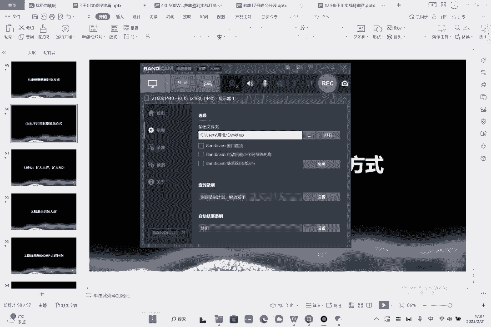

然后再录制一下第15集，前传增长期的一个投放方式啊，就前面讲的这个，前面不是讲了这个这个这个模型期嘛，然后现在讲增长期，增长期会难投，那增长期相对于模型期会简单一点，因为模型期的话需要定模型期的话呢。

你也不能出价太高，然后那个嗯模型期的话呢，就是就是没有没有那个呃基础，然后增长期的话你已经有标签了嘛。

你有了标签的话呢，你就知道大概出多少钱能够跑得动了啊，啊在这啊看一下啊，怎么看呢，比如说我现在这个计划哎，665，对不对，现在看一下就知道多少钱能跑得动了吗啊，如果你跑成交的话，它单个成交的价格。

你看你的UV是平均的签签展是86点几，你的转化成本它里面没有标注啊，我找我填一个进来转化成本他没填，我们填上40多101啊，101，那你的转化成本是101，你就明白这是啥意思了吧，你懂了吧。

就是一个成交额是101啊，一个成交价是是101啊，投了600卖了9000嘛对吧，现客单是客单是1500对吧，然后呃一个成交是101，那你就知道了啊，出多少钱能跑动，出多少钱呢，就是除以100就能跑得动。

对吧好，那么那那你是不是所有的计划你都可以除100，你看这里我出的计划的价格是多少，我出的计划是88，对不对啊，出的是88，应该能跑得动，那你就知道你的转化成本是多少嘛，对吧。

你你你知道你的水平大概是一个呃，什么样的水平，你像这个是RI的支付啊，跑了133块钱，133块钱的，有两个订单，一百三十三十五点几，看见没看，2号A的支付，刚出的，我看我当时出的RA是多少。

而目标是20啊，优化是二十二十就能跑，20多，跑的话就相当于是75块钱呗，嗯投放的数量是1808万，也就是说在增长期的话，你可以用两种方式来跑，就是嗯第一个第一个你如果图省事啊，如果咱们图省事。

为什么说为什么说就是在起量期的时候，他可以稍微泛一点，人群要圈，但是要犯到了增长期的时候，人群可以窄一点，但是人群要人群要精，就哪个人群跑得好，你是更清楚的，所以说在这个阶段的话呢。

就是我们可以用我之前给大家讲过的，哎可能每个包的人群不用放太高，每个人群包的人群就是在2000万左右就行啊，一到2000万就OK，就是你多建计划，每每天有个十个左右的计划，然后一到2000万就可以了。

然后看一下哪一个跑得好，就在这个阶段是你可以缩小包括精准人群的，为什么，因为用户系统知道了你要什么样的人群，所以说系统会安排这个人群去考量啊，系统会比最开始的时候要求会松一点，因为最开始的要求更严格。

在最开始的那个阶段，那个时期他的要求都是更严格的，而在这个阶段他会慢慢的变松，也就是说计划可以变得怎么样，可以变多啊，计划可以变多，而像这种2700多万的，2700多万，你就可以直接跑了。

可能我们在第一个时期的话，我们的要求大概是500万左右，5000万，第二个时期可以把包打到2000万啊，可以把包打到2000万，那么把包打到2000万，就是计划就会变多，那这个时候计划就会变多。

为什么呢，因为最开始的时候如果是2000万，可能系统探索不到，因为你没有标签，但是你现在达到2000万的话，你有了标签，这个计划可能就会动，可能就会动，就是就是那个像老吴讲的，通透拉满999给你讲啊。

这个肯定不行，因为通透拉满的话，它数据还是不准的，那个数据哪怕你有标签，你探索到了其他数据的话，给你对你的账户没有任何好处，我这么告诉你，对你的账户是没有任何好处的，他是你非购买的人群。

那么我们再去探索的时候，我们更多的会去探索你的购买力人群，会去探索购买的人群，也就是说在人群洞察里面在起量。

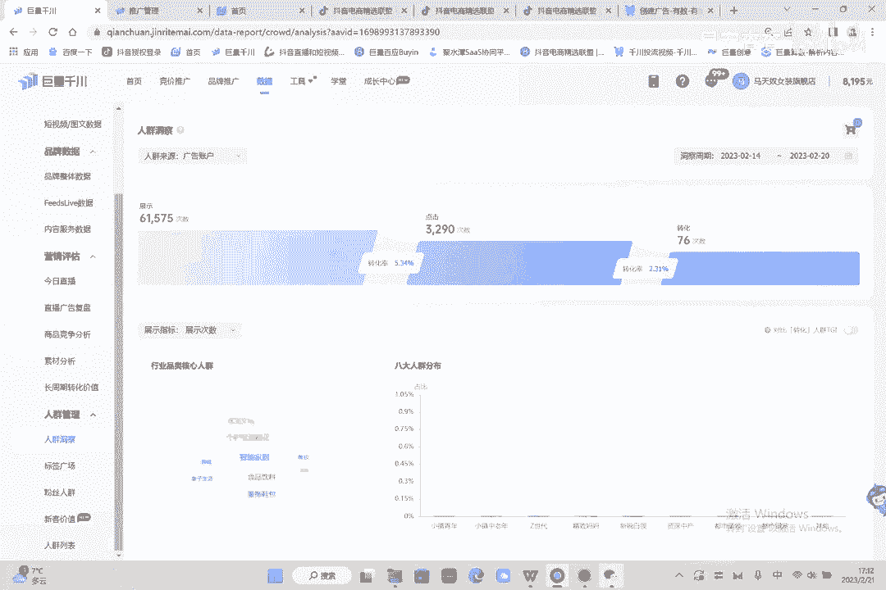

在这个时期段好，我们选择我们自己的直播间来看一下。

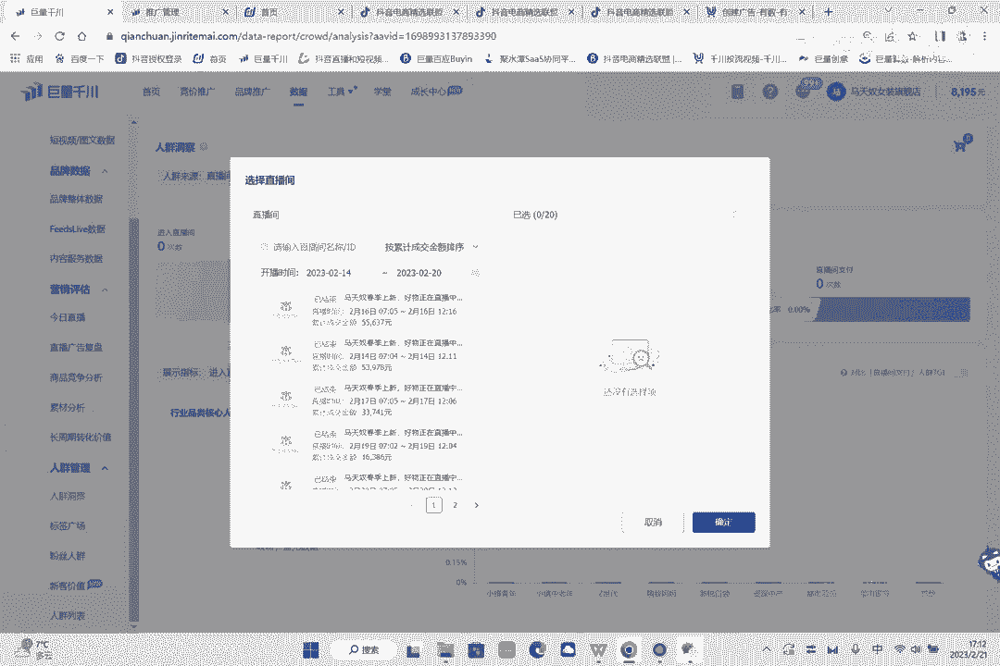

这个阶段再去打包的时候。

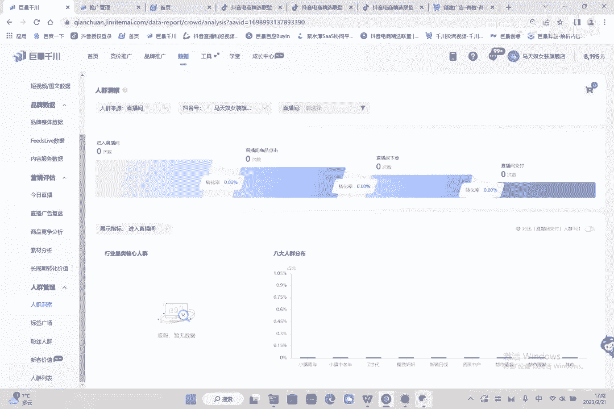

可以把包打的稍微的小一点，打到2000万左右。

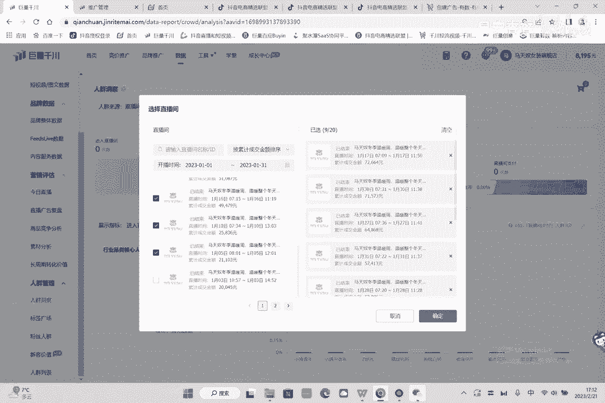

小包可以带着大包一起跑好，这个时候我们也知道了啊，是小镇中老年资深中产都市银发，但是我是不是可以做交接了，现在这样我就可以做一个交集对吧，我可以用我的小镇老年去教它的智能家居，对不对，来看一下。

那我就知道了，智能家居这个类目跟我小，跟我我跑的到底怎么样哈，小镇多少年1亿9000万行业偏好潜在人群，核心人群啊，去进行一下智能家居的电器的一个交情，对啊，八百九十八百九十八。3万好。

为什么这么这个这么小啊，为什么这个这么小呃，是有原因的，是有原因的，就是我们这个包可以怎么打呢，可以先用先这样，比如说这样潜在人群对吧，好其他东西都不要，智能家居留下好，核心人群多少，什么东西好。

别的都不要好，智能家具留下好，好像购买利润去全部都不要，然后把这地方全部拿掉啊，智能家居留下对吧，就是我们可以单独交，你，比如90天高频次，中频次就不要了，就只要高频次就要他买的。

然后这样这样90天搞搞活跃，对不对，一个亿了对不对，是不是一个亿了，好这样哦，CRPU键间距电线，这是智能家居吧对吧，电量最好的就是我完事好，现在最后多少，1亿1亿4784万好。

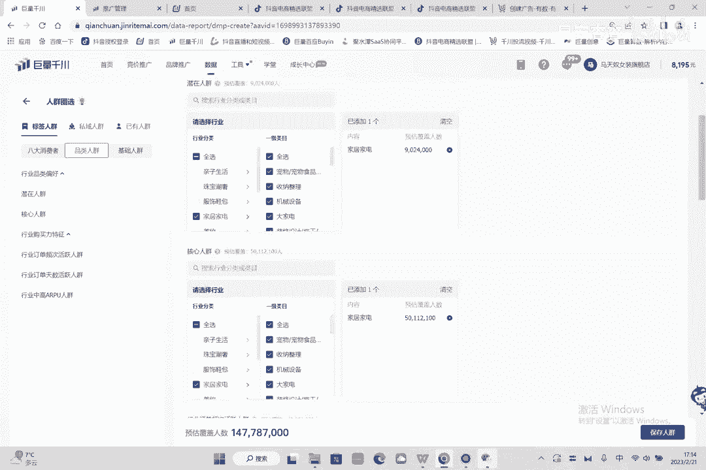

你先把他交了，这个人群叫什么叫做智能家居，他是不是说智能家居的所有人群，呃热闹家具的人群啊，这是智能家居的人群对吧，好好我们还是给他放到了一个组里面，人群分组分了两天组。

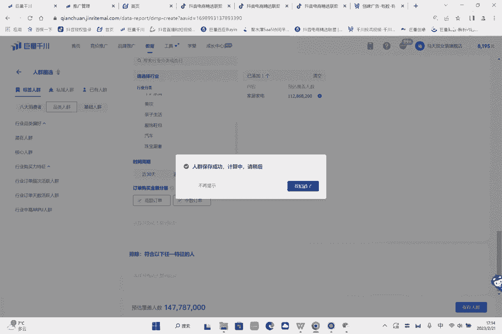

好计算，OK你等它计算这个地方，你要等它计算呢，那我们为什么这么做呢，因为如果你不这么做的话，它相交之后就会变少，交跟并集不能同时产生理解吧，你在打这个包的时候，你就把这个智能家居打进去了。

现在就是它就是智能家居的包，就是单类目的好，我们可以看到在在这个地方对吧，我们刚才弄的是弄的是哪儿，我们看这个计划好吧，呃开这个计划在在这这这里，在这啊在这，然后我们点一下人群登场人群能查。

就是我们这个就不移动了啊，我们在弄支付这个东西嗯，转化率转化成红线，成交效，按照成交金额来讲，那嗯智能家居排第一嘛对吧，那我们先打智能家居啊，把智能家居具打完之后，打什么打服饰鞋包。

然后打什么打珠宝文玩好，你那有人问了，说你这个小类目这些小的用不用清呢，0。14用不用清，我告诉你可以不清，为什么，因为我们卡了人群，你卡你还你砍了类目的时候，你还砍了人群，这个人可能就卡掉了，就买机。

就是说在智能家居里面买机械设备的人，可能就不是他妈小镇中老年，你就已经卡掉它了，你不用再重复卡了，理解吧，能理解我的意思吧，大致我估计大致能理解啊，我相信我的这个能进我们公司的人，都还是比较聪明的啊。

这是在这算呢，你让他先算啊，不着急，让他先算，我估计一时半会儿他也算不完，我等他一会儿好吧，我等他一会儿，但是这个是这个意思。

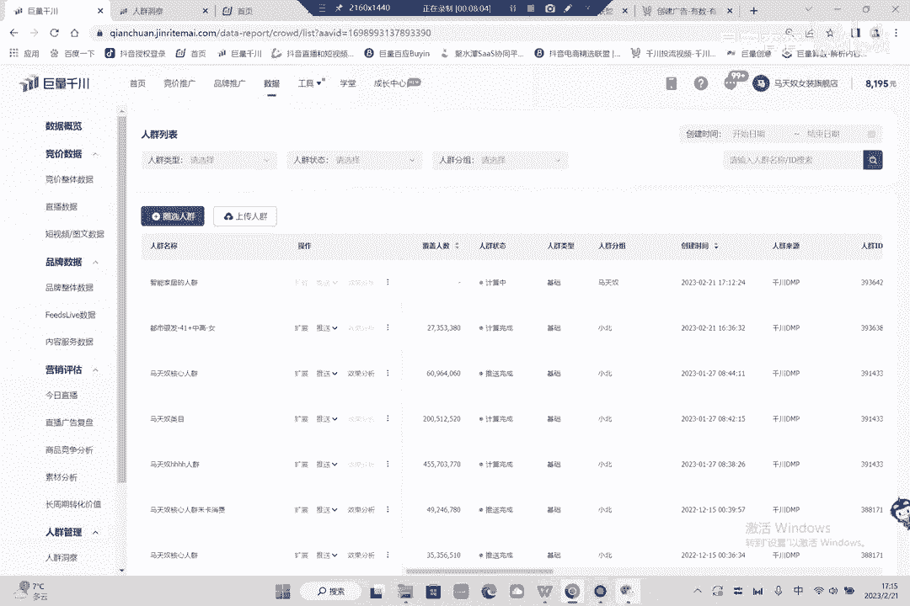

也就是说你的智能家居我们来算一下啊。

好我们来看一下这个包好，也就是说我们最后交出的是什么样的小镇壮年，你看啊，小学生中老年教智能家具，一个包教服饰鞋类，一个包教珠宝安，一个包教个体花个体花一个包教食品饮料饮料，一个包教亲亲子生活。

十以下就不交了，剩下不交了就交这五个包哈，这是五个包，对不对，这是五个包，这是多少个包啊，这是五个包哎，这又是多少个包哎，这又是五个包，所以说15个包可以抛，可以你可以跑15个包。

同时那么15个包一起跑，另外每个人群他都是不通的呃，每个人群都是不同的理解吧，他互相之间不通好，那么15个包一起跑之后，你还能跑什么好，我们之前是不是有大包大包，到时候还跑不跑大包我你到时候也跑。

理解吧，就是小镇壮少年单跑自身中产单跑，多人性化单跑智能家居，智能家居跟那个服饰鞋包哎，智能家居跟服饰鞋包单跑啊，都单跑，大包小包都单跑，这会造成一个什么样的效果呢，就是你你同时跑很多个计划，当然了。

你你可以，如果你的这个人群够精准的话，你也可以不跑大包，只包小包，这15个计划，15个计划我可以这么告诉你，如果你只要不是你把这个名字起的，花里胡哨一点，我告诉你，没没有人能知道你跑了什么，理解吧。

这个就是千春的玩法，我们再去做带头的时候，你肯定要是弄的玄乎一点，用户才能买你的单，听懂了吗，你别就是一两个计划的话，那么谁看着谁都会复制听懂没有啊，然后我们来看一下这个地方，这都是干货，那计算的好。

算完了对不好看，没有智能价值多少，1万一四千多人好，我们来确选选选人群啊，这个时候我们看已有人群在这在这选好，智能家居人群好，跟我们独身一发的啊，不是我不是这个不是不这么交交，这小镇壮年的一交。

看到没有，两是不是2000多万，2000多万是不是就够用了好，然后我们再把基础人群打上去，基础标签，年龄标签打上去，四十一四十五十啊，600多万，600多万，女性人区375万，375万，消费。

高消费中高消费，好我们来看这个包是不是打出来就小了，我们现在来讲是不是，就只你你只打出一个200多万的包啊，但是你200多万的包打出来，你也可以按照200多万去跑，你可以按照200多人去跑。

就是你可以去测这个人群去跑，没有问题的，因为他是一个智能家居的人群，再加上一个小镇状的人群，你可以去跑的，你只要出一个价格，反正我这个类目我交出来之后，我大包也跑，小包也跑啊，可能我这个小包最后好。

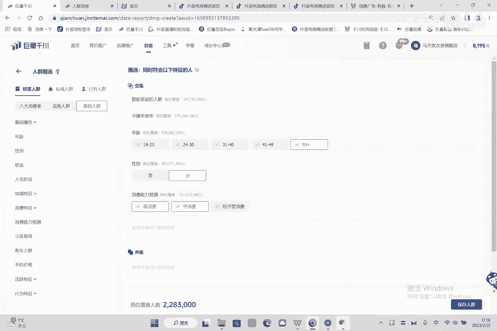

可能这个小包我最后有个呃，这个包不止200多人群，这个算出来肯定有300多人群的啊，有300多人群的就是智能，因为可能小镇中老年智能小镇，就我们叫智能小镇，对不对，41家的女性对不对，中高啊。

小可那这个人群就很精准了啊，这个人群就很准了，好我们直接确定退出啊。

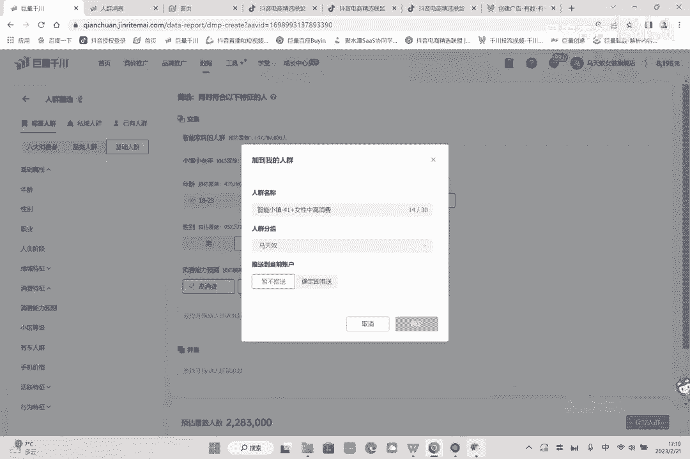

就是你的这个，但你前期可千万不能这么打啊，在起量期是不能在这个模型期是不能这么打的，得在得在这个什么时实际才能这么打，得在得在增长期才能这么打，在起量棋是不能这么打的，因为起量棋如果这么打的话。

就会出问题，就会他跑不动，他肯定跑不动，但是你已经有量有模型的情况，他是200多万的，包里面就能跑得动，你只要把价格出到正确的一个价格，比如说你出个除以88哎除以100，它就能跑动啊，你就能跑动。

你算出来之后肯定不是200多万，你算出来之后大概在400万左右，你放进去在400多万吧，因为那个包里面放进去的人群都要大一点，等会我给你们放一下看看啊，我们等他个2分钟，等他探索一下，嗯看一啊。

嗯那个毛算一下，好了200多万，看到没，这里是220万的，六千六千六，226万的7460多，我给他放到计划里面，你看一下啊，放到计划里面就不是这个数字了，这里还是一样的啊。

这个支付RI支付RI的话就是20，刚才20都跑动了对吧，我们现在的话就是金额是101对吧，我们设置一百一百肯定能动，然后这个地方还是3000不动，暂停不能往下拉，自自定义定向，然后选择更多人群。

自定义人群，马天奴的诶。

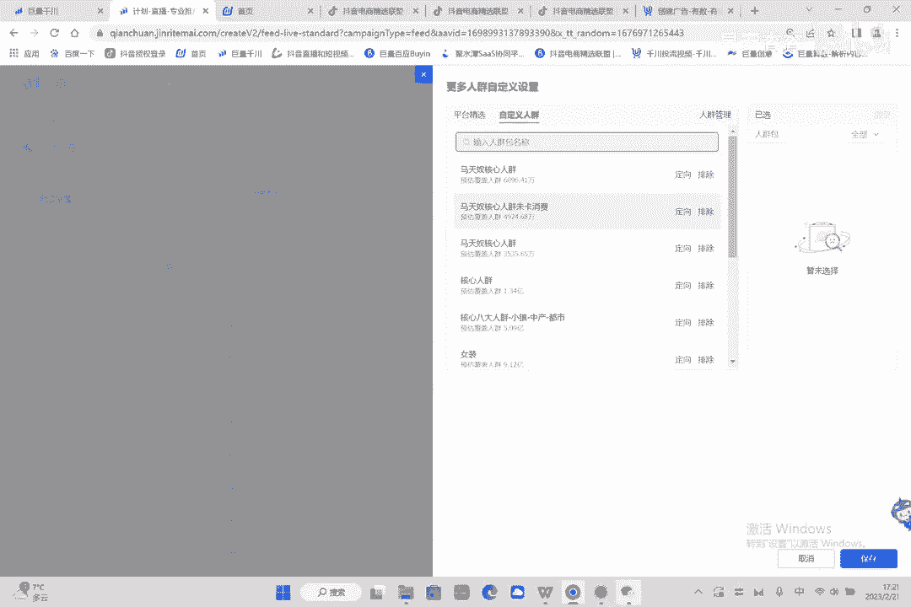

我没推进来，没有推进来，这个得推进来，这推送还要一会靠嗯，推送到当前账户，先推进来，啊这个推送需要推一会儿，大家等一会别着急啊，我来看一下它推送完了没，还没有还推送哎呀，未使用平台工具战乱引流。

推送起来可能会比较慢啊，这个还没推好，还没推好，还要再等一下，千川基本就这样啊，千川你说有没有第三个时期，就是说嗯有没有那个额就是成熟期之后，其实成熟期之后的话，就是其实就是你账号有模型了之后。

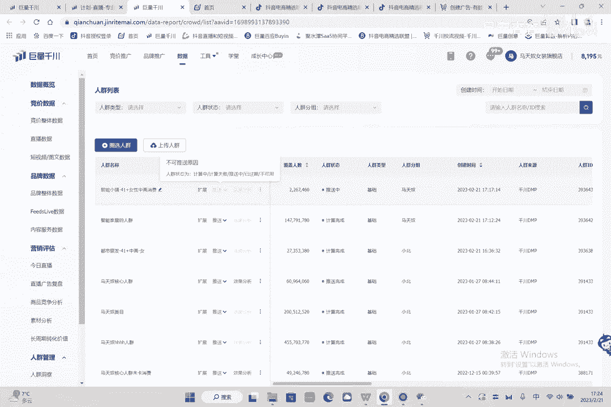

账号哪怕有模型了，这个地方我也觉得再给大家讲一讲，补一下这个东西，就是就是哪怕账号账号已经有模型了，你的账号已经有模型了的情况下，你也不能乱跑，因为你的模型如果一旦千川投放量过大，模型能跑偏，一旦。

极速的流量过大，模型会偏，知道吧，模型偏了就麻烦了，这模型模型偏了的话，你的RA一定会往下降，你还得用正确的模型去修，所以说千川在跑的时候呢，我们真的是不能够去跑这种嗯，这种这种极速就极速的话可以带。

可以略带，但是极速一定是搭配着主机炮去跑的，主机炮的主机化得往大了跑。

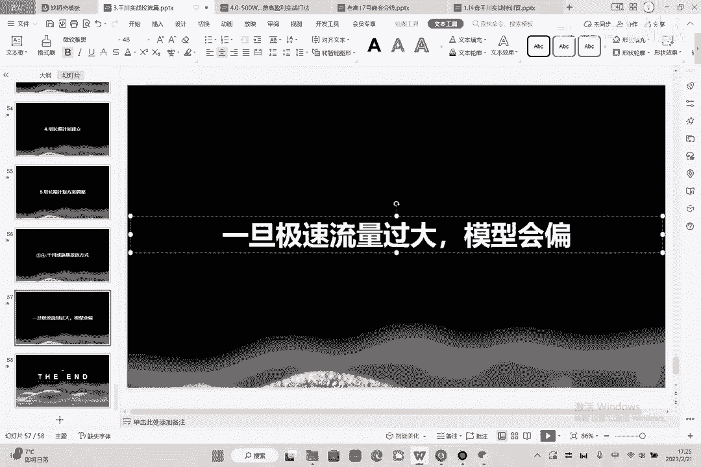

然后才能去带极速，然后这里的话呢我觉得可以讲一个小技巧，可以给大家讲一个小技巧，趁着这个他推送的时间啊。

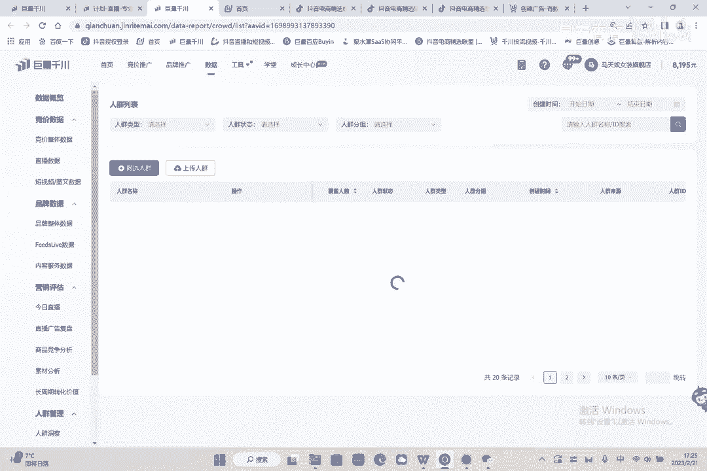

哎完成了啊，完成我们在这里的计划，看一下，在计划这个端口看一下它到底是多少啊。

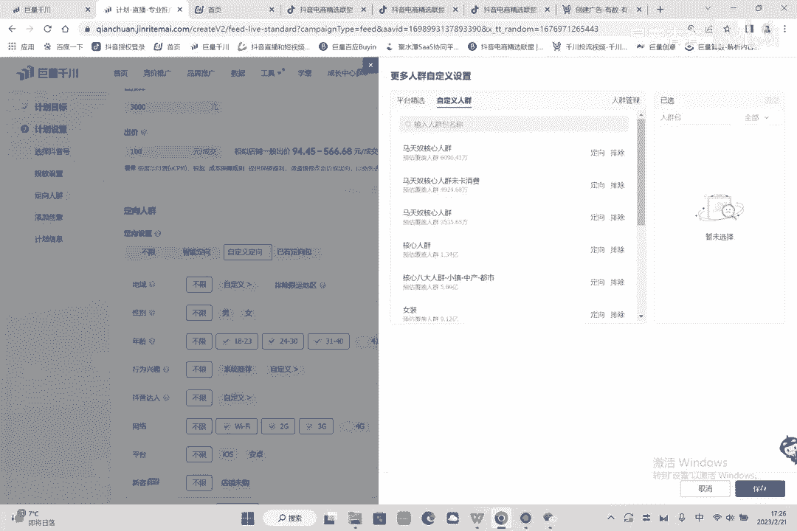

我们在后台看的话呢是226万对吧，然后我们在这个地方看一下，这个地方的话呢是这成交，然后这个地方是3000，这个地方是嗯嗯100以自定义定向，然后店铺自定义系统违规在哪呢，就更多的人群自定义人群。

这个哎定向好，定进来看是多少，376万，哎你看我就说吧，他基本都会稍微大一点，然后给你圈个女，那你看他会不会少一点，没少四十一四十九全选上上没上，摁下去啊，没少啊，四十一四十九，353万。

所以说所以说他整体来讲，他是一个353万的这样的一个人群，你跑也可以建一个计划跑嘛，对不对，建一个计划跑视频嘛，完全可以，就是计划多啊，你不用太担心他15条计划呢总有人群多一点，人群小一点的。

你出一样的价格让他去探索就行了，那这个时候你就能知道每你你的计划，大致上在每一个人群里面是一个什么样的属性，一一定是有模型之后才能这么去跑，没有模型的情况下不要这么跑啊，没有模型的情况下不要这么去跑。

然后你在这么跑的时候呢，你也别担心，说你的你的那个说，最开始我们第一个在在模型期的过程中，就那几个包好不好用，一样要用，一样要用大的小的都有，大的呢主要的目的是为了测什么呃。

你大的包主要是为了能够保你的量，你小的包更多的目的是为了去保你的RI，能懂吗，能懂吗，然后你根据这些计划的话，比如说你可以有一批你的大的计划，后面你的大的计划不就是深层计划了吗，好你的深层计划。

大的计划可以去建ROI计划，你小的这种计划可以建成交计划，明白吗，因为因为你的人群大，为什么RI要拥有人群大的包，因为RI他的成交会更加的怎么样，更更它更深度，所以说它需要更大的范围去探索他跑的深度。

他在这个大范围里面去找这个探索的人群，而你小的300多万的成交相对来讲浅一点，所以说你就可以去跑浅一点的，这样的一个计划啊，我估计大家能理解啊，都是聪明人啊，都是聪明人嗯，基本上就这样。

然后我再讲一下这个几个计划的一个区别，在这个地方有一个区别点需要讲呃，呃在这那就是新建计划呃，新年计划的话呢，就这有一个专业计划通投广告极速推广，我把搜索的话也给你们讲了，找搜索也讲搜索其实极其简单。

搜索在这新建一个搜索计划啊，比如说马天奴对吧啊，你不能单见马天奴啊，对吧啊，这个时候是这样的一个情况下，马天奴，你先把你的词先把这个词全部删掉，好好你先看你先添加关键词，你先看你关键词最多的是什么。

是是什么，是是连衣裙，对不对，你主打连衣裙，那你就那你就去搜连衣裙对吧好，祝你所有连衣裙连衣裙之后呢，干什么就下载好，我们下载一个关键词出来好，这个好打开好，打开之后我们点这个量，第一个点筛选点筛选。

然后哎针对他点筛选，然后月搜索量啊，这里的输出一个词，这里点什么呢，点那个不要点升序降序点数字筛选点大鱼，最少一个月最少得收个5000个吧，你不搜5000个话，说明你没有能力啊对吧，还有5000个。

然后呃点个降序，看一眼裙子，裙子连衣裙大裙大裙都可以，这些词都可以用啊，这些词都可以用好，娃娃领裙都可以用，好的这批字都留下好，A4也，这些词都留下好，留下的话呢，然后我们要按照什么来弄呢。

按照这个上传关键词表，关键词模表，这里写一个东西好打开好，打开之后把关键词填到这啊，好在这关键词这行删了对吧，然后这个地方呢全都是用那个什么，选择选择短语，这地方选择短语就行啊，不用选择精准。

因为选精准的话有点太选金水也太泛了啊，选金也太泛了啊，然后如果你选那个的话就又太窄了，你选这个这个这个广泛又太窄，就选短语就行，短语什么短语就是包含这些词好，这些呢都是搜索量在5000以上的，很简单啊。

很简单对，都都是等于号好，CTRLSOK文件嗯，另存文，这说明你的关键词就几个对吧，你看这个女装，那就连衣裙搞定了哈，然后你再搞一个再搞个什么，再搞个女装是吧，女装也是你大四嘛啊。

在女装里面你可以弄一下啊，弄一下这个东西啊，马天奴是你的品牌色，好按照这个程序弄啊，每天东西可以按按照这个程序来弄好，当然测这个东西，马天奴他可能品牌词跟你这个没关系，好没关系啊。

马天奴的话可以可以来弄，然后你上传的话就传回来就完了，传回来在这个关键字模板二哈，传回来好，你的词确定先添加好，这句子都来了对吧，全是短语，好的，添加进来看见了，然后一样的道理啊，一样的道理。

然后卡成交是吧，然后呃卡成叫自定义啊，要卡自定义自定义，这里呢主要是不卡这个东西要卡什么，看年龄，看年龄卡性别，看你的主人群哈，好这样的话又是我的主人群，他又solo这个词，你觉得成交概率大不大。

他是不是成交概率也很大，然后成交的金额是一样的哈，3000元88，这有什么难的呢，啊这有什么难的，把1000个词填满，把1000个词跟你有关系的词填满就OK了啊，这个不难啊，这个不难。

然后然后卡视频OK了，让他跑就可以了，让他跑就这么简单，好吧好吧，这个搜索就搜索就搜索就讲完了，搜索是非常非常简单的一个搜索词，然后如果你要是不嫌麻烦的话，你把这些词全部换成精准，你也再建个计划对吧。

你把这些词全部换成精准，再建个计划，然后如果你想把它，你想量大的话，你就给他换成广泛用管饭也可以，为什么，因为你卡了这样的一个成交嘛啊你卡一个成交，但是成交的话在这个里面的保障，你要看一下，现在有保了。

应该是在搜索情况下哈，转化数大于两个，三天转化两个，你是可以做到的，三天转两个是可以做到的，所以说用广泛也可以啊，用广泛也可以，当然你就可以按照这个精准精准广泛，还有这个成交，你各建一个计划吧对吧。

你构建一个地方搜索就完事了啊，相对来讲还是呃呃没什么难的啊。

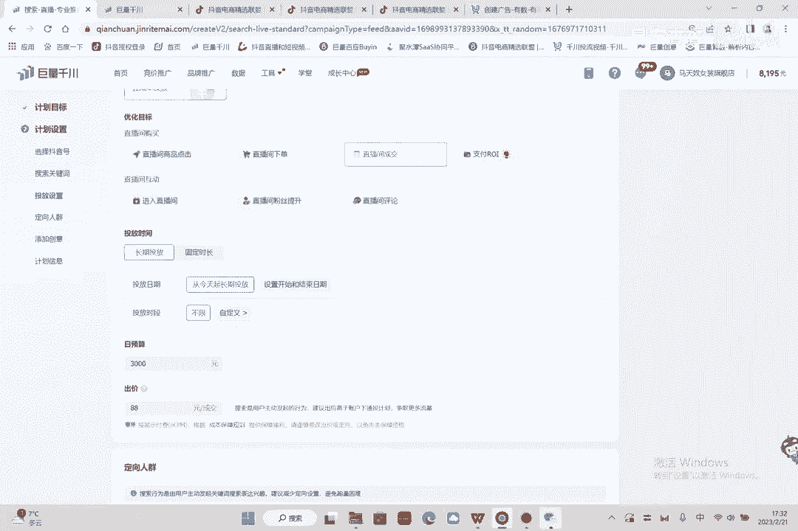