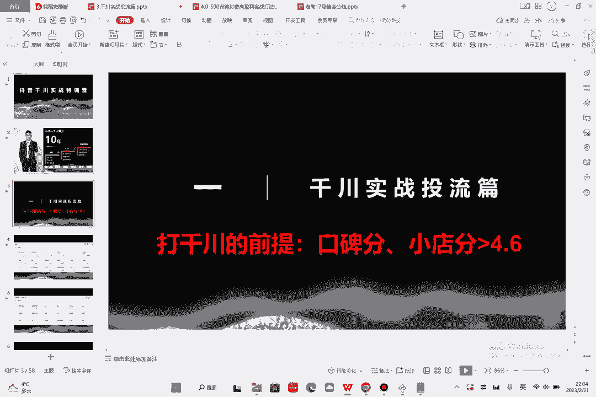

# 086 2023抖音千川运营训练营，起号期+增长期 的搭建计划详细实战课！ - P1：01.千川序：自我介绍.mp4 - 早安睿睿 - BV1e7421Z7KB

Hello，各位同学们，大家好啊，那大家买了这一节课，听到内容的话，那就是我们抖音千川的一个实战特训营，我出的啊，我们叫小北，简单的呢介绍一下我自己，我的花名叫小北啊，已经在电商行业有10年了。

那我自己呢是15年的淘宝大学的讲师，然后万堂书院的讲师，他就是抖音巨量学的讲师，另外的话呢我和其他的老师不一样的地方，就是我自己呢也做过IP，是在抖音有76万的粉丝，然后在快手有300万。

然后也是内蒙古的爱心扶贫的重大事，另外的话呢，我去年和前年的是一个呃职业经理人，是一个上市公司的VP，然后呢负责抖音的直播基地，然后也负责了很多个大家知道的品牌，那我的最有名的这里写一个叫做慎独，刚毅。

谦卑坚忍跟勤奋，这个呢不是我说的，这个是曾国藩老师，然后再去有一本书叫做挺经，如果大家有空呢可以看一看啊，这本书对我的启发很大，然额第二，那么千川的话呢，我们这节课呢是一个序言，那么千川投流的实战篇。

我在开篇的时候呢，呃给大家讲一个话题，就是千川你要是想投的好，你的口碑分和小店分是要大于4。6的，这个如果没有做到的啊，大家呢可以去怎么样。

可以去做一下，这里呢我写上额口碑分啊，小电分额大于4。6，好，这个呢我以后每节课呢我都写一下。

然后呢其实千川的话我们可以看一下，这个呢是我在去年的时候投过一个临时类目啊，然后当时的话呢是23。4万的销售额，然后投出了呃103万的1。04万的成交，然后RI是5。32，这是第一个案例啊。

然后第二个案例的话呢是一个数码产品，数码产品的话呢是呃投了83万，然后产出了的话是100呃，200万啊，203万啊，7日的一个产出数据的话呢，是一个2。5的一个数据。

所以说呢不同的类目它的投法是不一样的，那么在这样的一个数据下，能突出这么大的一个金额啊，能投出一个这么大的金额，那么投流的话呢是一门学问啊，对于大类的账户的话，投起来会更难。

像这种数码产品客单价比较高的，投起来其实是很难的，有人会问啊，说那你这么高的一个投流费用，然后你的产出这么低，还有利润吗啊没利润是没人做的啊，兄弟啊，你要知道这件事情没人没有利润的话。

一个月投80多万是没人做的啊，然后第三个的话呢是一个女装类目啊，女装类目的话呢，它的成交他的RI就会比较高了啊，这个呢七天的一个RI是31。86，投了6万8，然后七天的一个累计的产出是220万对吧。

那大家再去看课程的时候，肯定觉得哇这个女装账号的投手很厉害，是不是，但其实这三个账号都是我自己投的啊，也就是说投手没变的一个情况下，不同的类目它所投出的产出比是不一样的。

不同的类目它所能够产生的RI也不一样，所以说呢跟投手其实关系有没有有，但是并不大啊，并不大，因为经验都是一致的，那么不同类目在操作的时候呢，有的类目就是没有自然流，有的类目靠千川纯打这种类目的话呢。

他的ROI相对来讲偏低，那么自然流的直播间呢，其实有一些RA是会计算到你的自然流成交的，也就是说你虽然是推荐流卖的货，但是也会给你记得千川的成交。

这个大家能理解吧，好那么这节课开始呢，我们就从细一点的去给大家，详细的来讲解一下啊。

