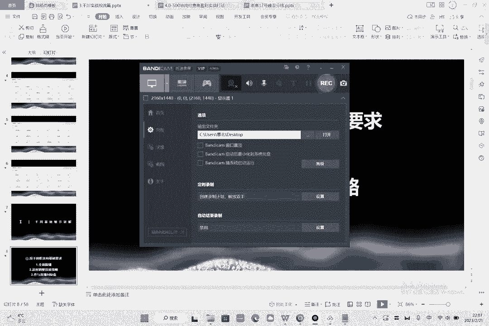
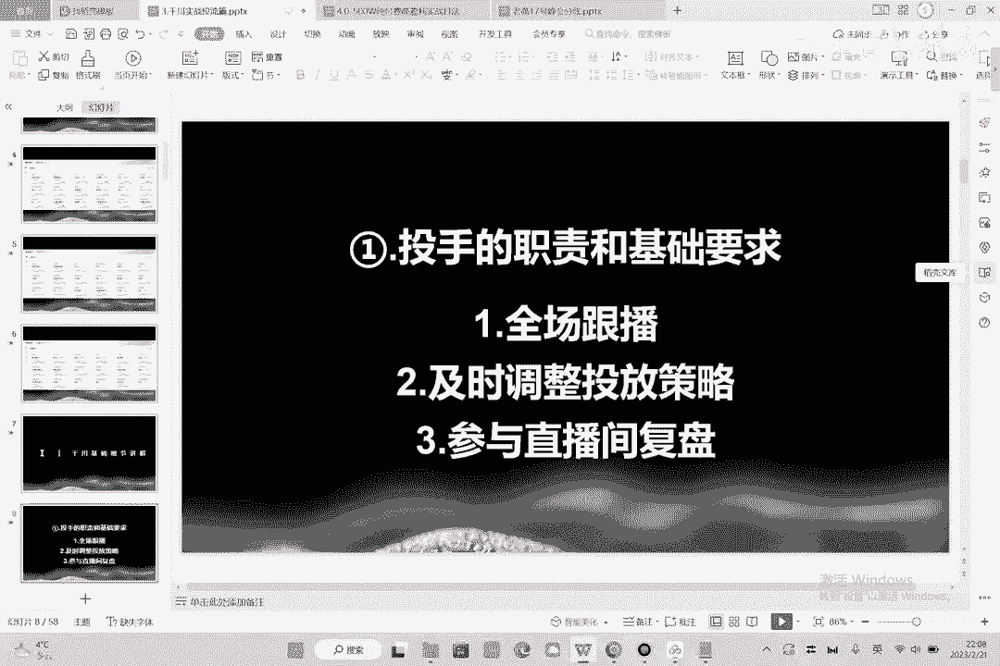
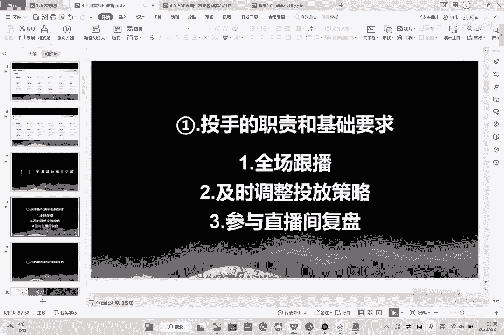

# 086 2023抖音千川运营训练营，起号期+增长期 的搭建计划详细实战课！ - P2：02.1.千川基础讲解.mp4 - 早安睿睿 - BV1e7421Z7KB

好的，那我们学习线串的都是为了去做投流嘛，那么在这一点上呢，我们先来明确一下，一个投手在店铺中的职责和基本要求，那么一个投手他有什么样的一个职责，首先如果你想做好投流的话，我们再去服务用户的时候。

都会一对一跟播的，就是这个直播间出了什么东西，出了什么问题，你最好时时都能知道，因为你只有实时的把控，那么你才能够去做出及时的调整它的投放策略，那么如果你自己都不知道说，他到底哪里出了问题的话。

那你是没有办法去调整它的策略的，这个大家能理解吧，也就是什么时候该加价，什么时候该停计划，什么时候该复制计划，什么时候该新建计划，这个东西你是完全不知道的，所以一个投手的职，一个投手的职责。

第一个是全场跟波，第二个是根据直播间的效果，根据直播间的数据，那么及时的去对整个的投放策略做出调整，第三个是要参与到整个直播间的复盘，也就是说你直播间在直播过程中，到底有哪些问题是需要投手去参与的。

也需要投手来告诉你，你觉得主播在这一步为什么没有转化好，因为转化跟投流是息息相关的，你需要给出专业性的指导意见，这个我们再去投的时候呢。

