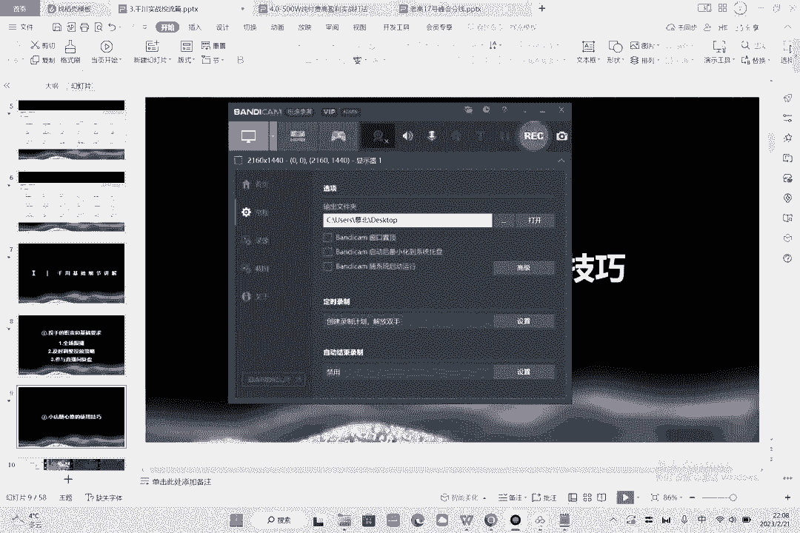
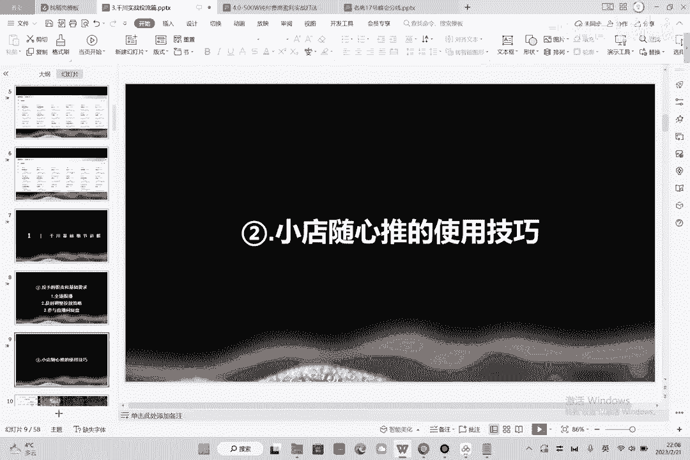

# 086 2023抖音千川运营训练营，起号期+增长期 的搭建计划详细实战课！ - P3：03.2.小店随心推技巧.mp4 - 早安睿睿 - BV1e7421Z7KB

然后我们第二小节也比较简单，第二小节呢就是小店随心推的使用技巧。

其实小店随心推在我看来啊，没什么技巧呃，为什么这么说呢，因为他整体的操作真的是很简单很简单的，你作为电商来讲的话，在2023年，如果还有人告诉你说，哎你要不去投点商点，要不就团点进入直播间做的人气。

我告诉你，他的这个东西成交支付RI下单商点跟进入，它并不是转化目标的不同，它是人群的不同，也就是说你投商点的人他就不买东西，能理解吧，就你进来的全是大拇指，进来的全是灰太狼，所以说这种情况下。

我们是无论如何不可能去投下单跟上点的，那么你要记住一个点，就是如果你还你这账号是中，前期你的标签模型并不稳定的情况情况下，你就投成交，因为成交相对于支付RI来讲的话，它的投放深度会相对来说浅一点点。

那么他这个浅一点点，有助于系统帮他去探索更多的人群，如果你的模型准确，我们大部分的情况下是会用到千川巨头的，用到小店随心推是很少的，而如果你的模型准确，你也可以去投支付ROI。

所以说对于铅窗我们电商户来说，那么简单的投法就是投成交，然后呢系统智能推荐，自定义关注类型和档案相似，这个地方啊，是这样的，这个地方的话呢有区分点啊，为什么说有区区分点，你在没有模型的时候。

你无论如何是不能去投系统推荐的，因为系统也不知道你的模型是什么，他也不知道什么样的人群去适合你，而你去投了一个系统的模型，你投出来之后会变会导致什么样的一个情况，会导致你的这个模型去跑的过程中。

系统也不知道跑给谁，那么就会导致这个账户整怎么样，整体空跑一个钱浪费掉了，所以说我们在信号的阶段，是不会去投系统的智能推荐的啊，那么我们会投什么呢，这个时候呢，我们就要讲一下达人相似的一个推荐。

和自定义观众类型的区别是什么，达人相似的好处是，这个人群确实他抓的比较精准，但是非常的不好意思，你在这个达人相似过程中，你只能选20个相似的达人，而这20个相似的达人你全部勾选上之后，你会发现。

虽然说你在选择过程中选择的是互动行为，你选的这个是互动行为，就是说种草过商品的行为，但是我告诉你，你的这个人群用户里面，很有可能没有办法去覆盖到，系统能跑量的一个量级，什么意思，你选20个达人。

可能种草过这20个达人的呃，人群只有200万，只有200万到300万人，还得说是大户，小户的话，可能就是百八十万，那百八十万会造成一个什么问题，就是系统根本跑不动，那么但是小电磁星推有个特点。

就是其实它是会放量出去的，那么它放量出去的情况下，就是你如果放量数据的话，那就导致了你跑的过程中，它还是会飞，还是会飞，他的人群不够，你探索，你懂我意思吗，那他还是会去盲目的找人群。

另外的话我们之前老版的话，大家都看过达人相似的一个观众，他能够买到的用户量是最小的，他并不能买到大量的这样的一个系统用户好，那第三个是什么，第三个就是小店随心推投自定义的关注类型，这个其实用的比较多。

就是比如说这个前提是什么，前提是你一定要有一个明确的人群，比如说我是卖连衣裙的哈，那我就是不排除我选择女24~30岁，31~40岁好，这是我的人群啊，那这个人群其实投下来之后，相对来讲也是比较精准的。

可能有个一两个亿这个样子，让他去探索，又够系统探索，又够你自己的人群去吃，那么就能够去慢慢的去跑，而有一些类型的产品是比如说什么花卉呀，比如说一些数码三四页，他又有男又有女。

这个时候我建议你还是去跑达人相似，因为达人相似会相对来讲准确一点，那么这也就是说自定义达人啊，自达人相似，跟自定义观众的类型，我们应该怎么选，大家清楚的，要了解到这一点就OK了啊，没有问题。

然后小店随心推，整体的技巧其实就是这么多啊，他是没什么太多的一个难点，而且我基本上讲到了，还有就是要要不要投视频，投视频是这样的一个情况啊，就是你并不是说每一单都要投视频，小电推推是100起投。

所以说呢你去投入程中呢，你可以先一板一板的投视频跟直播间的画面，你都跑一下，直播间的画面的好处是它更直观，用户看到的这个画面进来之后点到你的直播间，就是你当前的这样一个直播间。

那么用切片去投视频行不行也行，切片投视频的话，也是也是素材跟直播间是同步的，这个对这边也有好处，那么如果这两个都不行的情况下，那么你去投视频，视频的话好处是什么，视频好处是它可以拍的更精准。

有一个精准的引流，但是另外一个好处是什么，另外一个好处是，如果你投画面的话，会存在创意几啊，也就是如果你同时投很多条的话，一定会有一个创意解压，就是你有很多个画面同时在竞争，那么你的创意是相似的。

那这个呢就是用视频可以避开你的创意解压，另外就是视频可能会更加的精准，视频去投的过程中，那么视频在去投资过程中呢，他至少对这个产品是种了草的，用户有兴趣的才会来买，但是你千万不要去拍一些什么乱七八糟。

跟直播间没有关系的视频，这个对我们是没有任何好处的，总结就是你需要3~5条的素材来帮助你去投，小电水硬推，但是他有一个缺点，缺点是如果你这么选了的话，就会导致你的直播间啊，你所投放的素材会被对手看到啊。

这是他的一个缺点啊，全员随机推的订单呢，其实跟你的直播间走，像我们投资程中的，可能300成交个几千块钱啊，或者说400多，成交个几千块钱都是很正常的一个情况，非常容易去出现啊。

投个十几20的RI是很正常很正常的，但是这个东西一定是建立在有模型之后啊，那有模型，说白了这个RI高低没什么可比较的啊，因为如果大的网红在开播的时候，比如说像什么前段时间那个什么呃刘晓庆啊，对不对。

什么向太啊啊什么这个这个这个嗯呃董先生啊，你去给他投100块钱，你去试一试，他的RA能跑到200行不行，投100能成交2万，所以说这个东西本身它不是本质，RI的高与低。

并不能说明这个人的水平跟投手的水平啊，这要看账号是否有模型，有标签了，这个就是小店随心推嘛啊。