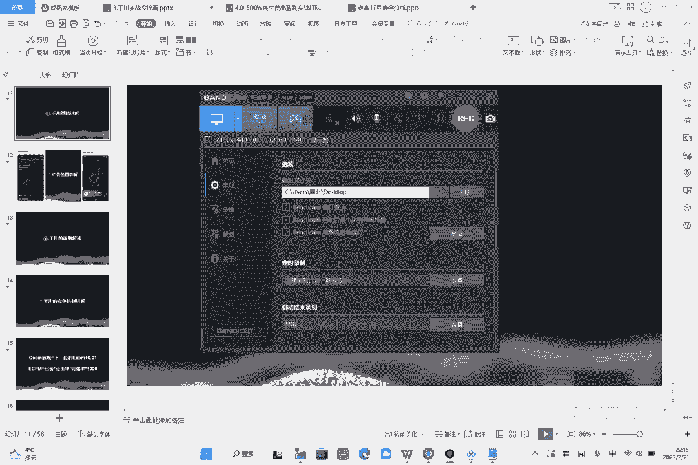
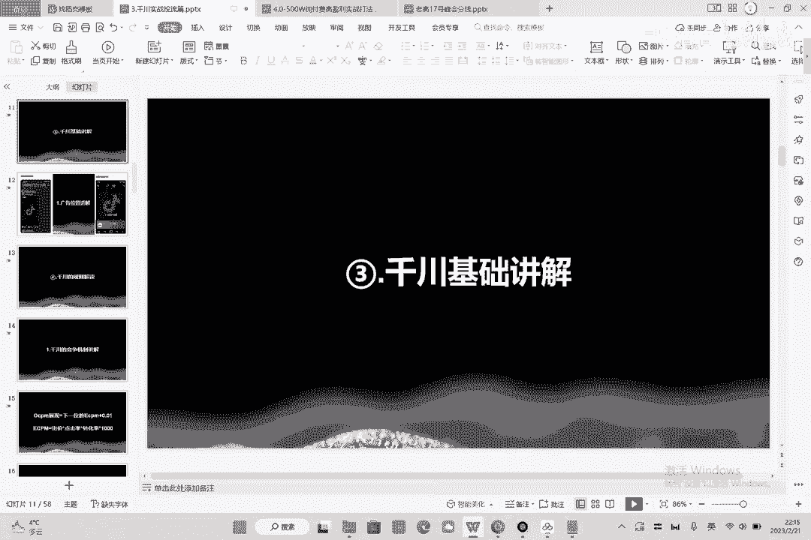
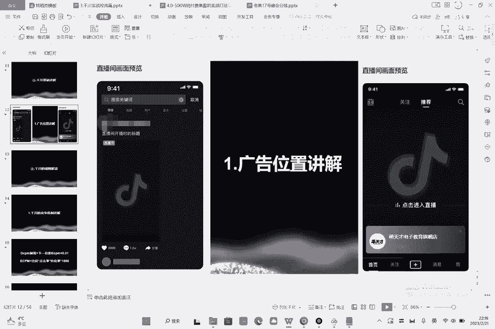
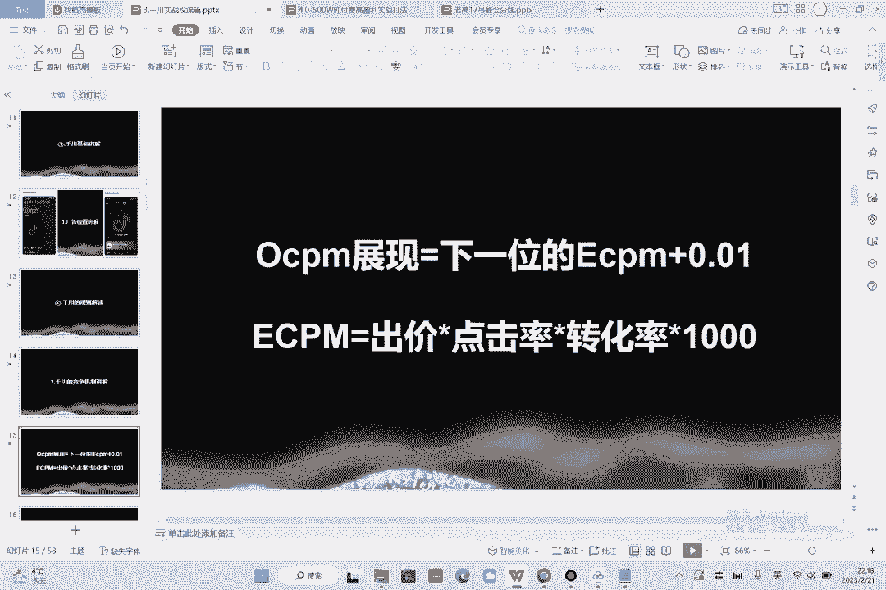
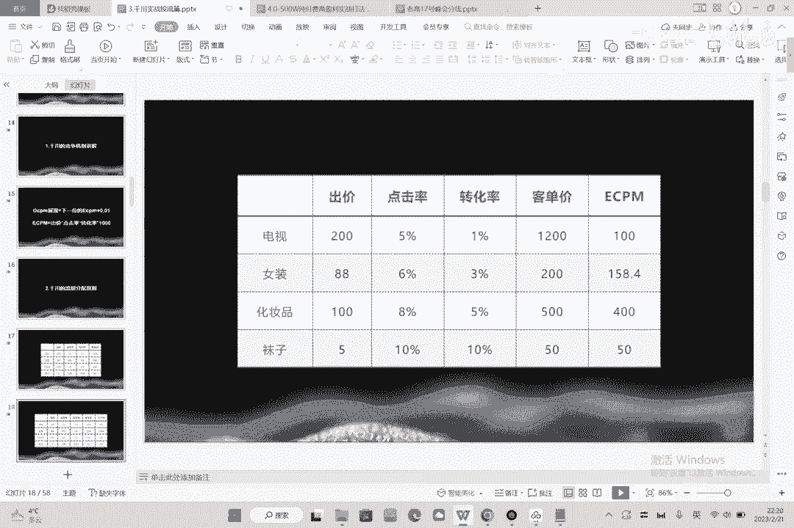
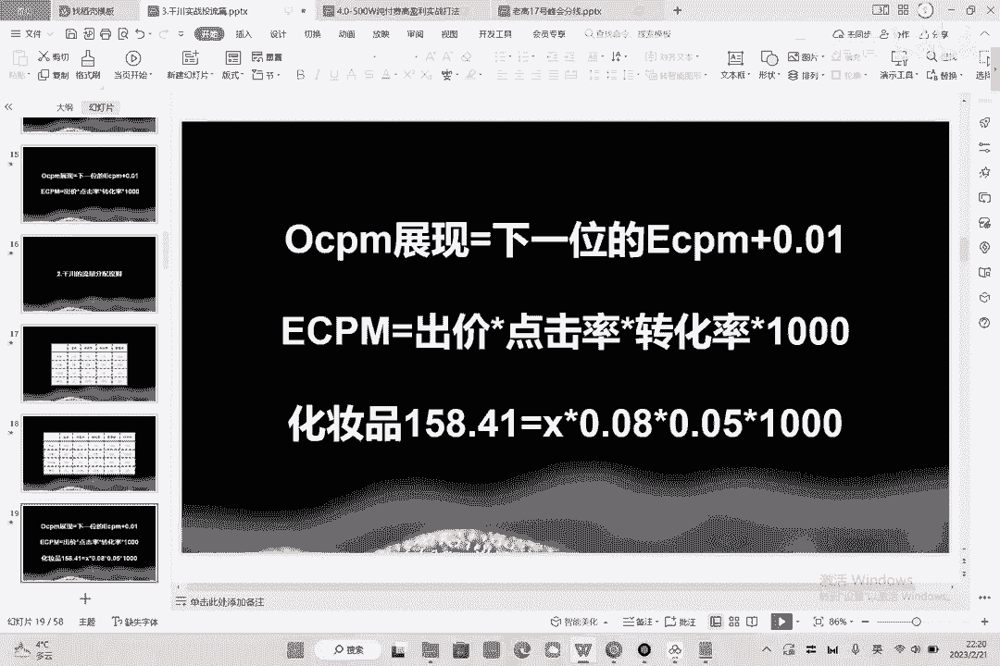
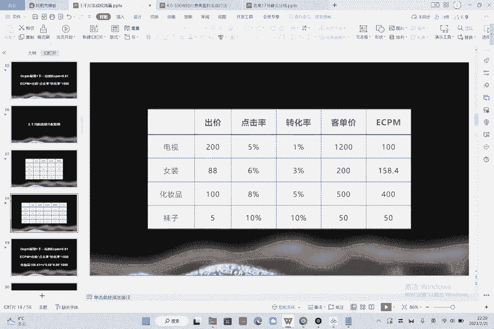
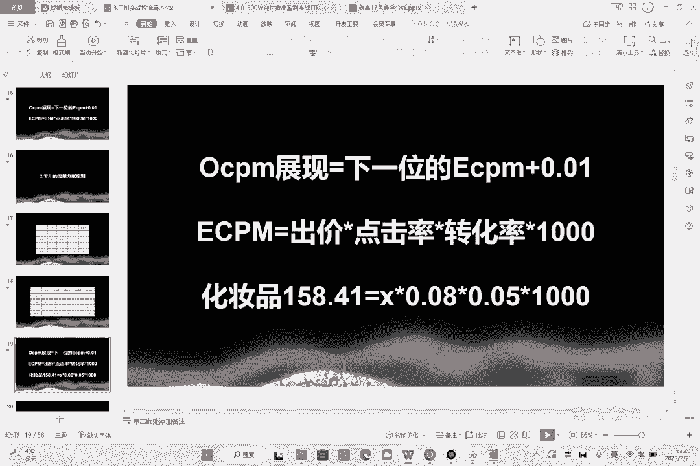
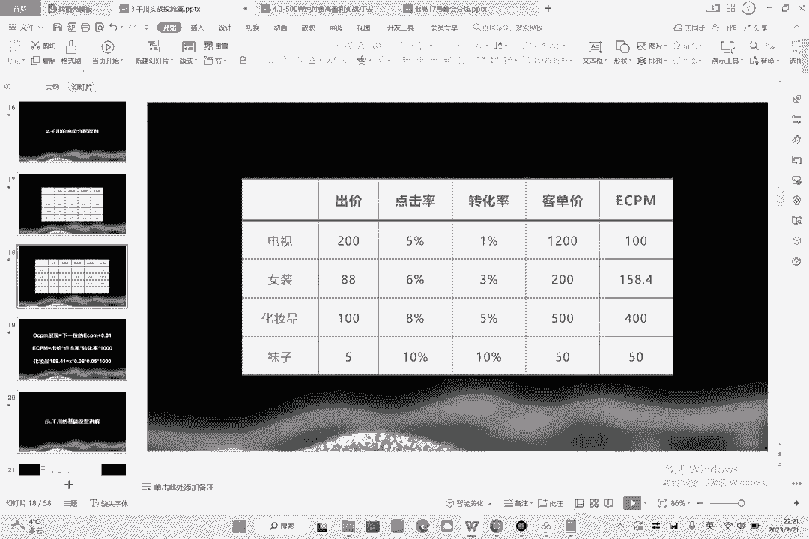
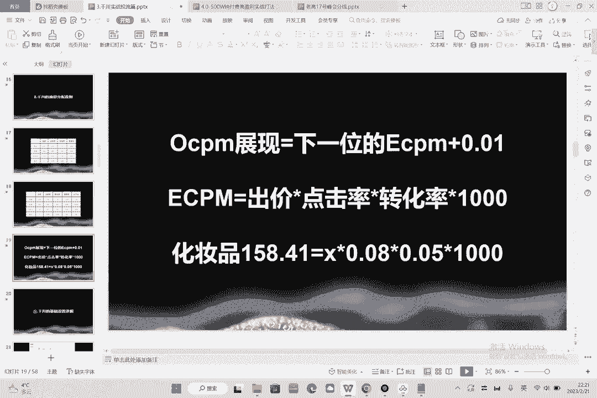

# 086 2023抖音千川运营训练营，起号期+增长期 的搭建计划详细实战课！ - P4：04.34在一起.千川基础讲解.mp4 - 早安睿睿 - BV1e7421Z7KB

呃第三节的话我们拿千川的基础来去讲一下。

那千川的基础讲解呢，就讲一下千川的一个广告位置啊，这两个呢是需要大家去了解的，如果说你千穿的这样的一个广告位在右侧啊，你看一下右侧，右侧的话就是你在刷的时候刷到了一个画面，这个画面播放的视频。

点进去就是千川的广告位啊，点到你的直播间，有很多人他也不知道千川是怎么展现的，就收我钱，那么今天我告诉你，千川就是通过右侧这样的一个方式啊，展现出来的，那么左侧是什么呢，左侧叫做搜索关键词。

就是它是千川的搜索广告，那么你只要在千穿的过程中搜索了这个东西，比如说我搜索了一个什么什么啊，化妆品啊，什么什么东西啊，你搜索了这个词，你买了这个词就会在左侧，这是他的一个广告，那么这是千春的广告位。

你知道它在哪里，你才能够更好的去啊应应用它，对不对。

那么第四小节的话呢是一个千穿的规则解读啊，额比较重要啊，比较重要，大家好好记啊，这节的话呢概念性的东西其实挺多的啊，那这节的话，第一个小节呢叫做讲一下，千川的一个竞争机制啊，千川是个什么竞争机制呢。

给大家讲一下，第一个就是OCPM啊，就是目标的签字展现的一个扣费，那么OCPM等于什么呢，就是OCPM等于下一位的ECPM，加上0。01，可能大家听不懂啊，到底什么是OCPM，什么是ECPM，对不对啊。

CPM知道吗，CPM话就是淘系的钻石展位签，叫做千次展现的扣费的一个竞标，那么OCPM呢叫做目标签词，展现的一个竞标啊，它是不一样的，那么什么是ECPM呢，你可以这么去理解，如果你的ECPM高。

那么你就比用户先跑啊，ECPM是干嘛用的，ECPM是用来比较排名用的，看咱们两个的广告谁先不好用的，OCPM是什么，OCPM是扣费用的，也就是说这个东西我能扣多少钱，我虽然说买了大家抢这个广告费。

我能扣多少钱，然后下面这个公式你先看一下，你不需要懂啊，ECPM等于出价乘以点击率，乘以转化率乘以1000啊，记一下盲记啊，大家可以盲记一下好那有人问了，说这个东西有什么用，有用啊，这个东西真的有用。

为什么有用呢，是你就能够知道铅穿的规则是什么，出价不说了，我们都有出价，按照一个成交价100块钱，对不对，假如出价成交，我出100，我的点击率是5%，我的转化率是6%，那么我乘以1000。

那这个时候问题来了，如果我的转化率提升到了8%，我牵出的价格是不是就可以降低了，是不是我的出价一定会降低，为什么，因为我的竞争力变大了，对不对，那么你怎么能提升到8%呢，同学为什么我告诉你。

你提升到比8%的办法就是，第一个办法就是降价，第二个办法就是提高你的转化，第三个办法就是提高你的节奏跟密度，对不对，那所以说有没有关系有关系啊，那么点击率怎么优化，点击率就是你的素材嘛。

就是你直播间的画面吗，你投直播间画面，就是你的画面的一个曝光进入率吗，如果你投素材的话，就是你素材的一个表现能力嘛，所以说这个是出价乘以点击率，再乘以转化率乘以1000，就是EC啊。

PM就是等于它的这样的一个值，那这个值是这么来的啊。

然后我们来看一下前车的流量分配原则，是怎么分配的，好我举个例子好，电视现在有四个类目，一个是电视，一个是女装，一个是化妆品，一个是袜子好，那么电视出价是200，女装是88，化妆品是100，袜子是五。

点击率是5%呃，电视的点击率是5%，转化率是1%，客单价是1200，女装那点击率是6%，转化率是3%，看电价是200，那么化妆品的点击率是8%啊，转化率是5%，那么客单价是500。

那么袜子的点击率是10%，转化率是10%，客单价是50，请问大家算一下，你们现在就算一下啊，你们如果现在听视频，你们现在暂停一下，你们算一下这几个东西谁先跑，哪一个应该新考新跑量，他又是怎么扣费的啊。

这个东西很关键，如果你了解了它，你就知道了牵扯的机制，你知道了签穿的机制，你再去后面再去啊，跑他的扣费这个东西就会容易非常多啊，好算好了吗，算好了给大家看一下啊，也就是说我们要算的是什么。

要算的是ECPM对不对，电视的ECPM等于200乘以5%，再乘以啊1%，对不对，再乘以1000，再乘以1000，所以说电视ECPM是导是100，那么女装88乘以6%，再乘以3%啊。

再乘以1000是158。4，化妆品100乘以8%，再乘以5%，乘以前是400，once子五乘以10%，再乘以10%，再乘一减少十五十，所以一目了然，哪个先跑，是不是化妆品先跑，为什么化妆品先跑。

因为化妆品的ECPM高啊，他的跑量顺序就是化妆品，女装电视袜子是这样的一个顺序啊。

大家要有逻辑好，那么OCPM等于下一位的ECAPM，加0。01，我们再来算一下它扣费是多少，那么既然女装的一个哼她的化妆品，她在他的OCMBPM是400。

但是我们会按照化妆品来扣费吗，不会他下一位是谁，是女装。

对不对，是多少，158，158+0。01是多少，是158。41，对不对，那么158。41，相当于化妆品最后的扣费是什么，X是出价158。4亿，等于X乘以0。080。05乘以1000。

最后得出来的结果应该是39点几，最后结果是39点几，所以说为什么你出价100，但是你花39点几就跑的好呢，是因为你的竞争力怎么样，高理解吧，是因为你的竞争力高，是因为哪怕你只是39点几，系统是公平的。

你只是39点几的出价，你都高于女装的ECPM，那么又女装就会让你进薄，那么有人问了，说跟客单价有没有关系，好我们来看一下这个公式。

公式里明确的告诉你了，跟客单价有关系吗，是不是没有关系啊，没有关系，对不对，所以说跟客单价无关啊，ECPM先跑，我相信大家听到这千川怎么扣费的，怎么出怎么出价的，怎么去展现的，怎么去比较的。

我相信大家都明白了啊，是不是一目了然，什么是出价，什么是点击率，什么是转化率啊，很清楚对吧啊。

