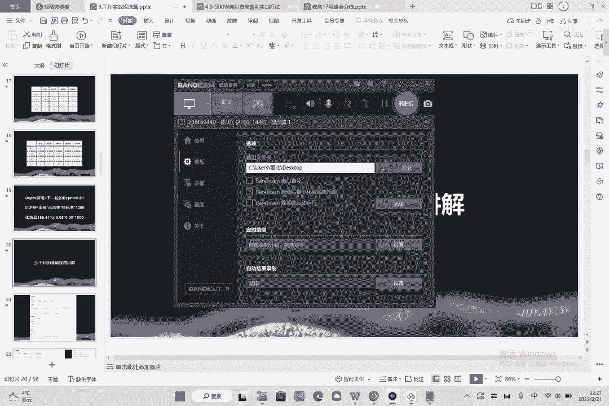
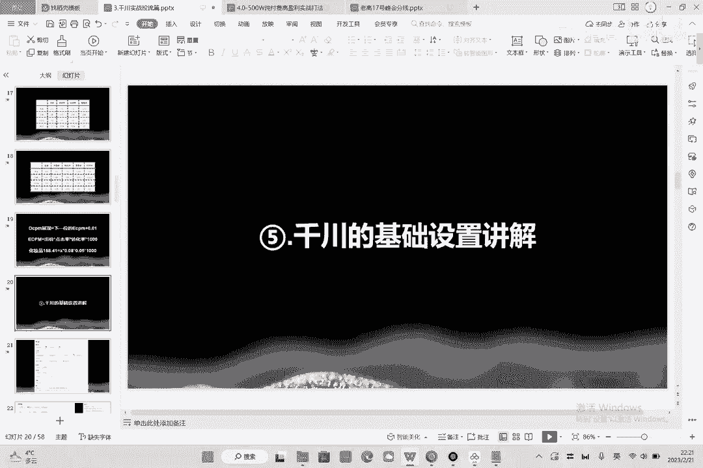
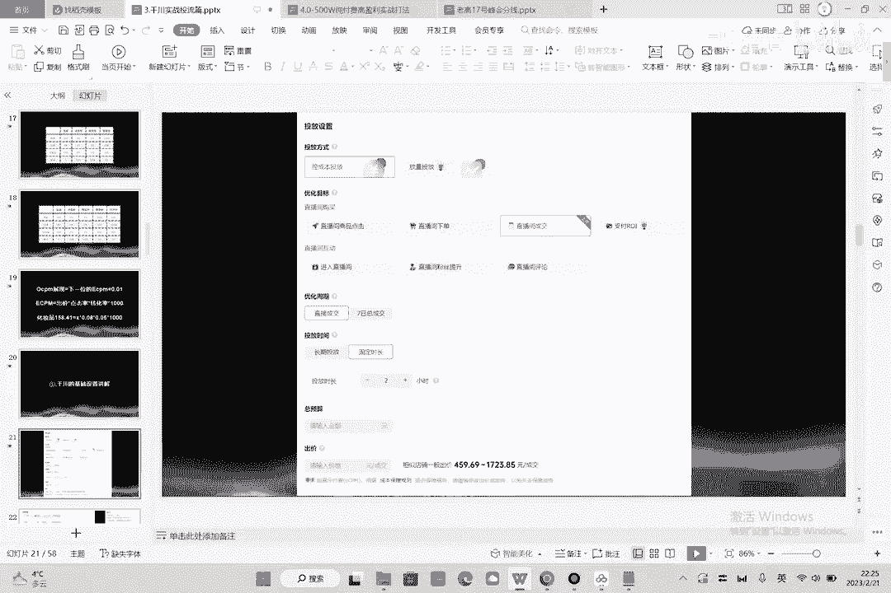
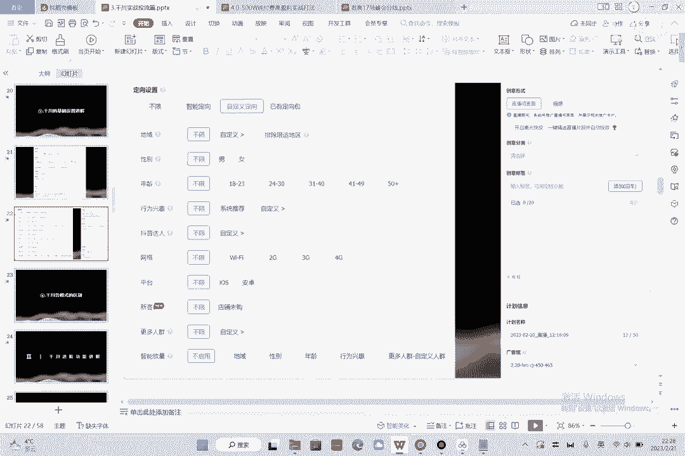

# 086 2023抖音千川运营训练营，起号期+增长期 的搭建计划详细实战课！ - P5：05.5.千川基础设置.mp4 - 早安睿睿 - BV1e7421Z7KB

第五节，讲一下千川的一个基础的设置的一个讲解好吧。

那么千车的基础设置，我们来看一下，这个就是进到我们的一个计划里面来了啊，接到我计划里里里面来，第一个有一个控成本投放，一个是放量投放，而放量投放，这个时候呢其实是在模型，大家可以几下。

在模型稳了之后有可能会用到放量，也不是说完全用不到放量是有可能的，但是在前期的话你尽量控成本啊，你把这个成本控制一下，什么意思，控成本就是慢慢跑啊，让用户去探索你的成本，让整个系统去探索你的成本好。

第二个叫优化目标，优化目标这里呢有浅层，有深层，直播间互动直接pass，为什么，因为这个东西刷出来的全是大拇指啊，全是羊头，那么直播间粉丝提升注意一下，如果你想买粉，你就用这个这个东西算是给你往死了。

灌水军的，他一块钱能给你买几百个粉丝，你信不信，兄弟们，我跟你讲，现在这个买粉系统是非常的呃夸张啊，非常夸张，便宜的不得了啊，这个我们测试过啊，可能100块钱就能买很多很多粉丝啊。

然后优化的目标呢像直播间的商品，点击直播间下单，直播间的成交，直播间的ROS，其实商品点击跑的是浅层的电商数据啊，什么是浅层的电商数据呢，我们在旗号的课程中讲过，商品点击其实是没有太大价值的啊。

商品点击就是以前的观看一一毛钱两毛钱一个，基本是跑进里都是机器人，所以说怎么样尽量不要投直播间下单，投不投直播间下单，其实也不要投直播间下单，就是以前的商店，它的一个深度也非常浅啊，这个呢也非常浅。

除非你的产品的性价比很高，产品很划算啊，产品的话呢模型又有，所以说它有可客单价还低，他才有可能成交，而且呢成交RI呢也不如直播间成交成交的好，所以说基本上来讲，就是直播间成交跟支付RI两个方法。

两个投投两个优化目标，所以说你的直播间的直播间的成交，对于我们来讲他是很关键的，什么时候投成交，什么时候投ROI，我给大家讲一下，在没有模型的情况下，大计划投成交是OK的，成交会成为你的主力的投放渠道。

哎而RI是什么，RI是当你的模型已经很深入了对吧，你的模型已经很好很好了，很优秀的一个模型，这个时候可以投LI，也就是说你可以看顺序点击下单成交LI，那么也就是说成交的深度是不如LI的。

那么如果你前期模型不好的情况下，你去跑了RI这个东西就会有一个问题啊，什么问题就是你跑不动，因为ROI的人群怎么样小，它需要优化的层次怎样更神啊，所以说这个是它的一个特点，那么优化的周期的话呢。

就是我们一般都是优化直接成交的啊，直接成交7日总成交的话是另外一个数据啊，7日总成交就就是在这七天内才能买啊，那么我们都是优化直接成交的，好投放时长，这里有一个长期投放跟固定时长，这个是什么意思。

给大家讲一下啊，长期投放就是从今天开始，我这个计划一直投着，让他跑，固定投放就投两个小时，三个小时，四个小时，而我们在用的时候呢，现在千川在后台里面一个东西叫做快速推，快速推的话就是以前的极速计划。

其实就是固定时长的一个放量投放啊，就是在这几我就是在这四个小时里面，我通过放量把这个计划全部都放出去就OK了啊，这个的话就是快速推好吧，然后这个总预算怎么设置，总预算是这样的。

总预算我们一般啊这个是由小二跟我沟通过的，就是设置20个单位，如果你的成交出价是500的话，你就设置1万预算，如果你的成交出价是300的话，你就设置6000预算，总之就是要满足20个单位，一旦小了。

系统不跑量，会限制你的一个消耗。

这是它的基础设置啊，然后我们来看一下定向设置数，好定向设置，这里呢我们选择的它有它有不限，有智能定向，有自定义定向，有一已有的这样一个额定向的包，我们呢都会选择这个自定义定向啊，自定义向的会多一点呃。

地域啊，地域就不说了，哪你你哪里不发，你就排把哪排除对吧，呃男女不说了，你看一下你的后台的人群年龄不说了，你是哪年龄段，你就投哪年龄段，行为兴趣要说一下行为兴趣是什么呢，行为兴趣就是莱卡啊。

新闻新是莱卡莱卡，我们后面还会深度讲，我们等一会再去呃，深度讲的时候去讲莱卡吧，好吧，抖音达人就是你的对标竞争对手，网络无所谓平台无所谓，新课无所谓，更多人群，这里更多人群，这里有什么更多人这群人群。

这里有一个DMP有达摩盘，好达摩盘的话呢，那个也后面讲，也后面讲智能放量，给大家讲一下，智能放量不启用啊，为什么呃，有冲突，什么冲突，就是你上面限定了抖音的人群，下面你又要通过智能放量去放量。

你要知道他是一个机器人，如果你又让它放量，又让他节约，这时候他就怎么样，他就懵逼了啊，他就懵了，我我到底该听谁呢，我是我是控人群呢，还是要放量啊，我到底应该怎么做，我是谁，我在哪，我在干什么，他就蒙了。

他跑起来这个人群就会乱套，那么你一旦放量的话呢，他会按照这个性别去探索，它，就会探索你计划原本以外的人群，他就不精准了，理解吧，尤其是在前期的时候，更不能去做智能的放量。

在后期可以考虑在中后期可以考虑尝试好，然后创业的模式，创意的形式，创意的形式的话呢分两种，一个是直播间画面，一个是视频呃，这个开启高光块头块头做不做做啊，做为什么，这个其实就是切片投放。

这个其实就是切片投放，他把你的一个优秀的镜头进行一个混剪，然后切片投放啊，有效果有用，只不过开启快高温开头之后呢，就是你的投留的最少的金额就会变成600了啊，还挺有用的，那视频端视频的话呢。

其实呃千川到最后跑的就是素材，跑的就是哪个到底哪个素材好，哪个素材不好，然后在后面的课程中呢，我们会给大家去演示啊，演示这个到底什么素材是好的素材好吧，创意分类啊，找到你的类目啊，创意标签。

把你的大标签写上，比如说你是女装啊，你是连衣裙啊，你是雪纺连衣裙对吧，你是长裤，你是长衫啊，把你的标签全部加上啊，要加大类目的创意标签是干嘛用的，就是为了能够让这个这个铅砖快速的去摸到。

你的精准的人群啊，来让他使用的。

