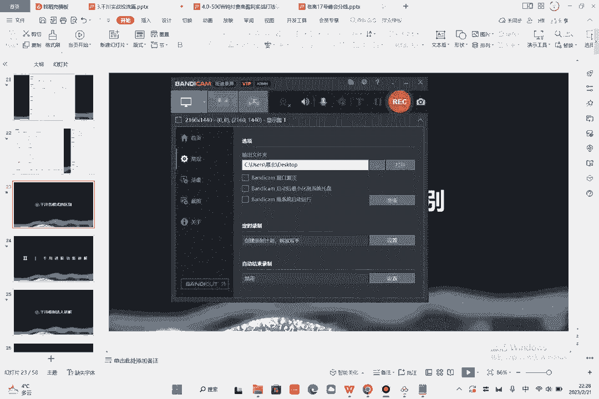
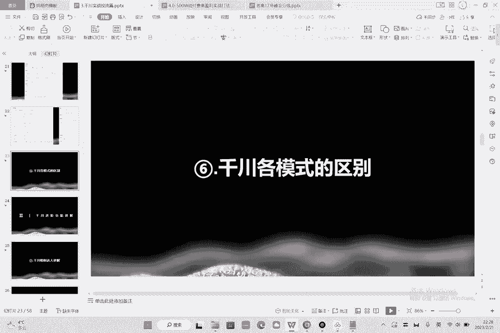
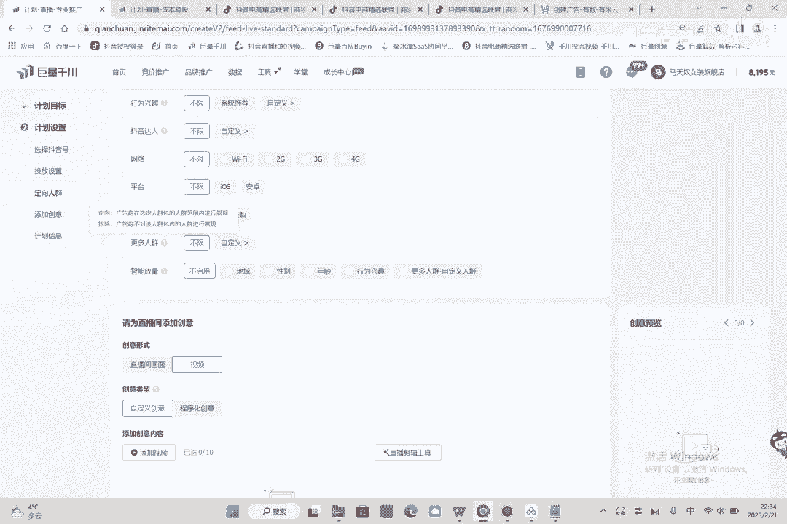
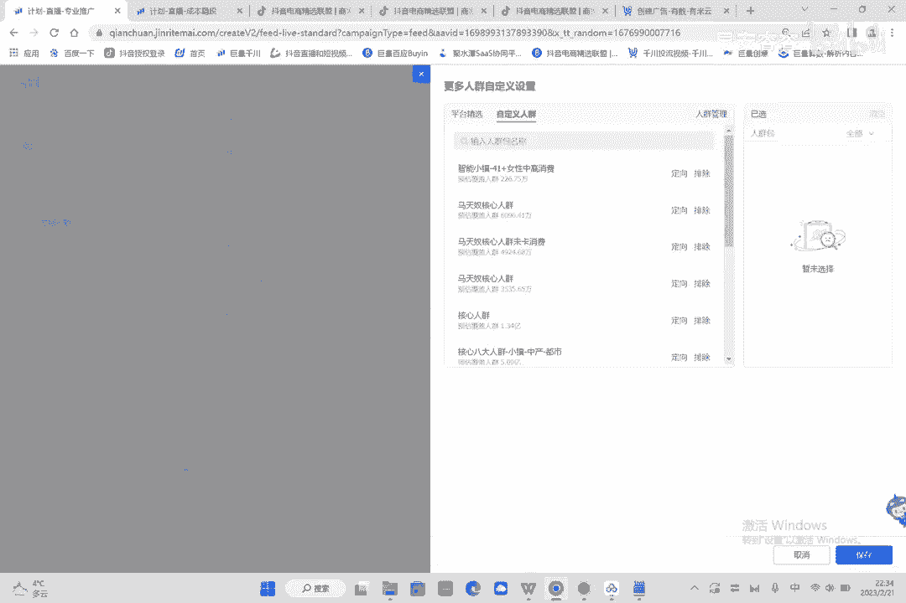
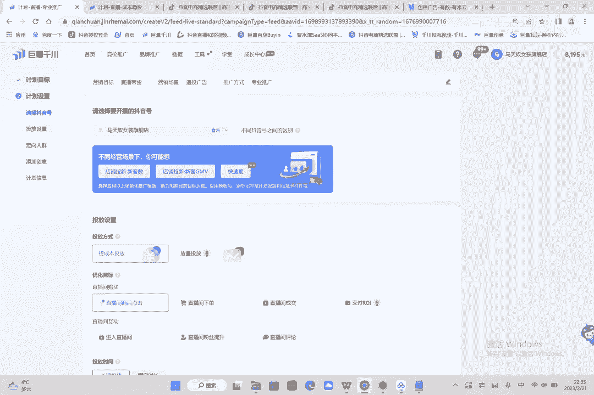
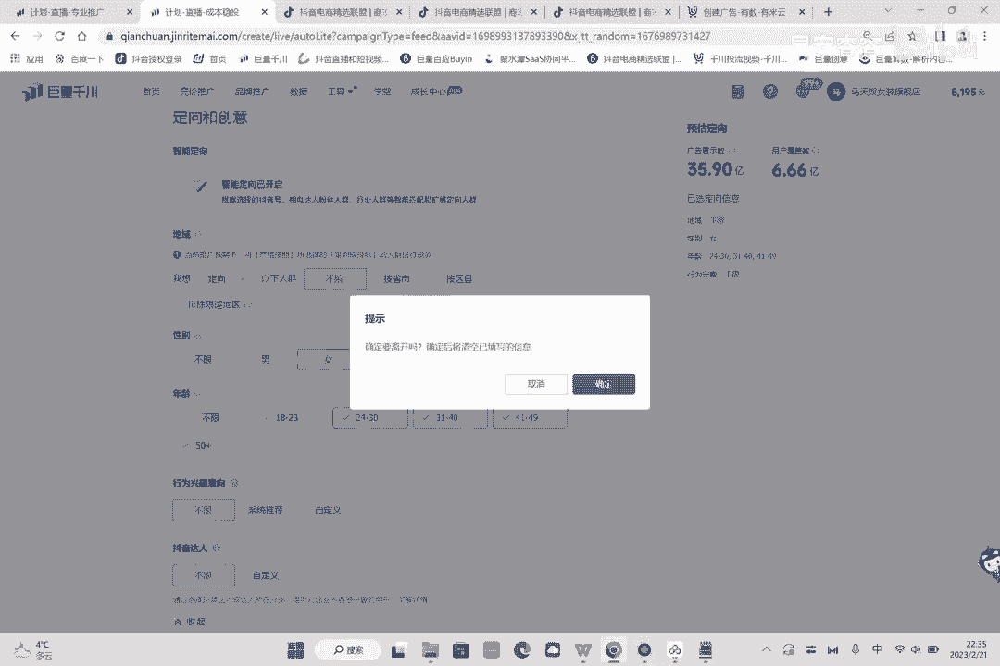

# 086 2023抖音千川运营训练营，起号期+增长期 的搭建计划详细实战课！ - P6：06.6.千川各模式区别.mp4 - 早安睿睿 - BV1e7421Z7KB

第六小节讲一下千川各模式的区别，呃这个得开后台啊。

什么叫各模式呢，就是我们打开竞价广告，在这里有个静态广告嘛，对吧好啊，进店广告之后呢，这里有个新建计划，新建计划，这里呢这个就是模式，就是我说的模式啊，啊分为图文带货跟直播带货，图文带货。

这里呢有一个商品托管，就是呃就是之前的一个一个计划，但是原计划托管，但是这个图文带货我们用不到啊，用不到对吧，那如果说图文短视频的话，也不是我主讲的，你们想学的话，可以找这一块专门的老师去讲啊。

图文的话我经验也不丰富，我也没怎么跑过啊，然后直播带货这里看一下，然后直播带货这里是我们的主讲好吧，那直播带货这里呢就是通过有有什么样的广告，第一个就是通过广告极速极速推广啊，还有就是成本问投。

我这里能见一下，给你们看看好，那成本投一般呢也是可以投ROI的，也是可以投直播间的，那么它的优势是什么，这里有一个明确他的一个小灯泡打开，那成本本投的优势呢就是它非常的简单。

只需要简单的设置就可以去操作，由系统自动盯盘，并且来去调调节它的节奏，比如说探索创业啊，啊计划停止啊，然后能设置的东西比较少啊，什么意思呢，就是你看在这，它跟它跟专业计划主要是差别在哪啊。

第一个是在这在这啊，就是在我们的这一个前面，前面都是没差啊，前面都没差，投放目标，直播间，一个成交跟直播间的RI看什么叫成本稳投，是不是没有浅层目标，你你看到有观看吗，有进入吗，有涨粉吗，没有对不对。

为什么有下单吗，有点击吗，没有为什么，因为官方也知道啊，他那个东西它不成交，他不成交，所以说他在这他都没给你显示，只有RNM跟这个直播间成交，这个跟我们刚才讲的是一样的，出价讲过了啊，春天讲过了。

他这个线是94块钱，你给的一般，一般我们情况下会给这个价格最低价，最低价往上加10%，如果你有模型啊，如果你没有模型的时候不能这么加，没有模型的时候会按照成会按照产品成本来加。

直播间没有模模型怎么售价啊，直播间无模型这个地方给你们讲一下，无模型出价，无模型出价的话，就是会按照按照利润的，呃比如说利润是X对吧，按照利润的嗯，110进行可选啊，比如说你的产品的利润是40。

那你就出44，那有人问说这样你不亏钱了吗，对呀是亏钱了呀，但是前期如果你价出低了，你肯定跑不动，价出低了，你放心，我放心，你百分之百跑不动啊，你出高了你都不一定跑得动，你出低了就更跑不动了，好吗啊。

这是他的一个，这是它的一个特点啊，好然后我们往下看啊，账号不是不用说日预算，日预算该怎么说的，如果这个地方出100，我们下面是多少，这个地方是多少，这个地方是不是就是2000对吧，2000啊。

20个单位嘛，好快速投放，从今天起一直投放好，没问题，投放时段不显示没问题好，这里有个定向啊，智能定线开了，根据选择打分号相似达人人群，行业匹配人群进行拓展，好地域地域无所谓，对不对，低于无所谓。

他这里展现更多的一个喜好，男女有的啊年龄，有的行为兴趣，有的新闻兴趣，一会儿给你们讲什么是行为，什么是兴趣啊，达人有的好，没有什么，我看一下没有什么是不是没有，那个是不是没有那什么感，感受一下啊。

同学们感受一下，是不是没有自定义打人，没有自定义的那个人群，是不是没有自定义人群告诉你就是没有达摩盘，相对来讲就是没有达摩盘，另外相比于专业计划的话，这块是不是没有什么标签的选择，是不是没有边界选择。

所以说系统自动给你怎么样去探索标签，用行为兴趣去圈定你的什么人群，用行为信息去圈定人群，那头都是女的，女的6。6个亿哈好，所以说这块能不能用也能用，但是怎么用，一会会给大家讲行为兴趣在这个地方可以用。

有了行为兴趣，它会自动给你探索，其实成本稳投也可以用，还有就是这里有个干货啊，我说到干货了就要记，我说的干货一定要记啊，什么干货，就是这个饰品好看好了，看好了，视频不一样的地方是什么。

看到没记下这个数字，想想这个速度速度这速度是多少，50，对不对啊，把这个东西记住啊，把成语标题30记住好，现在我给你点开一个专业计划，嗯点开一个专业计划，新建专业计划，好的好，往下拉。

看这看这看视频好几个多少多少，是不是十个啊，相当于什么啊，标题是几个十个，对不对，那为什么成本本头有30个呢，有30有50呢，我告诉你，这是他的一个成本投核心优势，核心优势就是它能够投放更多的素材。

记一下可以成本稳投，可以投放更多素材，就很多人都不知道他一个贼大优势是，它可以传50个视频，传50个视频意味着什么，意味着他有更多的素材可以展示给用户，意味着他们有更多的产品可以跑量理解吗。

然后我刚才说哪里没有自定义定向，在这没有更多人群。

没有人群包，没有自定义人群，这里都是我们自己打的包，一会我给你们讲八的人群的时候，讲达摩盘你们就知道了啊，讲什么是达摩盘，你们就清楚了啊，这个东西啊没有这个东西。

这才是关键啊，哈这是关键好吧，然后直播间画面创意分类，创意分类在那个里面系统是会探索的，这个里面我们要自己去填这个我们要自己去填，比如说我们是女装类目对吧，我们是什么，是KK是连衣裙，在这嗯。

连衣裙对吧啊，这个地方我没有写成什么女装，女装是你大类一定要去写，然后连衣裙你看这里头有词，这里还有一个问号对吧，在这里呢手动打上标签，可以更容易去找到你的流量对吧，比如说皮群是不是啊，然后嗯放量。

这都是这是我们的关键词，然后嗯什么什么什么词啊，牛奶丝连衣裙反正越精准越好啊，越精准越好，就是让用户尽快的找到你的一个这样的呃，这样的一个什么产品的，产品的一个呃类型就OK了啊。

就OK了，所以这是它的一个特点。

