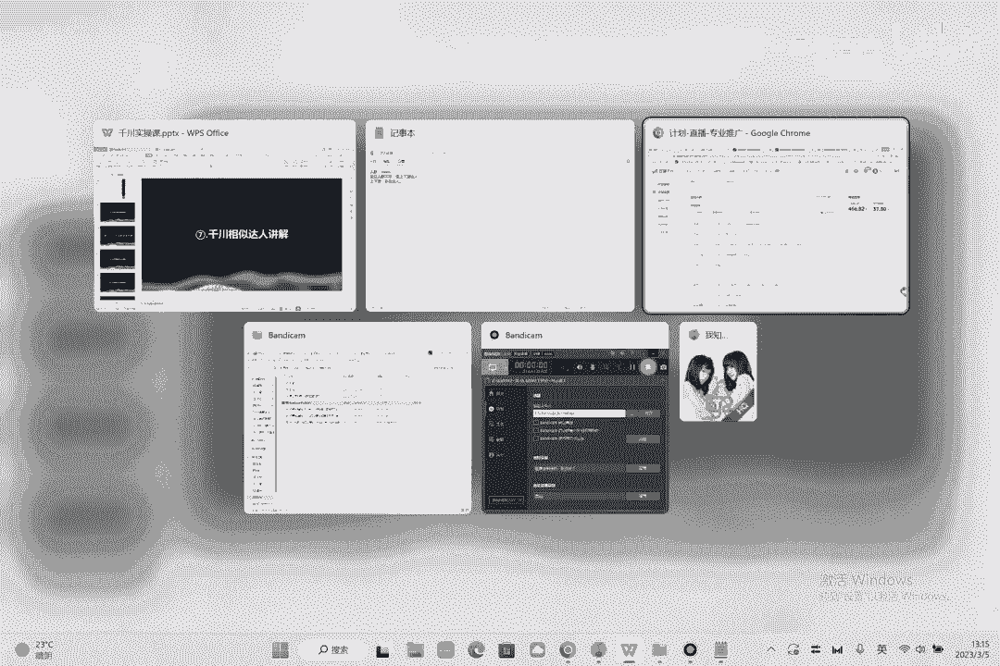

# 086 2023抖音千川运营训练营，起号期+增长期 的搭建计划详细实战课！ - P7：07.7.千川后台达人功能讲解.mp4 - 早安睿睿 - BV1e7421Z7KB

呃今天我们讲一下第七节啊，就是这个千春的相似达人的一个功能。

还是开一个千春户，专业计划，然后新建进来的话，这里有个相似达人的功能，然后相似达人功能这里呢在这儿啊，在这个更多的人群，在这个地方自定义，然后这里有个达人相似啊，达人相似，抖音达人，那么抖音达人的话。

首先我们要保证什么呢，这里有几个点要讲啊，第一个点呢是定向与以下单人发生的一个关系，那么需要什么样的互动来看，商品互动是肯定要的不对，这是精准的呃，直播互动先全选先全选啊，然后打赏评论有效观看。

光看不要因为光看太浅了啊，光看太浅了，然后视频视频互动这边呢就是呃他的点赞，分享评论你可以选，可以不选啊，呃两种情况，第一种你要想极致的精准，就是这些都不选，这都不精准，这都不选。

但是这样的有一个什么情况，就是你跑不动，然后你跑不动啊，因为我们在去评判千川的时候，至少有个1000万以上他才会跑，然后没有1000万他是跑不动的，然后这呢所以说我们都会选上他。

因为这样的话人群会关会大一点，关注不选，因为关注的话就是他粉丝没有意义，对然后选一个进近30天的，15天太小了，对不对，然后这个时候我说一个竞争对手，比如像那四，那这是我的对手啊。

那你找到你的对手就行了，好这绝对不是零啊，他这个他这个写的有问题啊，把这个写上二四，这绝对不是零啊，什么伊格纳斯，对的那应该是NN的，那嗯维格纳斯填上这个数据有问题啊，数据绝对不是零，比如说什么嗯。

我是做女装的啊，比如像什么婴儿，这显示都是零，什么意思啊，数据出错了啊，我保存一下看一下啊，37万3好，37万3，有点小额有点小啊，所以说你要圈的时候呢，这个位置你要圈到额1000万以上。

至少1000万以上，然后怎么圈呢，如果你自己的店铺的达人。

如果说是够不上的话，你这个时候你就要去宣上下游的达人。

记下，嗯如果你自己的计划圈不上，你就要首先人群人群的话呢，是要圈到1000万1000万的，然后如果自己的独立人群不够，群不够，那你就需要去圈上下游的达人。

什么叫上下游的达人呢，就是上下游的达人的一个定义啊，这个说下，上下游的定义是什么，上下游的定义呢，就是比如说我是卖女装的，我的人群是30~40，那么就是跟你的，比如说30~40的女性还买什么，像彩妆。

你就可以去圈一下彩妆的男人。

彩妆达人是OK的对，然后呢比如说我们在这。

我们这现在圈不够嘛对吧，那圈不够的话，我们就会可自己的人群先圈，如果还圈不够的情况下，那我们就会去圈彩妆达人，比如说美妆对吧，但我们不会这么选啊，这美妆你直接选上就三个亿是大类目了对吧。

你可以在美妆里面你去关注谁对吧，你看看到底是啊哪一个美妆的博主，你可以自己记一下，比如说你关注李佳琦，你觉得你跟李佳琪的用户是一样的，用户对你可以去关注李佳琪都行，那这个地方要怎么找呢。

如果你找不到的话，你就去去我们之前推荐的像什么蝉妈妈也好啊，啊这个这个这个什么游米云也好啊，反正就能找到你平时跟你的这个账号相似的，达人啊，怎么找很简单，在这呢可以找到搜，比如说达人对吧。

搜商品搜猜一个口红吧，你觉得口红是跟你相关的，你就搜口红是吧，然后你看一下价格单，比如这是59的价格，对不对，你点进来好啊，这里有个答案分析就能看到谁在给他带货了。

你然后比如说这个别摸我的圆脑袋，这个东西你找不到他，你现在你就能找到他了。

你就可以通过我这个方式找到他，你看比如这，哎这个小了啊，这个人小额，再找一下啊，粉丝量不够啊，看这个够不够，呃达人总粉丝数4。9，进出小鱼干睡着了，应该能找到啊，好能找到看到没能找到。

前面我刚才点了一个空格啊，都能找到，每一个都能找到的，也就是说你觉得口红是你的呃上下游产品，然后你觉得这个产品对应的人群，是你的上下游的人群，你就可以按照这个方式去找。

总之就是找到找到所对应的这样的一个，人群的数据就行了，对你觉得正常的话，你要圈2000万，你就找2000万的人群就OK了，好不好，对啊，别摸我的圆脑袋，我也能找到这个这个也可以找到，对这也能找到。

这都是一些小的个人的达人，你就去圈就行了，好OK看你也能找到对吧，你填进来，刚才是33万7，那现在肯定有增加，37万3，肯定有加，现在45万了，对不对啊，你圈到1000万啊。

这个地方圈套1000万好吧对嗯，然后呢我觉得昨天呢有一个东西没讲，就是讲讲这个呃出价调价的问题，我觉得出价调价的问题我们放到最后讲啊，不着急，好这个就是达人计划了啊，达人计划的话就是这样的一个情况啊。

如果你要圈年龄，就把你自己的年龄人群的选上，想更精准一点，这个就是答案相似啊，其他地方跟我们昨天讲的是一模一样的。

这是答案相似情况。

