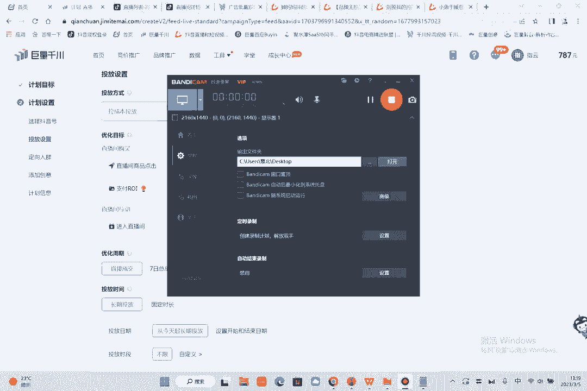
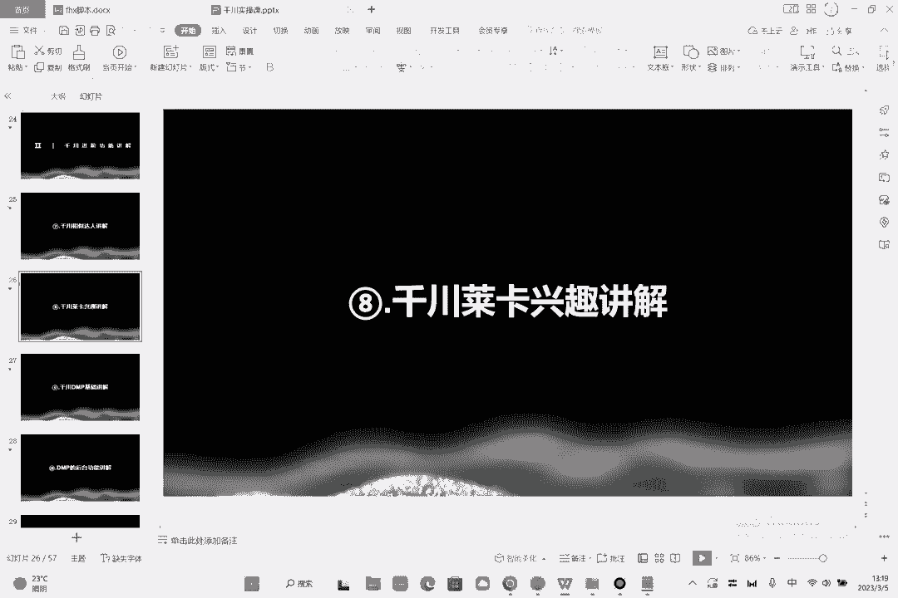
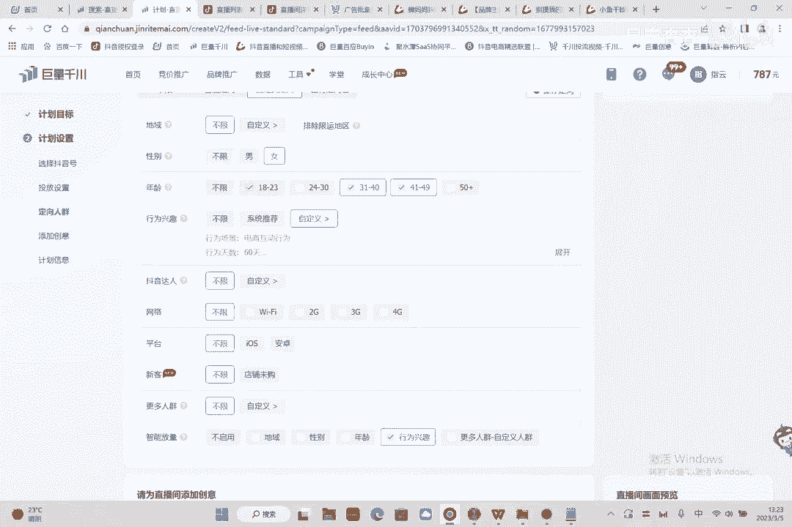

# 086 2023抖音千川运营训练营，起号期+增长期 的搭建计划详细实战课！ - P8：08.8.千川莱卡行为兴趣讲解.mp4 - 早安睿睿 - BV1e7421Z7KB

那我们现在现在呢再讲一下这个第八节啊，就是这个千川的一个莱卡行为兴趣的玩法啊，什么是莱卡呢。

莱卡其实就是行为兴趣呃，跟刚才的这个地方一样的啊，就是在这个自定义里面，自定义里面的话呢，就是现在选的是达人，然后呢还有一种选法，就是行为兴趣在这啊这个地方先选不限，然后自定义直接选择自定义好。

那这个就是你的你的行为兴趣了，你的行为兴趣怎么选呢，比如说我还是那句话，我是做女装的对吧好，所有场景电商场景你是需要的，对不对，然后这个资讯场景跟互动场景，其实都不太需要你。

就是我们只去关注他的电商行为，那好那么选一个60天的，60天的，别太短，太短的话，选不到人，就学前，你先选一个女装，我是做女装的啊，大S我先留下，打满女装，中老年女装都要，然后在这里呢，如果你选词不够。

有两种方式，第一种呢是进到千川，你看我们千川这个地方，呃第一种是进到千川的这样的一个竞争，新建在这专业推广额，No no no，进错了啊，记错了，确定进到搜索广告专业推广里面。

看搜索广告里面是什么意思呢，就是在这这有关键词啊，我就把这些关键词全删了，全部删除，然后添加关键词，这是女装对吧，好获取推荐关键词，好，女装看到没，女装裙子妈妈装，大码女装这些词哎这些词有多少次。

你知道吗，好多好多次，你把它下下来，你把它下载下来好，你把它下载下来之后呢，哎你可以往里面导，你觉得跟你相关的词，你先选，你选完之后呢，可以往里面倒，比如说这14相关对吧，那我复制一下。

我可以导到我这个词里面，你可以一个一个去找，过了你可以一个一个字去去添加，这是通过搜索往里面往里添加的，你反推这里有个放大镜，看到没有，这里有个放大镜啊，比如说你旗袍啊，是你做旗袍的啊，我是做旗袍的好。

那么我裤子对不对，我的衣服吊带T恤可能就都跟我相关，我搭配对吧，然后你的内搭，你的冬装整体来讲的思路也一样的，就是圈到5000万左右的人群，必须要有5000万行为兴趣的话，没有5000万，他是跑不动的。

针织衫往上填，往上填，皮衣职业装可能这个东西百褶裙秋装对吧，阔腿裤呃什么呃穿搭这是兴趣，光腿神器长群，反正你自己看，跟你有关的，你就填上去，跟你有关的就填上去啊，啊这里也是一样的，然后你如果觉得不够。

你在这还可以有个放大镜返返回来放大对吧，啊青蛇对啊，折腾库秋冬新品奢侈品嗯，气纯的好兴趣，这里是一样的，你先去选一个你的主搜词，先来看你的主搜词是什么，然后通过你的主搜词来反推好啊，往后退往后退。

就够用了啊，就够用了，够大家玩了啊，这个东西，天上A减少，保存看看是多少万人群啊，按10。9个亿，现在啊1。67亿啊，1。67亿的话呢，太多了，对不对，太多了话，你就可以把一些不要的词你圈掉。

这地方给他控制到多少，控制到5000万到8000万啊，现在是8600多万，那你说这个词里面有不专业的对吧，有不是我的词的对吧，有不是我的这个行为兴趣类目词的怎么办呢，好看到没有，那么因为我又是女性。

又是选择了31~49的年龄，那可能我的主人群在这懂我意思吧，然后你通过人群砍了一波，通过年龄性别砍了一波，又通过行为兴趣砍了一波，所以说这个人群已经相对精准了，理解吗，然后这个地方智能放量。

如果你选择行为兴趣，你想让它跑量的话啊，你就把这个选上啊，这个量就大，如果你不选的话，量就小啊，这个就是莱卡，莱卡的话就是新规兴趣。

