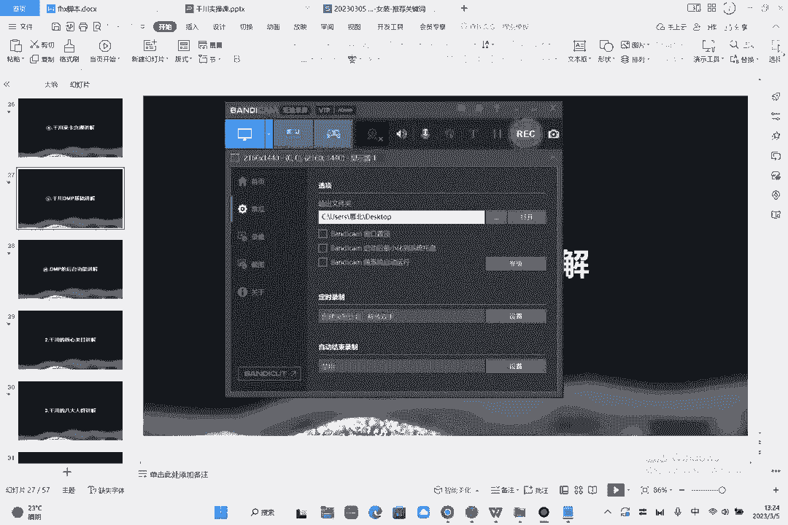
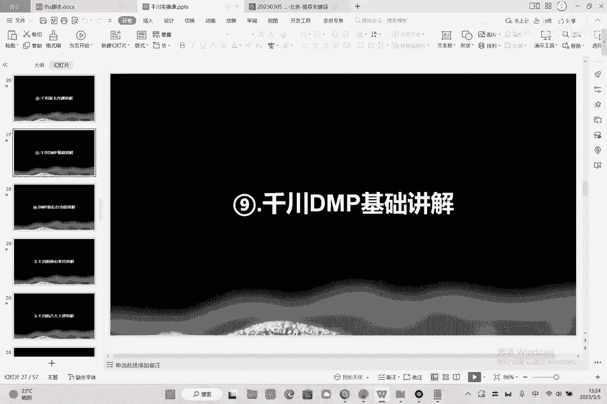
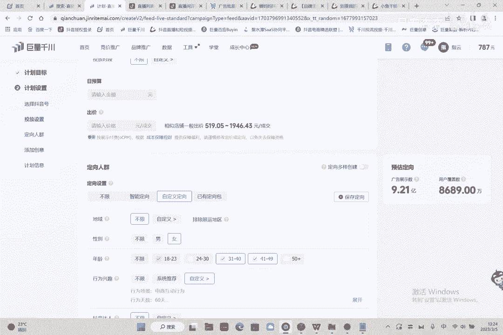
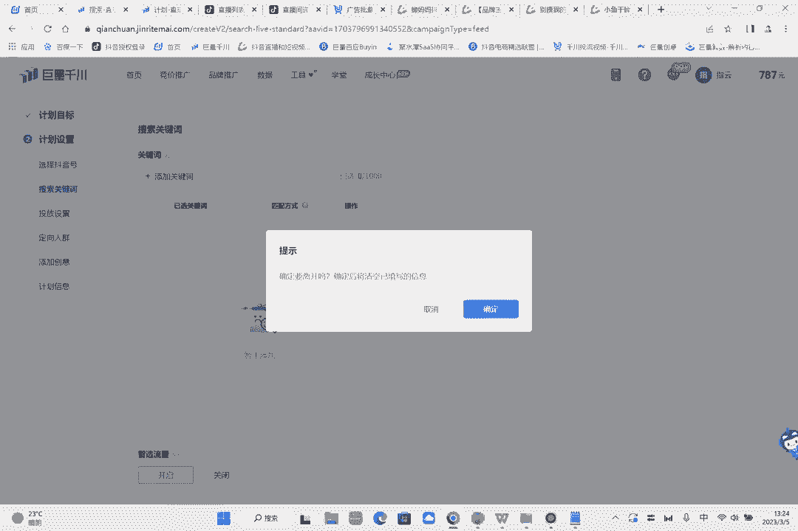
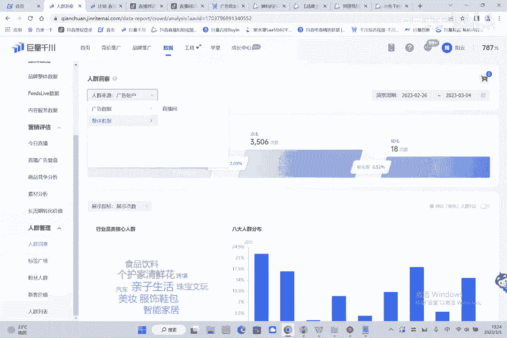
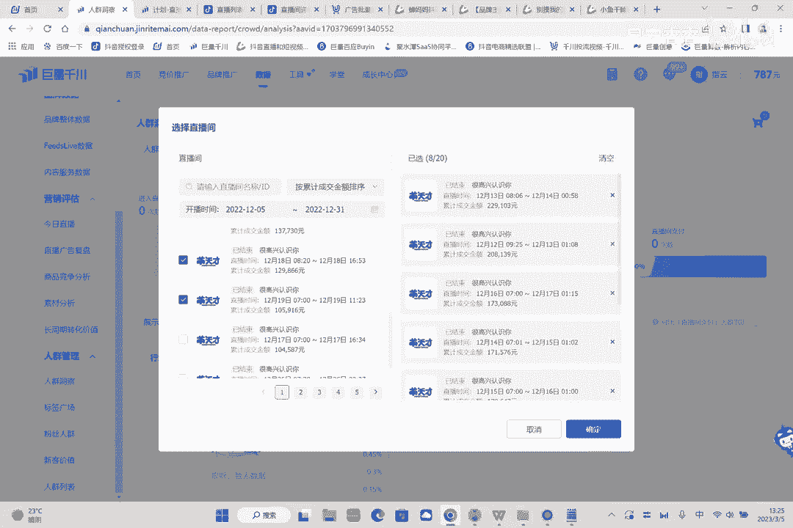
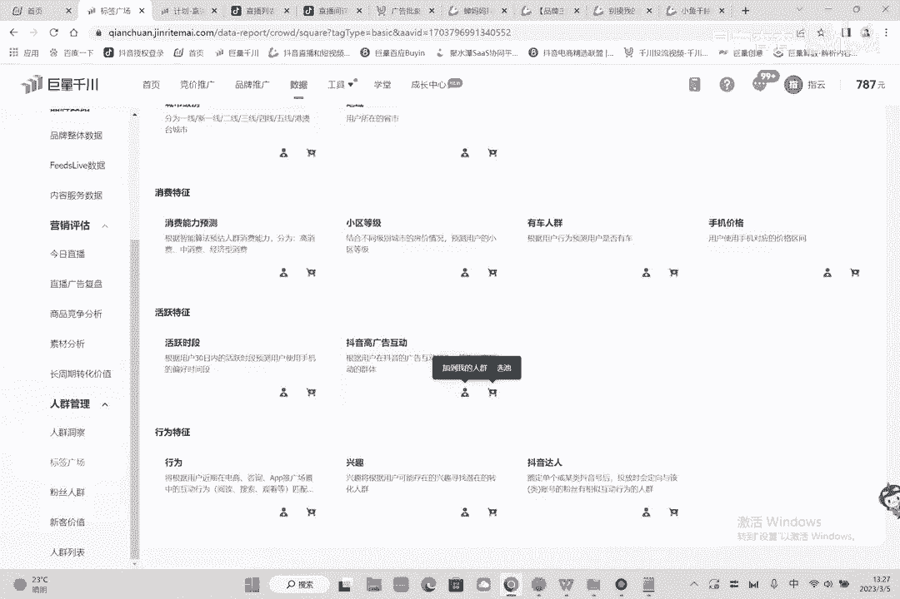
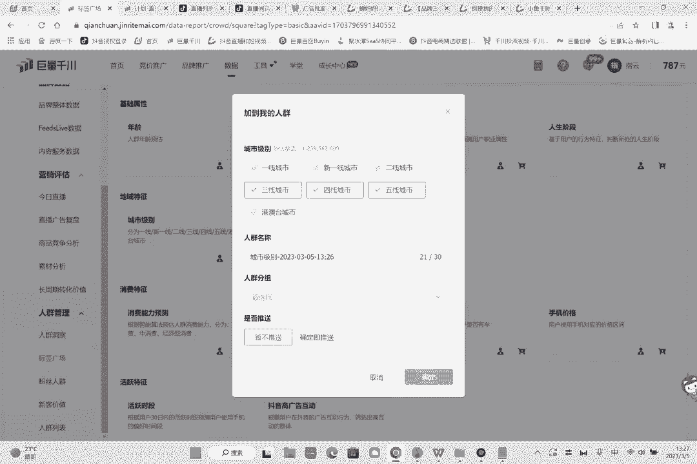
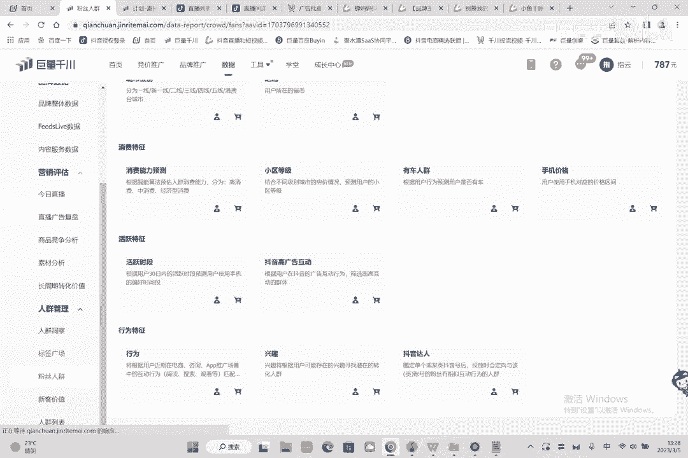
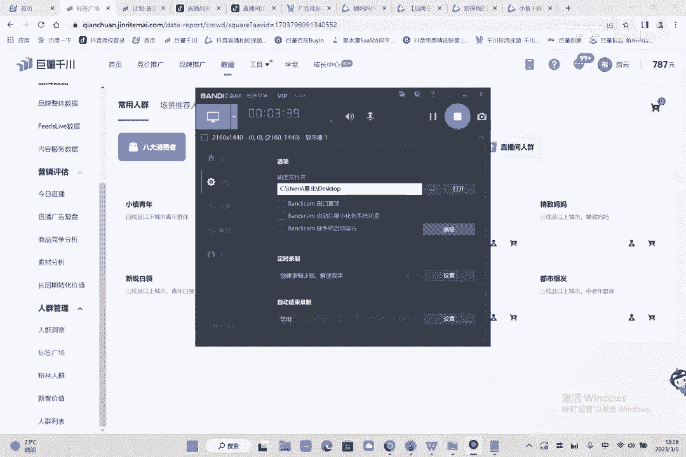

# 086 2023抖音千川运营训练营，起号期+增长期 的搭建计划详细实战课！ - P9：09.9.DMP的基础讲解.mp4 - 早安睿睿 - BV1e7421Z7KB

呃第九节的话，我们来讲一下千川的额达摩盘的基础讲解啊。

就什么是达摩盘哦。

还有达摩盘是这个东西，就现在一直在讲达摩盘，达摩盘就是这个你就数据啊。

点击数据呃，数据里面的话有人群洞察，看到没这个地方啊，这个地方就是答案就是你的达摩盘了啊，人群洞察看一眼，首先呢你先通过你的人群找一下你的整体人群。

直播间人群对吧，比如说我这个人群你选两场对吧，你选个机场，然后呢你把他选下来之后呢，就会有你的一个整体的人群数据了，哎举个例子啊，嗯嗯有点卡网不行吗，把这个选上啊，都选上好吧。

嗯确定啊，确定好，确定好之后，这就是你的人群数据，看到没，然后人群数据呢这里选择支付的啊，就是你买了谁，就是这个八大人群加上核心类目，就是你的大磨盘，这个东西一会会讲到具体的每个人群，代表了什么东西。

也会给你们讲到的，然后呢我们可以看到年龄分布，你的标签就是说达摩盘的意思是什么呢，是对你整体的数据有一个更详细的分析，让你能够更了解自己的人群，是什么样的一个人群，然后针对于这个人群。

你的购买力强的人群进去进行出价啊，进行对这个人群进行让他们去购买，去进对他们进行投放，这里有个标签广场，标签广场呢，就是我们每一个人群的这样的一个什么，一个核心的消费者，你看这里有个店铺人群对吧。

这一个直播间人群你都可以选到，就是他直播间的人群也可以选到你的店铺人群，也可以选到，你可以把七天内的啊商品的什么，比如说商品收藏的架构的购买的这个东西，就是你的大磨盘啊，你的广告人群，你的千专户的人群。

你的基础人群，什么是基础人群，年龄性别，职业啊，人生阶段地这个位置什么东西分到很多的，分的很详细，包括你的地域，消费能力，小区有车没车，手机价格活跃时间，抖音的一个广告，就是说千穿他到后期了。

已经我们现在他已经成熟了一个成熟的千川，就是我可以让你能够更详细的啊，更深入，更贴切地去选到你所需要的这样的一个人群，而不是说我推什么人群给你啊，你就用什么人群，就是你只能之前基础版，你只能用莱卡。

只能用达人，但现在有了这个东西的话呢，你就能把你的消费者圈的更精准，比如说我是卖卖童装的对吧，那我这里呢会看一个什么东西叫做呃他的呃。

人生阶段对吧，人生阶段人生阶段这里有什么阶段，家儿女就是我已经有孩子了，明显抖音告诉你，我有孩子的人群大概能覆盖6亿2600万好，你要多少，对不对，就是所以说这个地方好就好，在你能够更精准的判断。

说这个人是什么样的一个情况好，那甚至说你可以推断他的职业，那我觉得我是卖公立装的，我就是卖线上医学装的好，那我是要医生要什么东西，他有职业的判断，这个就是达摩盘几线城市对吧，城市几线。

你觉得你这个产品就是卖新一线城市的对吧，或者说我这个产品数码产品，我就是卖三四线城市的对吧，我是卖教育产品的那一二线补习很出很出名，很发达，所以说我们就卖三四线城市，卖五线城市，对不对。

比如说我有些九九十九的产品，我就卖五线城市。

所以说它是达摩盘，是这个意思，那这个呢就是达摩盘的一个基础的讲解。

这个就是上面的一个人群的管理啊。

