# 0基础转行做拼多多，六种方法教你做好防比价，轻轻松松日销百单（拼多多开店｜拼多多运营｜拼多多新手｜拼多多实操） - P1 - 宵筠电商 - BV1ausSe7EYJ

近期，许多拼多多商家朋友常常遇到直通车流量突然中断的问题。同时，一些小白商家呢在上活动时会被系统提示优化售价，否则就会被限流。今天就来和大家聊一聊拼多多的比价机制原理，以及被比较后该如何正确处理。

如果说你看完这个视频还是不太懂的话，我准备了各个类目的实操文档以及最新玩法的拆解步骤，你也可以根据实操文档来操作。首先在进行仿比价操作之前，我们要明白比价机制的原理，它是在赛道内进行比较的。

比如你的链接在A赛道与ABCD进行比较却比不过。这时你可以通过洗链接或者是仿比价的操作，让系统将你的链接放到B赛道与DEFG进行比较，这样就有可能比较成功，系统是如何判定的呢？

首先它会根据你链接的元素进行识别，确定你的赛道，进而确定你的竞品。所以要解决比价失败的问题，就得先解决识别问题。那么系统识别的主要因素有哪些呢？第一个是主图的底稿。

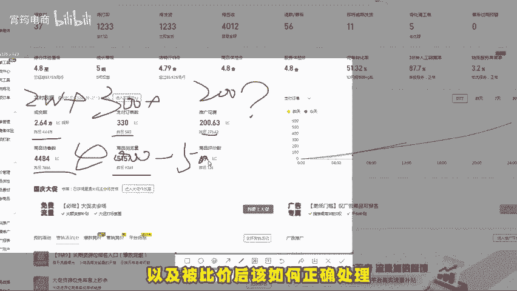

元素。第二个是SKU的主修饰文字，了解了原理之后，我们就可以根据原理采取一些比价措施和玩法。第一种方法是文案合理拓展法。提到SKU文案的防比价，很多商家都知道要加前缀或者是后缀。

但很多商家只在SKU前缀加上今日特价实惠等字眼。这样做的商家太多了，导致SKU防比价成功几率大大的降低。我们要懂得创新，不能思维固化，以卖水果为例，可以在SKU后面写上关于水果的具体信息。

如有多少颗是什么样的品质，甚至可以加上一些情景化的描述，比如说亲自带给老婆的，这样的文案拓展的很详细，且具有情景化，不用担心比价问题。第二种方法，标品文案延展法。这种方法通常是合差异性较大的非标品。

如果是电饭锅剪刀等标品，就不能用第一种方法。那么有些标品类商家呢，可能会在SKU文案里面加上特殊的表情或者是罕见符号。但这样可能会影响流量，还容易被人工审核。

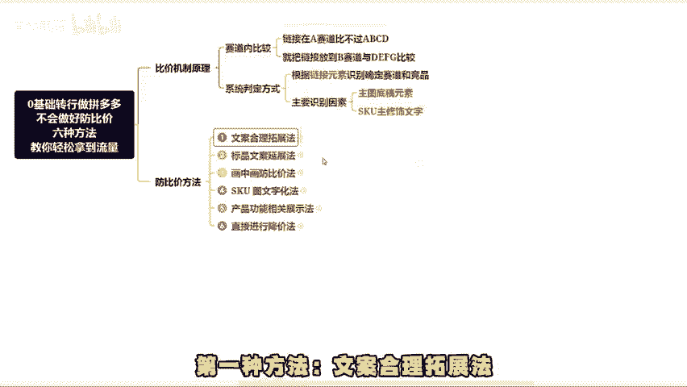

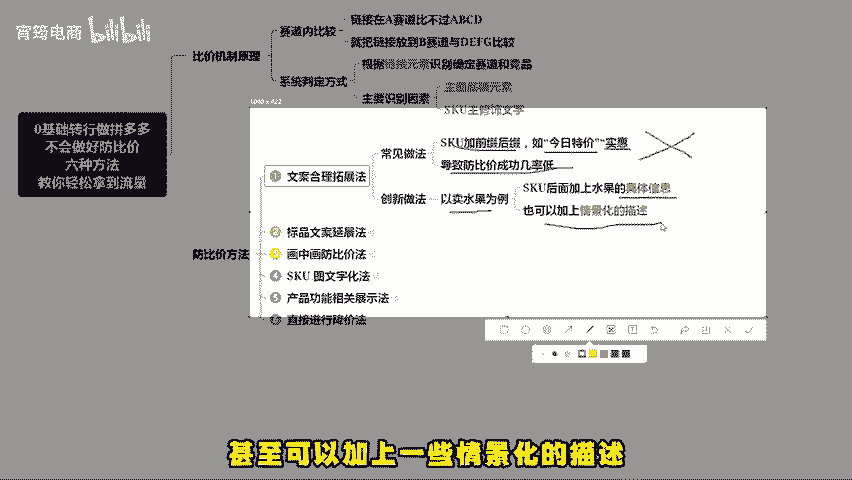

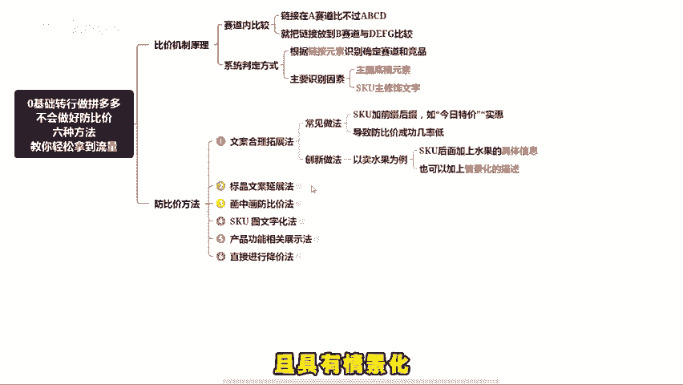

定价格过高，标品的SQU防比价操作应该是不设置过多层级的SKU把能写的信息都写到SKU里面。包括但不限于型号、颜色、款式、正品以及简单的特殊符号，优惠价格等。第三种方法。

画中化防比价系统除了通过SQU文案识别，还会识别图片的底稿元素。最近比较流行的方法，就是在SKU图中放一堆不相关的物品，这样SKU防比价会因为识别不出哪个物品，从而极大增加SQU防比价的概率。

非一手货源店的商家可以尝试这种方法，第四种方法，SKU图文字化。这种方法主打反差和差异化。现在商家把图做的太精美了，偶尔来一个纯文字简单粗暴的SKU图，会给人一种没有新眼的感觉，效果还是很不错的。

第五种方法，产品功能相关展示法。除了在SKU里面直观的展示产品，还可以通过功能功效，使用场景的图片来做SKU图，这样既能避免SKU图被查出。

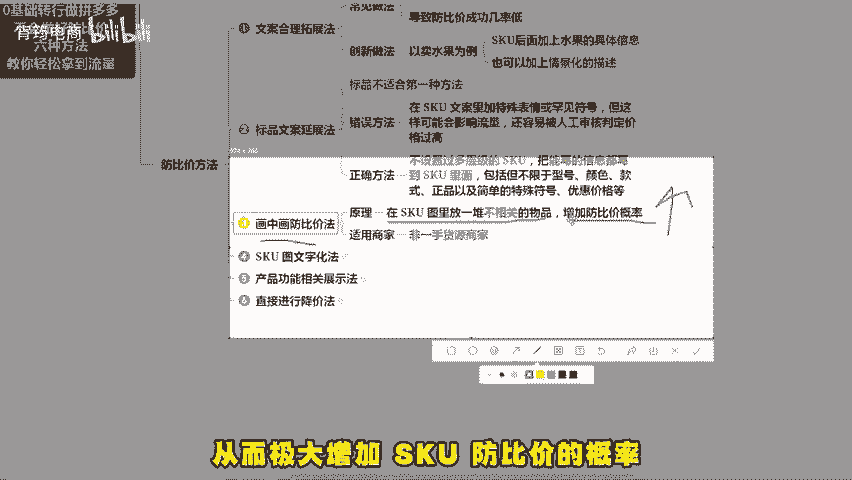

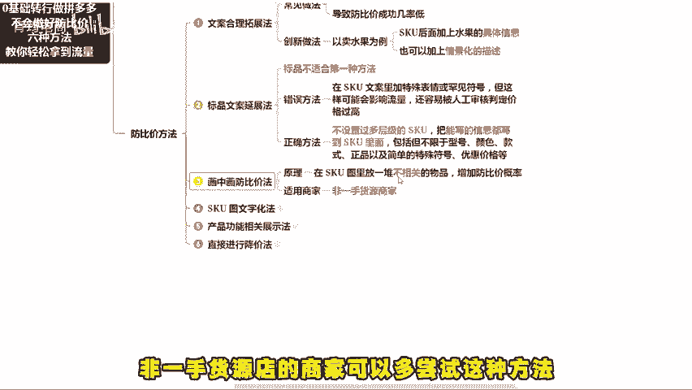

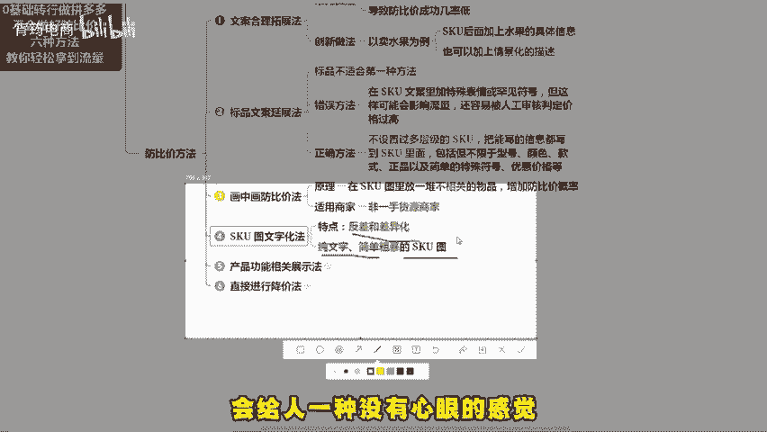

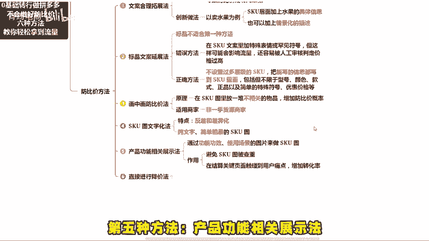

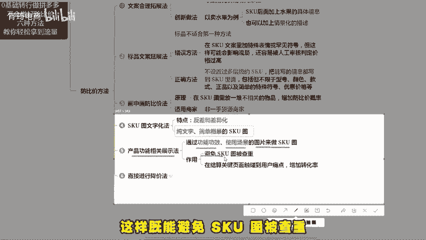

又能在结算关键页面触碰到用户痛点增加转化率。第六种方法直接进行降价。如果你的链接被比价失败，可以考虑降价。大家注意系统是按照券钱价格进行比价的。实际价格再低也没有用。所以如果是长期资源位大促活动。

可以用限时限量购把价格降下来，解决比价问题。如果没有降价空间，就可以用上面的5种方法。因为比价失败的核心，事先有识别后有赛道，只要改掉识别因素，就能做到链接的仿比价。以上就是6种实测好用的仿比价方法。

好了，今天就分享到这。如果说你看完视频还是不太懂的话，可以找我领取实测文档也可以提问。或者说你需要我去给你做店铺诊断的，也可以来找我。最后就祝大家早日爆单。

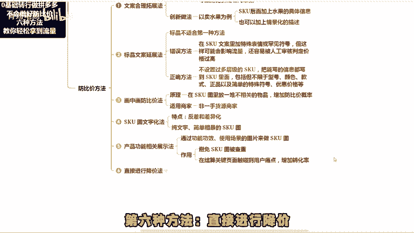

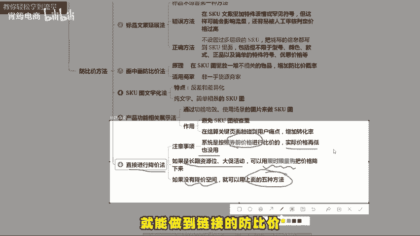

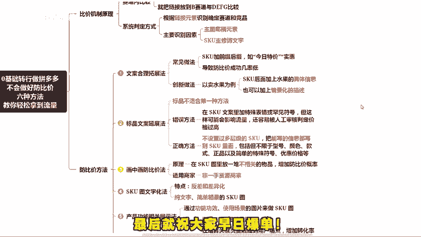