# 0成本，靠短视频玩传餐饮小吃培训赚钱玩法 - P1 - 可行思维 - BV1nHsaeLEWH

🎼分享一个低成本的创业玩法，餐饮跟小吃技术的线下培训。我身边的朋友单人作战，已经跑通盈利模型。目前月利润已经突破了5位数。所以我想做一期内容给大家拆解整体的玩法，为什么我要强调低成本呢？说句大实话。

目前的大环境，咱们想要创业的话，考虑的第一要素就是低成本，否则一失败，轻则继续赔光，重则负债度日，沦为牛马，餐饮培训这个行业，短视频平台其实有过很多次的红利。首先是短视频野蛮时代。

也就是前几年的流量红利，很多的餐饮老板并没有意识到可以做短视频招生，也没有专门的流量操盘手，老板跟员工随便拍一拍菜品视频跟排队的场景就能吸引大量的客户咨询学习，变现搞得飞起，无意间采中了时代红利。

最近这两年则进入短视频流量的争霸时代。很多懂运营，会做账号会搞流量的玩家发现原来做餐饮招商式风口，于是开始组建团队下场去做，要么找餐饮老板合作，要么自己开店拍，要么拍餐饮老板创始人IP。

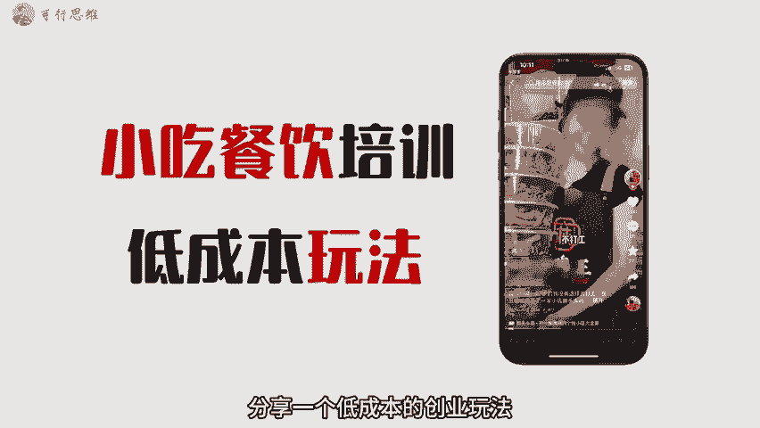

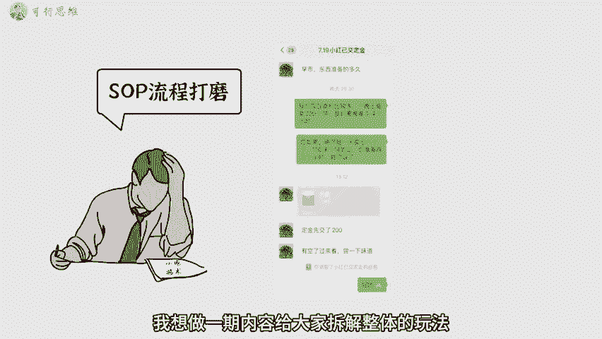

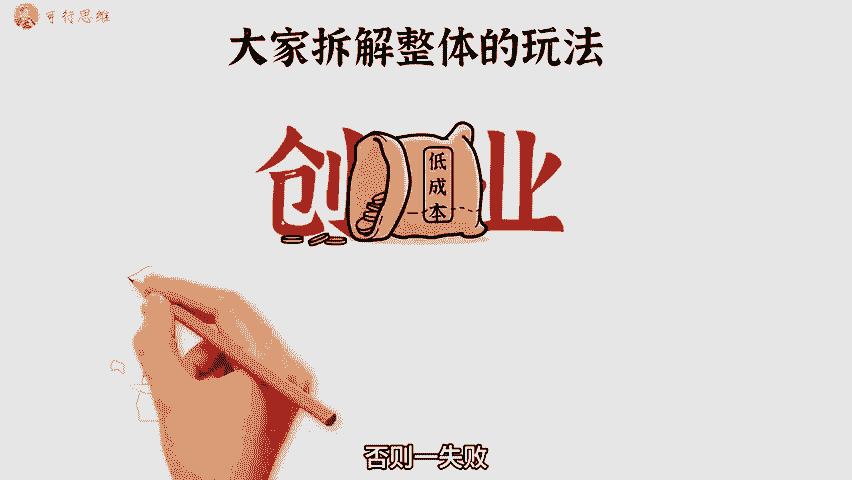

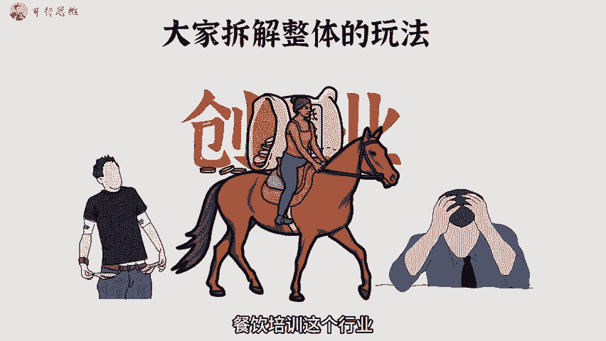

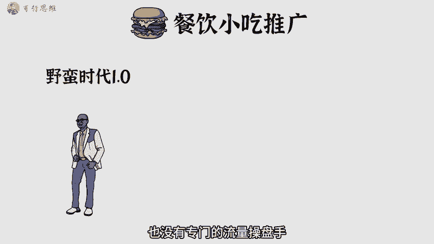

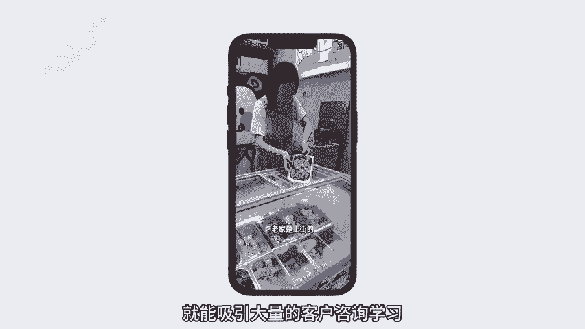

🎼这个时候只要下场去做的，基本上都能拿到不错的结果。像那些什么某某羊肉粉地摊小火锅店一年时间基本上都做到了千万级别的GMV。接下来也就是今年开始进入短视频流量的内卷时代，这就需要具备牛逼的策划能力。

以及需要更精致的视频内容，从前端运营到后端的体系，考验一个团队的整体能力，才能说可以拿到大的结果。那话又说回来，我们去切入餐饮跟小吃技术培训项目，如何避开内卷，如何能做到低成本呢？很简单。

我们只找地摊店主合作，去帮他们运营账号，朋友圈招收学员，店家只需要负责后端的教学交付就行。利润五5分。找地摊谈主谈合作，有几个优势。首先，他们普遍不会做账号，没有互联网思维。其次。

学员学习跟开店的成本低，便于快速成交。基本上账号有了标签之后，每天都会有客户咨询，想做这种低成本的餐饮小吃培训，就涉及到了以下几个环节，如何找小吃摊位洽谈合作，如何去拍摄素。

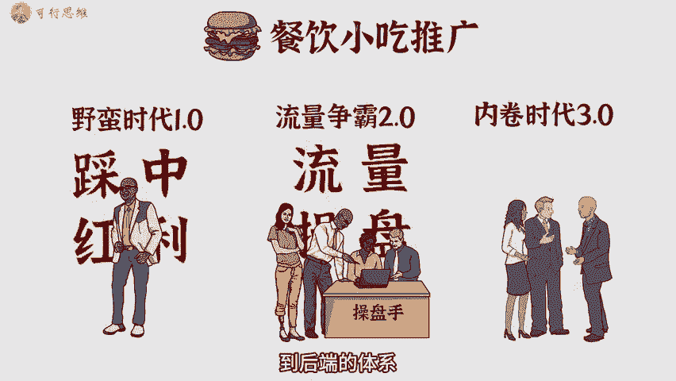

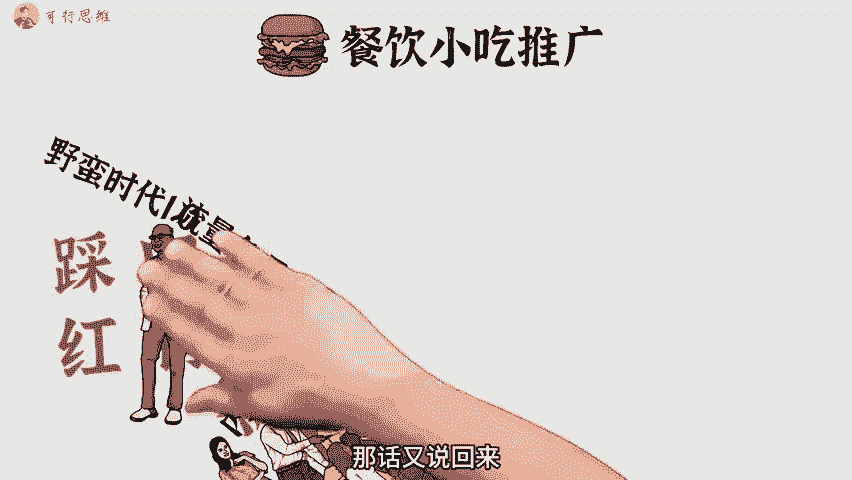

🎼运营账号以及如何去成交客户，我一个一个拆解。首先是找地摊摊主谈合作，每个城市都有夜市，大家不妨把周边的夜市逛一逛，观察一下那家生也好，需要排队，然后自己再买一份品尝一下，可以肯定的是。

每个也是都能找到几家不错的地摊小吃，主动去找老板谈合作。你来运营账号帮老板招前端学员，老板只需要负责后端的教学，谈好利润分成就O了，在谈合作的过程中，有几个点需要特别注意。一、首先要明确告诉老板。

不收取任何费用，打消老板顾虑，才能有接下来的发展。2、适当的追嘘自己的能力，给老板看餐饮成功案例，当然，这些案例可能是别人的。不过没关系，3、明确双方要做的事情。

比如老板娘每天几点负责出境账号交本拍摄剪辑由我们这边全程负责。账号归属权一定要死死拿在自己手里，防止账号做起来，老板跑路单干。因为人性永远是贪懒的。本来这些普通的夫妻档，每天辛苦摆摊。

能赚1000的利润，已经非常。

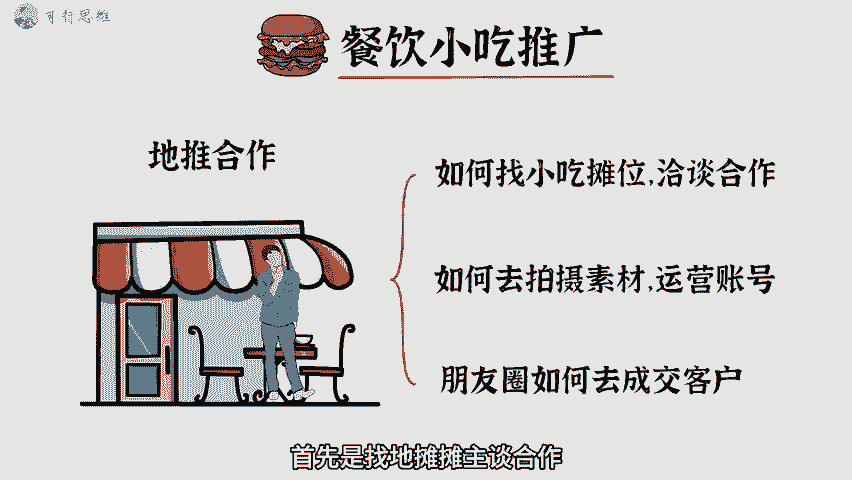

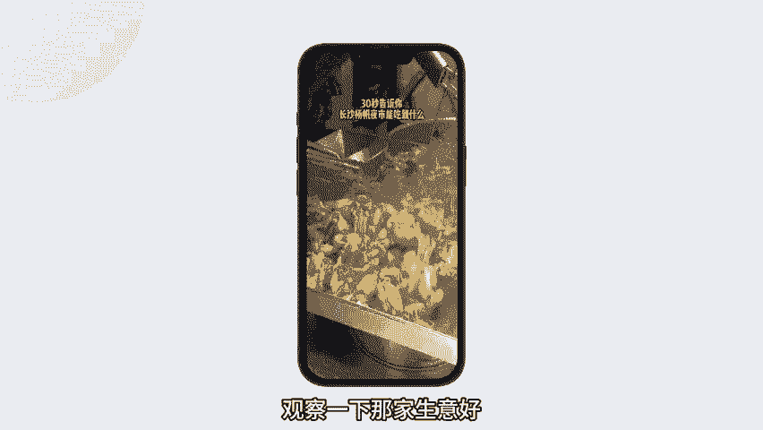

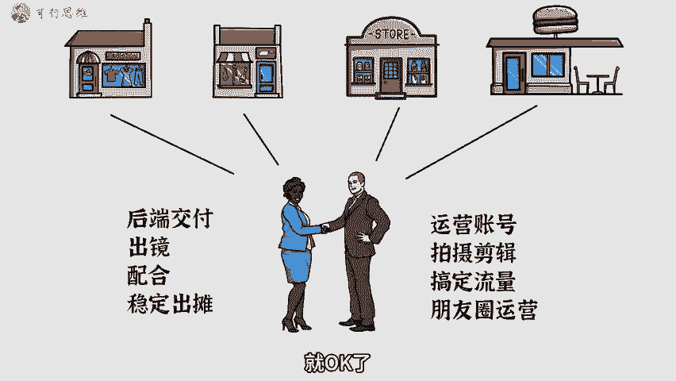

🎼知足了，你把账号做起来后，每天收三的学员就能把利润做到1万，这利润谁看了都眼红。5、账号做起来之后，一定要签好合作协议。6、尽量找那种面相看起来和面善很有亲和力的老板娘合作。这种自带天然的信任气质。

对于后端的成交来说，有很大的帮助。当然，在谈合作的时候，前期不熟练，肯定会有谈崩的，也肯定会有谈成的，无所谓，自己多去练习，反正没有成本，接下来就可以撸起袖子开干了。至于怎么去拍摄素材，怎么去运营账号。

这些也完全不需要什么成本，无非就是花一些时间去拍摄跟剪辑，这个我会在下个视频里进行详细的拆解。当然，我也准备了一些关于小吃培训运营的操作手册跟行业案例，大家可以在我。

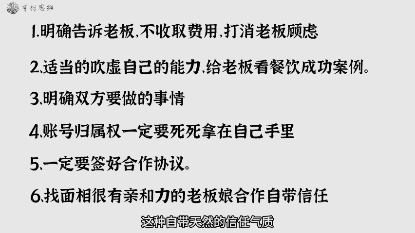

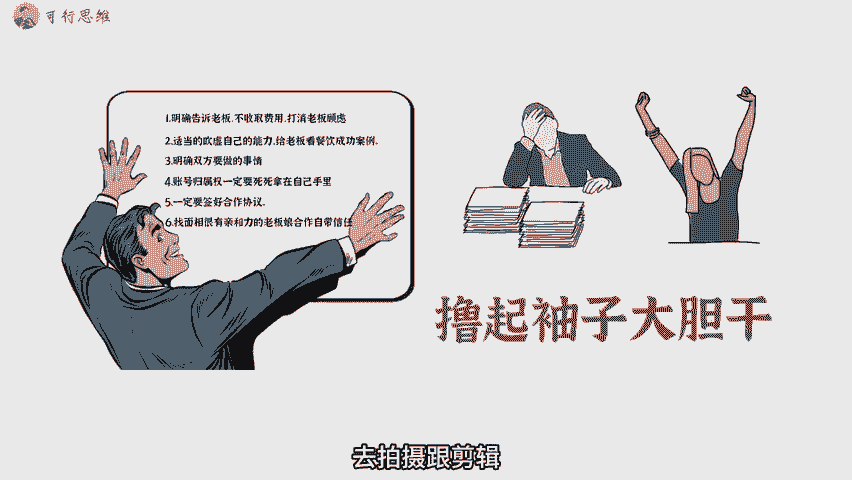

可行思维，回复小吃来学习。好了，那今天的分享就到这里了，我们下期再见。

