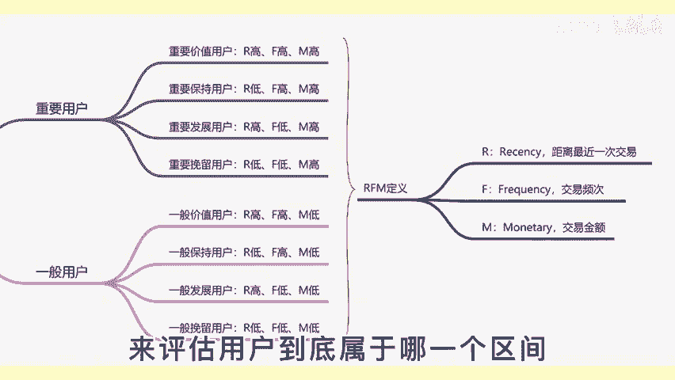
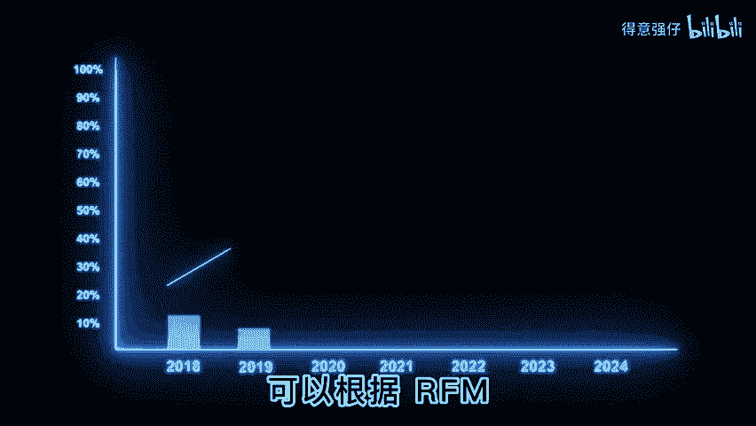

# 1. 搭建用户运营体系，建立RFM用户运营模型的五大步骤 - P1 - 得意强仔 - BV1Swp6eVE3t

🎼很多企业在搭建用户运营体系时，不知道如何选择运营模型。我推荐一款模型，可以帮助你找到重要价值用户。作用户精细化运营，可以大大提升企业的利润。大家好，我是刘洋，和我一起涨知识。

我们找到产品中能够衡量用户价值的关键行为，进行交叉分析和评估，最终形成某种分层运营模型，从而提升用户价值增加企业收益。今天重点分享RFM模型的操作步骤，我们可以通过RFM模型三个维度来进行细分。

如果按照5个层级来讲，其实可以组合成125种用户类型。但是这种分法远远超过了我们人脑的计算。况且还要匹配相应的运营策略。所以我们在日常的运用当中，把RFM模型分为八大类价值用户。

大家可以把视频当中的两页截图截下来。然后一一对应用户的区。🎼分如果有不明白的，可以在评论区里进行留言。我们重点来讲RFM模型的操作步骤。首先我们要去抓取用户的原始数据，定义出F中的一段时间到底是多久。

再来找出用户的下单时间下单金额以及它的下单频次。第二步，我们要定义RFM值的评估模型和综值，要根据业务特性或数据分布情况来划分数据分布区间设定评估模型。我们可以通过三个方向来设定RFM的三个宗值。

所有数据的平均值或者是中间值。第二，基于业务节点的重要值。第三，通过R8法则进行推算。这些数据，我们要根据自己的业务具体情况来定义。那么第三个步骤，我们要进行数据处理，获取RFM的具体值。举个例子。

我们把消费频率分为5个等级，消费一次是。🎼新客户，两次是潜力客户，三次是老客户，四次是成熟客户，五次是忠实客户。如果设定宗值为3，那么消费低于三次，我们就代表F值是低高于三次，就代表F值是高。

然后大家可以去匹配前面的对照表来评估用户到底属于哪一个区间。R和M的宗值也是这样去寻找。第四步，我们参照评估模型与综值，对用户进行分层，找到属于我们业务的8类价值用户。第五步。

针对不同层级的用户制定相应的运营策略。我们把我们的主要经力放在重要用户上。对于一般用户，我们可以适当的发展，可以根据RFM的三个维度来进行不同层次的提升。这样一来，我们促进用户消费会更加精准。

这就是RFM模型搭建的步骤，它是一种思考方式，并非是唯一的答案。关于用户精细化运营。

🎼的合集已经全部分享完了，希望对大家能够有帮助。我的分享就到这里，我们下期再见。