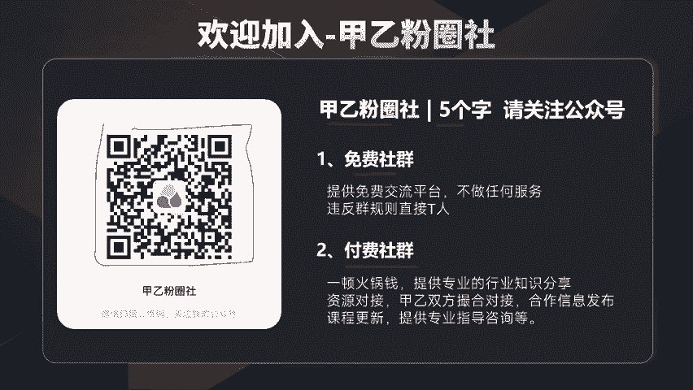
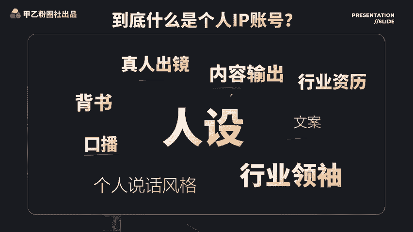
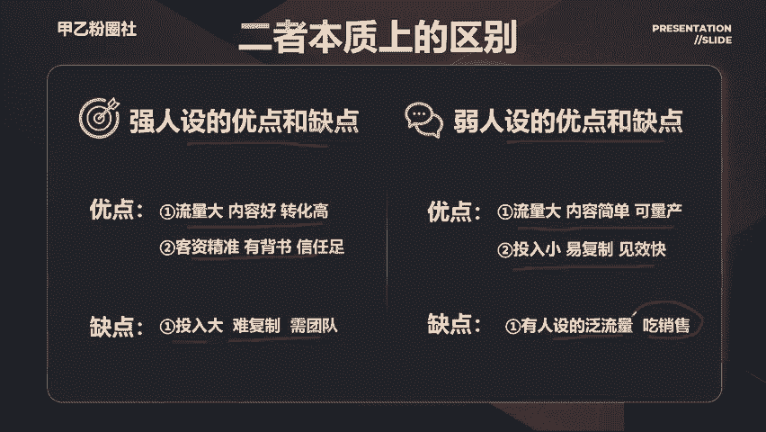
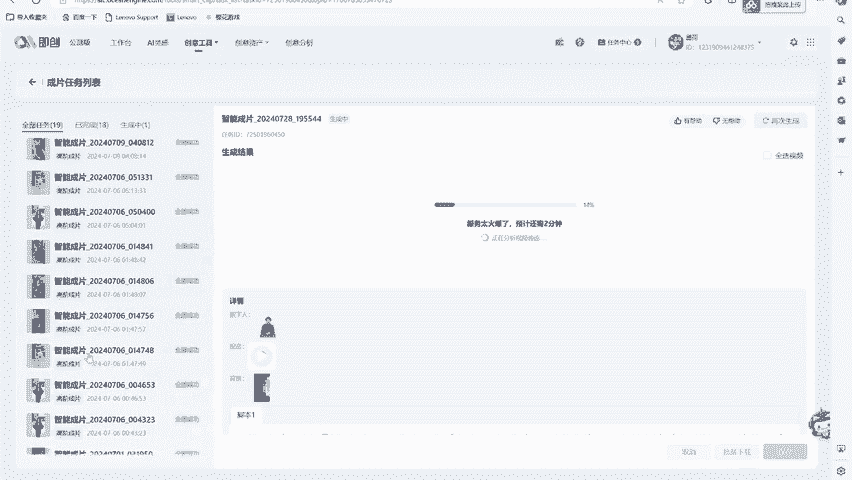
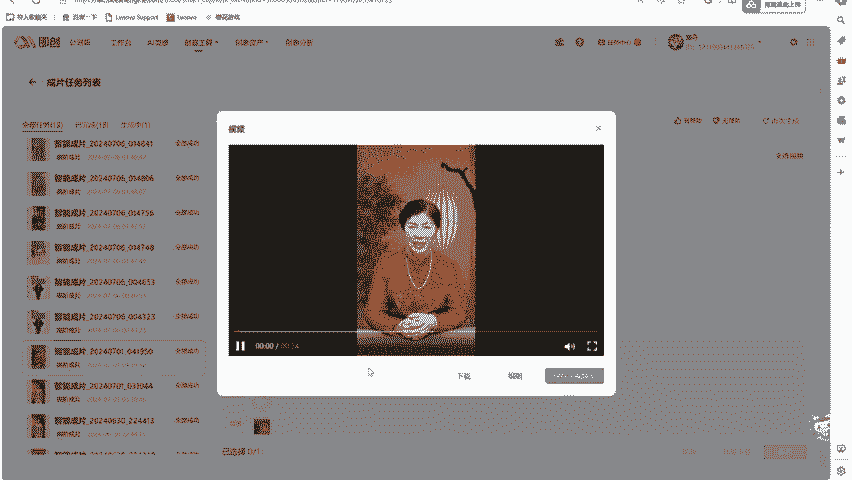
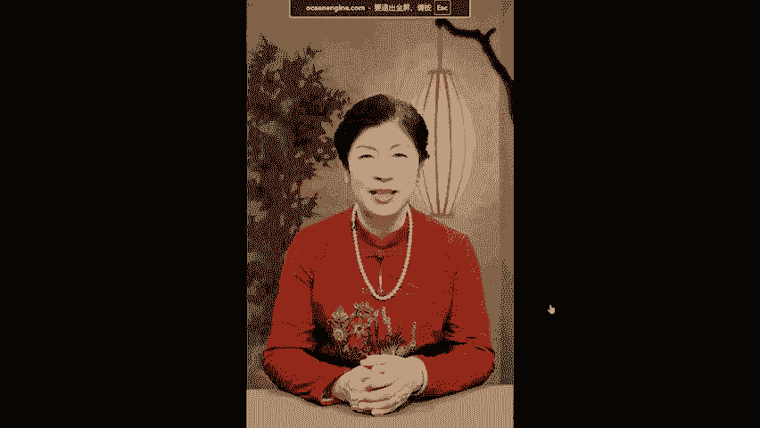
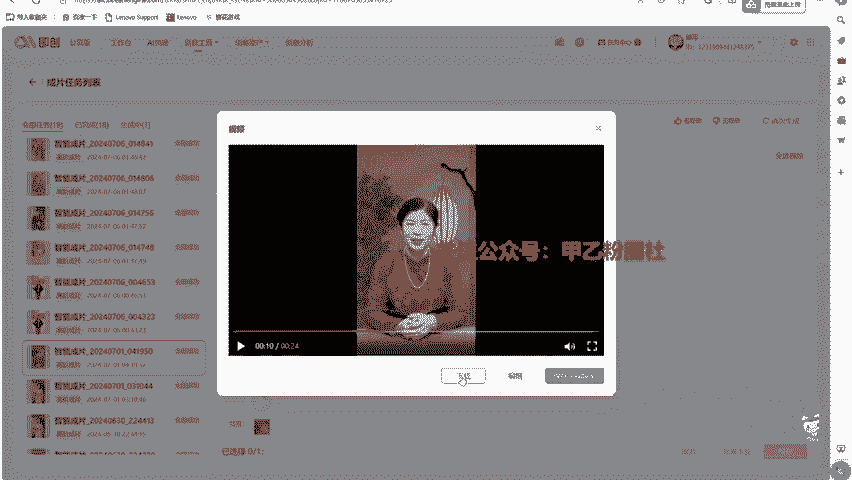

# 10、人设号引流及数字人技术 - P1 - 不讲干货的阿文文文 - BV1E1YteQESb

呃，第十节课呢，我们来聊一下个人IP类的引流啊。因为我自己呢也做了好几年的IP操盘手。那么先讲就是什么是个人IP呃，你可以理解呢，把短视频平台当做是一个朋友圈啊，可以展示你个人业务能力。

个人魅力的一个这样的平台，对吧？实现引流客资。那么我这里想说一个点，就是如果你在生活中或者工作中，你本身呢就是一个极具鲜明个人特色的这么一个人。其实你做IP呢会容易很多。

通过平台呢能更广的传播你的个人影响力。好，那么肯定会有人听这个课啊，觉得这个东西应该很难啊，说自己不具备。那么就是希望你把这套课听完之后，听一下我的方法论。好，这里呢给大家讲一下，如果说你对我们的课程。

觉得价值还不错的话，欢迎加入到我们甲乙粉圈社5个字，请关注公众号，甲乙粉圈社，我们有免费的社群。有付费的社群。如果感兴趣的话呢，扫描屏幕的公众号二维码。来加入到我们的呃社群。好，呃。

首先呢很多人会有一个疑问，到底什么是个人IP账号啊哎，是不是真人出镜就等于呢啊是不是有内容输出就就就是的呢啊，以及包括说哎我是不是要要口播呀啊或者要边写文啊，这些东西，很多人有这些疑问。

那么我今天这堂课主要讲的东西啊，就是两个字，其实就是人设很重要啊，听我慢慢拆解。那么在这里呢，我给大家总结一下啊，就是这个IP个人IP的做这种类型的引流。它有两大优缺点。第一个呢。

啊，他的缺点就是可复制性并不高，难度有一定大啊。你很多人说哎要我要真人出镜啊，对吧？要去具备一定的表达能力啊，包括现实生活中愿意抛头露面的人呢本身就是小众，对吧？

所以你会发现呃10个人里面可能只有一个人具备这种出镜解说演说的这么一个能力。所以你会发现哈呃，他的可复制性并不高，然后其次呢你还要在行业里面具备一定的专业知识，呃。

如果说你请一个演演员他演讲能力也没错啊，这个形象也没错，他其实可以通过文案实习稿，做做视频，但你会发现你像海声哥，对吧？大家经常说的人，那他是有真才实学的，他能做直播能跟观众做互动，对不对？

但如果你请一个演员，他只是去讲一个稿子，这个倒并不难。好，这个是他的缺点。但他的优点呢也非常明显他的爆发力是非常强。强大啊，上一个热门可能加好多好多人啊，其次呢就是他这个转化率是非常高的。

因为它基于这个信任。对你这个IP号的信任，你有极强的个人背书。那么我举个例子吧，以这个创业粉为例啊，如果你不是IP类的啊，就是一个直播引流过来的，或者是一些短视频引流过来的。

你最多是百5到百0的转化率顶天了。但是如果你是个IP类的对吧？那你的转化率可以到2030甚至更高。所以核心点就是啊你想做个人IP的话，就一定的。哎，要去把自己的一些背书拿出来，产生一些信任。

转化率是非常高的这是他的优缺点。那这给大家看一下，就是各个行业一些现象级IP啊，那比如说你像这个营养师方可，他就主打做减肥嘛讲他的心路历程，对吧？看一个胖子的逆袭之路啊，讲他是怎么成功的。

然后你再包括这个商业圈的啊海森哥啊，他的18年经商之路，这个就是IP啊，如何链接他，还包括呃他的一个广告推荐，你看这些都是都是他前面的一些置顶视频了，对吧？然后就是像这个留学，这是一个行业，对吧？

还有这个律师，那么我讲的这些东西都是行业的IP不等于网红啊，不等于网红啊，好，那么有人会说哎呦这个好像门槛好高啊，好难啊，甚至我都要退出你这节课了，其实我建议大家呢不要被IP吓到，其实我想说我们普通。

😊，人来做好这个所谓的IP号也好。其实核心观点只有一个东西。我讲的就是把人设做好就行了。我们不需要做一个非常大的粉丝量账号，对吧？因为我们只要搞定一个事情就是。哎，客户的信任来自于什么？

来自于你的你的人设，对不对？我们这里来看一个吧。看一个像这个钱总对吧？也是私域圈的一个IP号。那这个我没有吹捧他的意思啊，我举个例子，就拿他为例啊，还有包括老王，还有意万，他们这些做私域IP的。

我就拿呃前局前身，举个例子，你看他的一个作品内容，你们自己去看一下啊啊，然后他展示的一些内容好，那我得出一个什么结论，通过他的内容来把他的人设展示出来。比如说他的行业身份、财力、社会地位、专业程度啊。

个人性格这些东西，人设就是这个意思。那么你去看一下钱总的这个他的IP号，我给他做一个定义行业做私域的。啊，身份是个大boss啊，财力啊，天天有豪车对吧？基本上是财务自由，然后他在这里表达很多观点。

那一定是行业的意见领袖，专业程度他分享的一些知识都非常非常专业，那他的个人性格特点也非常明显，他这个人长得挺帅的啊，有人评论说长得像韩国欧巴啊，肌肉猛男外加代付眼镜啊，有点那个呃像演员的一种感觉啊。

斯文败类的福建人啊，说话特别有特点。那么这些就是汇聚他一个人的标签，总结就是我靠，刷到钱总一看就是做私欲，发过大财的人。那么你想学做私欲，你是不是会去链接他，如果一个人他也他传达的东西都比较少。

你敢吸他嘛，你不敢信对吧？所以你会发现他包括意外，还有老王，我觉得他们在私域的IP里面都是打造了非常O的啊，当然还有一些我们没刷到过的一种，他们打的。路线不一样啊，有的人打的是专业路线。

包括我们社群的呃主打的是一个叫做实在对吧？讲知识，讲讲实操啊，那么我们可能没不去秀什么呃，这种颜值也好，可能秀不过人家了，是不是好，那么懂这个逻辑之后，其实我们要把这个人设落地就OK了。

我们不是要奔着说做个百万号做个几十万号，不是这个意思。那如何把人设落地。好，那么我这里呢分为一个叫强人设和弱人设。我们来看一下什么叫强人设？比如说像这个号啊，大雷子，他是一个医美号。

他自己就是一个医美的从业人员。他会讲到做医美的一些问题。比如说呃跟你告诉你怎么去。做医美啊，医美有哪些点都跟你讲的很专业。那么为什么他们要做强人设？如果你只要但凡呃牵扯到选择非常成本非常大的一些。

领域它都需要强人设，比如像律师号啊、医生号啊，这个医美号啊，如果我选择一个错误的啊呃一个一个链接。那我就会导致可能整整整形出问题了，对吧？或者是个官司打失败了，你只要选择成本非常大的行业。

他都应该去做高人设。所以你们去看一下他的账号，你会讲发现他讲的很专业。好，那么再看一个弱人设。好，像这样的一个弱人设，他发的东西就是一个自拍，打几个字啊，比如说像这里老妈让我上班，他帮我带孩子。

可是她不知道我在家也能挣钱，上个月挣了4900啊，今天又挣了210，对吧？比上班还挣得多，把邻居的都带会了，他这么一个内容。是不是都是很重复这种。那么你通过这两个账号，你就刷一刷啊，得到人设。

这个人设非常专业，对不对？非常精通。那你要做医美，你会不会会不会找他，你肯定会找他，对不对？那这样的弱人设，他展现了什么东西啊，就是一个哎，传递，他就是一个在赚钱的宝妈而已。

这就他的人设表表达的东西非常少，包括我们刚刚说了，以钱总，他这个账号为例，对吧？他表现的东西是非常多的，你看没有对吧？一听福建人啊，福建人干思域肯定很厉害了，有这个天然的一种属性，对吧？同样的这个道理。

那么你去看他这个。😡，只要表达一个东西，就是我是一个宝妈，我在挣钱就行嘛，对不对？其他的信息他也表达不出来，对吧？好，那么这个就是叫强人设和弱人设。我们来看一下他两者的本质的区别。

强人设的优点和缺点就是他的内容也比较大，内容比较好，转化非常高，他的客资非常精准，有背书信任组，他的缺点是什么？就是哎投入是比较大的，你比如说你说要做一个呃医美号，那么你自己都不懂医美。

你在那讲医美知识，你能讲吗？你不能讲对吧？好，你自己都不是这个专业领域的人，你就产不出相应内容，所以他一定是复制难的，对吧？所以你就发现有很多员工啊，他去做号，他根本做不起来，他自己没肚子里没货，对吧？

好，然后弱人设的这个优缺点很简单，就是他流量也比较大啊，内容制作简单可量产，投入小啊，易复制啊，见效快。但弱人设，他本质上他只是比。😊，我们这种自热铁的啊这种信任度高那么一点点。

它本质上呢还是属于泛流量，还是靠销售能力啊，后端销售能力要跟上。不然它转化其实跟我们做自热区别不大。好，你只要懂这两者的区别之后，我们来看一些案例。

比如说像小国对小国就算命嘛，对吧？小国的一些账号对比，我举个例子，强人设来看一下，像这里有一个账号叫他的这个法号呢，叫做这个呃凌云。🎼中过得不好的路进缘浅的人，往往才是家里边最有才华和慧根的人。

因为他们的人生体验和别人完全不一样，他不依赖家人自己就能突围。只有在这样的环境下成长的人，才能成为强大的人，只有这样的人才可以自己一个人就能过得很好。好当然身边所有的人羡慕你要知道蝼蚁成群。

只有虎狼独行，浮生无量，若你幸福。大家看一下，那么他就会把一些这种传统的国学知识，还有包括这种道德经里面的一些观点都能输出出来。那么你关注他就一定是觉得这个人是有才华，有有内容的。那么我们看一个弱人设。

这个弱人设呢叫做近成师妹，这个说白了就很简单啊，看一下，非常简单啊，所有人都想看看你倒下的样子，你放心天助天会助你，你不会倒下来的。我是近成师妹啊，这个是一个大字写上去。这么大个文字呢。

本质上啊都是一些呃。😊，🎼中年人中老年人会看这样的内容，对不对？因为稍微看一下他的内容。🎼，好，那么为什么他是个弱人设呢？很简单，他表达东西很简单，就是他是一个啊大概的就是一个类似于这种居师啊。

或者是一个修行人一一个一个这样的呃身份啊，头发一扎，这个道袍一穿，就这种感觉了。但是你要说他再传递出更多的信息吗？没有了，没有了，所以他就是个弱人设，还有那种无人设，完全没有人设对吧？

他就是在这个道观里面瞎转悠，他只要表达就是他在道观里面是个道士感觉啊，🎼，그。🎼你像这种无人设，你说他转化率会高吗？肯定不会很高的，对不对？但是他好容易做啊，你随便去个风景区也好，去个哪个寺寺庙也好啊。

道观也好，找个这个古建筑穿个道袍走两下，一天可以拍个两三百条呢？是不是？但你想一下，如果是同样，你是信信国学的人，这三个，你选一个你会选谁你自然而然会选全人这个强人设的啊，包括他的长相啊。

他说话的这种感觉。你都觉得这个人是自己是非常具备有这种能力的人，是不是？这就是讲的强人设和弱人设的小国账号对比啊，那你想下他转化是不是有区别，是不是好，我们再来看一个。😡，好，再就是像这个自媒体培训号。

我举个例子，你像这里啊这个号他每天呢他因为他们在做实操，所以他们会把每次的实操的内容全部分享出来，他就是强人设，对吧？原创的内容？强强人社，他自己也是做这个东西的讲出了这些观点，没有？这个观点。

那么我们再看一下像这种内容都是一样的，每天说自己做自媒体超书赚了多少钱赚了多少钱，他的内容都是不变的都是不变的。那么你就是一个他就是做一个智商过滤，对吧？你信他你就加他，然后开课就好了啊。

这个用公开课去洗的公开强行洗脑对吧？可能就是转化的人和这个引流的人根本不是一群人比如说他叫小麦可能加过去这个这个售后或者这个销售叫什么什么阿狗对吧？

但这个不是他一定是打自己的IP账号背后的朋友圈也是如此。那还有无人设的话，像这种啊，就是分享笔记了啊，分享笔记了。后。一些运运营技巧什么的，这就是无人设。那如果你现在这个视角来看是吧，我我我。

我把大家的认知啊都是往上提的话，你肯定会选择他嘛，因为他做过实操，对吧？他自己做在做，他自己在做做账号，对吧？如果你是一个没有智商的人，你肯定会会选他了，是不是？😡，是不是好。

这个就是这个叫也算是一种培训粉。好，我们再看一个。强人设弱人设的啊国学禅修好。你看这样的强人设尼姑。尼姑身份。🎼对吧然后在这里在一个寺寺庙里面讲一些大道理，对吧？讲一些这种呃情绪价值的内容。有缘人。

你看到了静仪师傅不会让你吃亏的记住贵人服一步，胜走十年路，六十吉祥，啊，你像这种残修号佛学号，他本质上的就是做一些这个答疑解惑啊啊，做一些法事啊，甚至做一些所谓的这个烧香啊，这一些这样的内容，对吧？

因为这个是是个道法这个道道佛，现在有点不分家在国内那这个是真实的尼姑形象。你可再看一个弱人设，就是个居士形象啊，说自己有缘人来了，不是我不联系到你是是我真的找不到你们看到我你划走了啊。

我是龙凤阁第十三代传人，这江湖人称这个铁口之断。那么你看一下他这个内容，其实就是个摆拍啊，你可以看是个修行之人啊，修行之人叫居士嘛，对吧？也叫禅修。🎼对吧也就是说我是个居士，我帮你在庙里烧烧香了啊。

顶多是这样子的。好，那就是个摆拍，不要再。🎼熬住困惑，放下烦恼，放的快乐。好，那么同样的，如果你是一个信佛制，你会去找他烧香，还是找他去烧香啊？是不是那还有更离谱的啊，像这种啊。

这种完全没有人设来个佛祖啊，就这样一个一一个这样的图啊，然后他的主页也会留留留这个微信啊，就讲就是要烧香啊，要干嘛的啊，可以加微信，就类似这样的内种。😊，🎼呃，这里讲一下这个强人社的一个内容生产流程。

如果说我们想做行业里面的一个强人社，其实我不建议大家上来去做原创，因为创不出来的啊，最好的方式就是借鉴同行，但借鉴同行呢是做的是洗稿加个人特色的一件事情，就一定要洗稿。比如说这个作品火了，对吧？

这个作品火了，天越热，就一定得喝热水，因为天一热就一定要喝热水啊，因为天热的时候怎么样你看再看这个文天气越热，我们反而更要喝热水，你知道为什么你看他其实讲的东西都是一个东西，但是他换了一种描述。

如果你不会洗稿，对吧？你还不会洗稿，你最好的方式就是用个AI比如说下载豆包这个软件，就是把他把这个文案给他，我让他保持上面这个意思不变，帮我改一遍。看到没有？用为AI去改一下就好了。

但是我一般建议是真人去改。因为AI去改的话，它的说话逻辑啊啊或者说是他的这个说话口吻啊，可能不符合你的调性。所以一般来说，你让AI去洗稿之后，你还是要自己去再纠正一遍。好，另外呢这里讲一个技术啊。

大家看一下这个效果啊。这5种食物可以放心吃，饮食一直是困扰糖友们的重要问题。甜食不敢吃，油腻不敢碰，这也不能吃，那也不能吃的朋友。你从现在开始就去做无人播剧项目，3个月后没人敢瞧不起。

如果你想打一辈子工，那下班回家。大家看一下对这个素字人的效果是否满意。其实有些时候呢呃很多行业啊，我们压根就不需要真人出镜，你就直接做一个形象啊，让他去读稿子就行了。

你像这样的一个老奶奶去讲一个养生有什么关系？一个这样的气质女人讲个呃养生有什么关系，对吧？所以发现啊现在呢就是说我们随着这个AI的技术强大起来了。你会发现不是对口播这么为难的。好。

你觉得这些这个效果比较不错的话呢，来给大家推荐一个平台叫集创平台，这个平台呢是抖音旗下的是不要钱的，效果是非常厉害的，几乎是以假乱真。一般人根本就看不出来。好，那么接下来给大家看一下这个极创平台呃。

教大家如何去使用一下。😊，接下来给大家演示一下这个极创的后台呃，这个后台呢，你可以在百度里面搜索呃集创，它是巨量引擎自己的一个平台。这个平台呢是完全免费的平台。

就是你们可能会去买一些所谓的AI的一些制作平台的话，其实没有必要啊，如果我们不是要定制自己的形象，其实这个平台已经非常够用了。那么这里有图文创作和直播创作。那么我们常用的呢是这个视频创作。

点击这里智能成片，它有两个这个成片有点类似于剪映里面的模板，选择这个高阶成片，高阶成片它就是一个数字人的一个操作。那么它一共会有几个地方按钮脚本视频啊，配音音乐字幕。

那么我经常会用到的是这个数字人的功能，其他的我们不用啊，先回到脚本。我们刚刚把我们的脚本给它粘贴上去啊，这样一个脚本，对吧？然后点确认。好，点确认。然后这个视频呢正常来说，你是上传一个视频啊。

让它进行一个前贴后贴啊，贴到前边还是后边的一个东西。但是我们一般不用啊，一般不用。因为这个在简历里面操作，可以方便后面的修改。然后什么音乐啊，字幕啊，配配音可以选择哈，我们一般只选这个数字人。好。

那么我们随便点一个，比如说现在是一个养生类的文案。那么我们先筛选一下，我们找一个老年人讲养生，肯定要比年轻人讲养生要更好一点。好，那么我们可以挑一个，比如说我觉得这个老年人好，这个老年人。😊，来看一下。

给他拉大一点点。好，放在这里，然后你可以点击这个画面预览啊，这个效果就在这里啊，你拿它做投放，它这个有个实时预览。好，那我们继续啊。😊，呃，默认呢它是配套了会有一个呃配音。

比如说像配的是这个知心大姐的声音啊，我们先不用管。那这个背景呢我觉得有点呃不和谐。因为我们讲养生的话，一般那种禅意的背景会好一点，这里呢我在淘宝上买了一些背景。你看这样的背景是不是舒服很多。

那这样的背景是不是舒服很多，对吧？符合他这个中式的穿衣风格，那比如说我就举例我就用这个好吧，啊，会换一个看换一个好一点。好，这个吧对吧？然后点立即生成。😊，立即生成他等待2分钟，我们看效果。好。

他就会在这里任任务中心这里我们点击它就会跳转到任务中心。好，那么我们看一下他以往的一个效果，像这样的效果点开。

甜食不敢吃，油腻不敢碰的朋友注意啦，注意啦，少吃小片片，多学饮食搭配，只要按照我的正常来说的话，这样的质量，很多人是看不出他是数字啊，然后你觉得OK了，就点击下载，在剪映里面二次编辑去增加字幕也好。

增加一些贴片也好，这个看你怎么去操作。好，讲完了这个强人设的逻辑。那我们讲一下这个弱人设的，其实就是跟我们做自热是一样的，就是找同行模板抄一遍，一直操作它没有流量，比如说像这个账号跟这个账号。

你说他本质上有区别吗？都没有区别。他们表达了一个意思就是我是个宝妈，我在挣钱对吧？然后你想挣钱找我来做，就这么简单的东西，他表达的东西很简单，他绝对不会说呃有什么行业地位干嘛的。因为这个东西啊。

我们一直讲啊，物以类聚，人以群分啊，那人以群分的话，如果你是宝妈，你看到这样的宝妈在挣钱。

你会不会去问一下你在做啥呀？你在做什么呀？这个就是天然的链接属性。被毕竟啊我们做这个思域，本质上的就是个销售工作，销售销售它链接的是这个人啊，这个这个人赚钱的，那我跟着他去赚呢，对吧？这个孕妇能赚钱的。

我也能赚钱了。其实他们赚的钱就是这些人帮他挣的钱对吧？好，这个就不去详细讲了，就跟我们做自热一样的啊，只不过变成了一个人设啊，有人设和无人设的区别，那这里给大家看一下，我们团队啊。

以往打造的一个IP账号案例啊，那像这个账号叫爱笑的料率啊，这个账号当时是我来做的啊，你看一下作品呢最高的是一万播放量啊，是个律师号，但是我们是陪跑。因为这个律师是我是我的朋友啊。

然后还包括我们做的这个陆老师这个讲堂啊，这个是视频号的后台啊，有10万多粉丝，主要讲的就是教家长怎么去呃。教孩子去高考去升学这些知识啊，做的非常不错。另外呢请大家可以关注我的个人IP号啊。

可以搜索一下抖音号吃人。6558可以关注一下我的啊，我自己呢其实在以前呢一直还做做自己的账号，后续转到幕后了啊转到幕后了。那么呃接下来我将会在我这个账号里面持续来分享一些关于行业的知识。

大家可以关注一下我的这个IP号。好，最后呢来打一波小广告。如果你是现有存在的IP啊，你还不知道用什么方式变现。好，或者说你想做IP的，我欢迎大家来加盟我们的社群。和我们一起来打造行业头部的私域社群。

欢迎大家来成为我们的联合创始人。无论你现在在做的啊，或者想做IP类的。啊，那么我们可以是你们的非常坚实的后盾。那么好处也是有的。第一个呢就是我们的会费，你可以拿走90%。我们的社群会费啊。

就是你只要推荐过来的，或者说你通过你过来的，你拿走90%。好，然后如果说你的会员需要做陪跑。那么陪跑费的50%啊，你可以拿走。然后还有很多隐性的收入，这些隐性的收入是超过这些的。但是我在这里不方便去讲。

如果说你有兴趣想来和我们一起做社群的话，欢迎大家成为我们的联合创始人。好，等你来咨询，那最后呢讲一下，就是甲乙粉圈社。如果说你缺甲方，对吧？可以来找我们啊，又怕甲方不结算，我们做担保。

如果你是甲方你缺流量，怕别人打假粉，可以进圈子，我们帮你匹配出粉团队。如果。你是小白，可以找我们做陪跑啊，也可以呢来陪跑我找我们做IP对吧？和我们一起来做社群。好，这节课讲到这里。

