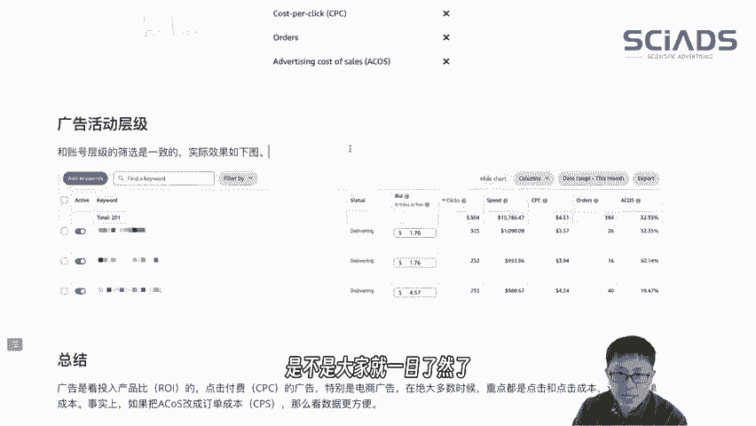

# 10年经验亚马逊广告操盘手如何看广告数据？亚马逊广告后台重点关注哪些数据？奥卡姆剃刀原则 - P1 - SciAds亚马逊广告 - BV1UA21YhEwY

。大家好啊，这次给大家讲讲入门的一些知识。很多人啊看后台的数据的时候都会被后台的数据给吓到。因为数据现在实在是太多了呀，所以说给大家分享一下，我是怎么来看亚马逊后台的数据的。主要是针对商品推广。

如果是其他形式的广告的话，可以增加一些其他的指标。我们先说一下筛选的原则，筛选的原则的话，只有5个指标最重要分别是点击订单，点击成本，广告话费和ac cost在任何时候这5个指标都是要勾选的。

其中有一个原则分享给大家就叫奥克卡姆剃刀原则，如非比较物证实体，根据需要越简单越好。账号结构的话，敏感的信息我全都打满。大家可以看一看，如果说只显示这五列的数据的话，是不是就非常的简洁的呢？

勾选方式像这样勾选就可以了。广告活动层级这样勾选就非常简单了。可能很多朋友会问，那展现之类这些数据没有展现出来。事实上平常我们是不看这个数据的。总结一下广告投放是看。投产出比的。

所以说广告点击成本是很重要的，特别对于电商啊，重点都是点击和点击成本，而点击和点击成本就联系到你整个的一个广告的输入了，就是总体花费了，对吧？还有一个就是你的出单成本。我们很多期视频给大家传递一个原则。

就是投广告的时候，你要想把它当做投低友一样这样来理解，投低友的话，你关注花了多少钱，出好多少单，出单成本是多少。广告又很特别，它是按点击付费的，所以有多少点击点击成本是多少，这样解释的话。

是不是大家就更加一目了然一些了。

