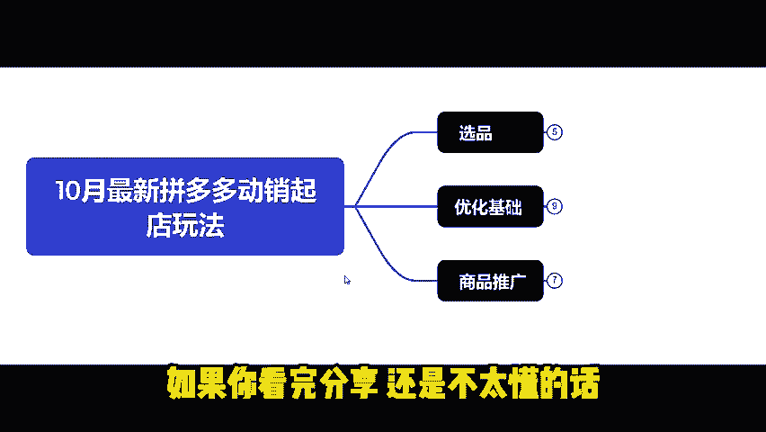

# 10月最新拼多多动销起店玩法-月入5W+日发500单实操教学！ - P1 - 白羊说电商 - BV1962SYQEhK

现在做拼多多店铺都是怎么做起来的？自然流量起电靠的是产品。半付费起电靠的是沉淀和时间。动销起电模式。起电周期最短，能在15到30天就能日发百单。今天就由我带大家学习10月最新拼多多动销起垫玩法。

这店铺是我9月下旬注册的。

到前两天的时候，还不到30天。直通车花费不到200，就已经能做到日发500架。

用的正是动销起电玩法。如果你看完分享还是不太懂的话。😡。

我也整理好了拼多多运营实操文档。放在下方评论区有需要的小伙伴。

可以自行领取。2024上半年，拼多多起垫是强付费趋势。但是。下半年开始，平台陆续给很多类目放出一些自然流量的信号。从平台流量扶持来看。我们能看到平台自然流量扶持。都跟产品价格有关系。最近两个月。

平台出了一系列政策。开始挽留商家仅退款变少。之前平台基本上都是维护买家的。平台的变化都预示着我们拼多多的商家环境在逐渐的变好。如果我们的拼多多店铺想要在年底之前翻身。那就只有跟着我来操作。😡。

这套10月最新拼多多动销起点玩法。能让你在15到30天内快速日发百单。

第一步选品分析市场，选品主要分析同行市场竞品价格。图片SKU布局等等，判断我们自身的优势。你做这个产品能超越他的概率。首先我们搜索我们产品的核心关键词。

比如我现在搜美妆刷，先按销量进行排序。找到销量和评价都比较多的链接，像1万家这种。下面我们要去对标竞品，要满足两个特征。他们的价格段要相近，规格相同，有相同价格规格。外观款式型号在同一个赛道里面。

像这两款美妆刷才能叫做我们的竞品。

通过前面两种方式，从榜单找3到5款对标竞品。再根据我们的对标竞品来完善我们自己的产品。2、优化基础一产品定价，先填写对标竞品价格。再去填写自己成本，自动去得出产品定价。

通过对标竞品的价格去确定我们利润率有多少。从而判断这个链接起量的方式。比如利润率在20%以内的产品。以自然流量为主，可以微付费。利润在20%到40%之间。可以通过活动和半付费起量。

40%以上利润可以玩动销起电玩法。2、主图主图会直接影响我们链接的点击率，最好是原创没有条件原创主图的，用AI做图，参考下头部同行怎么做的。主图一定要直观突出我们产品的卖点。

比如这款充电宝就用5700毫安超级快充质保5年等等效果，直击买家痛点。3SKU布局。你的外露价低，规格少，买的人多。😡，这是典型的低价引流打法。可以解决新链接跑不动的问题。低价引流几乎适合所有产品。

在实操中，我们就要注意价格的被差。你现在设置一个低价引流。你的价格不能设置很低的SKU。竞品的最低价跟你不同。可以切类目，不会切类目的来评论区找我。😡，4、基础销量改销量。改一万销量。

提高我们链接的点击率。新店，你不要一次性把店铺所有的链接都改了。😡，否则他是很容易被关小黑屋的。😡，如果你店铺已经被关了小黑屋。新店可以直接放弃重开。一条链接搭配做100条有效评价。

最后我们再通过商品推广扩大订单流量。商品推广有稳定成本推广和全店托管两种推广方式，稳定成本推广的成交出价适合利润率大于40%的商品，主要作用是拉新。成交出价对应的计划投放的都是新人群。

每天给你拉新课的推广计划。目标投产适合利润率小于30%的商品。主要是收割计划，主要去触达的是之前有接触过这类产品。但是呢他没有下单的这部分人群。重复的去进行触达，以此来提高转化率。因为是救人群。

所以它流量的成本相对来说就会低一些。全店托管更适合店铺链接超过30条以上。主要是用来筛选链接。全店托管的优先级大于稳定成本推广。打开全店推广之后，你的稳定成本就暂停了。最后如果你看完分享还是不太懂的话。

😡，我也整理好了拼多多运营实操文档。放在下方评论区，有需要的小伙伴。

可以自行领取。同时也不要忘记一键三连。

你们的支持就是我更新最大的动力。