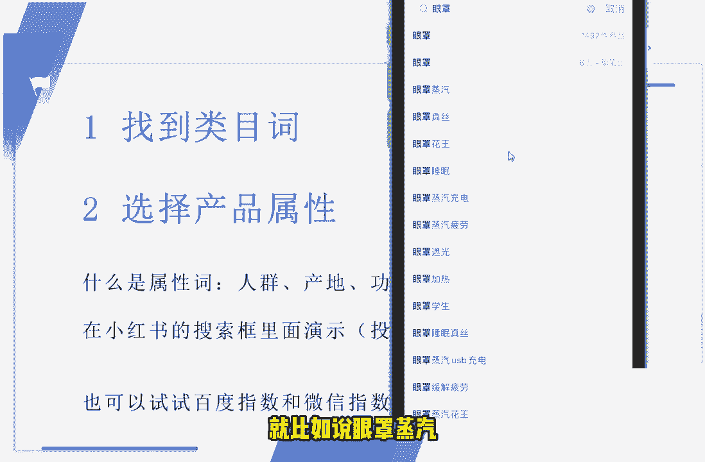
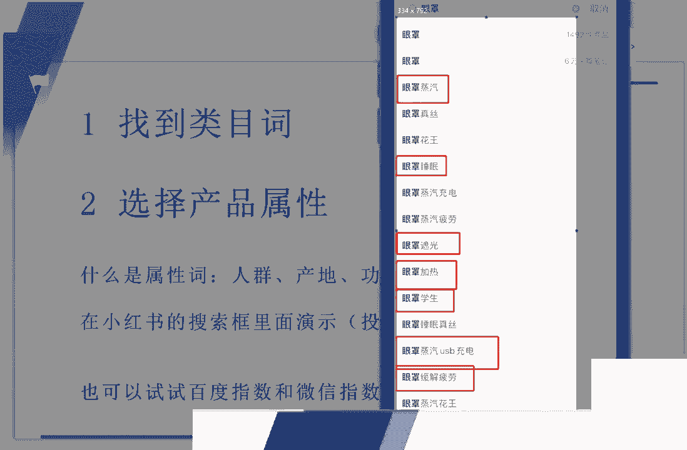
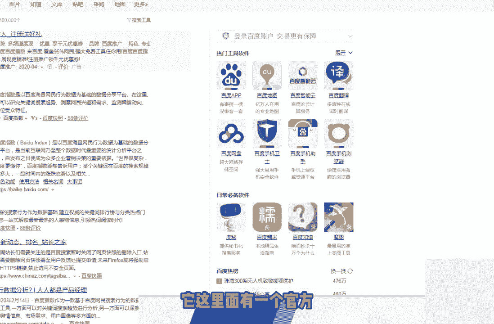
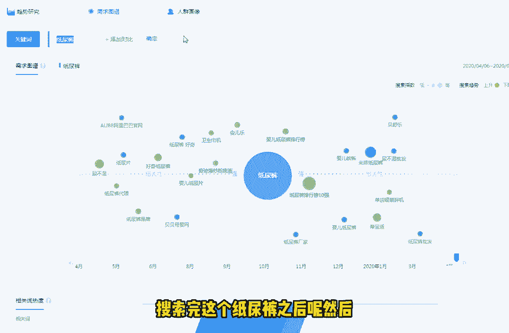
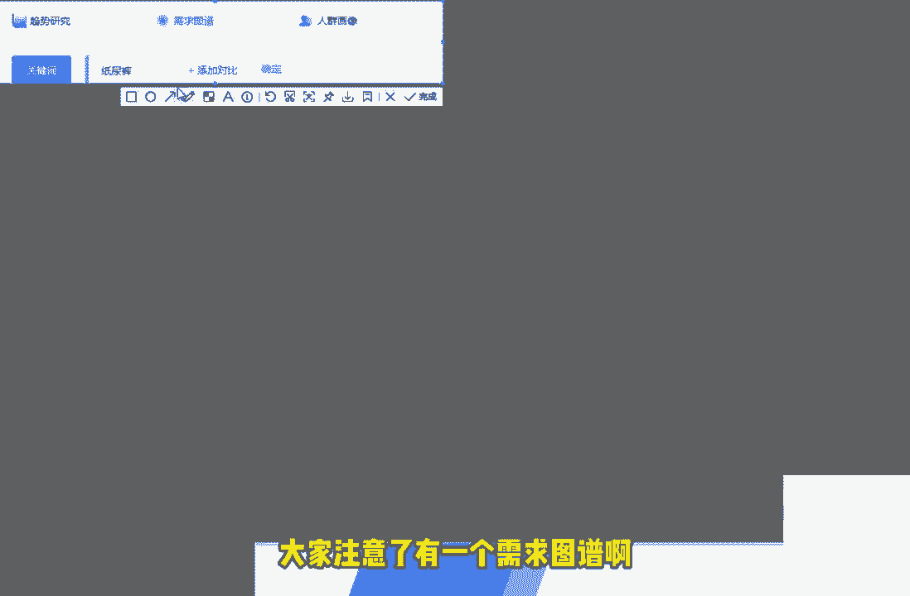
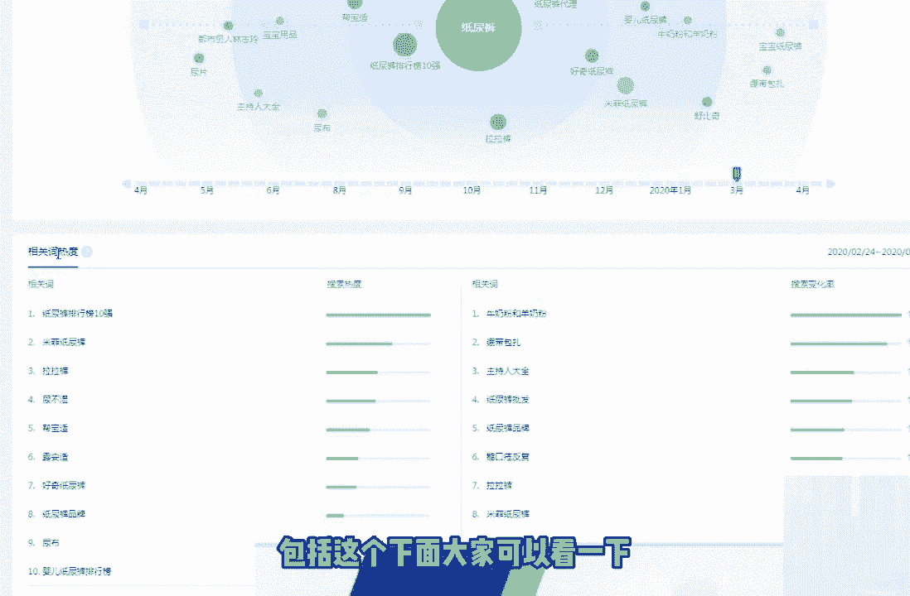
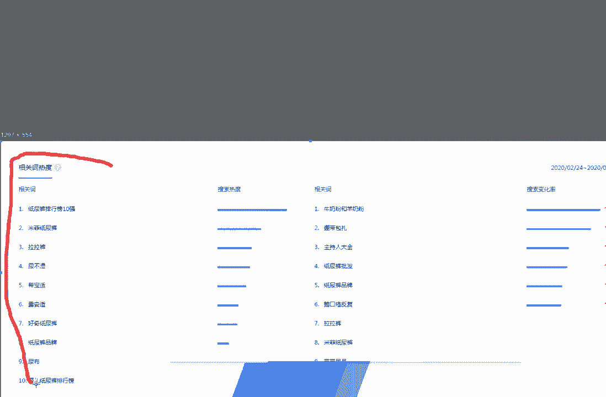
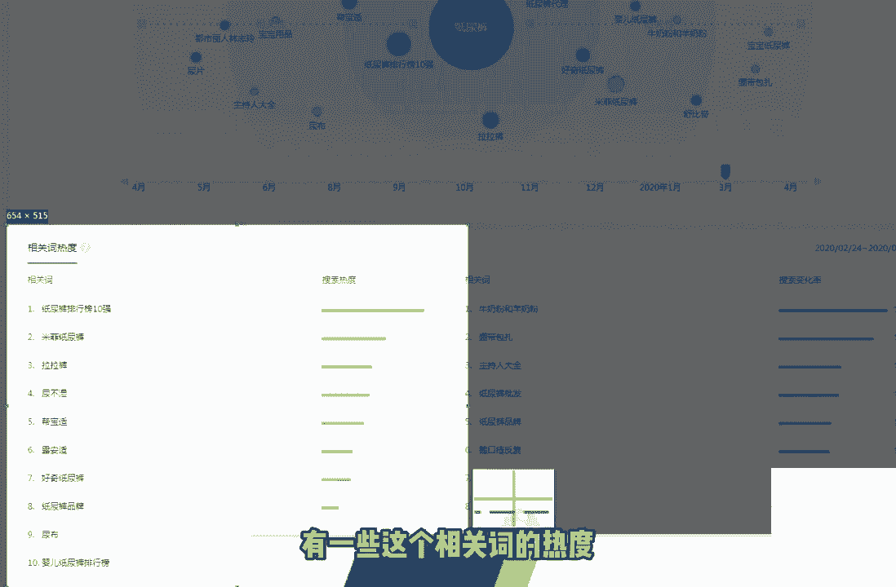
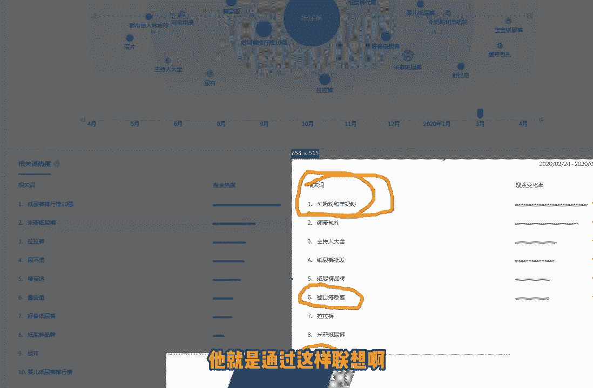
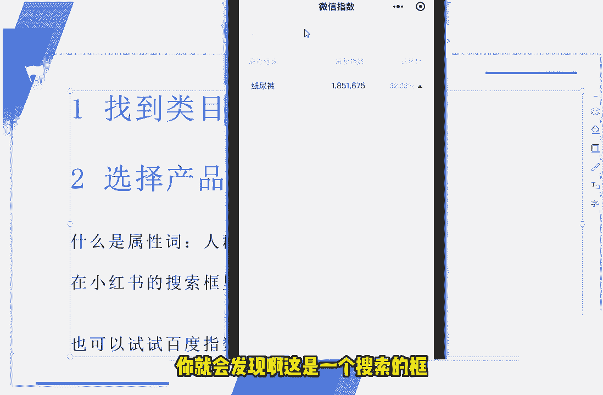

# 120分钟精简版学会小红书运营-原来打造爆款笔记这么简单！！！小白零基础入门必学的小红书笔记公式拆解，最简单的起号教程，快来学！！！ - P10：第7节：小红书运营教程之小红书笔记关键词挖掘技巧，教你抢占更多小红书流量！ - 锦州山河 - BV1YDtmeHEKE

今天的这节课呢，我们来讲一下小红书的笔记热词，如何去掌握关键词，关键词的一个挖掘方法，抢占更多的小红书流量好，那我们这节课呢主要是跟他跟大家讲的是，找到这个更多关键词的一个方法。

首先我给大家推荐的一个方法呢，是很很接地气的一个方法，也是非常实用的一个方法啊，我们不需要借助一些其他的这个，额外的一些工具，我们就可以完成这个关键词的一个挖掘，就比如说我们用这个淘宝很简单的。

比如说我们以纸尿裤这个关键词为例啊，我们搜索这个指指南库之后就会发现呢，它这里面会出现一些其他相关的一些，这个关联的一些关联，那些关键词，啊就比如说您是不是要找，因为和纸尿裤相近的这个词，有拉拉裤。

尿不湿对吧，帮宝适等等等等这些词，因为它这些词和这个和这个纸尿裤，这个词比较相近，我刚才说了对吧，所以说系统会给你推荐出其他的一些，大类的一些词语，也就是说你如果说想做这个纸尿裤的话。

那是不是也想做这个拉拉裤，或者说想做这个尿不湿对吧，好，通过这个方法，我们找到了这种类目的关键词之后呢，我们可以选择一些特定属性的一些产品，属性的一些词，那什么是产品，什么是一个产品属性的一个词呢。

啊这里面和大家讲简单的讲一下，就比如说我们简单的啊通过这种人群啊，产地啊，功效啊，效果啊等等这些词，它就是一个产品属性的一个词，这里面呢我用这个手机投屏来和大家看一下，好。

这个时候我打开的是这个小红书的app，的一个界面啊，我们就拿这个眼罩，我们换一个词，就拿眼罩这个关键词来搜索搜索，搜索出来之后呢，我们发现这个小红书的搜索框里面呢，出来这么多关于和眼罩相关的呃。

一些个这个长尾词，一些关键词我们来和大家说一下，有哪些词呢是产品的一些属性词，就比如说眼罩蒸汽。

啊眼罩蒸汽睡眠，遮光对吧，这是它的功效对吧，加热针对于学生用的对吧，啊这种USB充电的可以用来缓解疲劳的啊，可以用来充电的这些词，我们可以看到呢它就是一个产品的一个属性词，就是我刚才所所说到的。

我们扩充这种产品的这种词之后呢，就可以针对这些词呢来去写上，我们不同的不同的文章，不同的笔记好。

大家应该明白了吧，主要的是我们啊，通过第一个找到你所在所做的，这种类目的一个大类，然后呢选择这个类目的一个属性值，然后呢这个就是你所写文章的一个方向对吧，你写这个笔记的一个方向呃。

那我们除了用这个小红书的这个工具之外呢，我们还可以用什么工具呢，这里面呢我我给大家推荐的是一个是百度指数，还有一个呢是微信指数，我们首先来看一下这个百度指数，百度指数呢我们直接在百度里面。

百度这个百度指数之后呢，它这里面有一个官方。

大家可能看不见，我截图给大家看一下。

啊这里面有个百度的一个官方，我们点进去之后呢，就会来到百度官方的一个页面，我们在这上面最上面的写上这个，比如说我们搜索这个纸尿裤，对吧啊，搜索完这个纸尿裤之后呢。

然后他在这里面，他在这个上面大家注意了，有一个需求图谱啊。

有一个需求的图谱就是扩展关键词那些地方，我们大家可以看一下，和这个关，和这个质量库比较关系比较近的一些词，或者说一些相似性，相关性的一些词，大家都可以看得到，对吧啊，搜索趋势是呈现上升还是下降的。

都可以在这里面看得到，包括一个时间的一个节点啊，每个时间段它到底出现了一个，啊他到底出现了一个什么样的一个，排名的一个关系，包括这个下面包括这个下面大家可以看一下。

有一些相关词的一个热度啊。

有一些这个相关词的热度。

包括有一些这个其他的一些相关词，那有的相关词呢都是比较精准的，有些相关词呢就比较不太精准了，就比如说为什么你搜这个纸尿裤，他要和你推荐，他要给你推荐这个牛奶粉和羊奶粉啊，这个就比较好解释了嘛。

因为你搜纸尿裤的话，很可能家里面你有你家里面有小孩了对吧，那他可能就会给你推荐一些婴儿的周边用品，对吧，比如说小孩子可能有这种鹅口鹅口疮呀对吧，宝宝用品呀，你看到了吗，他就是通过这样联想啊。

去给你推荐的一些其他啊，其他的这些一些关键词，甚至呢我们可以通过这个微信指数，我们来看一下微信指数的一个使用方法，这边和大家讲解一下，我们打开这个微信的小程序，然后呢，我们在这个里面就可以搜到微信指数。

这么一个小程序，我们点击进去之后呢，你就会发现啊，这是一个搜索的框。

比如比如说我刚才搜过了这个纸尿裤对吧，我在搜搜索这个这个词的时候呢，就会出现这个词，在微信上出现了一个指数的一个频率，比如说14号啊，有这么多个数据对吧，150万对不对，那它的一个趋势。

它的一个变化的一个一个一个比较对吧，大家都可以看得到一个简单的一个比较，我们还可以通过这个里面的纸尿裤的这个，搜一搜呢去发掘一些其他的相关的一些关键词，这里面呢就不跟大家去演示了。

所有的大家可以记住一下所有热门的一些搜啊，搜索引擎，包括是商业性质的这些app呢，它的搜索框呢都是会给我们带来其他的，一些类目词，包括一些这个商品的属性的，这里面大家要注意一下呃，关键词排名的一个。

那我们知道了这个关键词之后呢，就和我们，我们就和大家来讲一下这个关键词的排名方法，首先呢就是布局关键词，布局关键词的话呢，我建议大家写啊，写文章的时候，我们来写这篇笔记的时候呢。

还是建议大家去采用这个总分总的结，这个结构呢来写我们的文章，然后呢去代入我们的关键词，关键词布局的方法呢也比较简啊，也比较简单，主要呢是分成三个大步骤，我这里呢和大家简单的去说一下。

首先呢第一个大步骤呢，就是说我们的题目里面一定要带有，你所在行业所啊，所想操作的这个类目的一个关键词，然后呢因为总分总的结构嘛，就是开头要带上一带，带上一个这个关键词对吧。

中间分为几段我们来阐述这个东西，最后呢我们收尾的时候呢也要带上这个词，也就是说这个词总共在一篇文章里面，一个笔记里面出现的次数大约不要超过十次，7~10次左右呢是比较理想的一个状态。

我们围绕着这个主题呢去写的这个关键词呢，对吧，就可以从这个开头啊，中间啊，结尾啊带上这个关键词，对不对，那第三个呢，我们图片，图片中呢也可以加上这个关键词的一些标签啊。

大家都知道在写小红书这个笔记的时候，可以加上相关的词的一个标签对吧，甚至我们结尾的时候呢，也可以加上一个和这个关键词相关的一个话题，这样子的话呢就是一个完整的一个总分，总的一个结构。

有点像那个汉堡包的一个结构啊，从上从上到下，中间呢是夹着的对吧，这种结构呢是写文章，他的收入的概率是比较高的，那我们操作这个呃小红书这个关键词，关键词排名的时候呢，又会遇到又会遇到一些问题。

这边呢我总结了大概三个问题，问的是比较多的，我来和大家分享一下，也是也是我们这边比较常见的一个问题啊，首先第一个笔记排名上不去的话，那需要怎么样做一个优化，这边呢如果大家发现自己的这个笔记呢。

做了很长时间排名都上不去的话呢，也不要去啊，花很多的时间去优化了，我建议大家自己直接是重新选择这个关键词，然后呢重新对着这个关键词词去做一个笔记，有可能你选的这个词呢就比较热门。

所以说你你对你来说竞争来说的话呢，那个压力就是比较大的，第二点呢有很多人问对吧，我的排名老是掉怎么办啊，排名老师调呢，它实际上是证明了，首先第一点这个词呢有很多人跟你竞争，第二点呢这个竞争大的这种子呢。

那是确实也会给大家带来一定的收益，一定的利益的，所以说我们可以在这方面去花点力气，花点时间对吧，我们去多投入一些精力或者时间，来创作更加优质的一个笔记啊，把这个掉下去的这个名字呢我们给补上对吧，啊。

然后还有人问人工排名比较靠谱，人工排名靠谱吗，这如果听到外面有人说，做这个人工排名到底应该做不做，这里面呢我额跟大家说一下，因为我们之前遇到的团队呢，之前遇到的这个额团队或者是一些个人呢。

他们有做过这个人工排名，但是风险呢是比较高的，也只是暂时的能给你排名去排上去，所以说他的排名风险还是比较高的，这里面呢大家可以根据啊，你你们公司或者你们企业或者你个人，你团队的这个需求来进行排名。

最好的一个方法是什么呢，就是说你先让他少少做一点去看一下，比如说先投一个500块钱，300块钱，我们去看一下这个效果啊，如果效果可以的话，那再投多一点对吧，然后多一点效果还可以的话，那再投多一点。

我只能说建议大家这样去操作，这个小红书人工排名啊，其他的话呢倒是不建议大家去做好了，那我们本节课呢，关于这个掌握关键词挖掘的一个方法呢，这个小课呢就和大家分享啊。

