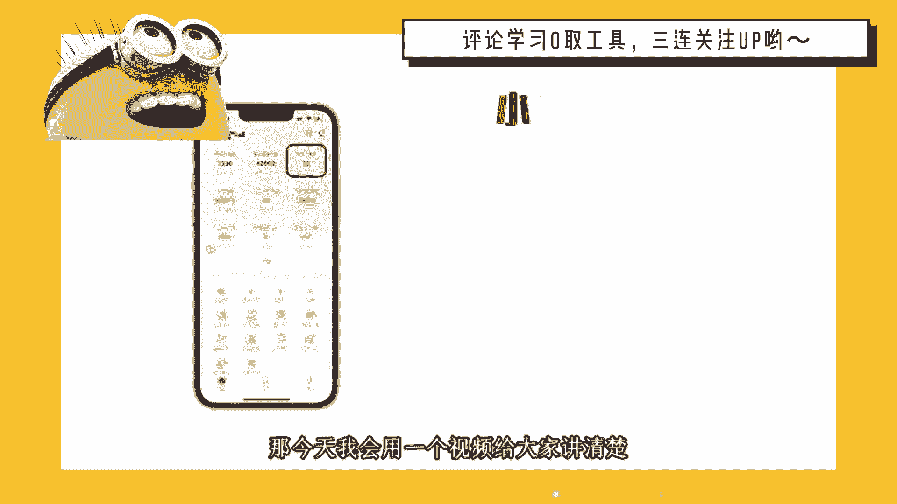

# 120分钟精简版学会小红书运营-原来打造爆款笔记这么简单！！！小白零基础入门必学的小红书笔记公式拆解，最简单的起号教程，快来学！！！ - P3：小红书开店项目 - 锦州山河 - BV1YDtmeHEKE

要说目前什么项目最火，那就必须要提到小红书电商，最近半年时间，几乎整个互联网都在讨论，关于小红书电商的一些话题，甚至我加过的一些付费社群也都在讨论他，所以我在7月份的时候啊。

全程去跟进测试了小红书电商的玩法，到目前为止，数据好的店铺，每天的出单量稳定在50~100单之间，那今天我会用一个视频给大家讲清楚。

小红书电商到底应该怎么去玩，我会把小红书电商整个的操作流程。

包括一些需要注意的关键点，一次性给大家说明白，其中包括如何开店，怎么选品，店铺流量怎么做，看完之后，你就会对小红书电商有了一个大概的认知，那如果你的执行力跟悟性都还不错。

只需要跟着我的视频拆解去实操一下，就足够你去运营好一个小红书店铺了，好进入正题，小红书电商整个项目的操作逻辑其实很简单，无非就是三个方面，开店选品，发笔记，获取流量，我们先说第一个部分，如何开店。

这一步其实非常简单，打开小红书，点击左上角三条杠，找到创作者中心，点击更多服务，然后选择开通店铺，点击立即开店，再按照要求填写相关的资料就可以开通了，关于店铺的选择，在这里给大家细说一下小红书店铺。

它分为个人店和企业店，其中个人店又可以细分为，普通的个人店跟个体工商店，普通个人店只需要身份证，加上1000保证金就可以开通，而个人工商店在普通店的基础上，需要多准备一个营业执照，企业店同样有两种。

一种是普通的企业店，另一种是专卖店或者旗舰店，那开通旗舰店除了提供营业执照之外，还需要额外的缴纳600的年费，其实新手直接申请个人店或者个体工商店，就可以了，根据我这边的操作经验，个人店和企业店。

他的店铺的权重，店铺的流量基本上是没有什么差别的，那么开店的成本有这么几个，第一个就是1000保证金，这个钱当你不做的时候是可以退还的，第二个就是小红书平台的扣点费，官方会收取你店铺营业额5%的扣点。

说实话这个扣点其实还挺高的，第三个啊，你需要准备3000左右的流动资金，因为当你出单之后，你需要去垫资发货的，那我们开通店铺之后，接下来就是第二步，选品，到底应该在小红书上卖什么呢。

大部分人肯定觉得啊自己没有货源啊，没有产品可以拿去售卖，其实某多多，某宝，阿里巴巴都可以设立的货源，关于选品其实也不难，一般来说我们可以根据爆款思维去选品，只需要记住其他平台的爆款产品。

我们拿到小红书平台大概率也会成为爆款，因为这些都是经过市场验证的产品，比起你自己一个人去瞎琢磨，经过市场验证的产品，爆单的几率肯定是大很多的，在这里我推荐两个渠道去进行选品，第一个就是某多多，某多多。

每一个类目都会有一个销量的排行榜单，每天可以来这里逛一逛，找到那些符合小红书审美的产品，然后直接搬运测试，第二个就是去抖音的精选联盟选品，点击这里的爆款版，然后进入联盟榜单。

在这里能完美的了解到哪个品最好卖。

对于新手来说啊，用爆款思维的方式去选品。

反而是一件非常稳妥的选品方式，好我们有了产品之后就到了第三步，这也是小红书电商最重要的一步，如何获取平台的流量，如何让客户购买你的产品，我们始终要明白一个点，就是小红书是一个种草平台。

店铺90%的流量都来自于你的笔记内容，客户之所以购买，就是因为看了你的小红书笔记，他感兴趣之后才会产生成交，所以如果想快速出单，一定是要去研究如何正确的在小红书上发笔记，这才是我们出摊的关键因素。

关于发笔记，首先我们要排除硬广告，小红书的客户群体啊，对于广告是比较反感的，根据我们的经验，目前出单最快的方法就是批量去混剪视频，模仿同行的封面啊，批量去发布笔记，那具体的做法就是去其他平台。

找到那些同行的产品素材，然后利用剪辑软件打乱素材的顺序，替换背景音乐，然后做一些抽帧处理，基本上只要找到一个素材，就可以批量去混剪出几十条小红书笔记，那如何去找爆款素材呢，当你选好产品之后。

我们拿抖音举例，在抖音上扫一扫产品图片，就会出来很多的同款产品的视频素材，所以素材这块我们肯定是不缺的，那当你发布的笔记数量到位之后，基本上一个星期左右就能产生成交，当你把单个账号的sop流程跑通之后。

我们就可以开始做矩阵操作了，可以批量删号，批量发视频来放大我们店铺的流量，以上就是小红书电商运营的基本框架，希望对大家会有一些小小的帮助，最后我也整理了一些关于小红书，电商运营的文档。

我更新到了工具箱里。

