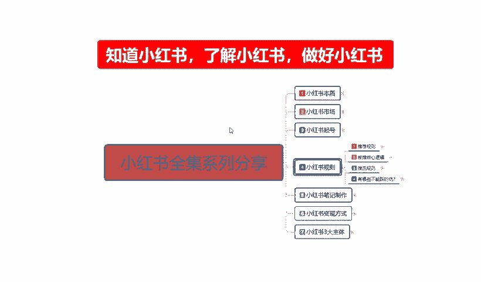
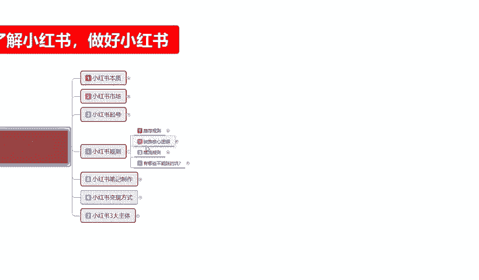
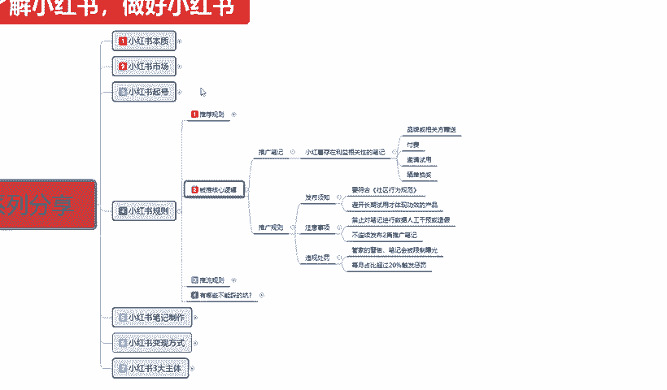
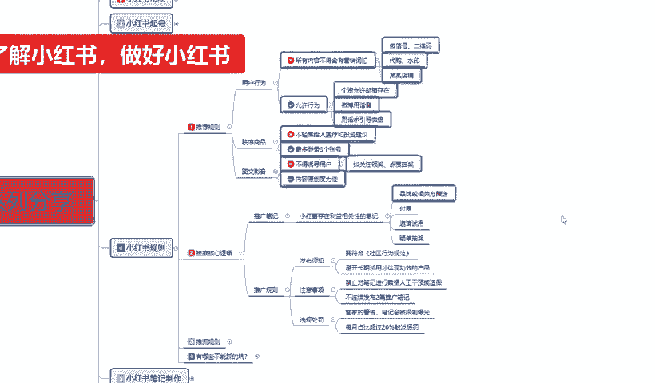
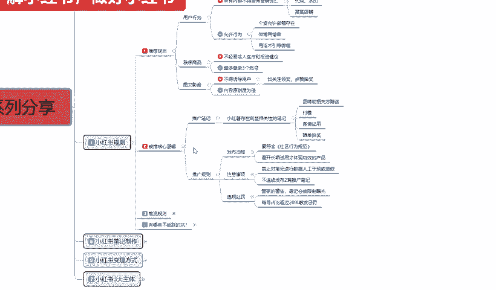
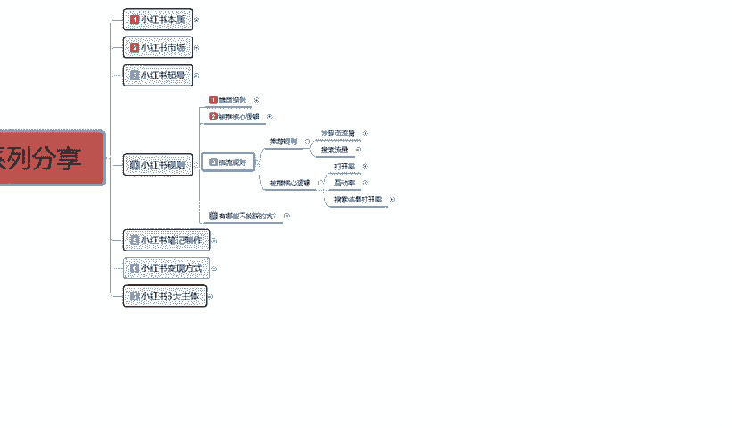

# 140分钟学会小红书运营-原来打造爆款笔记这么简单！！！小白零基础入门必学的小红书笔记公式拆解，最简单的起号教程，快来学！！！ - P10：09、新手小红书运营-小红书规则（2 - 有点像大哥Seven - BV1pY2vYcEf2

大家好，这期期呢给大家分享的是小红书全击系列的第四大课时，小红书的一个规则。第二节。这节课啊给大家讲解一下是什么呢？背推核心逻辑这个背推核心逻辑是什么意思呢？就是小红书整个系统。

给我们啊推广笔记的一个规则。

什么意思呢？就是说我们通过被推广的一个笔记，它会给我们额外的一个权重。

啊，推广规则里面的话，我们首先了解一下啊，推广笔记。与小红书存在利益相关的一个比记。就是说品牌或者相关方的一个赠送，它都是有账号基础权重加成的。比方说我们这个账号。

如果说有品牌方或者说是相关的一个权威性的一个呃第三方介入，你去。就是你有其他第三方的一个认证的话，你在小红书上面的话去做这个呃。品牌认证或者相关方的一个赠送数据认证的话，他会给你额外的一个流量辅助。哦。

我们正常起号的话，基础展现可能在1000到300，但是你有这个认证的话，可能就翻倍了2000到40002000到6000都有可能。啊，就看你这个品牌大不大，相关发证送的一个数据量多不多啊。

小红书认不认可你的一个存在。啊，就是说小红书存在利益相关，就是跟小红书有合作的。你去做它的产品，做它做它的数据，做它推流的话，它都会给你额外的一个流量属性。啊，这个就看我们自己有没有这方面的一个资源。

第二是付费。小红书里面的话，它还有一个付费系统啊，它会把你的你如果说卖卖商品啊，可以去了解一下它里面有一个付费推广。但是这个付费推广的话也加权。但是正常来说的话，我不建议大家去做啊。

因为它的一个付费推广的话，我们在中后期再去拿它去做。可以。前期的话没必要啊浪费资源，而且效果不是太好。因为它整体的话，小红书笔记里面展展示10到15个或者是接近20个才会出现一个呃小红书店铺的一个商品。

你要去弄的话，你就是抢20个里面的这一个的一个付费费用。竞争太大，而且的话流量没有那么多，不是那么好做啊，付费的话加权重是加权重。但是不建议大家前期去做啊。

这个比较适合中后期你店铺碰到瓶颈以后再去通过这种方式去推广，可以。第三个就是机情私用。第四个就是晒单抽奖，这个都是官方的一个活动啊，就是官方的激情你参加什么什么的一个品牌开方的一个活动。

它是对你的账号有一定的信心，对你感所感兴趣的一些一些东西有信心啊，他才会去帮你。做推广，你没有的话，你就只能和其他的账号的话做同样的一个步骤啊，这个就是被推的一个核心逻辑。里面，我们做B级推广也好。

做商品推广或者其他的推广也好啊，它只是有一个额外的加加成。大家可以了解一下啊，就是这四个四个单点啊，这是系统的但是后续还有默认的啊。然后第二个点就是。推广规则嗯，这个怎么给大家说呢？推广规则里面的话。

其实他还是比较容易理解的啊。我在这边呢已经给大家打出来了三个点啊，发布须资注意思想和违规处罚。嗯。发布的话就是说要符合社区的一个行为规则。说实话，这个东西你不是你我们了解这个点啊。

推荐规则里面你把这几个。

点啊不能做的，把它规避掉，你基本上全部都能发布啊。发布以后的话，你按照它的一个行为规则的话，它会有一个自然权重。但是有些如果说你碰到这这个里面的话。他不给你展示的啊，你碰到这个里面的东西的话。

他又不给你展示了，它系统自动就给你检测出来了啊，然后避开长期试用才体现功效的一个产品。

就是比方说我们去卖商品的话，你这个商品的话就说。你不能做虚假宣传，意思就是说你这个产品一个月见效，两个月见效，三个月见效这种功能功效型产品啊。😡，肯定是不行的。你比方说我的之前给大家讲的那个嗯。

随便给大家举个例子，我们做膳食纤维的内容一个星期啊，第一天吃什么，第二天吃什么，第三个天吃什么？这个只是说我们发布笔记，你要去在这个小红书上面通过这种方式去做商品的话，它会被限流的啊。比说长期试用的。

你做是可以做，你要有有固定的粉丝的话，嗯，也能做。但是的话就是说流量的话没有做其他产品的话那么大啊，这是做商品的。但是你做笔记啊，做那个推广，你把人群定位以后做的话，再去操作这个的话。

其实是没多大的问题。第二个就是注意思想。什么叫注意思想呢？就是说禁止对笔记进行数据人工关预干预或者造假。你比方说嗯。罚单。不单。😊，啊，类似这种，你比方说嗯。我今天那个。粉丝数量不够啊。

我去找人找找些人，他们有那种没粉丝的，给我不点粉丝啊啊，不点关注啊。我这个笔记展示量够了，但是点击率不够啊，对吧？我去找人把我这个笔记推广一下，让他们搜索一下，帮我点一下笔。

这种人工干预造假很容易被抓的。因为小红书的话，说实话他给你的一个展示权重已经非常高了。他就是内容为王，啊，他跟狗抖音不一样，抖音的话就是前两前两秒的一个展示。你前两秒能把用户留住。

别人才会干观看你的一个展示内容，但是小红书不一样，小红书的话，它内容为王，就说你前面做的稍微差一点，关系都不是太大。啊，但是内容一差，你就直接整体就废了啊。

所以说我们在这个发布笔记进行数据人工干预的时候，你把前期的基础数据做好，你后续就是把自己的一个笔记做好就行了。你没有必要去做人为干预的啊。因为人为干预的话，说实话权重也不是特别高啊，有权重。

但是你整体操作下来的话也。除非说是你不知道下步怎么做了，然后的话有或者是自己有一个什么样的一个计划啊，这种计划的话，你自己需要需要自己有思路，有方式啊，了解整个小红书的一个系统。

你然后把计划做出来以后的话，通过它的规则了解规则，然后加大杠杆的一个原理，他才会给你翻倍的一个数据。如果说没有的话，你普遍的就是说你没有这种计划去操作人工干预的话，说实话没有效果的，知道吧？没有效果。

不说没用是效果不大，没有太大的一个效果，你就没必要去做了，知道吧？你像那个笔记的一个数据数据进行干扰的话，你没有计划，没有方式或者说你不了解它整体的规则的话，你这么做了，你还被封号，没有必要啊。

就是说注意事项里面一定要把这个人为造假方面的话，自己啊掂量掂量再去做，好吧。第三嗯第二个点就是说不要连续发布两篇推广笔记。什么意思呢？就是说我们。小红说笔记啊，你一个账号，每天我给大家建议。

就是说发两篇。啊，你如果说有商品的话，发两篇就可以。没有商品，最多也就发5篇啊。超过5篇以后的话，你每天发那么多笔记。继做引流做推广，说实话没什么太大作用。有两篇精品的一个笔记内容就已经非常不错了。

你发多了以后的话，反而没有权重，尤其是超过5篇。两篇以后，两第一篇第二篇的权重最高。第三45篇的话有一定的权重。第五篇以后包括你第一第二篇都没权中了啊。而且这个是单品推广，还不算店铺。

店铺的话是就是整个账号的话，最多每天发5个。嗯单品的话，每天最多只能发两个啊。后续我会再给大家讲解一下，这现在还不涉及到这个。这个点但是我也给大家把它列到注意思项里面，需要大家注意一下啊。

就说我们前期创建账号的时候，你不要每天盲目的发那么多数据，发布那么多笔记，没什么没什么鸟用啊。发个一篇两天一天一天或者两天发个一篇两天就够了啊，发那么多没什么了。然后就是违规处罚管家的警况。就是小红书。

他有一个管家，你包括你抖音啊，你你直不过啊他都有一个那个管家啊，他都是一样的，有有是机器人，有是那个真人啊，都有机器人的话，他就按规则般是真人的话，还嗯酌情心情不好，随便给你来一下。

心情好的时候那就无所谓了，对吧？笔记归他这这个管家，如果说来警告你的话，你的笔记就会被限制曝光。本来之前给你退2000的，现在给你退200，可能200都不到啊。然后每月占比超过20%出发，什么意思呢？

就是说嗯我们数据异常超过上下浮动波动超过20%，除非你是正常的一个笔记爆款。啊，你比方之前有2万粉，下一个月的话，你做到了2400025000、26000，或者说是这个粉丝涨幅的话不会。太大。

区别内容不是太大的话，每个月不要超过20%，就是不会触罚惩罚。超过20%以后的话，它系统就会对你进行检测。检测如果说你是作假，他就会以惩罚措施就过来就是。你每一组数据你做出去以后。

你的惩罚幅度在20%以下，系统就直接把你默认就不管你了啊。你本来比方说有100万，你下个月涨到150万了，他就有人过来监测你的数据是不是真是的。如果说你是100万涨到了120万以内，系统管都不管方问题。

那直接跳过这个是正常的下一家。啊，类似这种它的一个。嗯，惩戒措施的话就是说。还是有很多漏洞让我们去做的，好吧。这个呢就是被推的一个核心逻辑，我们需要注意的一些。重点啊。

我在这里呢只能说是我们需要注意的一些重点。大家了解一下就行，好吧。呃，下一节课呢给大家讲解一下它整个小红书规则里面一个推流的一个。规则。

推流规则的话和上面两个这个推荐规则和核心逻辑它是不一样的啊。推流的话就是。了解我们整个流量的一个来源，它是通过什么方式给我们的一个流量啊，给我们的一个展现和曝光。好吧，那这节课呢就到这里。

