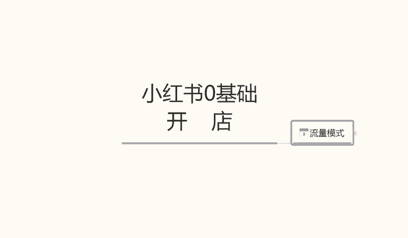
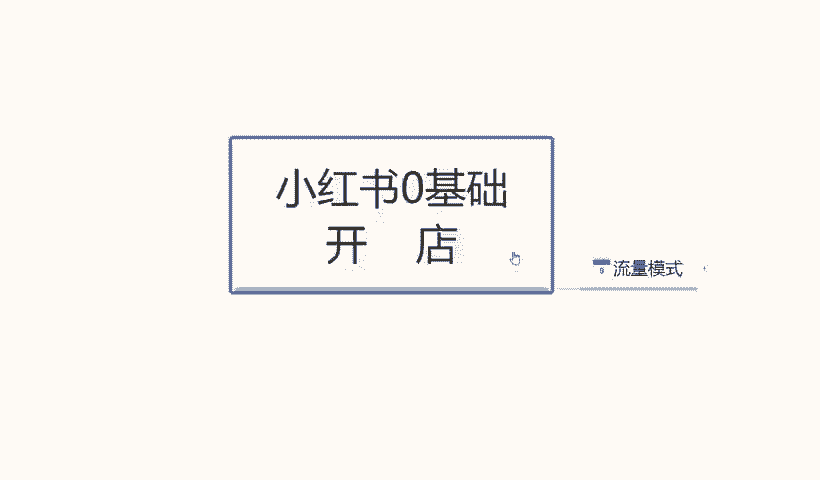
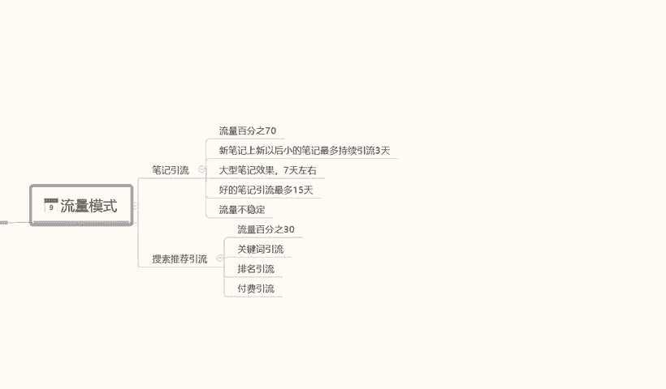
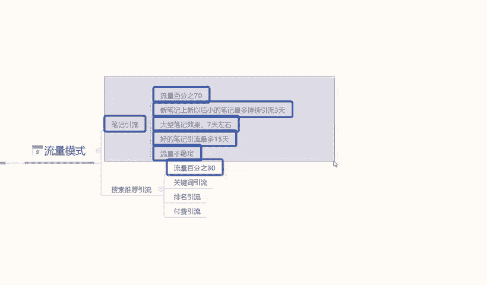
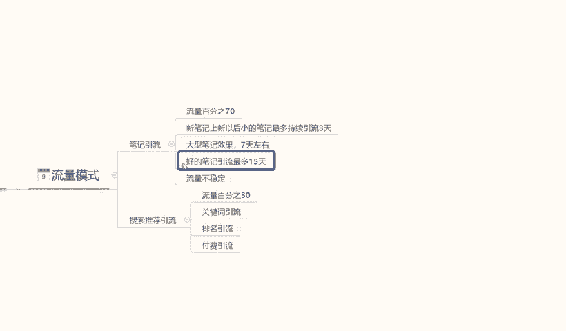
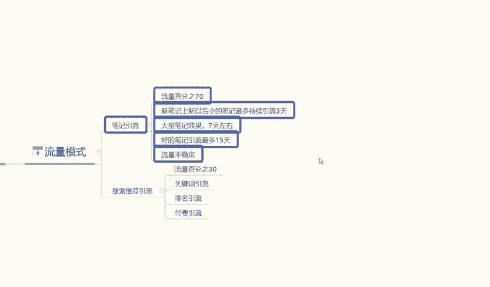
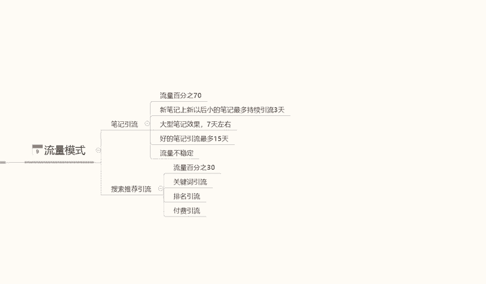

# 140分钟学会小红书运营-原来打造爆款笔记这么简单！！！小白零基础入门必学的小红书笔记公式拆解，最简单的起号教程，快来学！！！ - P10：8.小红书店铺流量打造 - 红书教程1 - BV1o629YMEjv

大家好，今天给大家分享一个小红书，您记住开店第九课时啊流量模式。这节课主要的内容呢是给大家讲解一下我们整个小红书运营体系里面，它的一个流量模式啊，是通过什么方式来给我们店铺带来访客和收益的？

首先呢我们了解一下流览模式，它分为两种。

第一个是笔记引流，第二个是搜索推荐引流。这里的话，我虽然说我每节课里面答的内容不多，但是我讲的内容的话，大家仔细听的话，其实。还是有很多内容在里面需要我们大家自己去仔细思考的啊。

今天这节课的话给大家讲解的是笔记引流和搜索引流推荐。首先我们了解一下啊，小红书的一个笔记引流。整个小红书系统它的一个流量模式的话，它是我们流量按分比来计算来啊，就是100%，那笔记引流的话。

它的整个流量占比是达到了70%。而搜索引流推荐的一个流量的话只有30%，它是整个商品系统的一个稳理流量啊。那这里呢大家一定要注意了啊，这70%的占比和30%的占比。大家不要觉得啊我操作店铺的话。

我去做了70%就可以了，30%无所谓，其实是错误的啊，不要看这个笔记引流占70%，搜索引流只占30%。但是我们如果说能把真的把控在30%的流量其实比这70%的流量效果更好。因为笔记引流70%的流量的话。

它的转化率没有那么高。

它的整体转化率的话可能。没有搜索引流转化率的。可能会要低到3倍左右。笔记引流的一个转化率的话，它的访客量是大，但是它转化率低。搜索引流的话。它的一个流量低，但是它的一个转化率非常高。

因为它的目标是明确的。我们比记引流的话，只是说是给我们店铺增加了一个人气权重，店铺今天进了多少访客啊，对吧？有多少人能看到我家产品感觉不错啊，偶尔有那么一两单成交。但是搜索引流的话。

它可能进来100个访客里面可能就会成交7到8单。如果说我们的商品好的话，可能成交的单数会更多。所以大家不要不要小求搜索引流，它只有30%的一个流量啊，上面只是说让我。我们用户更好的了解我们的商品啊。

我们自己进行的一个推荐。下面的话是商用户主动搜索我们产品获得的一个30%的流量。这个就是两种流量比引流和搜索推荐引流它的一个关键之素。啊，一个是主动搜索，一个是被动搜索。所以说两个流量都很重要。

第一个比率流量它的。流动性人口非常大，用户多，但是搜索引流的话，排名如果说坐上去了。整体店铺数据做上去了以后，搜索引流的一个转化率是非常高的。啊，就看我们自己选择一个侧重点，前期先做哪个。啊。

后续再去优化另外一个，这两个都是必须要做的啊，缺一不可。啊，少一个我们店铺的一个数据都不好做。所以大家一定要注意这个点。那首先讲解一下这个笔记引流70%的一个流量啊，新笔记刷新。

我们就是说产品发布笔记基本上都是一天发两个或者一天发一个或者是三天发一个。看我们自己的时间规划。做单店的话，其实说实话一天发两个流量左右。也就是一天发两个比例左右，对我们前期店铺的一个引流的话会好一点。

中后期的话，一天发一个，或者是两天到3天发一个都可以。但是这个时间段的话，前期不用固定，后期是一定要固定的。也就是说你我们最早更新的话，一天一根是最好的。或者是如果说我们时间不充裕啊。

三天一根或者两天一根没有找到新的搜索。但是这个模式的话，一定要固定下来啊。后中后期一定要固定下，前期的话没有那么太重要，一天发两个都可以。啊，但是每天小红书单品笔记。整个店铺单品笔记只能发两个。再多。

整体权重下降。啊，笔这是笔记引流里面最最重要的一点，大家一定要注意了，每天单品笔记每天最多发两个单品啊，其他副产品其实是不用发的，就是主产品每天发两个左右就够了。再多的话没用。

大概持续个10天到15天左右，基本上效果就出来了。啊，然后这里面的话笔记内容它也是有区分的。这点话给大家大概讲解一下啊，我们笔记上新以后，小的笔记。也就是说我们这个这个笔记如果说没有报。

最多持续引流3天，3天以后的话，他不会给我们店铺带来。基本上每天也带来1到2个，但是3天以前的话，每天给我们带来流量访客的话，就是这个。小红书里面上面的小眼睛，别人看我们的产品大概是在50左。

就是看我们这个笔记啊，不是看产品啊，看产品的又是另外一个分组了啊，那是不一样的。看我们这个单品的一个小笔记的话，每天大概在50个往上走。持续3天，这是小型笔记。大型笔记效果好的话，效果会持续7天左右。

引流的话大概会在200到300。效果不错的话，就是每天也流大概在200到300。最好的一个引流数据就是我们这个小红书，如果说我把这个数据发上去，这个小红书笔记爆了。它的引流持续时间也只有15天。

就是这个一个单独的笔记，在小红书上面，它最多给我们15天的一个推荐流量。15天以后的话，就是基本上自然搜搜索刷的话是刷不出来了以后。啊，你基本上就查不出来了。这是最好的那种小红书笔记非常棒的。

上万上上万的那种一个访客量，它最多效果也就持续四五天。中情的话大概在3000到5000左右的话，他也就持续7天左右。啊，小型笔记就3天，就是接个笔记效果不怎么样，发出去，它使续效果就3天。

也就是我们这70%的流量，根据我们笔记效果不同的话，它分为3天、7天、四五天，就是我们笔记做的再好，他最多给我们引留四5天，四5天以后的话，你如果说没有第二款，第三款、第四款。持续的一个笔记更新啊。

来更新我们更多的流量化。那么我们的数据它也不好做。所说大家一定要注意这个点啊。任何小红书里面的笔记流，我们不管做的再好，它最多给我们流量的话是15天。这里面它有一个特别不稳定的因素，它流量不稳定。

因为我无法判断我们小红书发出去的这个笔记到底给我可以给我们引流多少。啊，进入我们店铺的访客又有多少啊？观看的人数是多，但是进入店铺的访客的人数的话，他就不会那么多了。所以说它流量不稳定。

大家一定要注意了啊，流量如果说波动太大的话，不能持续进行效果。对我们店铺前边前面来说的话。就说给我们店铺的访客，但是没有太大的一个成交转化的话，我们这个笔记效果它也不会持续进行推广的。正常来说的话。

大型笔记的一个效果的话，它就是7天左右。能把B级做到1五天引流的这种产品很小很少，不是没有啊，很少。所大家一定要注意了啊，整个体系的笔记引流，它最多保证15天，也就是一个好的笔记。

最多保证15天的一个引流数去。

但是它的流量占比70%，流量流量性是非常大的。

啊，这个就是笔记引用。下面呢给大家讲解一下搜索引流。搜索引流的话，它这个里面涉及到的内容就比笔记引流多得多了。因为大家但是大家不要看这30%的流量啊。

这30%的流量可能比70%笔记引流的流量进入的店铺的访客还要多得多。啊，上面只是流量大。呃，但是下面是转化稿。而且数于稳定。它对比比记引流的话，它的流量是稳定的，而且效果的话也比比引流要好。

只是说他没有那么多用户去搜索而已。好吧，就看我们怎么操作这个推荐的一个就是搜索推荐的一个引流，就是通过关键词搜索产品推荐的这个引流。它这个里面的话主要是一个关键词引流，一个排名引流，一个付费引流。

关键词引流就是我们店铺之前啊上节课给大家讲解的时候，它这个产品详情里面的一个主观主题啊，就是产品的一个主标题，通过那60个字符。搜索产品如果说搜出来以后。

我我们这个产品字符里面每一个字它们都是有一个排名的。啊，两个字一组合。三个字四个字五个字，它是一个长尾长尾词。又是一个组合，它每个组合词它都是有一个额外的单独排名。这个就是关键词引流的一个排名，然后是。

付费引流付费引流的话，建议啊，我在这里提醒大家，付费引流，我们新店前期千万不要去做付费引流它可以给我们引流，引来很多的流量。而且这个付费引流的话，它的一个收费系统对比其他平台来说的话不会高速太多。

但是它的效果不好。除非我们把这个店做到中期，中后期以后，店铺做起来了，每天大概得能成交个几十单上百单。碰到瓶颈了，没办法增加了，再去做这个付费引流效果会很好。但是我们前期的话去做这个付费引流可以做。

但是你要有店铺基础，没有店铺基础的话。尽量不要去做，因为把付费引流一停，你的整个店铺的话数据会都蓝年下降。你再去想把店铺做起来，然后再去做付费引流的话，难度会提升很多啊，不是不让大家做。

是说尽量不要去做。就算我们资金在充裕的话，我们其实可以选择其他的方式去投入。但是付费引流邮的话，建议前期的新店小店不要去做啊。就说一步步子快太大了以后，你收不回来，卡上刀卡卡着了是吧，会很难受的。

这个就是推搜索推荐引流。呃，这节课呢就到这里啊，今天呢主要说是给大家讲解一下我们整个的一个小红书流量模式，它的一个运营方式啊和我们需要注重的一个重点。往哪个方面去投入精力？好吧。

那么下一节课给大家讲解一下。我们小红书数据分析。啊，数据分析的话，这里面我就不讲笔记引流的一个数据分析了。因为笔记引流数据分析的话，这个是看我们笔记的一个效果的啊。

下节课主要给大家讲解一下我们那个搜索引流的一个数据。

分析。