# 140分钟学会小红书运营-原来打造爆款笔记这么简单！！！小白零基础入门必学的小红书笔记公式拆解，最简单的起号教程，快来学！！！ - P11：12、新手小红书运营-小红书规则（5） - 村驴驴 - BV11V4ceTEvH

大家好，这节课给大家分享的是小红书全集系列的，第四大节啊，最后一节课，第五课时，小红书规则。

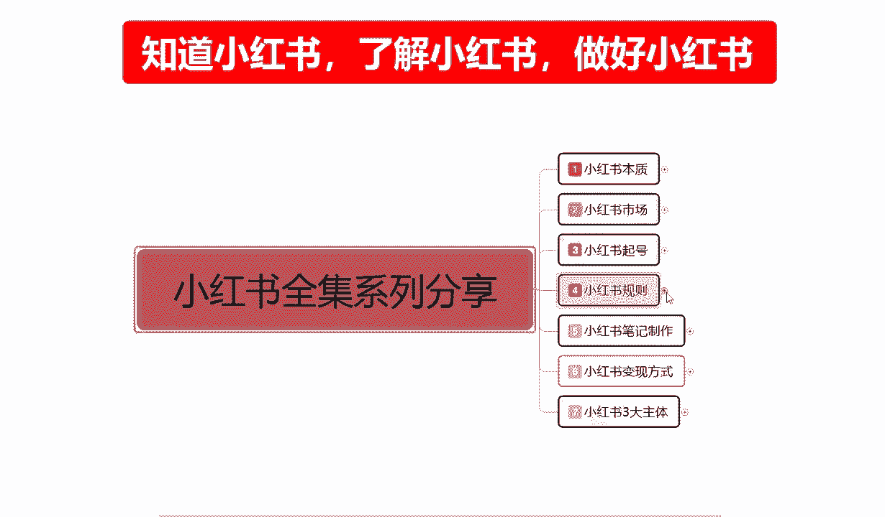

接着我们上节课的一个内容。

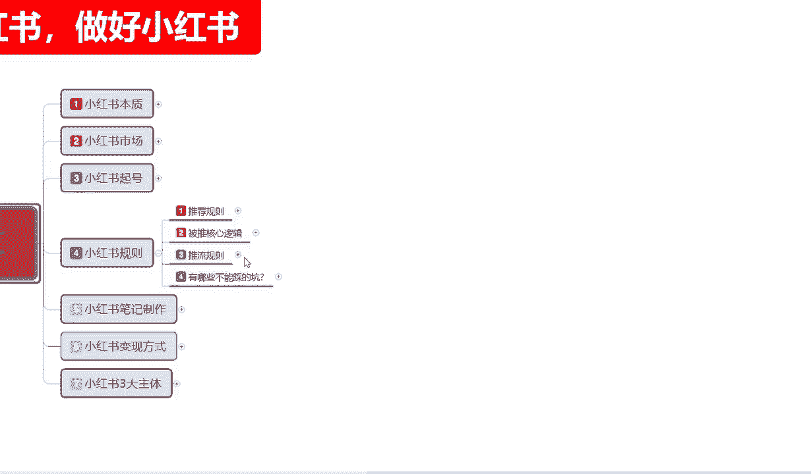

上节课的话主要是给大家讲解了一下，我们推荐的一个整体规则啊，平台是通过什么样的方式啊，进行的一个整体推流啊，包括我们的一个发现页流量和一个搜索页流量。

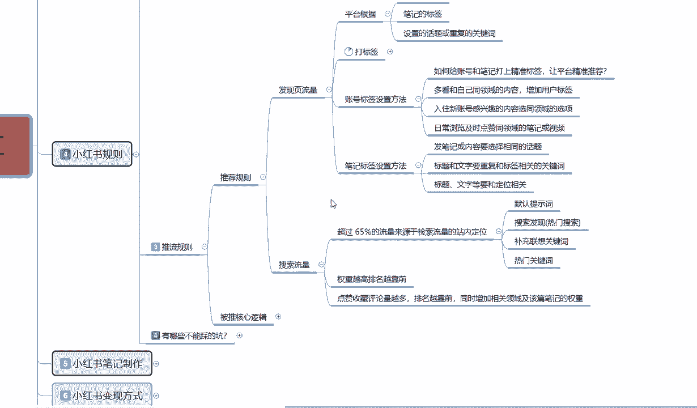

两个区分，这节课呢主要给大家讲解一下啊，被推的一个核心逻辑，和我们需要有哪些地方不能踩的啊，尽量去避免的一个内容点。

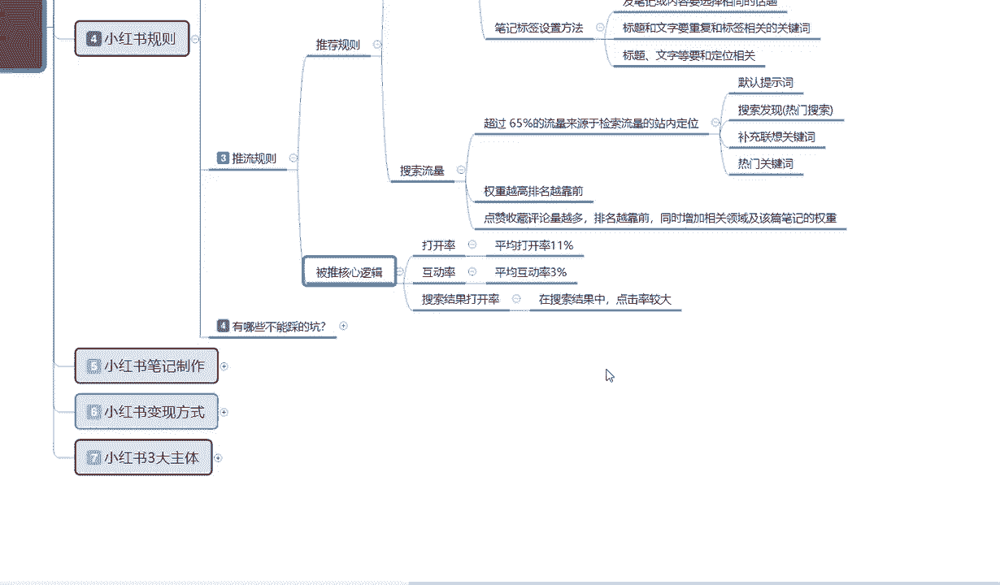

被推的一个核心逻辑是什么意思呢，就是说我们笔记发送出去以后，通过什么样的方式，比方说我这一篇我账号是星星号，我正常发数据的话，大概有1000个展示流量，或者说是50到200个小眼睛的一个点击率。

那他通过什么样的一个方式，可以把它跨越到200到500的一个啊小眼睛，或者说是有3000展示或者是更高的一个层级，就是跨越层级，它是通过什么样的一个方式来进行一个升级的。

因为我们了解这个升级过程以后的话，我们才知道我们的流量，节流到底是出现了什么问题啊，说我的笔记做的不行，数据做的不行，定位做的不行，还有什么啊，就是说他的一个整体核心的一个逻辑，首先第一个点是打开率。

打开率是什么呢，小红书我们在打开的时候，大家可以做一个示范啊，你们打开手机以后，把小红书点进去以后，它上面第一个页面展示的是四个小红书笔记啊，当然了，你如果说点进去的话。

它有一个主动推广的那个小红书页面，那个基本上有人看内容吸引内容做得好，有人看，但是那个不是我们主要做的啊，那个是付费的啊，我们现在的话还涉及不到做做那一块的，一个高高层级的一个流量推广啊，没有必要。

所以说我们第一要义就是说打开以后，小红书展示的也是推荐的一个流量，那推荐的一个流量来源，我们笔记发放出去以后的话，他会在里面展示一个页面，大概是4~6个产品啊，看我们手机的一个大小。

手机小的话就是四个手机，大一点的话可能会达到六个，看我们把页面放大或者缩小啊，看你们有没有这个操作，有些人习惯的话可能看小一点的图片，可能会展示六个，正常的话他说是四个产品一展示，不能说是产品。

应该说是四个笔记一展示啊，然后这四个笔记我们往下面拉的话，他会选择性出现20条笔记，然后进行一次的刷新，也就是说我们在这20个笔记里面进行展示，以后，有人点进来，给了你1000个展示。

比方说技术展示是1000点，那我们平均打开率的话要超过11%，你才能进入下一个层级，他才会给你2000到5000的一个啊展示量，如果说你连11%都没有，那他就一波推流就给你2000的一个单词。

所以说第一个第一要点打开率是11%，在20个同类型的笔记里面啊，你的笔记最少就是给了你1000个，你最少要有一一百一十个小印记，给了你2000个，那你最少要220个小小眼睛，以此类推啊。

他才会跳到下一级给你翻倍的一个展示数据，如果说你连平均11%的打开率你都没有，那你就是一千一千就是1000，2000就是2000啊，这个基础的一个展示量的话，它是根据你账号来的啊，你账号权重越高。

基础展示率也就越高，但是你的笔记发布推广出去以后，如果说你的平均点击率就是小，眼睛不到11%，那不好意思，你这个笔记内容不行，对别人的一个吸引不行，你的笔记图片不行啊，他就不会继续给你推流了。

就是一波的事情三天就结束了好吧，第二个是互动率，平均互动率3%是什么意思呢，如果说有人在你的笔记里面进行留言，我已经通过了第一阶段的，11%的一个概率，他给我进行了第二次这个推流。

那你的互动率低于3%是什么意思呢，就是我们进来以后，比方说我们1000进来了110个人，110个人里面，如果说连四个评论的都没有啊，就是连四个评论的都没有，那你的互动率就不到位，超过四个数据越高。

他给你推流的数据也就越多，通过这种方式去定位它，所以说我们大家一定要了解啊，先是打开率，然后是互动率啊，超过3%以后，你我们已经升了一级了，你下一级升的话就要靠互动率去升了。

就是两千一千升到2000到5000，下一级就从2000到5000里面升到1万到2万，应该说是5000到2万这个范围以内，给你的一个展示量，如果说你的平均互动率再次超过了3%。

它会根据你的内容选项再次进行申请啊，就是2万到10万的一个小眼睛，应该说是2万到10万的一个展示，你能获得多少小眼睛啊，就看我们整体的一个图片做的什么呀，标题有没有吸引力，内容做的优不优秀啊，靠这些的。

但是他的一个推流推流程序的话，就是这个样子的啊，先点击后互动升两级，你想升升第三级基本上不可能啊，因为你的技术权重不够，你如果说新号的话，你最多升到第三级，如果说你是老号，你起步就是第三级。

你就可以升到第四级，第五级你是第五集的话，那不好意思，你已经到顶了啊，六级七级八级那个流流量互动的话，那是大A的网络博主去做的，我们正常的话基本上到第四集，第五集就已经不错了啊，超过第五集开始，第六集。

第七集，第八集都是那个是要花钱的，而且是要花很多的钱好吧，不过那个时候你有那么多的一个数据量，也就不会在乎这一点钱了啊，但是你的内容要好，你内容不好的话，那个钱也是白花。

最后的话就是说他的整个搜索结果是打开率，然后在搜索结果中点击率较大，打开以后点击了进行你的一个收藏评论，关注啊之类的啊，这些数据如果说他还有一个整体核心。

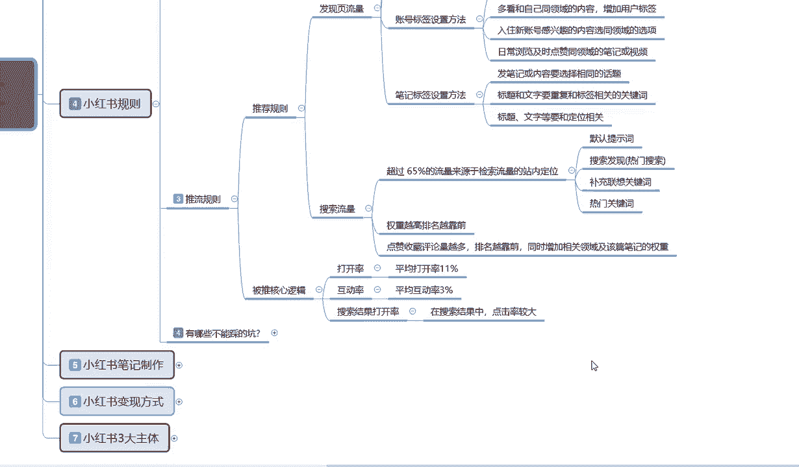

整体核心的话，就是我之前给大家介绍的这个，嗯给账号打上精准标签。

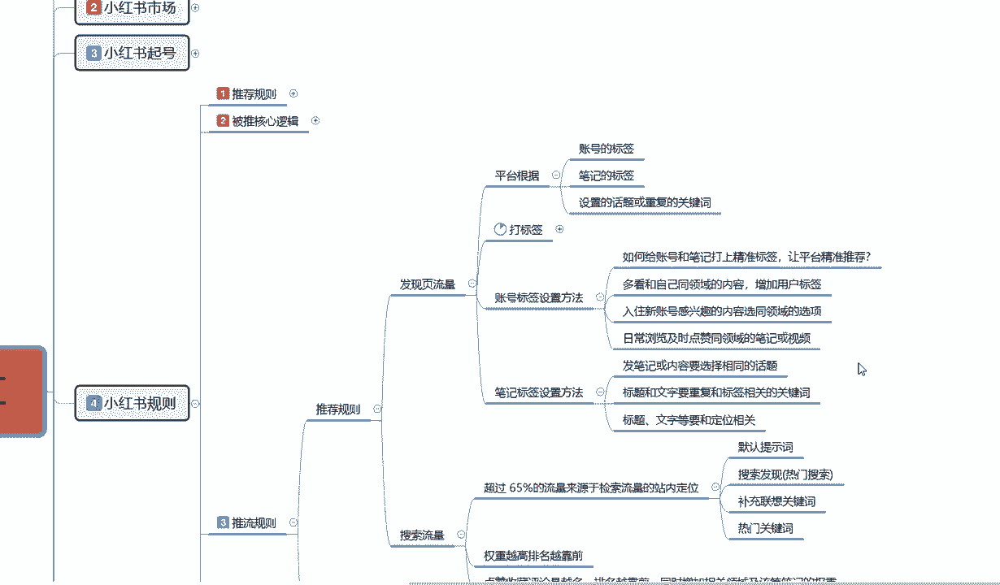

不是看一下啊，脑子有点过载了啊。

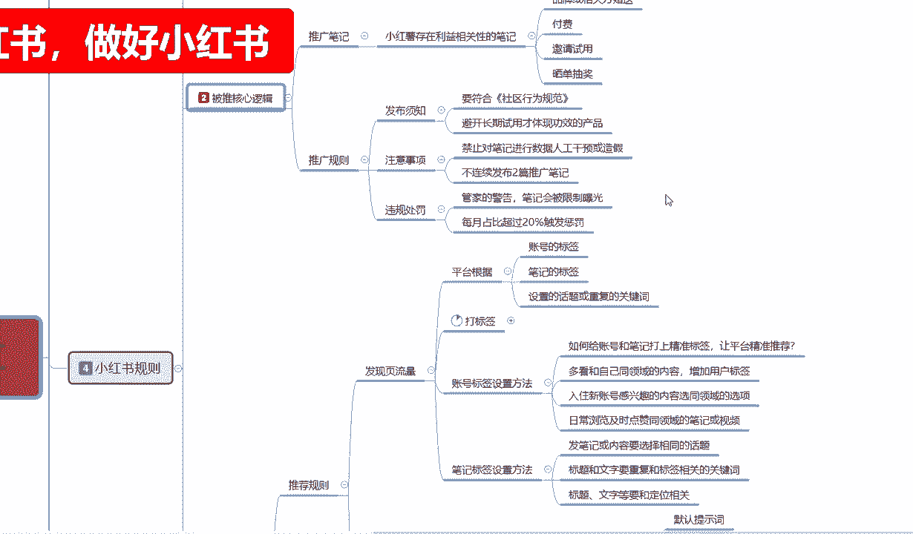

是这个，点赞关注收藏互动，分享这四个点它都是有评分的。

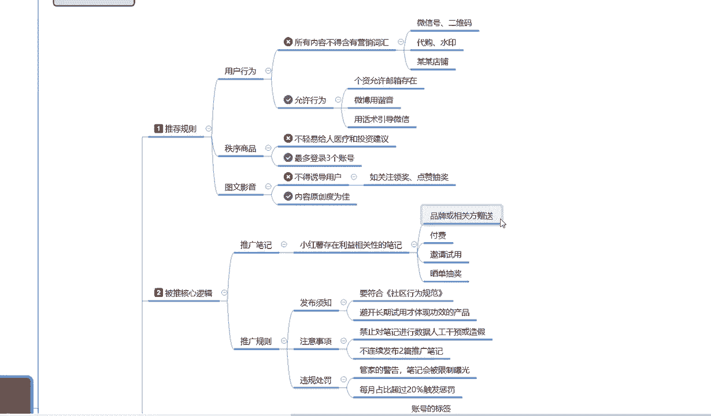

所以说我们需要把评分做好，你当然啦这是基础属性啊，你评分如果说做不起来的话还好，但是你基础属性达不不达标的话，那你评分给你再多都没用啊，你最起码要先把基础属性给达标啊，11%的平均打开率啊。

3%的以上的互动率啊，你才会有这个分享点赞关注啊，才会有这种权重，你要这个都不达标的话，那些权重给你了也和没给没区别好吧，所以大家一定要把这个被推的核心逻辑，先了解清楚啊。

这个就是整个小红书它的一个推流规则。

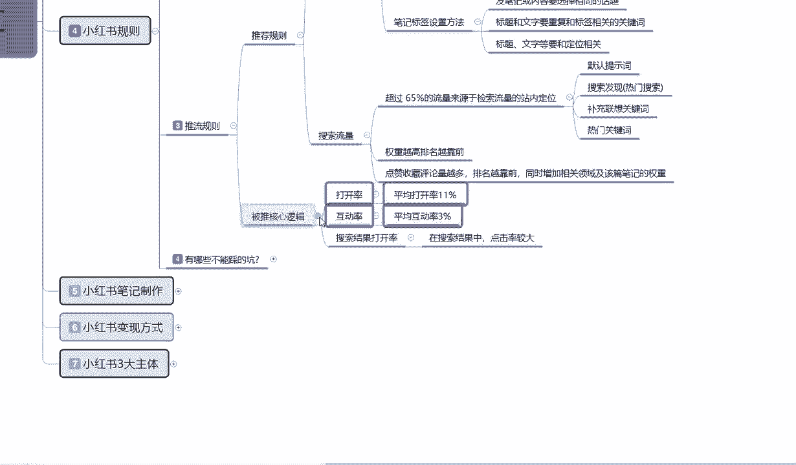

啊最后一点内容给大家讲解一下啊，小红书有哪些坑不能踩，就说我们在了解小红书规则的时候，你要避免我们自己所犯的一个错误啊。

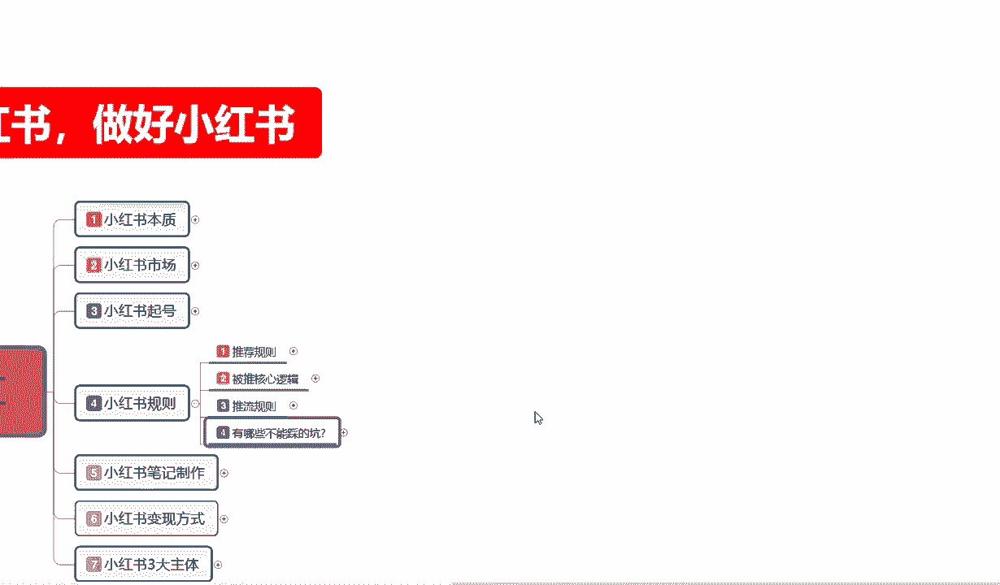

这里呢我也给大家把它给列出来了，大家可以看一下啊，嗯首先第一个点就是新号呢，他不要立刻发布笔记啊，我不知道大家之前有没有仔细听过，说新号需要养号的，你号不养的话，你今天建号，早上建号。

下午发顶多给你200个小眼睛的一个点击量，就是你已经把第一波的平台，就是小红书平台给你的权重用掉了，你后续再发的话就是五十五十八十七十八十，偶尔出个一百一百多的一个小眼睛点击率，那你这账号就已经半废了。

你得重新去打标签或者重新去做了啊，没有必要，所以说我们新号的话，不要立刻的去发放笔记，第二个就是说违规会降权，笔记推荐和排名的话，他都是会受影响的，我们尽量的话就是把那个发送笔记的时候啊。

之前给大家那个推荐的一个规则给大家说过，小红书整体规则里面的话，就是说尽量的话不要去怎么说呢，不要去违规，因为违规一次你降90%的流量七天，那你这个号，你后续你年断更七天的一个笔记的话。

你后续想把它做起来的话，难度最少提升十六十%以上，就比本来以前做的话吧，百分之百的概率还能往上面提两级，你这一被降权，你就只有40%的概率把他提两级啊，所以说尽量的话就不要违规，然后就是确定标签后。

就是我们整体的一个标签，店铺标签也好，人群标签也好，账号标签也好，不要去反复修改啊，有一定流量呢，再修改的话就说它就容易限流，就是我有我这个账号已经有流量了，但是我觉得我的人群不准，我想把它改一下。

改了以后你就相当于自己给自己做了个速速啊，把自己一半给砍掉，左右两只手本来挺好的，你非得觉得另外一只手不好用，把他给一刀给咔切了，虽然说是缠臂的一双手啊，但是你也没必要给他切了，那就更惨了。

所以说确定标签以后的话，不要进行反复的一个修改，然后就是不要一个手机登录多个账号，这个给大家也说过，一级一级一卡一账号，保证这个节奏就行，你要操作的话不行，电脑最多也就登三个号。

然后谨慎发布推广引流的一个内容，谨慎处理，留言私信，这个呢我就不给大家111念啊，就是我打的这些内容，大家了解一下啊，自己截个图，自己心里面有个底，有些东西也能做，有些东西不能做啊，好吧，那这节课呢啊。

小红书第四大节的一个课程给大家讲解完了啊，当然了，这说实话，前面几节课都只是说让我们了解整个小红书，我们后续怎么去操作，后面三个点啊，才是我们正式步入做小红书的一个节奏点。

我们只有了解了我们前面几个点才能去做。

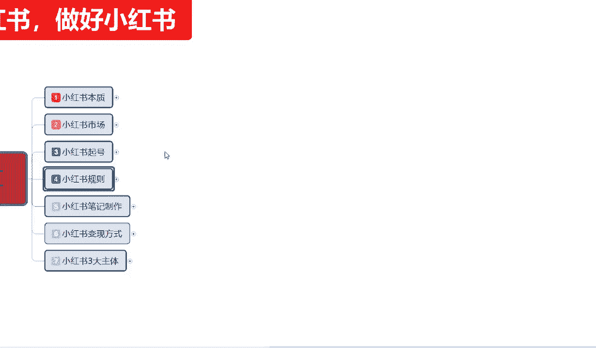

后面这几个点好吧，那么这节课呢就到这里。

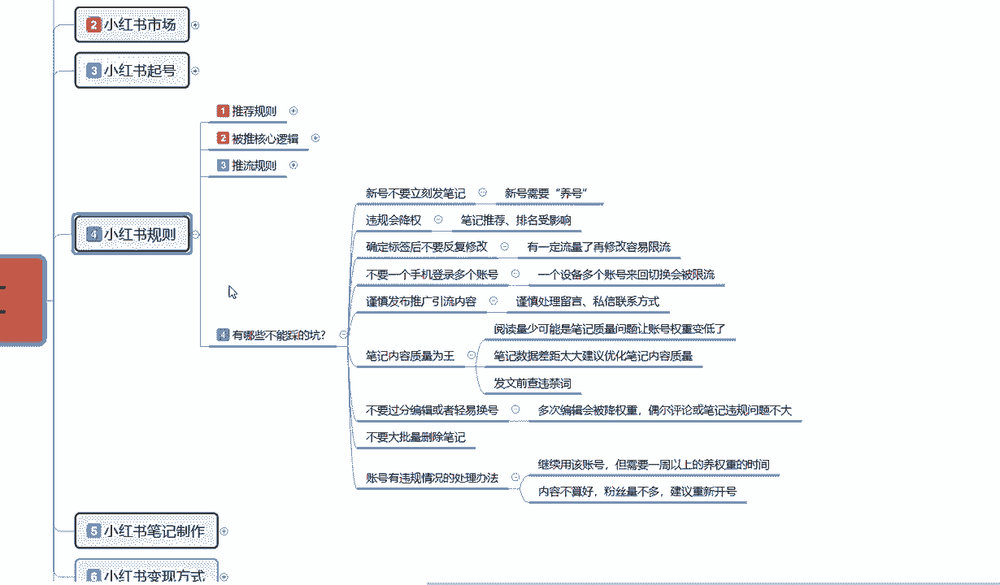

下一节课呢给大家讲解一下小红书，我们整体的一个笔记到底应该怎么去做。

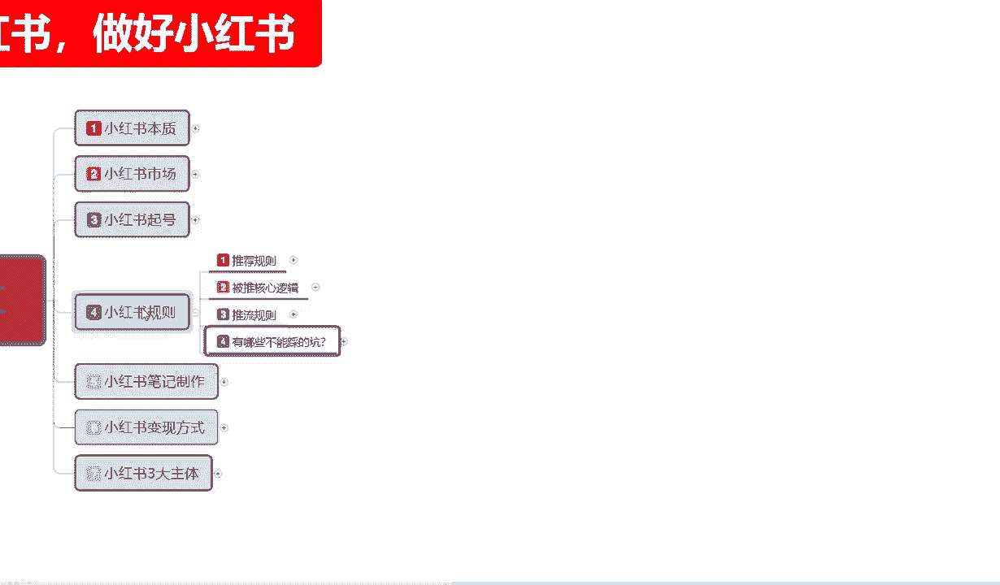

而而且这个内容的话是比较多的啊，它比前面的小红书规则，旗号市场这些加起来可能都还要多，先了解小红书笔记怎么做，然后我们再了解小红书通过什么方式去变现，最后小红书三大主体我们到底要做什么。

给自己定个明确的目标，同时从三大主体里面的话，我们可以了解我小红书做店怎么做啊，小红书引流怎么做，小红书我想做博主怎么做好吧，那这一期课的课程呢就到这里，下一节呢给大家讲解小红书系列的第五大课时。

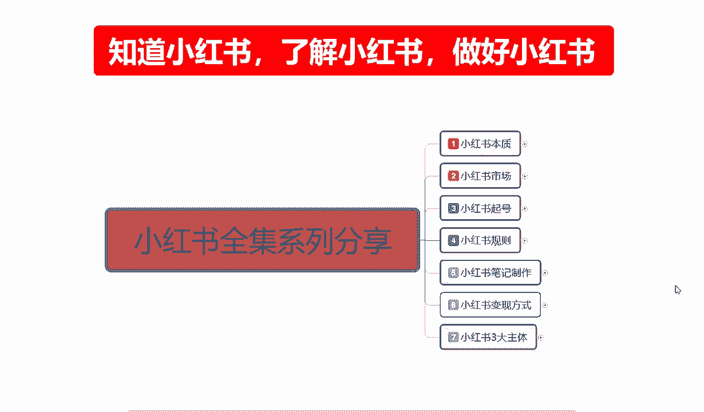