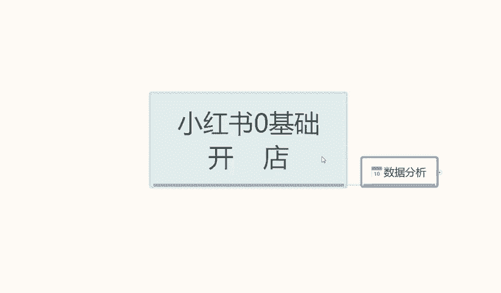
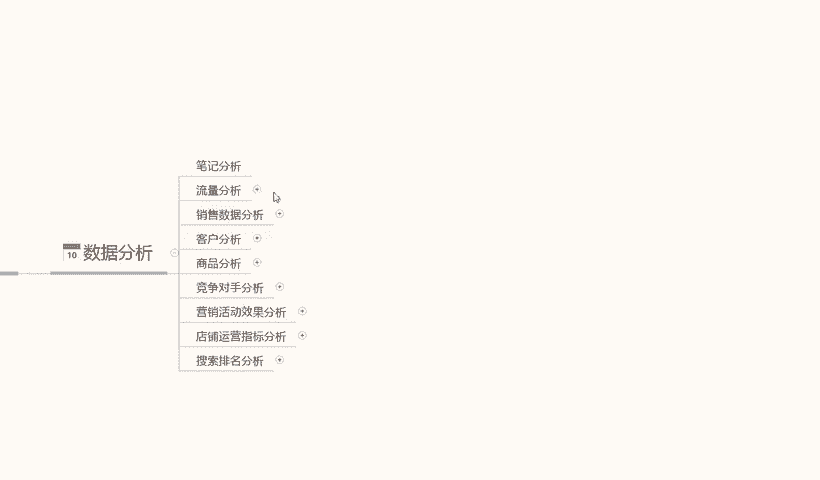
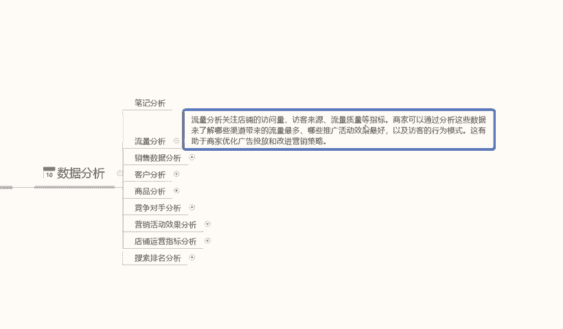
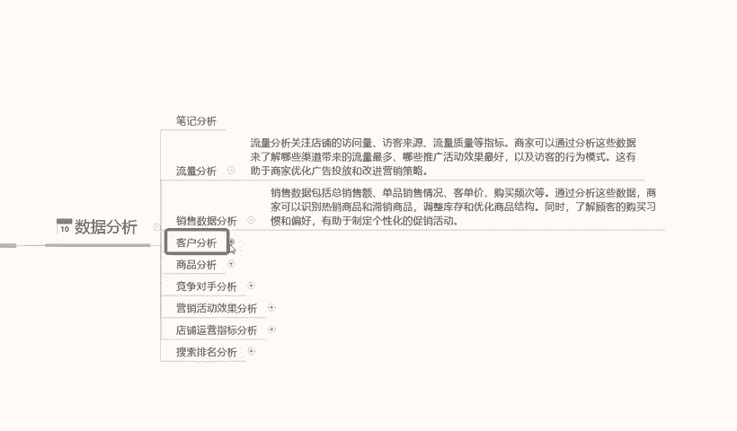
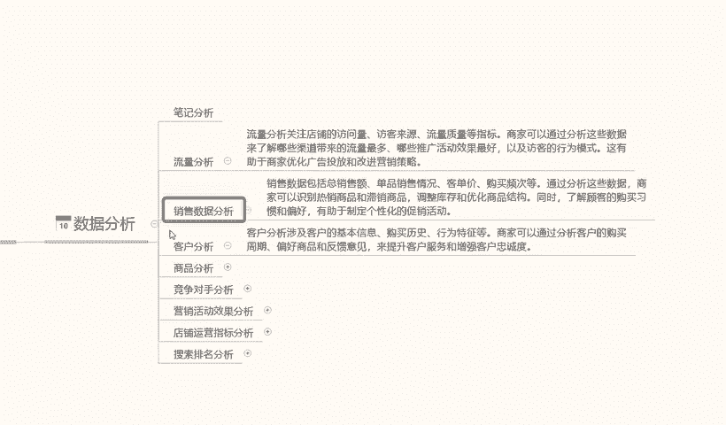
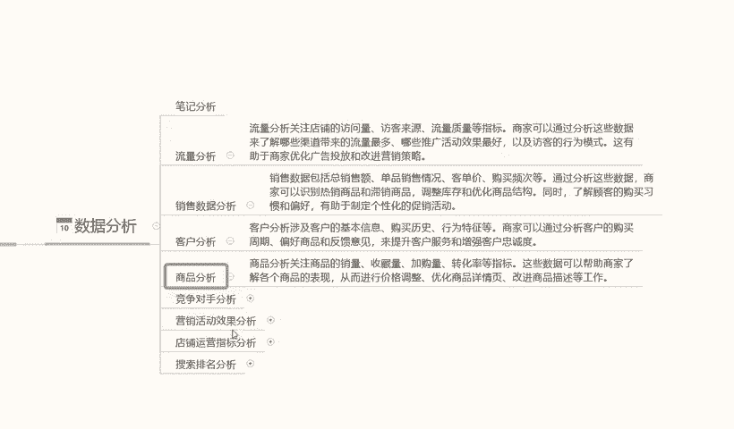
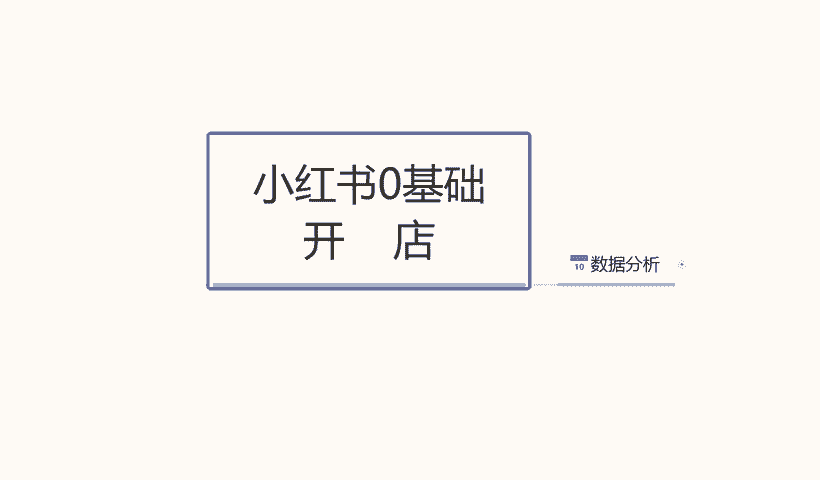

# 140分钟学会小红书运营-原来打造爆款笔记这么简单！！！小白零基础入门必学的小红书笔记公式拆解，最简单的起号教程，快来学！！！ - P11：9.小红书店铺流量打造2 - 红书教程1 - BV1o629YMEjv

大家好，今天给大家分享一个小红书名酒开店第十节课啊，数据分析。这一课的内容的话还是根据我们上节课的的一个延伸。主要呢是讲解一下我们小红书。搜索流量的30%流量如何去获取？啊，怎么去分析？

数据分析这一块的话，其实是小红书的一个分。数据分析的话，它还是比较清晰明确的。它不像呃其他平台的一个流量分析。为什么说它分析稍微明确一点呢？因为它的分析权整体权重的话没有那么。没那么明显啊。

但是我们也要去做，因为它这30%流量的话是非常的一个精准的一个流量。嗯。笔记分析这边的话，我就不跟大家说了。因为笔记的话，他说实话他做出来就是一个成品。他分析来分析去的话，无非也就是分析我们这个笔记呃。

优点在什么地方，出缺点在什么地方。我们下一步怎么去改进这个笔记，或者说是针对我们的产品，针对我们的一个客户做一个人群变动的一个调整而已啊。它主要的话就是看我们的基础功扎不扎实而已。这个呢就是笔记分析。

因为小红书笔记的话，说实话它70%的流量的话还是主体。那下面呢我们讲解一下我们的一个数据分析。数据分析的话，这个整体的一个。小红书店铺的流量数据分析。这个里面的话它可以分为流量分析啊。

销售数据分析、客户分析、商品分析竞争对手的一个分析，包括我们后面的一个营销活动的一个等等分析系统。这里呢我刚刚呢只是给大家讲解了一下啊，我们这些所有的分析数据出来以后的话。

其实也是可以改变我们笔记分析里面的。为什么说呢？因为我们把下面的数据分析出来以后的话，我们会对店铺进行一一部分的数据调整。数据调整的话，它主要通过的话还是说是我们推广笔记的一个方式的一个调整来操作的。

但是这些数据分析出来的话，我们对店铺里面的调整的话，还是靠流量分析为主啊，数据分析为辅。因为是笔记的话，它毕竟不是太精准的一个流量。

流量分析啊流量分析的话，它是通过关注店铺的一个。访问店也就是访客来源。访客来源里面的话主要就是笔记分析和搜索啊，然后测试我们的一个流量质量指标等。上就说我们小红书开店的话。

可以通过分析这些术语来了解我们的。客户的一个渠道是从什么地方来的？到底是通过。笔记来的。搜索流量来的付费推广来的啊，通过哪种方式过来的？我们整体观察这个过程以后呢。

我们可以查看我们店铺的一个整个的一个数据量在什么地方啊，从哪些流量过来，哪些渠道过来，我们哪一个方面需要进行一个整体的一个更改。因为之前我也给大家说过了，笔记分析占30%，流量搜索不笔记分析在70%。

流量搜索占30%。啊，我们对比一下他的一个。百分比的一个协协增率啊，就是说我们数据做出来以后的话，我们去观察一下哪些数据是正常，哪些数据是不正常的，不正常都数据的话，它的问题出在什么地方。

我们再进行修改就可以啊。当然这个数据里面可能分析的不止这些东西，这个里面还有呃。访客的性别年性别年龄啊，消费习惯，还有行为习惯、搜索习惯等等，他都暂示给。

就看我们怎么去看啊。销售数据分析的话就是说销售数据的话，它包括我们的一个整体的一个销售额，一个单品的一个销售情况啊。产品的客单价对比。嗯，购买频次等等啊，当然这个里面。通过分析这些数据的话。

这个里面的话它整体的话是确定我们顾客的一个。是确定顾客的而不是确定我们店铺的，是确定顾客的在我逛我们店铺的是什么人。这不是刚刚说的一个客户群体。呃，顾客经常逛的是什么商品啊，跟我们的商品没有冲突。

然后的话客单价购买范围是在多少？有没有需要去优化人群的，购买频次一个月购买几次产品。这些的话分析通过分析这些数据的话，就可以判断这个人的一个消费能力怎么样啊。我们是否是需要进一步的跟进。

推广其他的一个产品。对，就是销售数据分析。

销售数据跟分析明确以后的话，到下面呢就是一个客户分析。因为我们最了解的销售的一个数据，我们店铺里面的一个销售习惯以后，才能分析客户的一个群体画像啊。简单来说就是流量分析，我们不管是怎么去做。

上面流向量分析也好，数据销售分析也好，最后的话都是统计到我们客户分析上面。再通过客户分析的话，分析我们的商品为什么这么说。

访客进来以后购买商品，购买成交。我们要分析访客的一个数据。分析访客的数据以后的话，我们要分析我们商品的数据。通过访客反馈的一些情况，更改我们主推款，或者说是我们推荐的一个产品，是否需要更改商品啊。

这个产品适不适合做主推款。如果说不适合我们就要赶紧换产品。那意思吧？如果说我们的是内容范围是合格的啊，产品范围是合格的，客户范围不合格，那我们就需要。更改我们商品数据里面的一些。

就是引流这个的话就要就要修改标题，修改笔记。修改笔记内容啊，为什么呢？因为如如果说客户是正确的啊，访客是正确的，但是它的成交比例很低，那就代表我们的商品推广方式有问题，引流入的人群不准。

这个呢是商品分析啊，主要的话就是关注商品的一个销售量收场加工量。后面是竞争对手分析啊。

营销活动和店铺运营指标这两点的话其实不是那么重要。因为小红书整个店铺的一个权重权重效果在这个地方啊，营销活动不是很重要。运营指标的话我们稍微注意一下，其实也就可以了。嗯，主要的话就是一个竞争对手分析啊。

还有怎么去判断我们店铺的一个排名在什么地方。竞争对手分析的话是通过竞争对手店铺的一个数据啊，就是小红商家这里面的话，我们会以去灰腾里面去搜一下类似的一个竞争对手，或者是在我们小红书商家里面。

他的一个后台系统里面，就是工作台，我们可以在4呃工作台里面的一个数据分析，看我们的流量访客，基本上就是进入我们类似店铺的一个流量访客，他跑到什么地方去成交了，然后在别人的店铺啊，记住了。

不要用自己的那个店铺号进去啊，用用一个新号把他的店铺名记下来。然后。通过这个新号去他的店铺里面观看我们同类型，就是竞争对手的一个产品啊，和我们店铺类产品一样的产品去观察一下到底是。

我们跟他们有没有价格和差距啊，价格差距有多大？有没有其他的一个推广差距？推广差距的话，我们直接看他的一个销售数量就可以了。然后看他的客服客服的一个反馈，然后对比一下我们的一个服务结果，就可以分析出嗯。

我们竞争对手的一些基本信息，然后进行完善修改就行。这里面的话，我们修改的话，第一个价格是不能动的。我们能修改的话，也就无非就是营销活动。啊，活动和一个收后这两个点啊。

然后的话通过分析他们每天的一个成交金额。就说我跟他们在在做对手。通过分析他们的一个转化率，一个营销金额，然后来观看我们店铺的一个成交金额和转化率，大概的一个范围在什么地方。你的竞争对手。

你大家一定要记住了，你的竞争对手他的访客流量不会比你高多少。啊，就是你下面固定的那几个竞争对手，他的访客流量的话其实跟你是差不多的，就看你们怎么去理解啊，你只要把你的数据做的比他好。

一店铺排名就是比他高。大家一定要注意这几个点啊，就是我们通过分析竞争对手，不是要把东西对手弄垮啊，是我们店铺数据要超过他的店铺数据，我就能超过他的排名，他就不配成为我的竞争对手，我的竞争对手就会更换。

如果说你做不到的话，他可能会一直在他在脸上面啊。我们通过分析他每天成交多少单，成交多少金额，然后的话换算一下百分比的一个访客率，然后再算它的成交。转化率是多少？数据做的比他好。

我们的一个搜索数据的话就就会比他高啊，这个是竞争内容分析和一个操作步骤啊。也算是一个。实操小技巧吧。但是具体运用的话还看自己啊，我们前期新电刚做的话，其实没有必要。因为下面的那个竞争对手。

我们操作起来以后的话，他会更换的很快啊，基本上都会的话都是在中期左右的时候比较实用。营销活动分析这一块的话，说实话。嗯，小红书的话，它的一个小红书笔记分析的一个活动的话。全靠笔记。

营销活动基本上没什么太大作用了啊。可做可不做，看你们大家自己，但是他这个里面有一个呃店铺的等级活动，那个是要做的啊。后面如果说有时间的话，还有需要给大家讲解一下小红通小红书它里面有个店铺等级。

就是每日任务那个还是要做一做的啊，那是那也不能说光为了完成任务，把我们其他的东西都耽误了啊，到时时候后续的话我会给大家。呃，再讲解。然后呢，是店铺运营的指标的一个分析啊，店铺运营指标和那个营销活动嗯。

他们不一样的啊。店铺运营指标的话，这个里面的话主要是包括店铺的一个动态评分DSR也是退款纠纷，就是售后的一些服务。这些指标的话是反映店铺整体运营的一个质量和客户。满意度的啊。稍微注意一下。

评分不要低的太过分啊，尽量的话保证4。8左右就行。诉索排名。做索排名分析的话，这个的话是综合我们上述啊所有的一个数据分析。然后的话小红书它会在系统里面给我们一个整体的一个排名情况啊。

商家的话就说我们需要了解是影响排名的一个因素啊，比方说商品的标题，关键词销量评价数据优化啊，包括我们笔记整体的一个引流。这议都在里面啊，它是综合性的一个排名的。不是单独的，它是综合性的一个排名。

这个里面的话就是说我们如果说按搜索词做的话，它里面就包括了标题关键词销量评价。还有我们的一个DSR啊，也就是上面的这个DSR，它是整体，它是属于搜索排名。输入排名额外的话，它这个还有一个笔记排名。

笔记排名的话，它这个里面主要是靠那个展示和点击给你了3000个展示。可能点击如果说你有百分之。20。多达600，那你这个产这这个小。小的一个笔记分析的话，它就会成为一个小报。小报出来的话。

它会给你更多的访客。如果说你没有这个没有达到这么多的话，那么你就只能属于普通的那个。普通笔记了啊，也就30天流量左右，3天到5天流量稍微再多一点的话，也就大概500500左右。

还是看我们店铺的一个整体的。好吧。这个呢就是数据分析整个的一个内容。这节课呢就给大家讲解到这儿啊，我们下一节可能是呃零技术开店的最后一节课，我们的售后怎么去操作？

