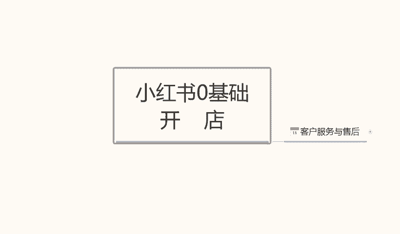
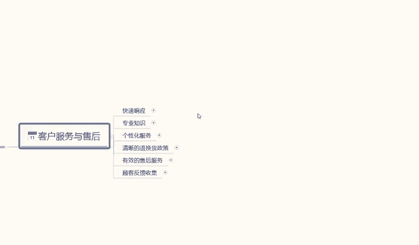
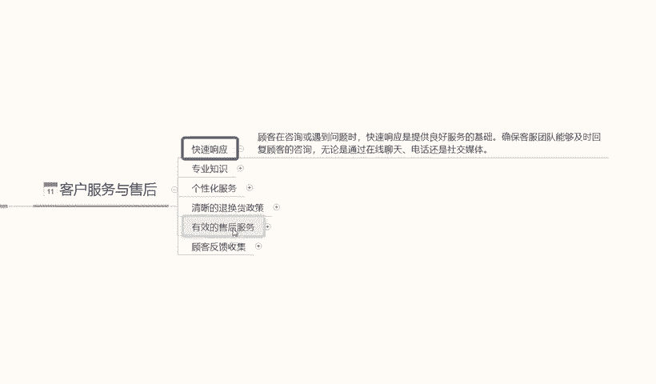
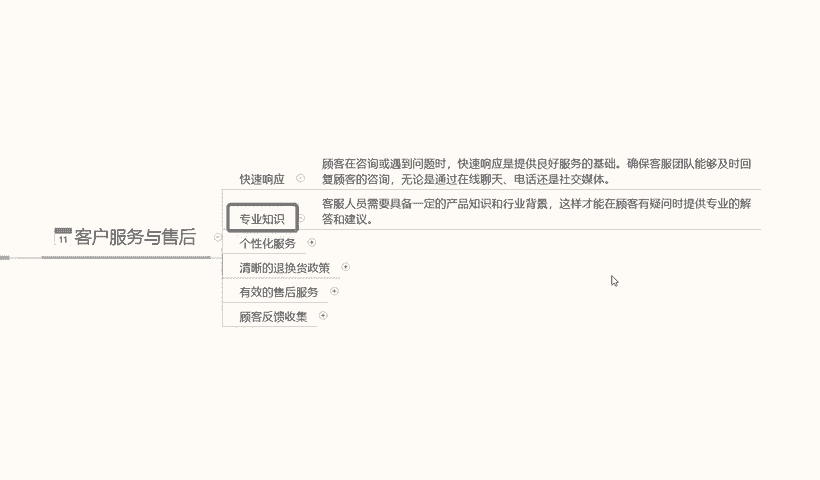
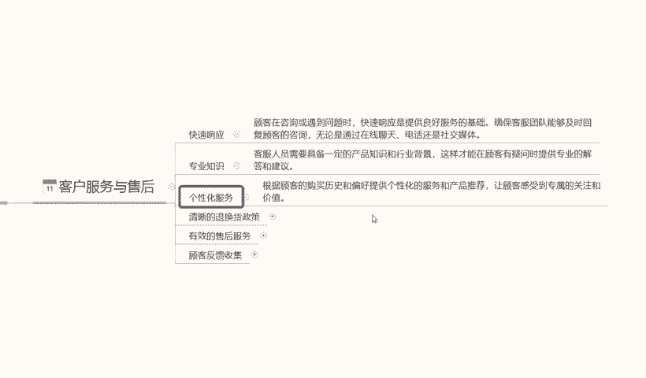
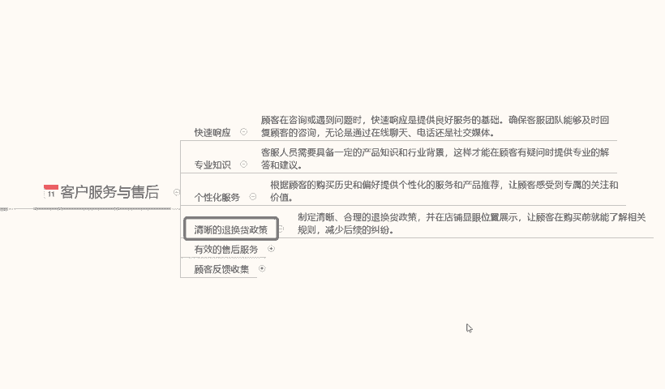
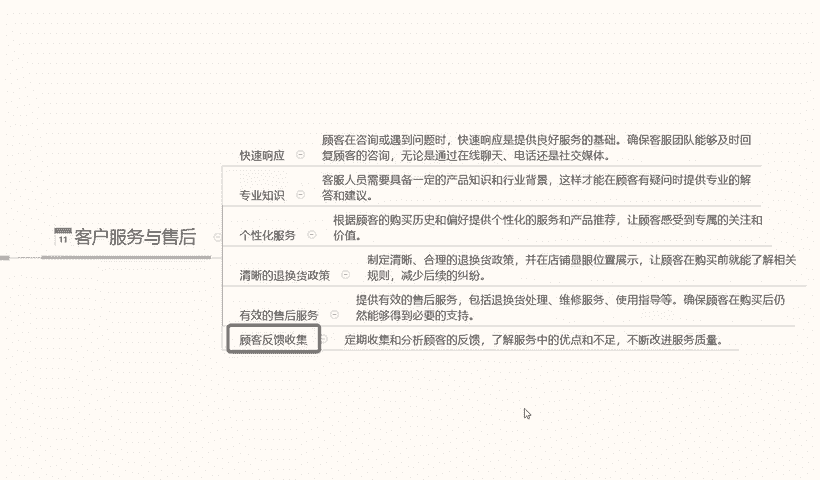
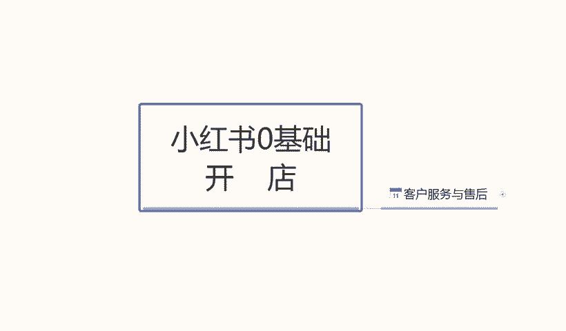

# 140分钟学会小红书运营-原来打造爆款笔记这么简单！！！小白零基础入门必学的小红书笔记公式拆解，最简单的起号教程，快来学！！！ - P12：10.小红书客服和售后 - 红书教程1 - BV1o629YMEjv

大家好，今天给大家分享一个小红初零基础开店的最后一节课啊，也是第十一节课客户背。客户的一个服务啊与售后。就如我们怎么去针对我们的一个售后做一个修改和调整啊，我们小红书整个系统里面。

我们的这个售后客服啊到底应该怎么去操作？

其实小红书的售后和客服的话，它对于其他的一个平台做对比的话，其实都是差不多。啊，我们这个小红书客服的话，它这个里面的话主要是也是它的一个整体啊，小红书客服可能比其他平台还要严。因为它本来这个。

小红书里面的人群是比较刁钻的啊，而且是90%的女性，它整体的一个人群是比较刁钻的。所以说我们在做小红书的客服服务与售后的时候，大家一定要注意啊啊，尽量是女性做售后，而且。打字的语气要温柔一点，不能活活。

就是火气很大。我们去做这种的话，说实话，男性的一个沟通方式和女性的沟通方式是不一样的。男性的沟通方式的话会比较简洁，你愿意买，需要什么？我跟你讲解决，但是女性不一样，他会问很多东西。啊。

女性购买产品他很少有那种直接购买的，他会用这个卡。比方说拿口红来说这款式、口红色号。啊。还有什么价格好不好用，能保持多久？嗯，出去以后掉不掉色儿等等一些问题它都会哎。在这个小红书里面。

他都会问的问的一清二楚。你包括买衣服也是大小合不合适，我多少斤穿多少。等等都是一样的啊，所以说是。小红书里面的售后客服。还是比较难做的啊，它整体的一个。

嗯，怎么说呢？就是说整体的一个素字在这个地方，不是说小红书里面的人员素质不好，它只是说人员购买货物货物的一个。购买行为吸管啊。但一定要注意这个点啊。那小红书售后的话，我们到底要注意什么呢？

第一个呢是响应速度。响应事度啊，顾客在咨询或遇到问题时，快速响应提供良好的一个服务基础啊，确保团队就是说确保我们的客服能够快速回复。啊，无论是通过在线聊天也好，或者是通过其他聊天也好。

但是这个里面有一个点，我要给大家告诉大家啊，小红书快速响应速度是3分钟以内。但是小红书你只要超过5秒钟不乐，不回复这边的客户，他基本上就不见了。啊，就5秒钟一个反应时间。所以说我们设置小红书售后的里面。

它有一个自动匹配，就是自动搜索词的一个关键机器人，大家一定要有。这是第一个点。而且第二个点我们回复的话就是说。机器人反馈的话可能给可以给我们节约20秒钟到30秒钟的一个时间。但是30秒钟以后的话。

你的机器人的一个反馈回回馈问题的话可能会就会比较慢啊，还是要人工客服去回复的。所以说如果说订单多了以后的话，你的客服可能会忙不过来，那需要你们自己再去想办法再去解决了啊。前期的话不会出现这种问题啊。

前期的话只是说你5但是前期你的一个机器人回复设置，没设置好的话，还是你人工客服去回复的话嗯，一定要注意节奏，5秒钟以内必须回复别人，不然的话，店里面的客户，你前面几个问题你没回复好。

5秒钟以后它是消失不见了，你找都找不回来的啊。大家一定要注意了，快速响应系统是给了我们3分钟，但是我们最好在5秒钟以内就要解决。

第二个是专业知识。像我刚刚刚给大家做的一个。解释啊，你拿口红单单独的一个色号颜色分类等等这些东西的话。你一定了解你对你的产品不了解的话，你就是说就去做这个东西的话。你自己不熟一些东西。

你没办法跟他们解释，知道吧？当然了，你前面解释不通的话，后面慢慢熟悉了以后也可以。但是那个时候的话，你的店铺就不好做了呀，你数据已经掉下去了，所以你要先一定要先自己了解的产品。

或者说你这一招的客户一定要先了解你的产品，然后去做推广啊，一定要把专业知识给做起来。因为小红说他这个里面的一些小饰频也好，小口红也好，小车内装饰也好啊，包括服装等等东西。你的专专业知识不多的。

不不够的话，你没办法。

爱，吃豆子。然后个性化服务啊个性化服务的话，这个是属于售后里面的，售后里面的个个性化服务也就是一个包装产品包装啊。产品包装的话，说实话这个里面。你包装好看一点，那么你的客服。客户反馈的一些新信息。

就说他给你的商品评价也好，包括你的那个售后服务态度也好啊，都会很高。但是如果说我们产品是小件。包装精美一点的那种的话，你们可以把它算在成本价里面去。啊，就是价格稍微拉高一点。把包装做好一点。

对你也是一个不错的。如果说你就是这种服务这多包装的话，那你的个性化服务的话，你去想办法把它引流到其他地方吧。那我只能这么说，看你们自己怎么去操作了，好吧。因为有些东西话也不能说的直。不是不能告诉大家啊。

只是说不能说的太清晰，好吗？

然后第四个点呢就是一个清晰的退换过程。啊，就是我之之前给大家上课的时候，我也给就是说之前给大家做分享的时候，我也给大家说过啊。我们一定要有清晰的退换或政策。退换货政策这个东西的话，你不需要告诉客户啊。

你的退换货政策是已经放在我们的详情里面了的。这个退换货政策是跟你自自己说的啊，跟你自己客服说的。啊，合理的退换货随便他退，千万不要给我们来差评，一个差评顶你20个好评，拉都拉不回来的那种哈。

所以说一定要清楚你的退换货的一个政策，他不喜欢就给他退了。很多人喜欢太小便宜，你就给他退了，无所谓的啊，不要影影响整体的一个销售情况。他这种人毕竟是少数，但是你碰到了一恶心啊。

就是说让让顾客在你这购买产品啊，了解相关的一个规定。能正常退就退，不能正常退，他有什么问题的，你就先反投诉他也不去啊。小红书对这个方面的话抓的还是比较严的啊，你把投诉他把他的账号封掉就可以了啊。

所以说一定要有清晰的退换货政策。包括我之前给大家说的那个。嗯，怎么说呢？就是说我们在详情里面最后做的那个退换或声明。也是有一定一定的效果作用的。你在和你的客户在跟明明人聊的时候，如果说对产品不喜欢。

也重复一下啊。下回他过来找事情的时候，你就拿着这个证据去找管理。啊，投诉他就行。

好吧。然后呢，是有效的售后服务啊，其实就是我刚刚给大家说的这个。看你怎么去沟通吧啊，提供的有就是我刚刚跟大家说的，提供有效的售后服务。因为包括退货维修使用证等等啊，就是说你把产品商品的所有的利啊，弊啊。

都跟他说了以后，如果说他不喜欢他人要找你麻烦，但是你的商品又没有问题，他买了以后又用过一段时间已错过退货时间以后，你投诉他，封他号啊，他给你的差评，系统会自动给你刷下下算错。

就是靠我们自己有效的一个售服务去维护的。如果说你连这样的技巧都没有的话，那你的店铺差评一多。就不撤很好做了，知道吧？一个差品要靠20个好评去维护。你想想这个。概率比例有多大？

100个里面有5个差评能忍受100个里面有7个差评，10个差评，你就别人就忍受不了了，觉得你这东西不是什么好东西，我不买了，就直接走了。所以说大家要注意这一个点啊。然后呢，是最后一点啊。

顾客的一个反馈收集。反馈收集的话，说实话呃，顾客反馈收集的话是对我们产品不满意，或者对我们这个整个产品的一个。优点和缺点不足进行改进。这种人的话，代表他对我们的产品还算是可以的。对比其他产品以后的话。

他对我们的产品还是比较理解的。你就可以哎。跟他交流别的东西，这些交流别的东西的话，我在这不没说你们清楚的话，应该都是清楚的啊，怎么去交流，怎么去改进我们的产品，然后做二次服务、三次服、四次服务。

他就相当于是你的粉丝了，就看你们自己怎么去搜集啊，怎么去做材料了。好吧，这个呢就是客服与售后的一个操作技巧啊，和我们去个人需要注意的一些事项。

好吧，那这一节课呢也就到这里，我们本期的一个课程，小红书零基础开店的啊，也就给大家基本上讲解完了。当大家了解这整个的一个课程内容以后的话，小红书我们前面技术说的技术去操作的整个店铺的话就。

非常清晰明确啊，知道我们该怎么做怎么操作啊，做什么样的产品，或者说是我有什么样的资源，我怎么去做了啊，了解这些东西的话，我们再去上索做小红书店铺的话会清晰明确很多，好吧。

