# 140分钟学会小红书运营-原来打造爆款笔记这么简单！！！小白零基础入门必学的小红书笔记公式拆解，最简单的起号教程，快来学！！！ - P12：11、新手小红书运营-小红书规则（4） - 有点像大哥Seven - BV1pY2vYcEf2

大家好，这节给大家分享的是小红书全集系列分享的第四大课时，小红书规则啊也是第四小节课程。

呃，接着我们上一节课程的一个内容继续往下面讲。上一节课呢给大家讲的是推荐规则里面的啊一个发现流量。发现流量把前面两个大点给大家讲。下面的话就是说我们标账号标签的一个设置方法和笔记标签的一个设置方法。

账号标签设置方法的话，其实就是我们小红书起号的时候，就已经给大家已经呃大概的说过了啊。首先如何给账号和笔记打上精准的标签，让平台精准推流啊。第一个多看自己和同领域的内容，增加用户标签。

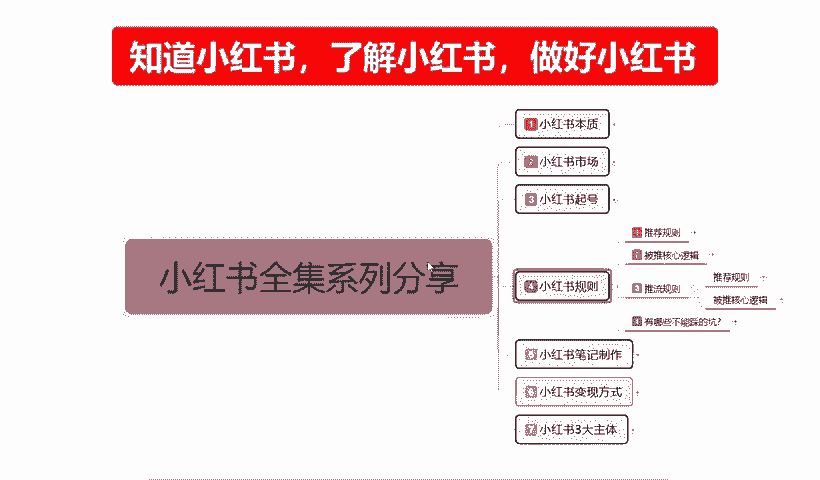

就说我们在这个时间段的话，之前我也给大家把时间小红书起号的时候，我也给大家把时间段给说过了啊。我们养号的时候就是这个啊。

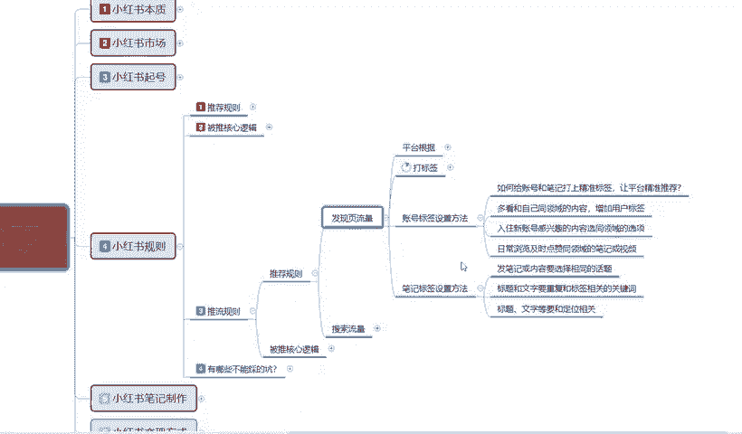

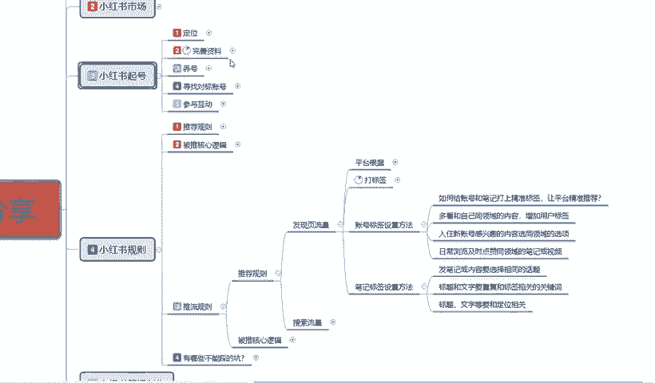

哎，养号不是养号的话，是三个账号同时操作，我看一下啊。哦，这个。寻找对标账号的一个标签，研究分析我们领域类相似，并且表现优异的一个账号，学习他们内容标题技巧啊。我们去观察别人的时候，也同时也是学习一下。

同时再给我们自己打上这个类型的一个标签就行啊。这个的话还是比较简单的。然后入驻新账号感兴趣的内容选择同领域的一个选项。就是我们在创建账号的时候。啊，把我们三个兴趣选项的话。你尽量的去框。

可能对这个兴趣感。对我们这个产品也好，对我们所发布的内容也好，感兴趣的去框。你要是不框的话，你就根据我们平台的一个规定，我们账号就没色标签就没色到。

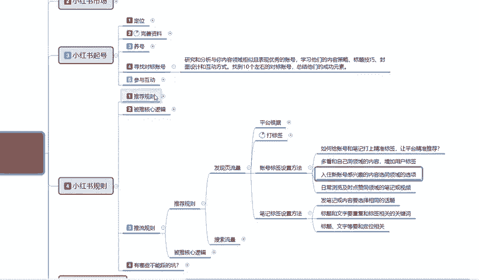

啊，然后是。日常浏览及及时点赞同领域的一个笔记或视频啊，这里面大家要注意点啊，嗯之前也给大家说过，就是说我们浏览别人的一个产品，浏览别人的一个笔记，或者浏览别人一个内容的同时。

我们需要观察它的内容到底是不是精品，它不是精品的内容，你别去点。啊。那种不精准流量，你点了以后也是浪费。然后的话啊给大家一个。怎么说呢？就说给大家一个保底。小眼睛低于5000的，你就不用去管他了啊。

除非他是是刚上传一天两天的，你可以去看一看，然后嗯抢个牌头，抢个位置去和别人聊一聊。如果说两天以后都没有超过5000的这容，他就不属于爆款笔记了，你就没必要去观看他了，直接跳过就行啊。

因为他的内容话题的话，他本来自己做别人的表现自己做的。就那个样，你去看他了，对你自己没什么好处，对吧？别把自己的账号给作废了。所以说我们日常浏览的话啊，点赞啊关注啊，你跟别人做互动啊啊。

你感兴趣的内容你去看一看，然后点赞关注收藏这种的话。尽量找5000小眼睛以上的账号。

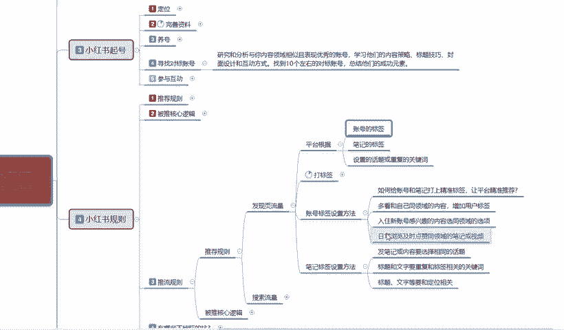

然后笔记标签设置的方法，发布笔记或内容选择要相同的一个话题。就是说我们的标题一定要跟你的。笔记内容描述相关，不然的话，你光做标题档，你的一个笔记内容跟实际内容性质完全不一样的话。

说实话这种的话只适合搞笑主播那种啊，就是我们前期起号的时候做。

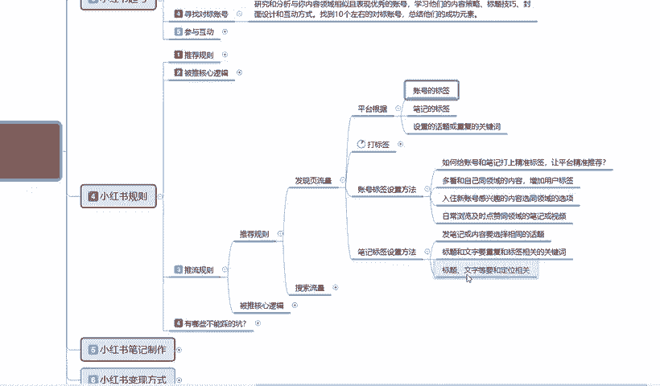

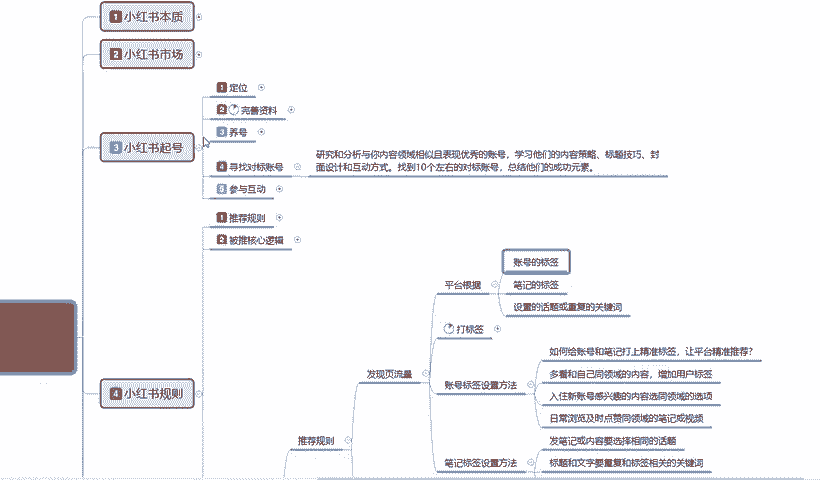

怎么说呢？就是小红书市场里面的话，我做任何话题，你可能适合这个方式，不然的话你基本上都要匹配我们自己的一个。

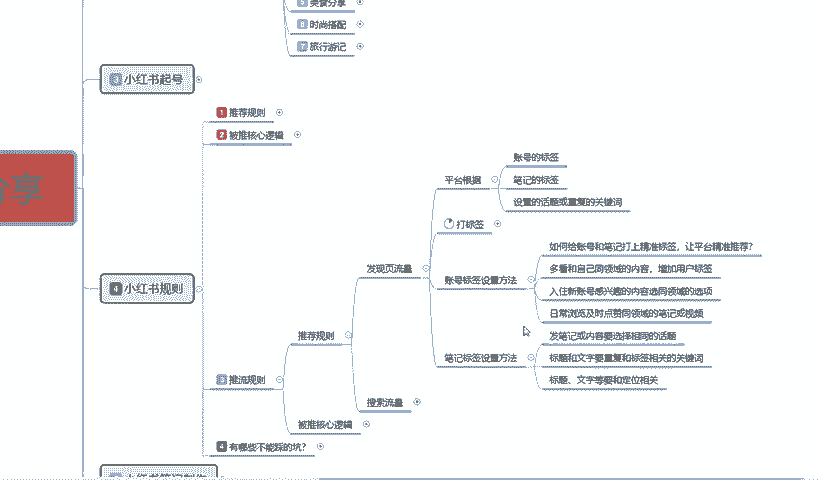

账号标签需求，你要是做搞笑网红，做这种后期的做后期啊，想把它做大了以后，然后的话通过嗯账号的权重去把它转变成。提款的话啊，就是接广告啊之类的，可以按照这种方式啊。就是。呃，怎么说呢？标题非常吸引。

其实内容一般啊。说实话，那么做的话，权重不高，想起来也很困难啊。你没有没有什么才华的话，尽量不要往这边靠。

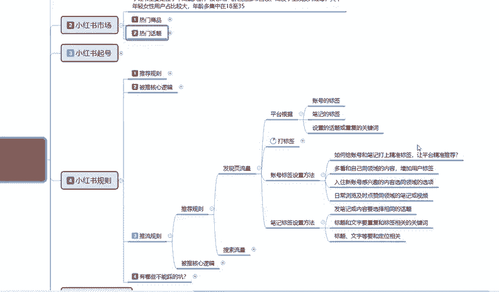

第二个呢就是标题和文字重复和标签的一个相关的一个关键词啊，尽量的话就是不要有重复的关键词。然后呢，你的关我们所搜索的关键词和我们笔记所发放的内容。尽量保持一样啊，你可以带站美吃。

在优化时候带其他的一些词汇都可以。最后一个就是标题文字等要和定位相关。你不能说是你一个笔记发出去了以后和你的定位关系不大，那引流是能引流，但是你后期不好转化啊。这个就是推荐流量里面的一个。

怎么通过这种方式去把更多的流量引入到我们的一个账号里面来？这个是搜索流量啊，刚刚给大家讲的是发现的一个流量啊，这只是系统推荐的。啊，搜索流量才是重点。搜索流量它超过60%的流量来源于搜呃，检查搜索。

就是说我们打开小红书的时候，小红书。在搜索页面它有一个放大镜，放大镜的话在里面输入关键词进行搜索。它的一个准确率流量达到65%以上。这个才是我们所有流量的一个核心点。

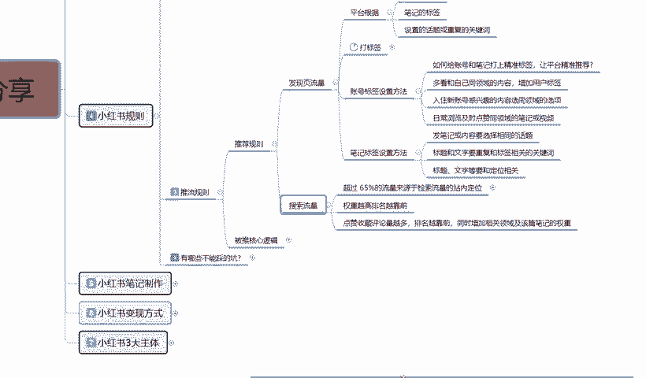

因为其他的自然推广流量，说实话给我们推再多的话，它的转化率。你要是坐店的话，它转化率或者说是其他一些东西它都不是太高的，准确率没有那么多，知道吧？

搜索流量就是通过关键词进行搜索的这种笔记流量才是最精准的。这里面的话，它有一个默认的一个提示。提示词就是我们在输入关键词以后呃。我们做标题的时候，你就如说你可以去参考一下这些提示词。

在关键词搜索栏里面看什么是热门话题啊，和我们相关的一个热门话题。然后搜索发现热门的一个搜索词，可以把它做到我们的关键词。就比方说我今天呃搜索了一个经线，什么什么什么什么关键词。

对吧他这个搜索热度排第一排第二排第三，我们也可以用这种方式去把我们的笔记标签给换成这样。那么他的展示几率就会变高。因为这种的话，它的整个搜索流量来源的话会达到65%啊，这是搜索流量。人体搜索流量的话。

其实在小红书。80页里面按80%算，搜索流量只有20%，但是它也是不可忽视的一个部分啊。然后补充联想的一个关键词，后面的词汇就看我们自己怎么去补充了啊。把这几个点的话，就是说这四个点把它做好的话。

基本上嗯可以从里面抢个1%到2%的一个搜索能量词汇出来，就是按热门词汇去做。不要小瞧这1%到2%。因为搜索词汇它的准确性是非常高的。所以说很多人都在做这个关键词的一个流量截流。你要把这个词做好了。

你能截留1%到2%，那最少都是2万到5万的一个。再次。你如果说点击。评论啊。这些数据做好以后的话，它的展示还会更大。然后他是按照权重越高，排名越靠前啊，就说他的权重是怎么划分的呢？点赞收藏评论越多。

排名越靠前，同时增加相关领域及该篇文章的笔迹显重。就比方说呃笔记里面它有成绩划分。20展现。0到200展现200到500500到2000吧，好像是。

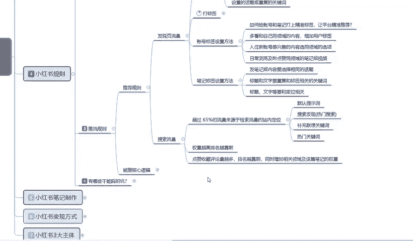

啊，他对于一个笔记笔记展现的一个整体数据。

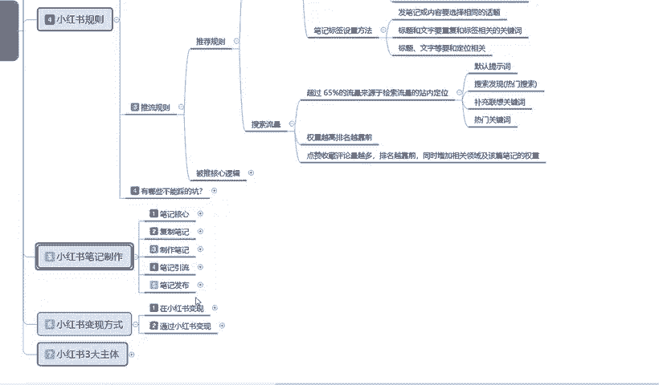

这个我没记，但是我有一个。小红书笔记。

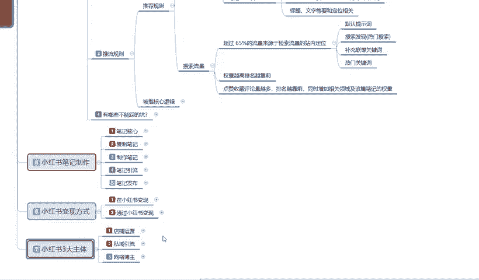

算了，骗题了，这就不给大家讲了。他这个里面的话是嗯小红书笔记里面有一个流量层级。

这个流量层级的话就是展示流量成级的。好吧，所以说我们把这几个点把它。

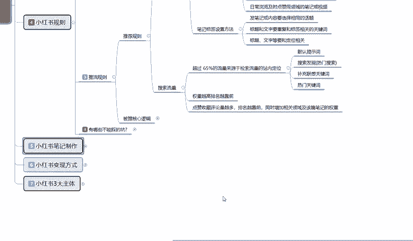

了解一下就好了。主体的话就是说我们推荐规则里面有一个发现流量和一个搜索流量。搜索流量虽然说只占20%，但它整体的一个65%的搜索流量来源的话是非常准确的。剩下35%就是看着好玩的。

整体65%的搜索流量准确性是什么意思呢？就说。这部分人如果说他去搜索商品，他1100个人里面有65个都可能去成交。啊，只是说在不在你店里面成交的问题，看你的产品有没有嗯那么高的一个吸引力。

或者说拿你的商品进行参考。所以说他的成交概率是非常大的。你比方说嗯。你那个。T恤对吧？用户通过搜索你的T恤关键词进来以后，如果说有展现，他看个十几个产品里面就有。65%的概率，他去成交司机给你们。

那100个人进来就是65个人，65个人看十几个产品，十几个产品的话，里面有你的展示，最少也能成交两三单。啊。你按概率学算的。如果说你的产品还比较优秀，价格还比较公道。

然后后续的一个展示介绍和自己相关系的一个笔记话题都是非常好的。对吧一篇笔记成交个几单，然后他后续再成交过后再给你加权，再给你展示，按照这种方式去做的。所以说大家不要忽视这个搜索流量啊。

小红书的搜索流量是直接成交最关键的一个重点。如果说你要是。做商品。你可以忽视发现那发现页的一个流量都可以，但是你不能不做搜索页。当然了，你要是做引流做网红的话，你就必须要发现一个流量啊。

这个就是整体推流的一个规则。

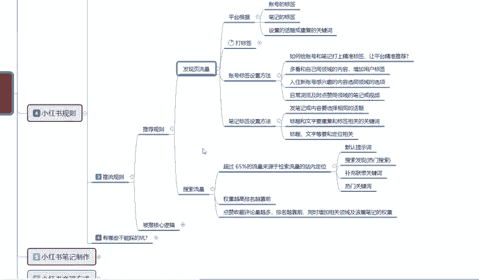

呃，包括我们下一节课的话就给大家讲一下啊被推的一个核心逻具。好吧，那这节课呢就给大家讲解到这里。

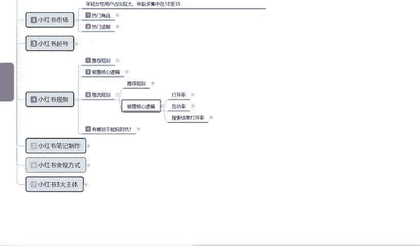