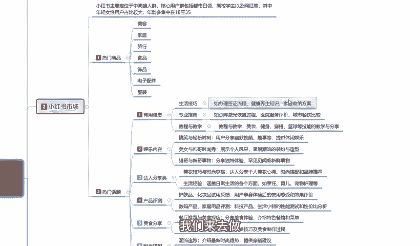
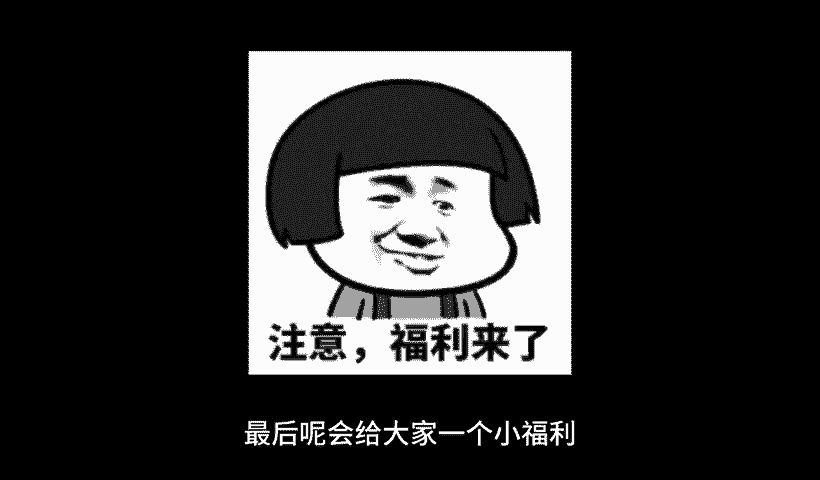

# 140分钟学会小红书运营-原来打造爆款笔记这么简单！！！小白零基础入门必学的小红书笔记公式拆解，最简单的起号教程，快来学！！！ - P16：04、新手小红书运营-小红书市场分析（1） - 红书教程1 - BV1o629YMEjv

大家好，这节呢给大家分享的是小红书全集系列分享的第二课时。啊，第二大课时。小红书的一个市场。什么叫小红书的一个市场呢？就是说我们通过第一大课时，小红书的一个本质的话。

就是了解了小红书它整体啊是否适应我们的一个市场环境啊，对应我们的一个产品。那我们从产品里面的话，它其实还是有区分的。我们要从。小红书本子里面。了解小红书的市场，通过小红书的市场啊。

发现我们的产品适不适合在小红书上面去操作。所以说我们需要对它进行一系列的分析和了解。那我们首先来看一下啊，小红书的市场有什么。小红书的话，它主要定位的是。中高端的一个人群，核心用户群体的话。

包括都是白领高校。高校的一个学生啊以及网婚等。其中的话年轻女性用户占比较大，他的整体女性用户占比的话其实是在85到90。男性可能只占10%左右到15%。啊，年龄多的话，他基本上都是集中在35到。18岁。

整体分层的话，就说他在这个里面。20多岁的占主体，18岁的话也比较多，35岁的也比较多。但是12到48，他这个里面的人群也有，只是说比较少。这种的话就是相当于类似家里面有那种不听话的小孩啊。

比较喜欢玩手机，对新技术比较感兴趣的。12到18的这个之间的用户群体也有。35岁往上啊，年纪偏大的一点也有。只是说他对于整体小红书来说的话，嗯，人群没有那么广。就是人数没那么多。

小红小红书目前的话接近3亿的一个。浏览记录和访客的话，它可能里面18到35的话占2。5亿。剩下的5000万才是18比1八小的比35大的啊，它的整体一个分流的话就是说女性用户占90%。18到35。

就占了剩下那么大的一部分数据啊。基本上。2。5亿的一个数据量占全球全国女性范围接近。一半了。接近一半没有一半。然后是小红书，整体的话，我们了解它的人群年龄和划分以后的话，就是了解小红书的商品。为什么呀？

只有先了解这这一一整块的小红书女性她喜欢什么样的内容和小红书。商品的一个投放内容和他所感兴趣的热门话题。啊，只有你了解他的一个性别了以后，你才能去进行分析。如果说你连性别都不了解。

你就想去分析小红书上面卖什么产品好啊，对吧？我的卖个男装啊，卖个汽车，对不对？那不现实，对吧？所以说只有了解他的一个人群用户了以后，我们才好确定它的一个热门商品，包括它的一个热门话题。热门商品这边的话。

我只是说给大家列了一些例子啊，呃，热门话题里面的话，信息是稍微多一点。因为商品的话，说实话，对于小红书来说的话，它不是整体数据的话不高。在小红书上面直接搜索商品的话。

它的热门话题就是人群搜索度的话不到20%。正常的话也就10%到15%左右。其他的话基本上都是收小红书，收热门话题的比较多啊，就是说小红书。只要他去搜商品了，那么成交概率就很高。

但是他搜索商品的整体人数的话没有那么多啊。热门商品上面的话，就是说呃小红书上面因为女性偏多，它整体的话热门商品也就是一个美容，一个家居，一个女性，一个食品，一个电子配件和服饰。啊。

这7个大类目是最好做的。你其他的类目去做的话，嗯，你要做产品也好，做推广也好，嗯，做其他的等一系列的东西去做的话，其实是没那么好做的。因为他女性的需求量基本上都集中在这几块。美容化妆品啊。眉笔唇膏。

口红对吧？睫毛、耳环、坠饰等等，都包括他的视频里面也都在里面。嗯，家居里面的话就是说家居里面的一些日日常用的什么开关器啊，对吧？菜刀啊、剪子啊等等都在这个里面。就说方便他生活日常所需的你都可以去做啊。

有一个前提啊，女性用品不要把它划分到男性里面，男性的5%到百分百10%到15%的男性用户。说实话我们去做小红书市场的话，你尽量你就不要考虑那些人了啊，因为那些。男同志进来，别有目的，好吧。正常的话。

女性在这个里面啊，我们去操作这个类目的产品都是可以的。就是说你要做店也好，做网红也好，做博主也好，做引流也好。最好是从这些产品里面去写。你其他的产品也能做，只说效果没有这些产品好。

这是我给大家进行的一个热门商品的一个推荐。好吧，第二个呢就是。热门话题。小红书市场热门话题的话，它就比较多了。热门话题我在这里面，我给大家把它分了7个点，第一个是有用的信息，第二个是娱乐内容。

第三个有达人分享。第四个产品测评，然后美食时尚旅行。啊，我把它全部给大家进行了一个分类。热门话题的话，说实话做你要了解热门话题。你要从热门话题里面去做商品，也可以去做引流，也可以去做博主也行啊。

你要先了解什么样的商品，什么样的话题，对我们整个的一个权重，对我们整个了解小红书操作步骤啊，有提升就行。什么叫有用的信息呀？有用的信息的话。嗯，怎么说呢？就是针对我们的一个生活技巧，专业的一个指南。

教程与教学它就类似于知识类的一个分享。我们在分享小红书的时候，比方说生活技巧如。办点签证也好啊，健康养生知识也好，家具收纳方案也好。嗯，包括呃饭后吃什么水果，美食保健。

对吧化妆怎么化都可以在生活技巧里面。专业指南的话，就是说如点正激光恢恢复过程。这个的话就是说它比较涉及的就是医疗科技。这种啊，然后就是餐饮。这个城市有什么好吃的，那个城市有什么好吃的啊。

比方说就是类似于做每次博主这种。教师以教学的话，其实就是呃补习班。美妆博主健身教练啊。传达。篮球技术的一些演练、演示和教学。这种的话，它是因为是用图案描述的啊。小红书笔记的话，虽然说也有那种视频笔记。

但是视频笔记的话，说实话它没有文案笔记容易爆。你视频笔记的视频笔记报的概率。如果说我们呢把爆款概率按10百来划分。视频笔记的一个爆款概率可能不到5%到10%。文案笔记爆款概率的话可能就有90%。

它的差距就这么大，它不主推视频。主推视频的话，说实话它的一个流量的话还没有文案的流量高的啊，大家一定要把这个了解一下啊。比如说有用的信息的话，就是分享我们日常生活中的一些生活技巧，专业指南、教程与教学。

我们可以往这个三个方面去靠。通过这三个方面，如果说我们是想做商品啊，通过分享这三个内容方面的一个知识，结合到我们产品上面去，比方说我做美容的对吧？做美容之前，我们先要了解。有用的信息对用户有用的信息。

你进行发布，你让人家了解你这个产品怎么去发布以后的话，别人才会去问你，你在哪里买的配件。你要知道啊，在小红书里面做商品，一定要把它当配件处理掉，你不能当主主流去处理掉啊，我们正常打开小红书以后的话。

它的整个搜索页面，20个笔记里面才有一个是附带商品的一个笔记。而且这个是推广，还要花钱的。不然正常搜索的话是没有商品笔记展示给你的啊，那家一定要把这个弄清楚啊。所以说我们一定要从笔记里面去找商品。啊。

而不要从商品里面去找笔记。所以说我们在发布呃商品笔记或类似的有用信息的时候，一定要先把我们自己的人设打招好啊。这个里面的话就是有用的信息，占主要最重要的一个点啊。第二个呢就是内容娱乐。什么叫内容娱乐呢？

内容娱乐的话，说实话这个的话你就是完全往网红方面去考。搞笑与宣春时刻的一个分享，用户分享趣幽默视频、趣事等提供休闲娱乐。这种的话说实话你要把它变现的话有点难度。但是你接广告啊之类的，嗯，做好了以后。

接广告之类的，或者做以前分享还是比较容易的。第二个就是美女帅哥的一个时尚秀，展示个人的一个风采，紧跟潮流的一个装扮语。赵平啊。这个的话说实话就是教程与教学里面的啊，你传达也好。你健身也好，美妆也好。

你要通过这个方式对别人进行一个教学。钓育的一个配。教育的一个培训。这个呢就是舆论内容。第三个是达人分享类的啊，为什么说是达人分享类？达成分享的话呃。它和娱乐内容不一样啊，娱乐的话它是以。搞笑轻松。

通过这种方式。来进行的一个分享。这种好容易起，但是变现困难。达人分享的话就是说你要自己有一定的知名度才行。说实话。这个达人分享美妆就小于时尚的话，你要在。怎么说呢？在这一领域做了一定的时间。

或者说你有一个团队，你才能去做达人分享。你没有团队，你个人想做达人分享。那我建议大家的话还是以娱乐为内容为主好一点啊。因为娱乐内容的话，你个人就能做达人分享，你个人做不了。你没有团队，你后续的一个。

设备资源你做不到内容你不好找，对吧？你的产品对应的一个效果也不好。你没有自己主做的一个产品，你没有名气，别人不会去看你的。你只有先把娱乐内容做透啊，通过自己的一些方式保留一定的粉丝和权重了以后。

让商家来联系，你再去做答人才可以。啊。但是达人类分享的一个热门话题，它热度是非常高的啊。在小红书上面。他的美妆具巧也时尚大，时尚穿搭啊，达人分享的一个个人美妆心得。他比怎么说呢？他比抖音的效果还要强大。

为什么说他比抖音的效果还要强吧？抖音的人群它是包括男性和女性，他都有，而且男性占多大部分。女性抖音的用户不到30%，但是男性抖音的用户占70%的一个比例。

那小红书的一个占比的话就是90%85到90的一个女性比例。所以说我们做达人分享的时候，在女性方面这个里面做美妆也好，穿搭也好，在这个里面是非常吃香的。而且女性对于小红书这个平台来说啊。粘合力更高。

所说达人分享类的，你要想把它做起来，先把娱乐内容做好。你平常的一个娱乐内容，一个化妆或者说一个穿搭。影响到了你后续做达人分享的一个整体圈中。就是你先把账号提升起来，把自己提的稍微有一点名气。

有个200粉，000粉。对吧你就可以去做达人。把账号一申请啊，把数据一提交，把经验公示范围一提交，就会有人来主动推广啊，这个就是小红书达人类的一个分享内容，好吧。呃。

后面还有产品测评美食分享时尚穿搭和旅行。啊，邮寄。这四个点啊，通过下一节课再给大家进行详细的一个讲解。然后我把这几个内容给大家讲解完成以后的话，我会教大家啊怎么判断热门商品和热门话题综合考量。

我们来去做小红书的一个整体账号。好吧，那么这节课呢就到这里。最后呢会给大家一个小福利，整理了小红书运营实操资料，可以评论区私信的方式领取，通过之后会第一时间发给大家，注意领取资料，不收费不收费不收费。

重要的事情说三遍。

