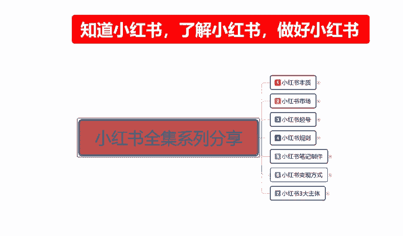
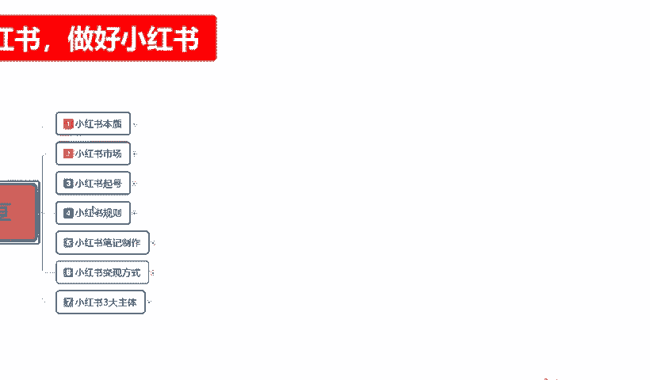
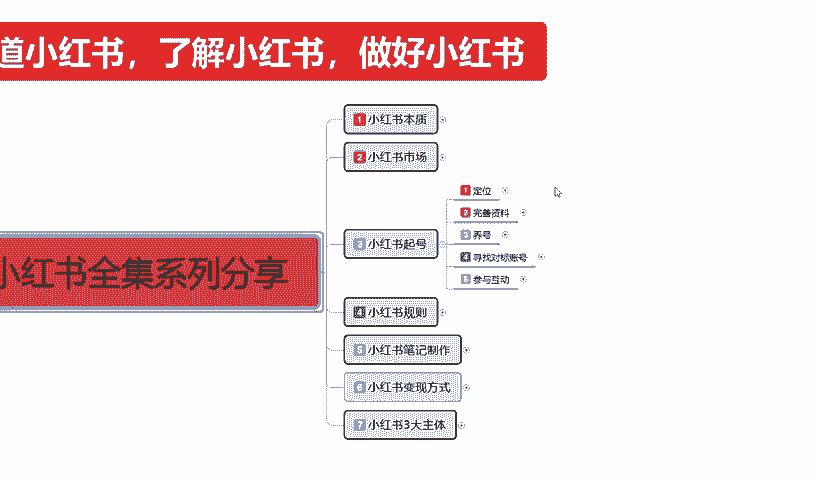
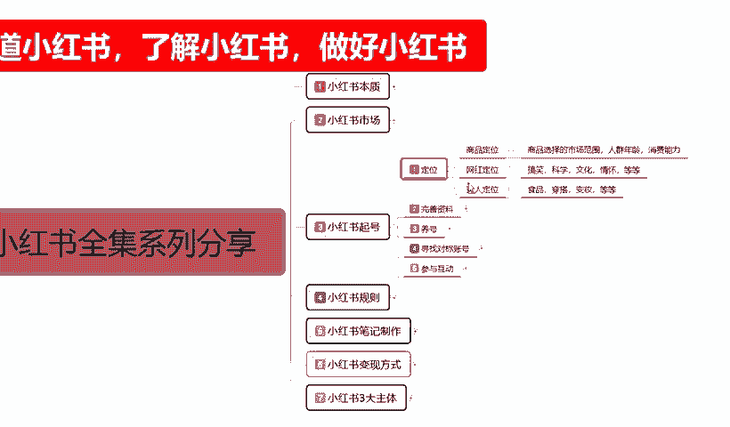
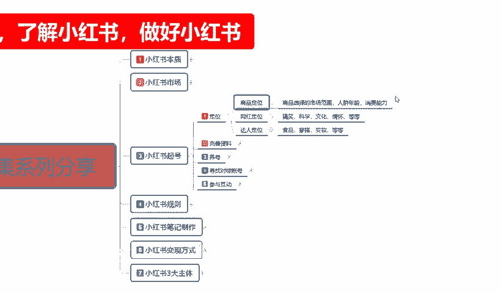
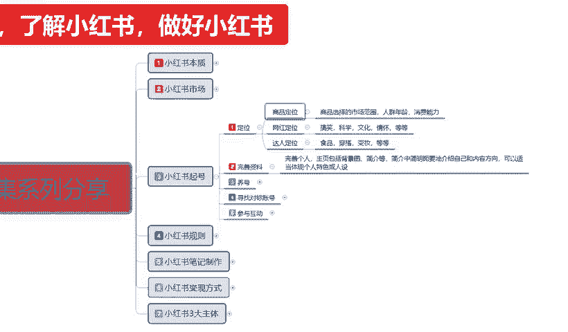

# 140分钟学会小红书运营-原来打造爆款笔记这么简单！！！小白零基础入门必学的小红书笔记公式拆解，最简单的起号教程，快来学！！！ - P18：06、新手小红书运营-小红书起号（1） - 红书教程1 - BV1o629YMEjv

大家好，今天给大家分享的是小红书全集系列的一个整体分享。第三大课时啊，小红书的一个起号。呃，包括之前给大家讲解的小红书的一个本子，小红书的市场。我们了解本质市场以后的话。

第三步我们就是要给小红书账号起号。为什么说是上号起号呢？如果说我们之前已经了解过小红书操作过小红书的呃，朋友呢？

你的账号如果说定位跟我这节课有冲突的话，我个人建议的话，大家是重新起一个号。如果说你有一定的数据量了以后的话，嗯，定位有偏差。这个里面的话它也是可以改数据的啊。

我先给大家把这个小红书账号起号里面一个改数据给大家说一下啊。呃，大家稍等。呃，首先呢小红书起号这边呢有一个改号的一个设定。本来呢是想给大家放到后面去讲的。但是的话呃因为针对于小红书起号里面。

它包括一个定位一个资料，完善养号和寻找对包对标末的一个账号，包括参与互动。在这个里面的话，我们有些朋友如果说听我这节课以后的话，他可能会已经做过小红书或者说是没做过小红书的朋友啊，没做过小红书的朋友。

呃，建议大家就是把这一课听完以后，整体全部听完啊。这5个内容点，全部听完以后，你再去自己小红书创建账号，然后根据你自己想做的一些内容，去完善你的一个账号的部分的一些内容。如果说已经有号的朋友的话。

我建议大家的话就是说你最好的话是根据自身的一个定位，把自己的一些呃属性都给改一下。这个属性在什么地方改，我先给大家说一下，首先是我们进过小红书以后的话，直接到我的主页我的主页链。页面里面去啊。

然后点击那个。设置。设置的话在什么地方？在我们。编辑资料旁边那边有一个那个色单钮，点进去以后的话，里面有一个内容偏好设置的一个调节。在这个里面的话可以设置我们自己的一个。喜爱的一个偏好啊。

在这个里偏好里面的话，它有一个更多的一个调节内容。就说如果说你们要做呃足球配饰、婚礼准备等等，这里面都有啊。这里面的话推荐的它这边给我账号显示的一个推荐是体育运动、时尚兴趣才与生活、家居、人文等等。

这些里面的东西，它都是大范围的一个定位。我们准确定位的账号的话，就说我们小红书，你想把它做起来，整体做起来的话，不需要有那么多内容。你选择一个到两个的一个组内容去推广就可以了啊。这个就是。选择我们。

小红书账号定位里面的一个。内容偏好调节是调整我们整个账号的一个权重权重和那个推广给我们的一个人流量的。好吧，如果说我们做商品之类的货呃，人群可能稍微广一点。但是你做定位，做引流之类的。

那么你的人群的话一定要把它做准。好吧，这是一个小方式给大家先讲解一下。嗯，接下来呢我们直接进入我们本科的一个正题。小红书起号啊，小红书起号的话和其他的平台它是不一样的。你起号它就有选种。你不起号的话。

怎么说呢？就是说你按照流程去做的一个起号。他在前面我也给大家讲过了啊，小红书它的一个本质的话就是说它和别的平台不一样，别的平台是你做了权重以后。做了数据以后，你的整个账号，整个店铺，整个商品。

或者说是你的整个数据链，它才有权重。小红书不一样的。你上来，你如果说它就是根据你设定的。小红书创建账号支出，你设定的越前面，你的定位越精准，它给你的一个数据量也就越准。也就是说它从第一步就开始。

已经给我们在划分我们的一个等级了。所以说我们在小红书起号里面的话，一定要注意了啊，自己的资料一定要完善。如果说你不完善的话，你后续的一些操作方式。他导进来的人不准确，你发放出去的资料，别人不感兴趣。

没人看，对吧？你的点点击率拉不起来。暂时拉不起来。收藏加购没有，那你这个号你想把它做包的话就很难很难啊，基本上。简单的说，第一步做不好，你后续就没有后续了啊，你准备换号吧。😡，有权重的朋友。听完了以后。

如果说你觉得你的自己资料不对，可以去修改一下，但是也不能修改的太频繁了啊。如果说没有起号的一个朋友的话，呃，你们起一下号。按照自己定位的一个方式去走。然后这个里面的话就说起号了以后。想把这个号不要了。

换掉，也重新起一个号。说实话，因为你重新起号的话，比你换资料的话要好一点，好吧。那首先我们了解小红书起号的第一个定点啊。

定位。

什么叫定位呢？小红书里面的话，我们这个这里面我给大家列了三个点，第一个是商品定位，第二个是网红定位，第三个是达人定位。就是说你在小红书上面，你到底要走什么？什么样的环节，什么样的路子啊。

商品定位商品选择的市场范围、人群年龄和消费能力。这个里面的话，他说实话呃，内容是非常大的。然后第二个是网红定位，第三个是达人定位。就是说我们从这三个人里面三个方位里面，我们要选择一个定位的一个方向去走。

因为它每一个定位的话，它对应起号的时候，他所选的内容都是不一样的。你比方说商品定位的话。我们在商品定位里面选中。它的一个整体选项的话，也就给我们限制的很死了啊。因为商品定位它本来商品的话，你无非就是。

嗯，家居家装时尚。然后还有美食、美妆、数码科技这几个大的一个品牌。如果说你要做亲子啊，要做宠物啊，或者做其他的一些商品的话，也可以，就看我们自己怎么去定。就所以说我们在选择商品定位的时候。

一定要把自己的账号，前期的一个偏好设置啊，我们自己的兴趣偏号设置一定要选对。商品定位的话，我们前期选择三个定位的时候，根据你的商品范围选择最精准的三个范围就可以了。这是第一个商品定位，网红定位什么？

搞笑科学文情、文化情怀等等也是一样的。包括达人啊、食品穿搭便装等等。达人的话，其实和商品定位它是有一点那个偏重叠的。但是说达人的话，他只是说是介绍我们的一个食品是否好吃，穿搭是否合理。

变装是否有效等等啊，商品定位的话，前期我们如果说直接去做商品的话，小红书上面你想把商品直接做起来，你必须要把账号起起来，账号起起来以后，你还有一定的粉丝权重和属性权重。你而且发笔记的时候。

你还不能直接发商品笔记。商品笔记没有权重的啊。这里面我给大家说说清楚啊，说定位一定要准确。你定位不准确的话，我们包括后续的一些能力啊。规则范围的话，我们是没办法去操作的。这里面我只是说给大家。

几号做了一个大概的一个定位。后续的话我会再给大家详细讲解一下我们定位里面需要注意的是什么啊，市场的范围、人权、年龄和消费能力。我在这里呢只是说给大家先把三个点固定下来。我们从这三个点里面的话。

只能选一个去操作。因为你三个都做的话，不可能最多做两个。做达人带货。啊，店铺里面有卖产品，你要是做三三项全做的话，你。做不到的啊，一个人群混乱，第二个属性不集中，你可以多做几个账号，你可以。

按照这种方式走。但是如果说你就个人的话，我建议大家只做一个内容。因为三个定位的话，三个节奏它操作的模式和节奏它都是不一样的。你商品定位本来就是。自己有商品，在小红书上面看有没有市场，给自己扩展一下思路。

扩展一下渠道。然后的话把商品拿到小红书上面去卖。那我们发展的话，你前期肯定是以以牛魔兽为。什么样引年陌杀？就是说我根据我的商品编辑一套程序，然后的话把访客先留住，然后去宣传我的商品，通过这种方式去做的。

用网红定位的话，那就不一样了。网红的话，你无非就是搞笑科学文化情怀等等。你是给别人创造机会，创造搞笑，然后以接广告的方式来进行变现。这是网红定位。达人定位的话，你食品穿搭便装等等。

是以直播或者说是以文案内容的一个形式给别人做一个产品介绍。他也是通过接广告或者是托接宣传类的。一个方式，所以说你定位做不准确的话，你后期操作你比你本来想卖商品的，结果你觉得商品不好做，我后期想做网红。

对吧我粉丝还可以，但是我商品卖不出去怎么？我想做网红，你然后再去转变店铺的性质的话，他不好转的，知道吧？所以说前期定位一定要准确，所有把定位做好了以后的话，我们后续你才好继续跟进的一个操作。

如果说你前期定位不准，你后续你根本就没办法操作了。

第二个点呢就是资料完善啊，这个的资料的一个完善是什么意思呢？完善个人主页，包括背景简介简介中要简明扼要的介绍我们自己和内容的一个方向，可以适当的体现个人特色，或者说是人设。背景的颜色。

主页的图片选择个人资料的一个完善，个人喜欢的一个类型。越全面越好。因为为我们说实话你定位商品。你是做什么的？对不对？你做这个东西多少年了，卖多少年了，对这个东西都有什么经验？你都了解吧。对不对？

然后了解了以后，别人对你第一印象是什么？决定后面别人进不进入你的粉丝团。啊，会不会持续跟据你的后续笔记或者后续商品的一个产品出卖？啊，你能吸引到别人就靠你的个人完善资料。因为你没办法直接去跟别人沟通。

后续的话我会给大家说一下啊，这个小红书里面的话，它那个变现方式里面，你就是说跟别人跟。其他人用户去做私聊或也好，不是好友，做聊天也好，或者其他方式聊天也好，有限制的限制非常大。

所以说我们是没办法正常交流的。不像微信啊，你跟我说话，我跟你说话，对吧？交流起来多方便，但是小红书不一样，小红书它就是你一个留言版，懂吧？让我们去了解这一部分的内容。所以说你的资料越完善。

别人了解也越深，你资料越不完善，别人对你越不了解。你觉得我这边的话，我介绍了我这十几年的经历，我是做什么的，卖什么产品的等等。然后我们俩做同样的东西，你什么简介都没有，你就是直接把商品放上去。

然后发两个笔记。商品一对比，我就算卖100，你卖50，也是我卖的比你好。技术是区别对吧？所以说资料一定要完善好啊。😡，呃，包括后面的一个养号，寻找对标的一个账号，包括参与互动啊。

在下一节课呢我会给大家进行一个详细的讲解，好吧。那这一节呢就到这里。

