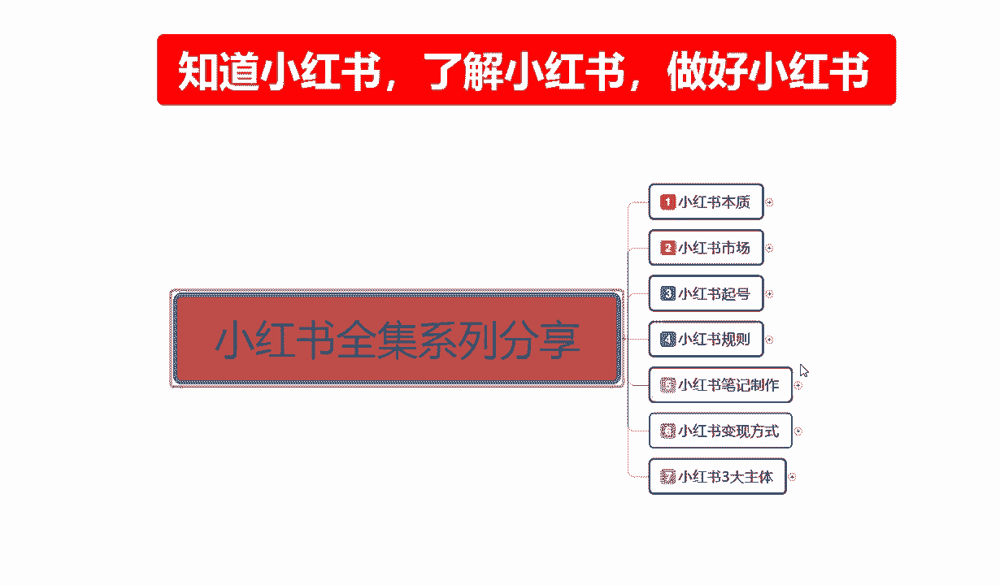
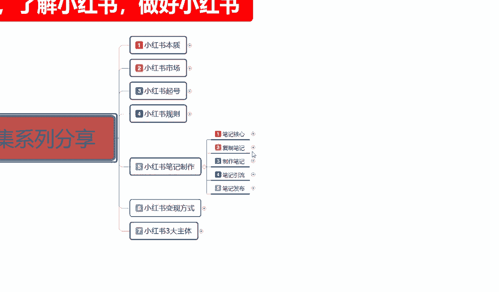
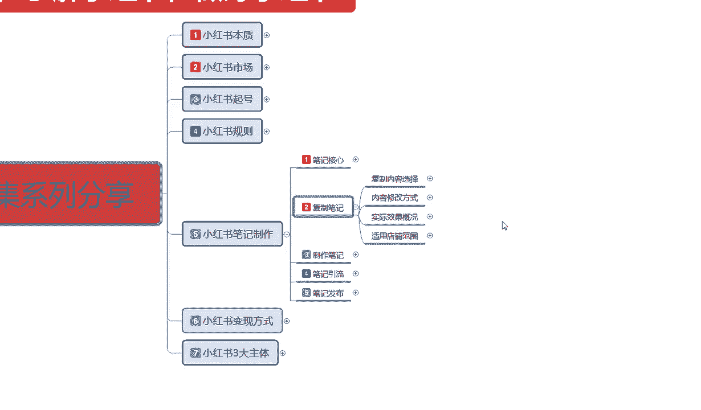
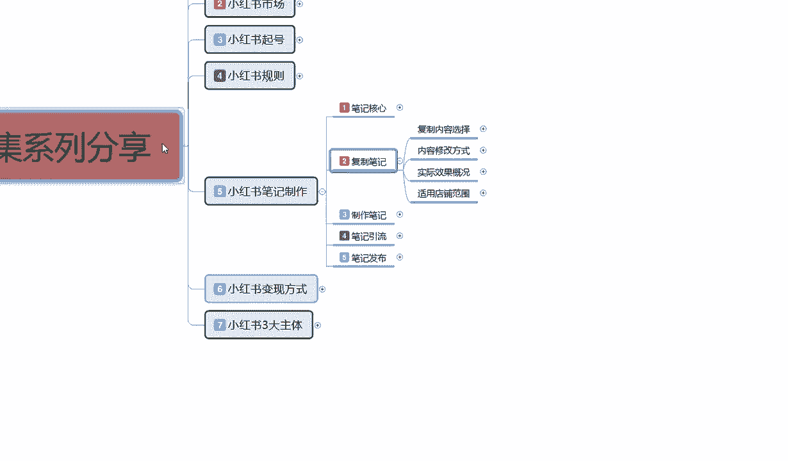
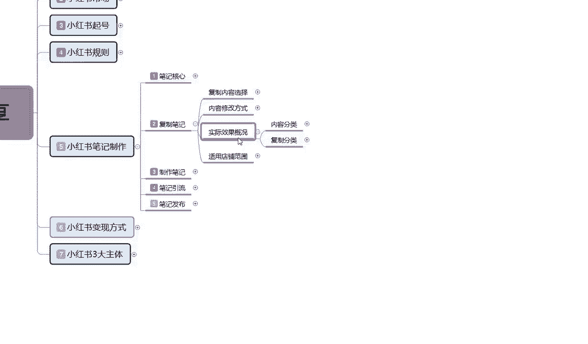
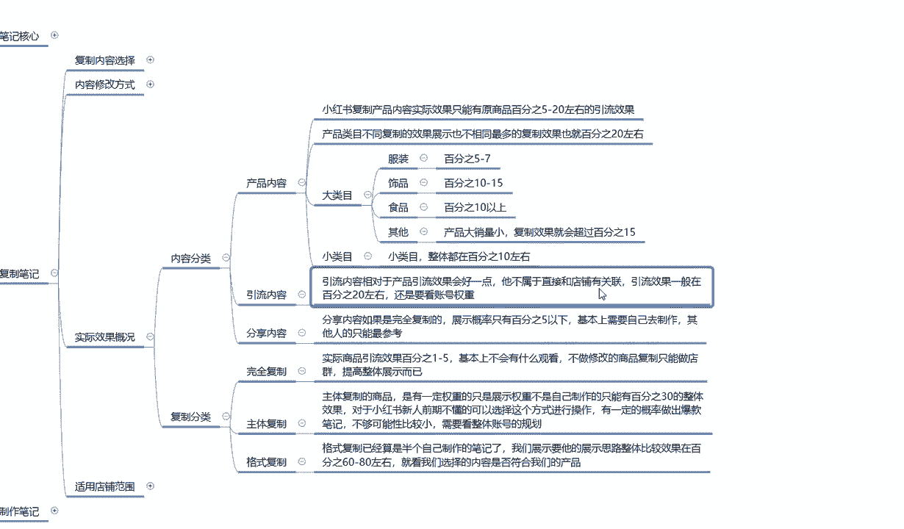
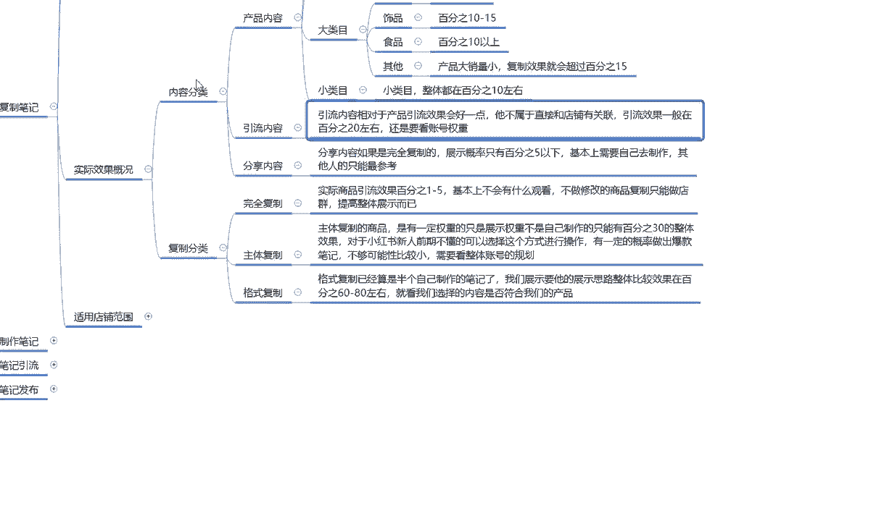
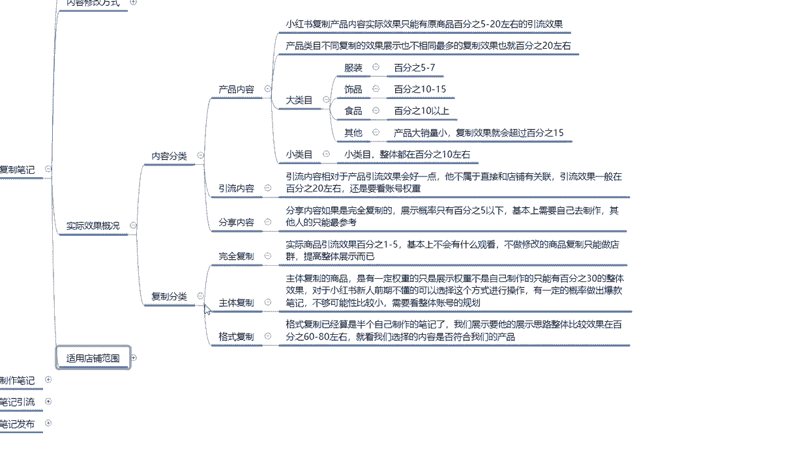
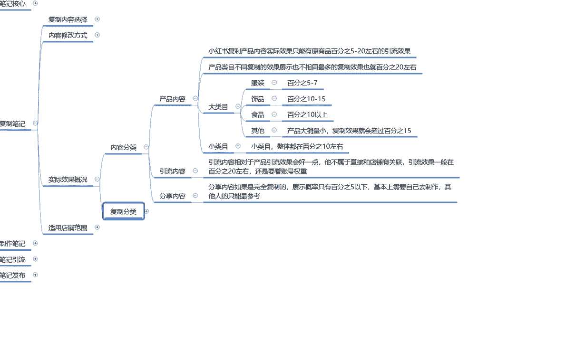

# 140分钟学会小红书运营-原来打造爆款笔记这么简单！！！小白零基础入门必学的小红书笔记公式拆解，最简单的起号教程，快来学！！！ - P19：17、新手小红书运营-小红书复制笔记：复制内容分类 - 剪辑手机教程 - BV1w22EY7EMD

大家好，这节课课给大家分享的是小红书全集系列，第五大课时的，第四小节，主要呢就是给大家讲解一下，我们后续的一个内容啊。

复制笔记里面的一个实际效果概况，包括我们他的一个整体适用店铺范围。

这节课内容的话其实不是太多，但是他对我们前期的一个选择来说的话。

还是比较重要的，嗯首先我们来了解一下什么叫实际效果概况啊，结合我们上节课所讲的一个内容。

就说我把它整体分为了两大部分，第一个是内容分类，第二个是复制分类，内容分类是产品内容，引流内容和分享内容，小红书复制产品内容的话，实际效果只能原有商品的5%，到20%的一个作用，引流效果就是说。

在小红书上面同类的一个笔记，你去复制同同类产品，别人的一个笔记效果，你把它复制过来的话，它整体的一个引流效果，就是只能达到5%到20%，所以说我们在选择复制笔记的时候。

选择的话基本上都是小眼睛在5000以上，5000以上两一直到2万左右，如果说超过这个范围内以上的话，我们再去复制那个别人会投诉的啊，第一个你的店铺会违规，就说不要复制太过于爆款的一个啊，文案和笔记。

你可以复制它的一个内容，但是超过2万以后的，千万千万不要去那个再去复制了，因为这里面的话其实有两点，第一点就是说容易被投诉，导致整体店铺降权，我们本来就是前期刚开始操作，你降降一下权的话。

你后续后续的话就不好操作，第二个就是他的小眼比单个笔记小，眼睛超过2万以后，它的整体流量你把他拉不过来，懂我意思吧，你也只能给他继续增加权重，就比方说他现在有2万，你然后拿他的一个笔记文案的一个效果。

然后你自己做了以后再进行发布，你可以从中蹭流量，我们正常的话应该是5%到20%，的一个流量嗯，拿1万计算，5%的话就是500个，偏移到20%的话就是2000，这只是拿1万来计算。

就靠我们自己选的一个比例效果，但如果说超过2万以后的话，我们整体效果的话可能就是在5%左右，他不会超过太高了，基本上就固定在5%，就是超过2万以后只有5%，而且还面临一个投诉的风险。

同时你还给这个原笔记增加了权重，让很多小云红书的用户的话，他看到你的笔记觉得你是作假的，对你的话嗯信任度不那么高，他会直接跳转到他之前看过的这个片笔记群，懂我意思吧，就是太过网红爆款的那种，不要笔记。

不要去抄，超的话，就是选择在5000到2万这个范围之内，去做商品的一个引流就行啊，这是内容部分的一个选项，产品内容，第二个就是产品类目不同啊，它整体复制效果的话就是展示也不相同。

最多的话复制效果也就是20%左右，就比方说我们选择任何内幕的一个产品，我们去复制它，不管怎么复制，它整体效果的话都有一个局限性，这点呢我也给大家列出来了，大类目里面服装饰品，食品，还包括其他。

就说嗯其他的话就是产品大，销量小，产品大销量小，就相当于那种木质家具啊，定制类的这种啊，他的一个复制效果就会超过15%，其他类的话就是说负伤是5%到7%，服装同类款同款类型的一个笔记自质量。

别人怎么拍的，你把他弄过来放到自己店里面，引流的效果只有5%到7%，也就是说，你选择复制这个行业里面的一个内容量的话，就是嗯同款的爆款比别人有2000，不有2万的一个展示量。

那么到你手上可能就一千一万的一个小眼镜，展示量哦，1000多1万偏多了啊，又1万50%了，基本上只有5%到7%，就是1000~1200左右的一个相应金数量，就是这种类似的一个产品，服装的话效果还算嗯。

因为他的那个大众内部太多了啊，要有就是四品，四品的话就是说它整体的话，因为四品它属于小件，而且省很多样式和款式，所以导致它整体的话嗯别人看见以后，他会以为你的是新的，所以说它整体的一个笔记效果的话。

引流量可以达到10%到15%，食品类的也是一样的道理，他的一个也是在10%以上，但是具体数额的话我们没办法确定，因为食品的话他的怎么说呢，你要是做嗯居家的那种，就是厨房。

我们自己能做的那种嗯类型的食品的话，他的整体搜索量的话可能在15%往上走，二十二十五都有可能，但是概率不大，如果说你我们做那种精致的小蛋糕啊，或者说是美食分享之类的，这种话，就基本上只有10%左右啊。

这就是大类目的一个范围，小类目的话整体都在10%左右啊，什么叫小类目啊，就是搜索的人比较小，你比方说那个什么发泡的鱼啊啊等等，就是说搜索目的很小，整体这个比例在质量的话，大概就在10%左右。

就是原视频有2万，那么你可能的话就是2000，这是产品内容的一个选项，第二个就是引流内容，什么是引流内容呢，引流内容相对于产品的话，就是说因为这个是产品，就是根据我们商品进行发放的选项。

他所得到的一个比例，后面的引流内容的话，它相对于产品引流效果的话，他会好一点，它不属于直接和店铺有关联的隐匿效果的，一般都在20%左右，但是还是要看我们账号整体的一个权重啊，你如果说是基础账号的话。

你全做你复制复制类似的笔记的话，最多升到第二级，可能达到七天的一个引流效果，它的引流的量的话就是20%，你比方说你复制了一个1万的，那么到你这儿的话，小眼睛可能达到1500到2000项啊，就20%左右。

效果还是不错，同样的别人也会增加选中的啊，因为同类型的一个笔记复制的越多，他的权重也就越高额，这里面涉及到一个点，就是小红书做矩阵的，他有很多很多的小账号去帮他做这个举证，也有一定的效果。

但是你要内容是精品的，但是我这一套整整个一套课程，说实话没有给大家讲矩阵，因为的话现在做矩阵的话，小红书做矩阵投入太大啊，不是一般人能做的，不如我在这里呢只说给大家啊，提醒一下大家有这方面的意识。

了解什么是矩阵就行好吧，然后呢是分享内容，什么是分享内容呢，分享内容的话嗯，如果说是完全复制展示概率的话，只有5%以下，基本上就是这个的话，说实话就是需要去自己去制作的，其他人的只能做参考。

就是别人怎么分享他的产品的一个介绍啊，特点啊之类的东西，这个东西说实话，那你复制过来也没用，基本上都是根据产品嗯，本身店铺的一个产品也好，或者根据自身的一个属性和内容去，你就说你网红博主。

你不可能完全去复制仿造别人模仿啊，你做模仿秀的话，现在虽然说很火，但是你没有一定的特长，你做不了，所以说整体的一个分享内容，我们去做复制的话，效果不好，只有5%，最高的也只有5%，所以说这这个分享内容。

还是大家自己做比较好一点，这个呢就是内容分享里面产品引流三个点啊。

给大家进行了一个效果分析，就说我们前期做的时候啊，你选的时候让大家明白，你自己的店铺不是做不起来啊，让大家明白你的店铺不是做不起来，只是说我们把别人的东西复制过来以后的话，肯定是没有原创的一个属性，高。

懂我意思吧，就说我们不管怎么去弄，把别人的东西复制过来，他的属性的话永远不可能有别人原创的高，偶尔有那么一两个复制的产品比原创的高，但是这种概率的话太小了，不要去赌这个概率千分之1万分之一的概率。

你去赌，你还不如去买彩票呢对吧，这个就是整体的一个实际效果概况啊，包括后面一部分的一个复制分类，那因为课程的一个时间原因，这一课呢就不给往大家往下面讲了。

大家这一部分的话，主要是先了解一下我们的一个内容分类，下一节的话就给大家讲一下我们父子分类，还有我们最后父子笔记的一个内容，适用的一个店铺范围。

