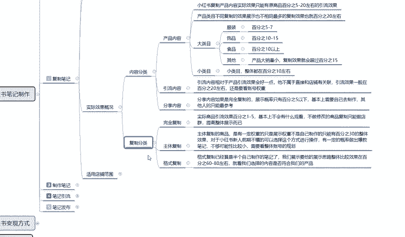

# 140分钟学会小红书运营-原来打造爆款笔记这么简单！！！小白零基础入门必学的小红书笔记公式拆解，最简单的起号教程，快来学！！！ - P19：18、新手小红书运营-小红书复制笔记：适用店铺范围 - 有点像大哥Seven - BV1pY2vYcEf2

大家好，这一节给大家分享的是小红书全集系列的。第五大课时，父字笔记内容的第五小课时也是最后一节课时啊，父字笔记内容里面的最后一节课时。呃，主要呢是给大家讲解一下我们后续的一些内容。

嗯，包括实际效果概括里面的一个复字分类和。整体复制笔记它通用的一个店铺范围。呃，废话不多说，直接进入我们的一个正题。上节课呢已经给大家讲解了啊，就是说我们按照内容分类，我们去复制别人的一个小红书作品。

过来以后啊，它整体笔记达到的一个效果。

这节课的话就是说负子分类。里面它还有完全体复制主体复制和格式复制。因为之前也跟大家说过啊，三个主体复制，它实际性实际用的一个效果亮度是不一样的啊。完全体复制就是说实际商品引流效果的话。

它整体引流效果只有1%到5%，基本上不会有什么观看，不做修改的商品复值的话，只能做店群提高整体展示而已。就说我按照我教给大家的方式。这种的话，我们可以避免95%的重复商品以后的话。

它还是有一定的访客流量。但是这部分的流量的话是不大的。嗯，正常的话。你能复制5%左右。到10%左右，就是你进行修改了以后，完全你复制。你进行修改了以后的话，大概可以有5%到10%的一个实际效果。

就是通过商品啊进入我们店铺的。意思就是。对方小红书每天有500个访客，那么你可能就有20个左右。懂意思吧？但是成交这个概率就不好说了啊，因为成交概率的话要通过你的产品价格。

包括你的呃产品类目里面的一个销量价格活动。质量，还有你自己的一个描述去讲解，它只能达到一个引流的效果，它不能达到成交的一个效果。你不管怎么去复制别人的产品，它都不能达到成交效果的。

所以这个点大家一定要注意啊，它实际商品是达到引流效果的1%到5%，就是完全你复制，不做修改，你修改过后的话，基本上就是5%到10%啊。这是得到的一个实际效果。说实在的嗯，我们按照正常的来计算。

就是你复制了一篇一万小眼睛的一个笔记，商品笔记。他的一个整体展示量的话，在他店铺里面可能达到。200到300的一个访客。但是通过我们分析的话，就是稀释以后。

因为我是负我们是复制他他他的一个产品的一个笔记，包括他的一个文案和内容。过来以后，本来就是。200。他能达到200的一个访客，但是到我们这边的话，我们可能只有20个访客。20个访客，因为他在往下面计算。

他整体是实际商品的一个引流，我们只能达到1%到5%。那给我们引流的一个访客也就在5个左右。懂意思吧？就是别人一天可能赢500个访客，但是到我们这边来的话，可能就是3到5个5到7个。通过这一个笔记进来的。

啊。为什么说复制比小红书上面做原创稍微好一点？但是做完全那些复制的话，它的访客量，你负制一个爆款的一个访客量过来，那每天给你的一个。商品房数也就在3到5。主体复制主体复制的话。

跟跟刚刚呢我给大家介绍的一个模式差不多。主体复制的一个商品的话，它是有一定的权重的，只是说展示权重不是自己制作，只能有30%的整体效果。对小红书系你前期的话，就是说对我们前期不懂的人来说的话。

选择这个方式进行操作，有一定的概率做出爆款比啊，不过可能性的话比较小。这个概率的话，你按概率学算的话，这种30%的一个概率。别人做出来可能100个笔记里面报一个。那么到你这的话。

可能就是3000个比1保一个。3000分之1的概率。概率不够小，要看要看你的展示文案一，二要看你的运气，运气好的话能保运气不好的话，同类的1个3000个笔记，你觉得要多久对吧？

虽然说小红书的一个笔记内容，每天更新的是非常多的。但是3000个报一个，轮到你的时候，估计也是10天半个月1一两个月以后。啊，而且还看你的店铺选中，店铺选中没做起来，你想包都包不起来。

还是要看整体店铺的一个规划。不过我们拿他的一个主体负责做去去做。店铺前期的一个规划做起来以后再去修改我们小红书笔记的一个内容的话，整体店铺还是非常好做的。最后一个呢就是格斯夫子。

格斯夫制已经算是半个自己制作的一个笔记了。我们展示要的是他展示的一个思路和整体比较效果。就是说它整体的话就是按照格式复制，我们去把它的一个内容全部复制下来以后，自己再去发笔记。

整体效果的话可以在60%到80%之间，这也是效果最好的一个。就是我们选择内容是否符合我们的产品就可以了。把它的一个格式模式全部套过来，然后把我们的产品放上去，再把内容稍微修改一下。按照这种方式的话。

格式复值我们其实只占了30%到40%这个复制量。啊，就父子比按百分之百计算，我们只占了30%到40%的一个量，剩下50%或者也好，60%也好。70%呀都是我们自己制作的。

对吧他已经可以算是我们半个自己的笔记了，它的整体效果可以达到60%到80%。笔记爆款的效果可能有70%。就是同类型的一个产品，它的爆款率可能是分之百%，到你这就有70%。

它的整体效果也就是我们在做复制笔记的时候，效果是最好。但是它有一定的上锁难度。对于新人玩家来说的话，呃，难度可能会大一点。对于老玩家来说的话，可能就有自己的思路，我知道自己只要他的一个模板，对吧？

比如说今天怎么怎么着啊，然后把下面的文案给他列个列个几条，列个五六六页，然后把你。他的内容复制过来，然后把主题改一下，把内容的。他所展示的这种改成我们的一个内容，然后把那图片换成我们的图片。

这种方式去操作的话，整体效果可以达到60%到80%。也就是最适合我们父制。做精细店铺的一个方式。

这个就是复制笔记的整体的一个实际效果。最后呢就是他的一个通用店铺的一个范围啊。这个还是比较简单的，为什么？只是说告诉大家啊这三个模式。完全体复制主体负责和格斯复制，它适用于什么店铺？完全体负制的话。

他这个的话就是说嗯你做店群可以通过多店每天上传的一个笔记每天的话就是。重点每天每个笔记不超过两，每一个商品不超过每两篇笔记，店铺笔记不超过5，他必须要去做店群，你才能把店铺做起来。你不做店群的话。

你就完全复制的话，你店铺基本上是做不起来的，而且会打乱你整个店铺的一个属性状态。主体负足的话就是说它适用于新人，整体的话想出操作起来的话，比其他平台还是。相对要简单很多。所以我们在操作小红书的时候。

用这个方式可以快速的熟悉我们前期小红书，它给我们流量来源方式方法，还有我读取我们店铺的一些数据，做过渡可以，也就是前一个星期。用这个方式是非常不错的。后后面接近两周左右，14天到15天左右的话。

用格式注制。因为我前面7天我已经了解到整个小红书的一个规则和变化。而且我对我自己宣传产品有一定的了解了以后，就可以用第三个模式。他的话适用于一定有经验，但是没有固定产品固定来源的人啊。

降低整体的一个需求成本和投入。使用一键代发去操作，有一定自己操作经验和店铺的一个构思就可以。这个的话。方式是很简单，但是你要有思路才行。你没思路的话，说实话前期先做主体。做主体做熟悉了以后的话。

你后期做格式复制，你就有思路了。你知道别人怎么排版的，怎么编文案的，怎么写数据的，怎么做图片呢。你有了这个数据以后，你再去做格式复制是非常好的。就是前7天做这个。7天以后的话，大概两周左右做这个。

再玩两周以后的话就要做制作笔记了啊，就是纯笔记用我们自己。前面只是以它整体复制笔记来说的话，它的整个使用效果时间段就是小红书刚开店，我对这边不熟悉，我想了解一下，用这个方式去做是最好的。好吧。

我们前面你直接上来，我就说我自己要制作笔记，我要有我有商品，我要推广，我要做什么。拿这个比喻去做。我说实话，你还不如先做父子一项，你先看看别人怎么做的，因为你盲目的去投入。啊，第一浪费时间。

第二浪费金钱。第三会消磨你对小红树的所有兴趣。你觉得这个平台我自己带产品，我带着资金，我带着人员过来设备过来了以后，我去小红书上面，我自己做笔记，然后去推广，但是没人看。这是区别知道吧？

就是说我们在了解不了解小红书的情况下的话，不要去盲目的进行一个整体投入啊。包括我这为什么说主题给大家选的是知造小红书，了解小红书，然后才是做好小红书。

对我们不。怎么说呢？就是对我们思想上面不熟悉的东西，我们一定要对他进行充分的了解和分析以后，你才能去接触这个行业。你不能说像我们刚刚呃以前吧。大学刚毕业也好，初中刚毕业也好，小学刚毕业也好。他喜于关毕。

就是高中刚毕业也好，你刚步入社会以后的话，对什么都很新奇，觉得我能行我无敌，对吧？结果出去。找个工作，3000块钱一个月都困难。所以有些时候你要我们要先自我认知啊，你才能去做好其他的一个内容。

复制笔记的一个方式的话，就是让我们先了解小红书。它整体一个运营规划的一个思路和流量的一个来源结果。啊，我们弄好了以后，再去自己制作，自结合自身的一个能力，再去进行自我推广的一个宣传，才是最好的一个方式。

好吧，那这节课呢也就给大家讲解到这儿。下一节课的话给大家讲解小红书笔记制作第三大点啊，我们自己怎么去制作笔记。

那这节课能就到这里。