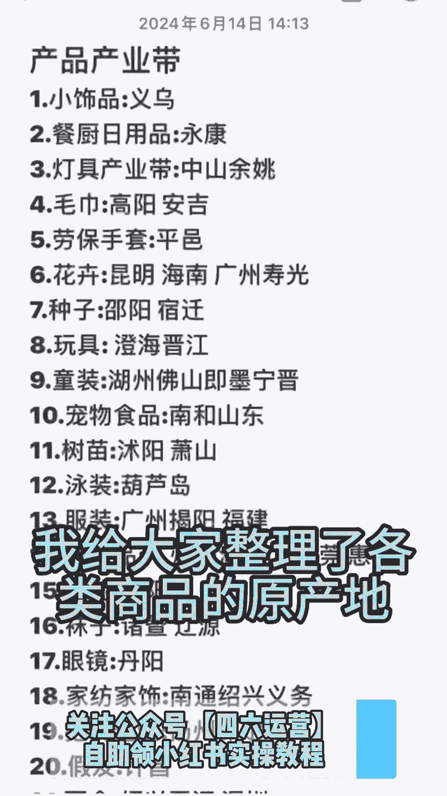
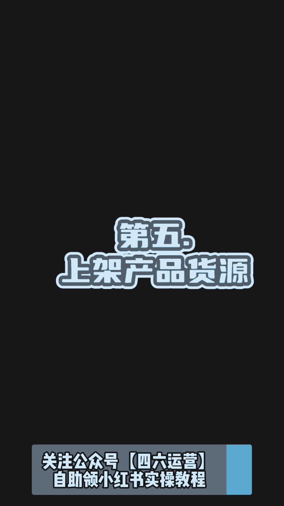

# 140分钟学会小红书运营-原来打造爆款笔记这么简单！！！小白零基础入门必学的小红书笔记公式拆解，最简单的起号教程，快来学！！！ - P1：小红书开店从0到1 - 剪辑手机教程 - BV1w22EY7EMD

启动资金1000，三个月回本5万，再加一个人，我是怎么做的，其实很简单，今天来给大家分享一下，我是如何用1000块钱把网店做起来的，开网店不需要露脸，不需要粉丝，不用囤货，真的不难，难的是你要坚持。

新手朋友可以收藏，反复观看，第一学习小红书推出了很多电商课。

如果你是新手，那你一定要去看看，搜索电商学习中心就能找到的，第二开店，首先点左上角三条杠，来到创作中心，再点开通店铺，现在零元零粉就可以开店，个人店是免费的，保证金，前期可以先不交，等你出单了之后再交。

第三选品就是想好你要做什么品，这一步直接关系到你能不能做起来能赚多少钱，贝多选品软件是收费的，我分享两个不花钱的选品方法，第一个是商机中心选品，可以选出想买的顾客，多卖的商家少的商品，打开小红书。

千帆找到商机中心，待机会猎物，这里筛选货源紧缺的猎物，像这种超级紧缺并且成交高增速的产品，就是潜力比较大的，更有机会搞到钱，第二个方法，应季选品，我们可以围绕夏天来选品，比如防蚊防晒美白。

我整理了一份季选品表，需要的宝子可以视频比，不低滴，我第四找货源。

真心建议你不要一上来就回货啊，我们可以先在网上找到一件代发的货源，让厂家帮我们发货，我们要找到真正的源头厂家，首先我们要选择带有超级工厂标志的厂家，再看好评率在95%以上，回头率在30%以上的。

我给大家整理了各类商品的原产地。

按照这个思路，我们找货源的时候输入原场地加产品，这样我们找到的基本都是优质货源了，最后对比下来，有利润空间就可以去问厂家这几个问题了，这里有一个注意点，找的厂家最好不要超过三家。

不然前期地址太多会很麻烦，第五上架产品，货源网站一般都会支持一键铺货的。

帮我们一键把商品上架，点一键上传，选择我们做的平台，这里可以改标题，改商品描述，还能直接加价格，选择设置好后点提交就行了，新品上架后该如何去提升流量呢，确定好你要主推的产品，每天需要去给这个产品做成交。

不能让这个产品挂零，第一天破零做动销，把基础评价，基础销量做起来了就能出单，别看我现在好像挺成功的，我刚做这一行的时候也是一窍不通，之前在电商公司上班，还经常被骂，所以说大家都是从不会到会的。

我也祝大家都能通过自己的努力。