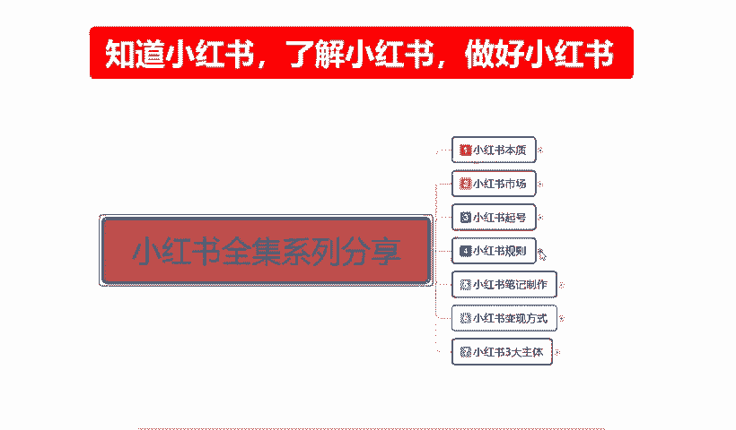
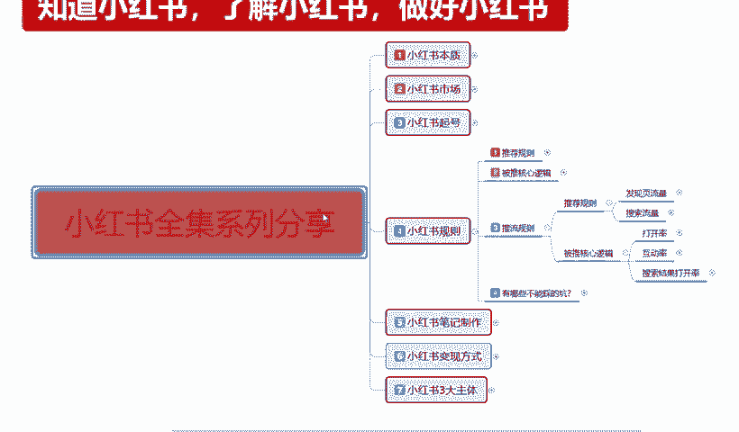
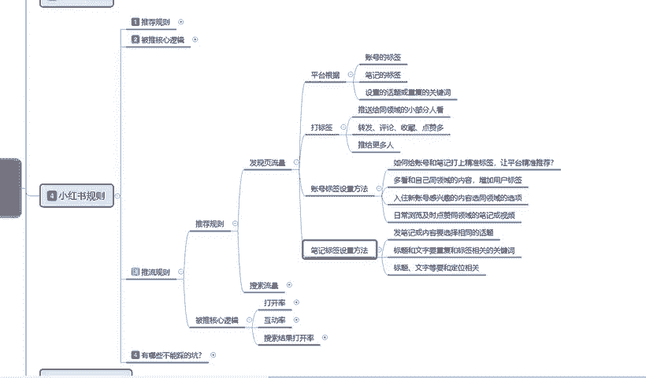

# 140分钟学会小红书运营-原来打造爆款笔记这么简单！！！小白零基础入门必学的小红书笔记公式拆解，最简单的起号教程，快来学！！！ - P22：10、新手小红书运营-小红书规则（3） - 红书教程1 - BV1o629YMEjv

大家好，今天这节给大家分享的是小红书全集系列分享的第四大节课程。小红书规则里面的第三小节。

这节课的话主要给大家分享的是小红书，它整体的一个推流的规规则。

什么叫小红书推流规则呢？就是说小红书。啊，根据我们店铺的账号，或者说是根据我们网络也好，网红也好，引流也好，它都是根据我们的一个账号权重进行的一个推流。那他他它整体的一个推流规则啊。是什么样的呢？

首先我们了解一下啊，他的一个推流规则，首先是发现流量。发行流量它是根据平台啊，平台的根据的话是账号的一个标签，笔记的一个标签，设置话题或重复的一个关键词进行筛选的。这个里面他怎么去解析呢？首先。

我们账号前期就是我之前给大家讲课的时候，小红书旗号啊、市场啊、本质啊分析这些内容的时候。小红书的规则，它就是根据我们起号的时候，这些账号标签进行设定的。比方说我里面的一个内容文案啊，一个账号的一个设置。

一个兴趣爱好的一个选项。这个就是账号标签。笔记标签的话就是说我们所发布的一个笔记对应适应的一个人群。这个私营人群他是怎么调整和选项的呢？就比方说我们发随便发布了一篇笔记，笔记的内容选择的话。

我们随便拿个。服装吧。因为服装的话，这个是属于大类目，或者说是我们拿呃。化妆品一类的也行，知道吧？就说我们发布了一这样一篇笔记以后，小红书会判定我们的品笔记它属于什么样的一个类型的人群。它呢是通过什么？

如果说你发的是产品笔记。啊，产品笔记或者说是不带产品的笔记，这两种都是不一样的啊。产品笔记的话，它只会推广给搜索里面。别人说。呃，用户用关键词进行搜索以后才能看到你的产品。但是有一个引流笔记的话。

它是不需要的啊，就是不带商品，直接发放。笔记笔记的话。发数据以后，我们在里面再引导用户来去搜索我们的产品，这是两种选项。但是这两种选项的话。

它的一个笔记标签就通过这种方式去判定我们用户所选对应用户所选的一个年龄消费成绩。年龄是什么呢？18到数345岁之间，你在这个里面发布的一个产品。

你的产品是卖给18到24、24到28、28到35这三个年龄段。嗯。当然我这个年龄段的话，我是随意给大家划分的啊，正常的话它都是有一个成嗯年龄段划分的，应该是18到24、24到26、26到3030到35。

按这种形式去划分的，我只是随意给大家做了一个介绍。然后通过你笔记适用的一个年龄。在这个年龄段范围的用户点击你这个笔记，观看的人数越多啊，那你后续的话，平台他就会根据你笔记进行一个标签定型。喜欢你的一个。

嗯，发所发布的笔记内容的用户进行推流。比方说你发的是30到35岁的一个笔记，点击率对比30岁以前的一个笔记比例达到了40%以上。那么他后续的话就会尽量的给你推30到35岁的这一批比及用户爱好者。

他是按照这种笔记的一个标签。去分序的啊，首先是账号标签，账号标签之后就是笔记表签。最后的话就是设置的话题和重复的一个文键池。呃，话题里面我们发布笔记的时候不是都有一个笔记标题吗？

你笔记标题里面所选的关键词的话和重复搜索类的一个关键关键词就是。你比方说我们呃发了一个。儿童。暂时培养。对吧那他后续只要说是搜过类似关键词的，或者是观察过类似关键词的一个词汇。他点进去以后。

小红书就会对这些用户进行自动匹配。那你的小红书笔记发放出去以后，你的标题里面附带这些关键词，系统也就会对应的再匹配给你。它这是三重匹配啊，先装好标签，然后笔记标签，最后的话就是我们的一个关键词标签。

通过这三种标签来给你推广精准流量啊，它的一个整体的话就是。我们在发现一些流量的时候，不是说你的笔记做出来以后随便发送上去啊，它是有根据给你选择进行排序的。他的一个人群定位的话是相对于你就算是抖音也好。

淘宝也好，拼多多也好，它的一个精准流推流，它比这三个还要严重。嗯，这个的话对于我们商户或者说是对我们卖家来说，或者对于我们网红博主之类的来说，它是好的一个选项。但是对于我们用户来说，它不是一个好的选项。

因为我可能的话今天对这个新东西感兴趣，但是我以后搜基本上都是这这一类的东西，我可能就会对这个平台的话嗯。怎么说？就有点松，除非我们主动用搜索把我们的标签形态改变。

但是这个搜索改变我们标签形态的我最少要3到7天。才能改变用户的一个标签形态啊。当然这不是我们操心的啊。我们如果说真要想把讲付书做好的话。

我们就要根据他的一个三三个啊平台根据的一个三个标签来定位我们店铺的一个。笔记标签，我们不管是桌店也好，你做网红也好，做博主也好，你首先你要确定你自己的人群是什么啊。

这就是我之前给大家一直强调的一个主体内容。第二个就是打标签，我们怎么去打啊。打标签，它是用平台，是跟我们的一个账号进行打标签的啊。第一个推送给同领域的一个小部分人观看啊。转发、评论、收藏点赞越多。

那么你同类型的一个标签也就越明显。他就会推给更多的人。也就是说我们前面如果说我们把这三个关键词。系统所需要的三个标签关键词全部做到位以后，他就会。退给同领域的一个小部分人观看，为什么说是小部分人？

他不可能因因为你整个账号权重是不高的，他只是说暂时性的选定通过这三个方式选定了一部分啊，可能有100万人，选定了一部分2000到3000个人。因为你是信号没那么高的权重。如果说你的权重高的话。

可能就是1万2万。啊，这是根据账号权重来的。通过这些类似的人打的标签推送给他们以后，他们如果说在同领域内小部分人观看以后，他的一个点击率。点击转发、评论、收藏、点赞。这些数据越多。

后面就会给你推广更多的流量，这就是我们需要做做的啊，流量它是有成级的。包括后续我会给大家讲小红书笔记里面，它还有一个流量成级的啊，这里面内容是非常多的。通过这种打标签的方式，他推给更多的人观看以后。

因为他对这个部分的一个内容感兴趣。感兴趣的人他才会去找这个内容的产品。比方说如果说我做了一个食品的，我，但是我的一个笔记标签里面是不包含食品的。然后我的账号设置里面也是错的。

那别人给你推荐服装的之类的这些人他不会去点击你的一个笔记进行观看。为什么不是我所要的内容。你本来是要卖化妆品的，他给你推个汽车，你会看吗？啊，偶尔感兴趣的可能会看一下一点兴趣都不敢的，他不会不敢的。

他绝对不会去看。所以说你的笔发上出去也没用。最重要的前期标签你一定要做好，你才有后续的发展。前期标签做不好的话，你后续发展很难。你要想把标签改过来的话，你最少需要。15天左右。前期标签定位很简单。

3天左右，你后续7天改一个小标签，15天改一个大标签。什么叫改小标签呢？就是小标签，它去改变你的一个小红书，它根据平台的一个系统判定你的账号，如果说是属于。服装类的对吧？但是你自己其实不是服装类的。

你是化妆品类的那你要去搜索的话，但是它是所有显示的基本上全部都是那种嗯。服装类的一个笔记推推留给你什么化妆好看，这个衣服穿着好看，这个搭配好看，他推给你这种，你不感兴趣，那你就要去搜索关键词里面啊。

搜索化妆品一类的，他才会给你推。但是他会搭配服装和化妆品给你推。你观看的化妆品越多，偶尔观看一下服装，那么他就会进行一个排序啊。这种排序时间的话可能会达到7天，你要完全把它改变过来。

会以后不出现服装类的，只出现化妆品类的那可能就需要15天的一个。嗯，并未。所以说打标签的时候，前面一定要严谨啊。包括我们前期养号的时候，为什么说让我们去观看同类型的一个产品，或者同类型的一个笔记。

也是为了打标签，先把我们标账号标签做好，再做笔记标签，再做设置的一个关键词，然后推广给给更多的人啊，它是这种方式的话，会给我们更多的流量。如果说这种方式做不到的话，平台他给你2000基础质量。

你人群本来就不准20千0里面你再给你个。七八十个小小眼睛，你点进去了以后，那你这个笔记你做了不是白做吗？啊，效果也没那么大是吧？所以说我们前面一定要把标签做好。嗯，下面呢就是给大家介绍一下那个。

账号标签设置的一个方法啊，还有。笔记标签设置的一个方法。这个点呢我现在呢啊因为课程时间那的原因我就不给不多说。下节呢我再给大家详细的讲解一下啊，包括我们后面的一个搜索引流，还有我们被推的核心的一个逻辑。

好。那么这节课呢就到这里。

