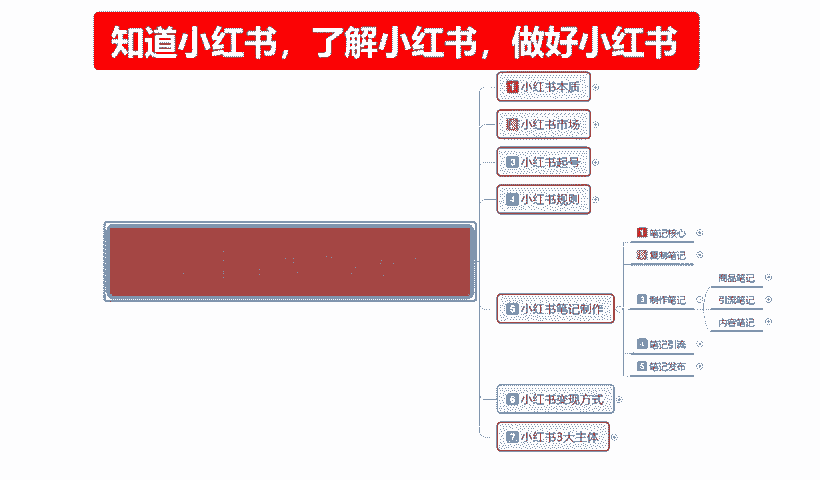
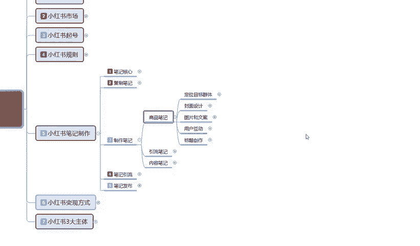
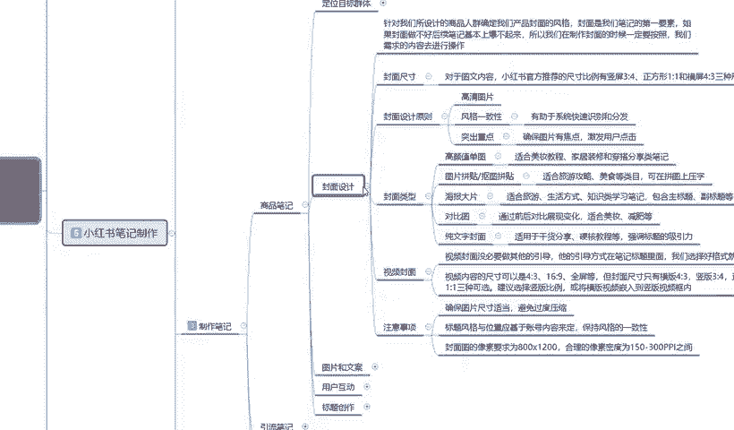
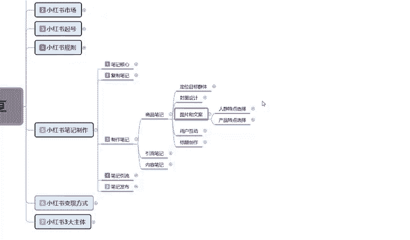
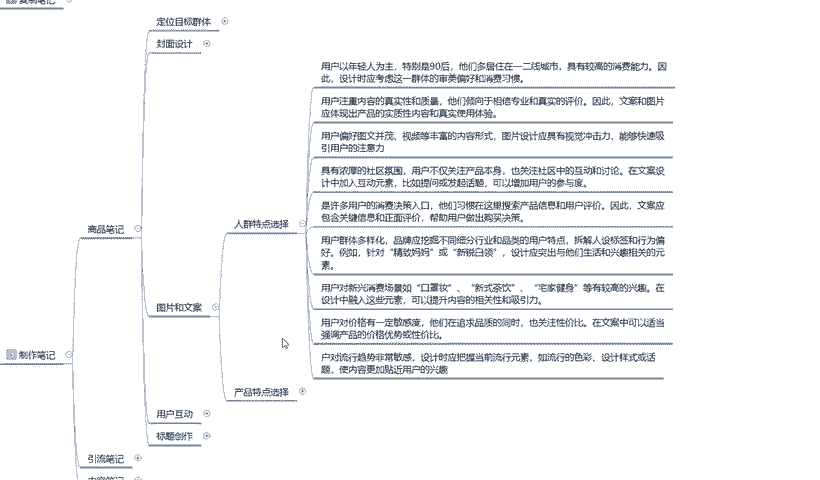
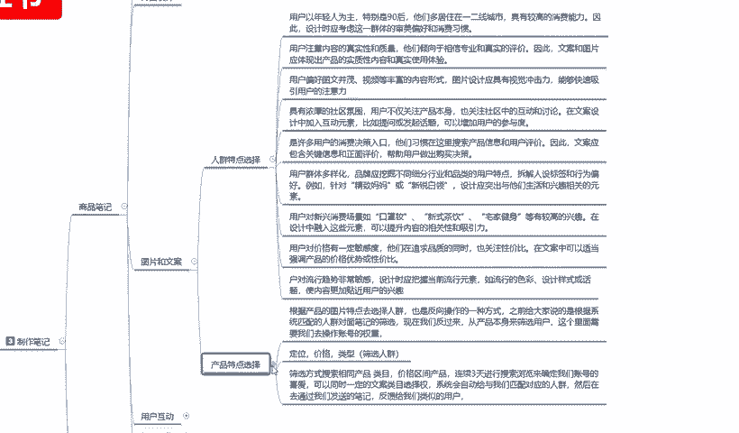
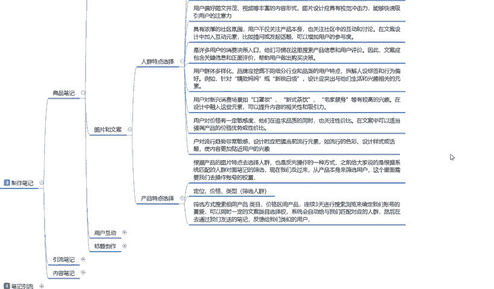
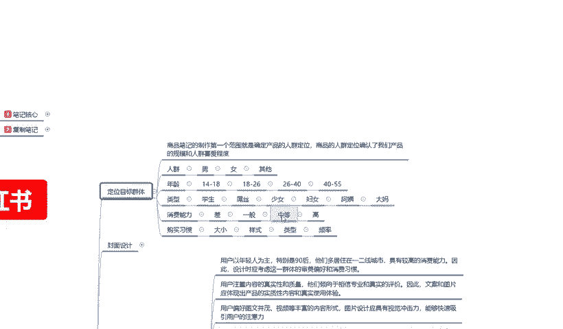
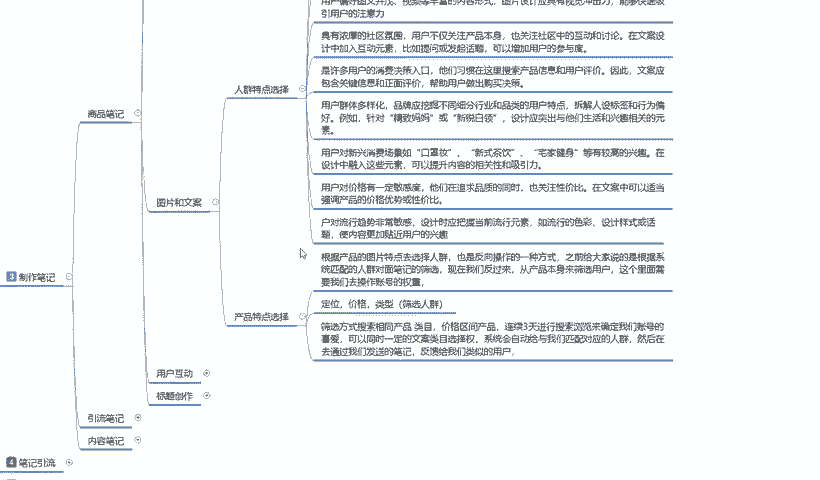
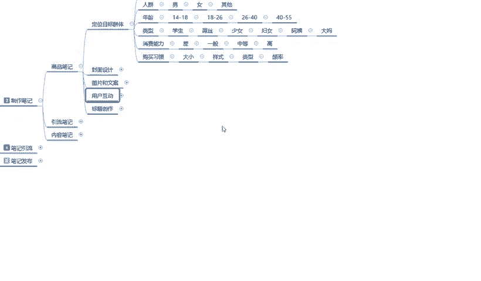

# 140分钟学会小红书运营-原来打造爆款笔记这么简单！！！小白零基础入门必学的小红书笔记公式拆解，最简单的起号教程，快来学！！！ - P22：21、小红书【商品笔记】制作：图片文案设计-人群特点选择 - 有点像大哥Seven - BV1pY2vYcEf2

大家好，今天给大家分享的是小红书全集系列分享的第五大课时，小红书笔记制作。第三小节笔记制作的一个内容。

就我们上节课给大家讲的啊。上节课给大家讲到哪呢？封面设计啊，我们所封面了解的一些呃设计方式和比较适合的一个类型。这节课呢给大家讲解一下图片和文案。

图片和和文案这里面的话，说实话啊，它整体内容是非常大的。但是我给大家。把它优化掉了，就说只给大家讲重点。同时呢要让大家理解一下什么叫图片和文案。首先我们从人群的一个特点来进行进行分析和选择啊。

他只是说进一步的了解我们目标的一个定位群体，让我们。

好确认到底怎么去做，好吧。这先是人情特点的一个选择啊。嗯，小红书用户的话，他是以年轻人为主的，特别是90后，他们的话就说。目标性人群的话，你我们所选择的只要是你在做小红书的购买商品的选择性的话。

它基本上都是在一线二线城市，三线、四线。往后五线城市也好啊，其他城市也好。啊。都比较少，它主要的消费能力集中的话就是一线城市二、二线城市、北上广深。啊。一线城市包括二线城市，各大武汉这种。

大型的一个聚会场所，他们女性对于自身的要求的话是非常高的。同时他们具有较高的一个消费能力。因此，设计的时候就要需要考虑这一群体的审美偏好和消费习惯。什么意思呢？小红书上面它有一个搜索区域搜索啊。

我们展示的时候，它有一个啊推荐。一个搜索，一个同城。知道吧？一个同城。这是三个点。还有第四个点。呃，关注收藏更新的。这个我后续会给大家详细解释，就是说大家现在只要了解这四个点。我们在这个里面的话。

其实每个城市它都有每个城市的特点。同时在小红书上面，每个城市所展示的特点面它又不一样。那我们选的时候基本上都是选一二线城市。但是我们所居住的话，可能是三线城市，四线城市或者是其他的一个偏远地区。

比如说我这边我有我好多东西我想推荐到一号城市。但是我没有这个能力，通过小红书这个方式啊，把我的商品卖给一线城市，二线城市喜欢漂亮喜欢时尚的女性用户或者是男性用户。所以我们在选择时候假如数字话。

它整体都是以年轻女性为主。那么我们在制作笔记的时候。每一个城市它每一个的风格不一样啊，大家要搞清楚一点，城市与城市之间的风格都是不一样的。而且城市与城市之间人的一个习惯，穿搭它都是不一样的。

我们选的时候一定要把它的整体的。位范围弄准确。通过一个城市。辐是到另外一个城市，比方说上海。吃的喜欢甜的啊，他们吃饭也好啊，光砖也好甜的。然后穿着清凉的。保守。对吧虽然说每个城市都有。

但是他们有一部分的区别范围，你做甜品，做食品的，你往上海那边推绝对没有错。对吧你在北京要庄重一点。优雅一点。对不对？你在广州深圳要活泼一点，开朗一点。这个都是产品人群特点选择的一个方式和方法。

我们要往这个方面去靠，就是说我们在选择的时候，制作商品的一个笔记也好，你制作引流笔记也好，制作内容笔记也好，都要往这个方面去靠，吸引他的一个人群。通过这一部分人群反复的进行发酵。我意思吧？

用人群扩散人群。你就是时尚的引导者，你就是时尚时尚的引流者，或者说是美食的宣传者。你要给自己定位的时候，要给自己明确自己的定位目标。第二个点就是用户注重的内容，它是真实性的一个。

质量他们倾向于宣传专业和真实的一个评价。因此，文案和图片应体现出商品的实质性内容和真实的一个用户体验。意思就是说我们在做小红书的时候，不要弄虚作假，因为这帮人非常挑剔。啊，我说句实在话。

小说小红书女性用户。你可以说他们笨。你可以说他们傻，但是你不得不承认他们非常挑剔。所以说一定要满足这个点啊，真实性和质量。产品不够完fi想我上面卖可以买，但是你只能做。一次性过藏，这个号卖两个月废了。

换一个号。但是你有多少时间，多少精力，这种收割韭菜的一个行为的话，在小红书上面你做不长久的。啊，你包括在其他地方你都做不上去。就说我们在。注重点的时候，一定要注重内容的真实性和质量。

同时呢用户偏好的话就是说啊图文并茂什么意思？图片要有文字要有，内容要有文案也要有。缺一不可。根据产品我们自己去划分啊，因为我不知道各位的话，就说看我视频的朋友也好。啊，兄弟姐妹也好。

我们在了解这个一部分内容的同时。啊，你们是根据自己的产品去设计自己的logo也好，自己的产品外观也好，自己的产品美图也好。都是要根据自己去做的，而不是说我只是给大家了一个方式方法和方向。

让大家进行了一个了解。第四点呢就是说什么呢？具有浓厚的社区氛围。像我刚刚跟大家说的，一个人可以传染10个，10个人可以穿染100个。他觉得这个好看，这个庄重这个妆呀，对吧？这个饰品戴着不错。

这个自甲有个颜色非常好看，对吧？这个口红涂的非常漂亮。从这种一传一一传十一传百，从这种方式去累加的。所以说我们要把氛围做好。对不对？我们做图片的时候可能。你可能宣传的话是一个人，但是你想把它做大。

你就要宣传群体。潮流潮流时尚新导向啊。口味独特等等风格你要把它凸显出来。包括后续的这些，大家可以看一下。当然了，我在这里呢只是说啊，通过我所查找的资料和我个人的一个分析给大家的一个建议。小红书呢。

它是许多用户消费的一个决策入口。他们习惯呢在这里搜索产品信息和用户的一个评价。因此，文案应该包含关键信息和正面的一个评价，帮助用户做出购买的一个决策。就是他喜不喜欢你。在这个地方需要我们去引导的啊。

不不要靠用户来引导。这个里面的话就涉及到是人与人之间的一个思想沟通，你要想办法去引导用户搜索你们的一个产品信息。这个的话说实话它主要的话就是说针对内容笔记进行宣传。懂意思吧？通过内容笔记引流到引流笔记。

引流笔记的话，它的一个扩散面比较大。内容笔记的话，它是精美的一个笔记内容。故事也好。图片也好，文案也好，情节也好，通过这种内容的一个笔记，让顾客吸引到了对你的产品，对你的账号。

对你这个人或者对你其他的东西感兴趣。然后观看你其他的一个产品，其他产品是什么呢？引流产品和商品笔记。应该说是引流笔记和商品笔记，然后他们会去观察引流笔记偏多。为什么它是我们流量的主要来源。观察流量笔记。

然后再不经意间发现你店铺的商品笔记，然后去你店铺里面成交。因为小红书它本来就是一个本身就是一个种草平台，而不是收割平台。你不是割草机啊，你想在小红书上面面去拿割草机一茬一茬的割不可能。所以说你要先种草。

等他长大。啊，他自己慢慢的脱落也好，慢慢的接受你也好，你再去更。3拔对吧？这就是你丰收的一个果实。下面呢就是说用户群体多样化啊品牌。说实话，品牌应该品牌的话应该挖掘不同的一个。行业细分和品类的用户特点。

说实话，你们如果是真的是团队去做的话，前期的话。尽量也不要投入太多啊，因为小说你前期投入太多，说实话他对于这个消费能力这边的话有点坑啊，就是他的平均税收的一个税点有点坑。

你前期如果说直接大规模的投入的话。你的收入和投入不成正比啊，这个大家要注意一点啊，它整体的就是解析人士的一个标签行为标签。例如针对金子妈妈或者新锐白年啊，或者说是。就是我们做团队的时候。

你们在设计这一方面的突出他们的一个生活和信息相关的一个元素也好，或者是其他的一个方面也好。你想去做引流也好，做产品也好，做商品也好，做博主也好，突出重点的去介绍，把自己包穿了。你就算是一个人。

你也要想办法把自己包穿成行业大佬，你才有吸引力。懂意思吧？就是我们在操作小红书的时候，你没有团队。别人问你，你都要告诉他，我这边的话有很多同类的一个兴趣分组啊，群也好，内容也好等等。宣传你自己。

你只有宣传多了以后加了一个人，加了10个人，加了百个人，他们结合到一起，你把他们拉一个群，他们也不知道你到底是什么样的实力。这就是信息场。好吧。最后三个点呢呃在这里呢就给大家大概的讲一下啊。

因为时间的话嗯也比较紧。用户对新的一个消费场景，比如说口罩装也好，新式茶啡饮也好嘛。宅家的一个健身器材也好，都有兴趣，较高的一个形象。说实话啊，在小红书里面，女性她是很注重自身的啊，是不是这又胖了啊。

我要减肥怎么弄他。就看你们自己怎么选啊，这小红书的市场是非常大的。只要你针对的目标是对的，人群是对的，商品没有问题，非常好做。价格方面啊，说实话小红书用户对价格有一定的敏感度。

他们在追求品质的同时也关注性价比。在文案中可以适当的强调产品的一个价格优势或者性价比。说实话啊。这一部分资料里面。大家在小红书上面做价格的时候。价格可以稍微高个0。5。到0。7左右。懂意思吧？

把自己的产品价值拉起来，不要做低端消费者，我要做的是高端和中高端的一个用户签取。他们是什么呀？一二线城市女性对自身要求很高的。他们所选择的内容的话，虽然说他们很挑，但是他们舍得花钱。

所以说我们尽量的话就不要找那种一般的和差的。一般和差的话，说实话你做那种小众的做三线乘四线层市才行。小红上面做一二线城市的话，你必须选得选高端和中高端。好吧。嗯，因为时间的一个原因。

那这节课呢就给大家到这儿，我们还有一点点内容没给大家进行讲解啊，最后呢就给大家讲解一下就是。

用户啊小红书对用户对流行的趋势它是非常敏感的。设计的时应该把握当前的一个简单说当前的一个流行元素。你们去找找那种美妆博主啊，或者说是那种抖音上面跳舞啊啊那种穿搭的一个。视频截个图。

做产品图片都是非常不错的。第二个大点就是产品的一个天特点选择啊。这个的话说实话是比较容易的。大家看一下就可以了啊。根据产品图片的特点去选人选，也是反向操作作用一种方式。之前给大家说的是根据系统匹配的。

上面这些是根据系统匹配的，下面的话就是说有一部分它是根据我们这个反向操作。啊，大家要理解反向操作这个词你就会做。你不理解的话，说实话你先走正路啊，再去考虑反向操作吧。先给大家说的话就是说。응，从。

产品本身去找客户去。好吧，然后客户群里里面的话，一个定价一个定位一个类型筛选人群。好的。用反的一个思维去操作就可以了。就是我的用户，我的产品适合什么样的用户，适合什么样的人群。

就是我之前给大家讲的时候啊，这个里面。反着来。通过产品去找人群。之前我们是通过人群来找产品，好吧。

那这节课呢就到这里，下一节课呢给大家讲解一下用户的一个互动和一个标题制作。

