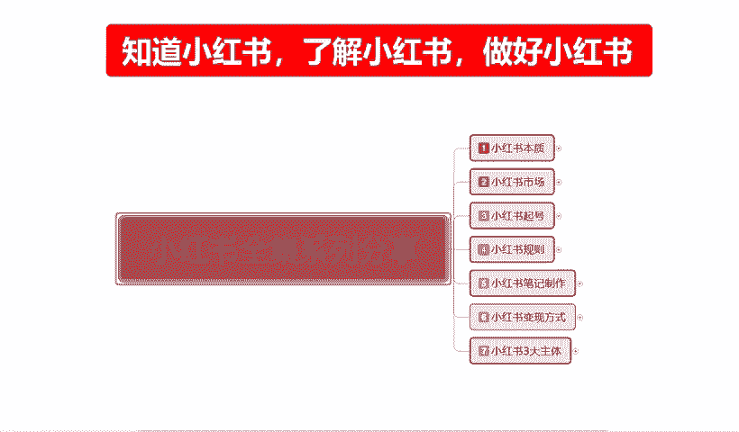
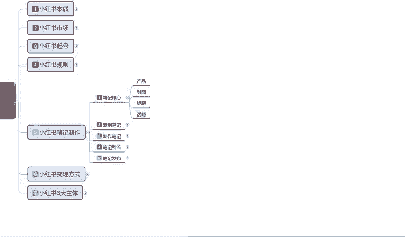
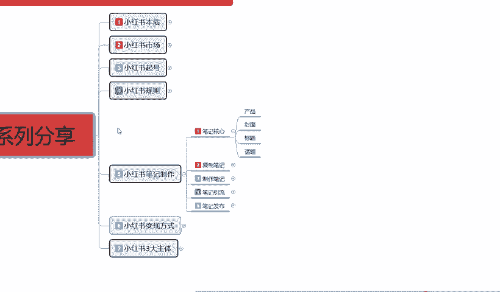
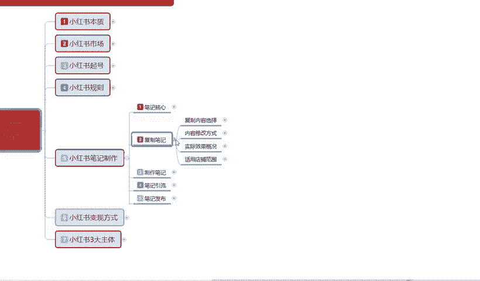
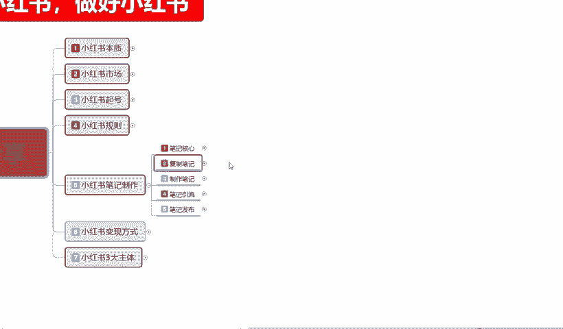

# 140分钟学会小红书运营-原来打造爆款笔记这么简单！！！小白零基础入门必学的小红书笔记公式拆解，最简单的起号教程，快来学！！！ - P25：13、新手小红书运营-小红书笔记制作核心 - 红书教程1 - BV1o629YMEjv

大家好，今天给大家分享的是小红书全集系列的一个第五大课时，小红书笔记的一个制作啊。从这节课时开始，包括我们第六节、第七节三大主体课程。嗯，这三节课程的话是我们小红书正式入门的一个课程内容学习。

上面四个说实话嗯，上面四节整体的一个课程的话，我们不管是本次也好，市场也好，起好也好，规则也好，只是说我们了解了整个小红书。他是做什么的，他的市场有哪些啊？我们应该在小红书上怎备起账号。

最后呢就是我们小红书它里面有一些规则，我们可以去利用和规避。从第五节课小红书的一个笔记制作，包括小红书怎么去通过什么样的方式去变现。最后包括小红书的一个三大主体。第三节课拆除我们正式步入小红书。

整体操作的一个实操步骤。好吧。😊，废话不多说，啊后开始我们今天的一个课程。第五大课时，小红书笔记的一个制作。小红书笔记。

在这里啊。我给大家强调一点啊，笔记它分为很多种的类型，但是它万变不离其中的话，说实话也就是四个点，笔记核心。产品封面标题和话题。这个产品是什么意思呢？小红书如果说你想把小红书的店铺整体把它做好。

我们在小红书上面光起号是没有用的。正常你就算说是都做网络博主也好，做引流也好，你必须要有一个商品账号挂上去。也就是你必须在小红书上面去开一科。商品店这个商品店里面的产品，你卖或者是不卖，你卖资料也好。

你卖商品，真的真正的卖商品也好，或者说你。随便挂个链接也好，但是你一定要有这个店，为什么？😡，小红书账号你开店以后，它有额外的加权。就是给你提升我们基础账号的一个权重。而不是说我们普通的网红店也好。

引流店也好啊，它不像商品店一样，商品店你本来你在小户上面，我就是准备去卖商品的。所以说小红书的核心，你要真想版在小红书上面去赚钱。不管你有没有产品，你在小红书上面啊，不管你有没有产品，一定要去开一个店。

只是说这个店运营或者是不运营，就靠我们自己啊，怎么说呢？自己怎么打算吧，对吧？你是想在上面小红书上面边宣传边做，还是说在小红书引流到外面去，或者说我准备做直播带货之类的。但是你做直播带货，说实话啊。

你去帮主家推广产品也好，你去帮主家打广告也好，你最好也是要开一个店，在你的店铺里面去对别人进行一个宣传。同时的话你自己的话术话题也是要通过这种店铺的一个形式去传达给用户的。所以说小红书开店必不可少。

你要真想在小红书里面赚钱，或者说想把小红书玩好，你做网红做博主，这个店你必须要开你就算是开完以后放在这个地方啊，一键产品不上一个笔记不发不发笔记不可能不发商品笔记就可以了啊，个人正常笔记要发的。

就说你这个产品放上去，你不用去管它啊，其他的就跟你没有关系的，你就是开个店，只是说给自己增加一点技术权重。如果后期我们店铺遇到瓶颈，或者遇到其他东西的了，我们再通过这个店铺。

我再把这个店铺运营起来再去操作也是可以的。但是小红书你真想去赚钱的话，你不得不开店。你就算是做引流的，你都不不得不开店啊。你如果说小红书在小红书上面，你的一个整体的话，你不去开店，你的核心笔记。

它的一个就是我们推广笔记的时候，小红书，我们做笔记的时候。你的正常笔记发放出去要比普通的用户权重少接近5分之1。接近5分之1或者说是10分之2。啊。就是平白无故减少10%20%的流量，你愿意吗？对不对？

而且小红书开个店的话，说实话就1000块钱保证金。这个保证金的话，你到时候还可以退出去花个十来块钱。啊，他有一个税收，但这个的话我们就可以不用去在意他了，对吧？1000块钱的事情。

你增加10%到20%的一个流量。对于我们来说的话，其实是差别很大的。你本来正常短信曝光1000的话，给你12001200。那么你在技术属性上面，你。根据我们之前讲的课给大家起的那些数据量。

我们再去分析你的一个点击啊，数据啊，你再把这个账号做起来的权重就会又会高很多。而且这个钱你又不是不能取出来。所以说我们在小红上面做笔记的时候，一定要有产品。好吧，这是给大家讲课之前让大家先了解一下啊。

就说我们小红书你是发笔记也好，你是。嗯，做网红也好，你做引流也好，你做商品也好，你必须要有一个店，好吧。然后。笔记的核心是什么？就是我们小红书，我们去发布笔记也好。其实在这个里面的话。

小红书的一个整体笔记的一个核心是什么？我们打开手机，在小红书上面会显示很多不同的内容。但是一个画面的话，就是说我们。手机打开小红书以后，它正常显示画面是4个。就是四篇笔记往下面拉。

这个是推荐的就推荐的一个笔记啊，往下面拉大概有20个左右，然后会进行一次刷新。20个刷新里面的话，它有一件是。嗯，小红书自带的推荐。笔记这个笔记的话，它会挂一个店铺上。这个是什么？这个是。产品笔记。

就是这个店我正在开卖产品。这样吧我给大家这么讲的话，大家可能没有什么太大的一个印象。嗯，你们如果说真的感兴趣的话，那我给大家边说啊，我因为我这边手机的话投屏它不是很方便。所以说我在这里呢就直接给大家讲。

我们小红书笔记的一个核心啊，产品封面标题话题。这个里面就说我们小红书笔记的话，做核心。我们打开手机，在小红书上面的话，它会显示很多的内容。不管我们怎么去搜索啊，我们或者是不用搜索，我们直接在发现里面。

小红书发现里面，它直接给我们推荐的推荐的笔记也好，视频也好，直播也好，艺术也好，算大也好，摄影也好，等等这些东西都是一样的。

知道吧？我们打开的话，打开小红书以后，进来以后的话，它都是4个4个笔记页面。四个笔记页面。当时我们往下面拉的时候，我们偶尔会在。右下角啊就是小红书笔记，右下角看的看见赞助两个字。

这个是小红书商品通过头流啊进行的一个封面抢抢赞。也就是说大概有8到10个正常笔记里面会附在一个商品推送。以前的话还没这么多，以前的话可能20个。作右才会出现一个那个赞助的一个商品。现在的话基本上就是。

10个左右，七八个也有可能他是随机投放的。看他现在的一个推广力度。就说往后的话，他这种呃商品的类型的话可能会越来越多。因为以前的话我们想找商品都找不到。但是现在小红书他在这个里面发现上机了以后。

他把这个。小红书商品的一个数据量放大了啊，由以前的百20分之1，现在提升到接近10分之1，提升了一倍的一个展示量。就说。😡，产品笔记你如果说要把产品笔记做好的话，这个里面的话它有一个产品笔记推流。

但是不适用于新手。因为你们点进这些赞助里面有我们大家可以发现啊。呃，我这边随便点了一个。笔记我们去看他的一个基础粉丝数量和一个货在与收藏，基本上都是粉丝，起码是在3000家到5000家往上走。

货赞与收藏的话是18000到2万2万5万40万这种形式。因为别人是已经把店做起来了，账号已经做起来了，然后去开始推推广的产品，然后再提升它整体的一个价子，卖它的一个产品属性。通过这种方式来获利的。

所说我们前期的话不需要去投这个，但是我们也要知道。小红书核心笔记里面它是有这个成分的，就是它的推广力度是越来越大了。以前我们看笔记的话，可能很少有人会注意它的。右下角这个地方有一个赞助。

这种的话是现阶段小红书刚推出的啊。商品头流。就和我们做淘宝也好，做其他的也好，它都有一个付费付费的一个直通车推广啊，转展等等之类的，它都是类似的，这个是花钱弄的，好吧。然后小红书整体的一个核心笔记。

如果是抖音，我们每回刷的时候，它只会显示一个产品。但是小红书的话它是4个笔记。所以说从这个里面我们要去抢留。我们现在要了解的是小红书核心笔记在产品封面标题和话题四个当中，什么是最重要的啊。

在这里的话其实也是非常简单的封面最重要。标题。第二，产品和话题其实。跟我们去产品的核心啊，影响不是太大，但是它也是一个步入点。如果说我们没有这个没有这个封面和标题。有封面和标题，没有产品和话题的话。

我们它是没有后续力量的。它和抖音不一样啊。抖音的话，每次我们去刷抖音，它都只会给你显示一个文章，一个视频，一个内容。你不愿意看就两秒钟就两秒钟。第一四眼的2秒钟，你看见这个抖音不舒服，啪就下一个。

下一个又不是怕，就又下一个。抖音只有2秒的燃示时间。但是小红书不一样。小红书每次显示的是4个，大概的展示时间是在5秒钟左右。也就是说你的小红书要在5秒之中吸引到用户，那么你的封面就是最重要的。

标题排其次你。这个笔记里面的内容，我们现在不说产品内容啊，我们说笔记里面的内容和你的内容话题，别人是看不见的。也就是说你在5秒之内，你的这个封面能不能？封面和标题能不能吸引到用户进行点击。

然后进行你的一个笔记观看，或者说是话题的一个欣赏讨论啊，就在于封面和标题。封面整体占比的话达到了70%到80%。标题的话说实话只有20%到30%。他们两个整体结合起来就是笔记的一个核心。

当然这只是表面核心，我们还有后续的一个核心。后续核心是什么？我们做产品也好，做。笔记内容介绍也好，做网红也好，做引流也好，做话题也好啊，这两个才是后续核心。

也就是说封面和标题是表面核心内容的话是产品和话题，这个才是最真实的一个核心。我们只有把这四个点结合了你的一个小红书笔记核心就找到了，围绕这四个点先去走封面。前期70%的投入要放到这个上面。

因为你的封面吸引不了用户，别人不会点进来4个展示画面，或者说20个，你从20个里面去挑啊。20分笔记里面，你能不能达到你的一个点击率达到11%，接近13%以上。进入下一个成绩，就靠你的封面和标题。

这个就是整个小红书笔记制作的一个整体核心。如果说我们把这个核心把握住了。你后续操作再怎么去操作都简单。如果说你把这个核心把握不住，我们笔记核心你把它把握不住。你不管做父字笔记也好，做制作笔记也好。

笔记引流也好，笔记发布也好，你。后面你做的任何东西都没有用，因为你没有把握到用户的一个心理层面。啊，你的话题不够吸引人，你的封面做的不够漂亮，不够好啊，内容不是我感兴趣的。

那你觉得你的整体数据流量会爆复起来吗？不可能的，对不对？所以说封面是第一要以70%，接近80%，应该说是75%往上标题是占25%。因为你封面再好，你的标题不吸引人。标题内容做的不好。也是白扯。

那后面产品话题你就更更不用谈了，对吧？我们把起号起完以后的话，就说笔记核心一定要了解掉啊。呃，因课程的一个原因，那这一节呢就给大家讲到这儿，主要呢是给大家介绍了一下啊，我们小红书笔记制作里面。

在制作笔记之前，我们应该把重点放在什么地方。好吧，下一节课给大家讲解一下复制笔记。什么叫复制笔记呢？就是说把别人的笔记啊内容复制过来。用到我们的一个账号上面进行一个宣传推广。我们前期操作嗯。

对于很多新手来说的话，我不知道自自己怎么去做笔记也好，我不知道自己怎么去排版也好，我没有材料，我没有素材啊，我不知道等等这些内容。我们其实可以去用复字笔记这种方式去操作。

那我们先熟悉整个小红书的一个体系，再接着进行下一步一的操作。好吧，下节课呢给大家讲解一下我们复字笔记的一个整体实操模式。那这节课呢就到这里。

