# 140分钟学会小红书运营-原来打造爆款笔记这么简单！！！小白零基础入门必学的小红书笔记公式拆解，最简单的起号教程，快来学！！！ - P25：23、小红书【商品笔记】制作：爆款标题制作 - 剪辑手机教程 - BV1w22EY7EMD

大家好，这一节给大家分享的是小红书全集系列，第五大课时的笔记制作内容。

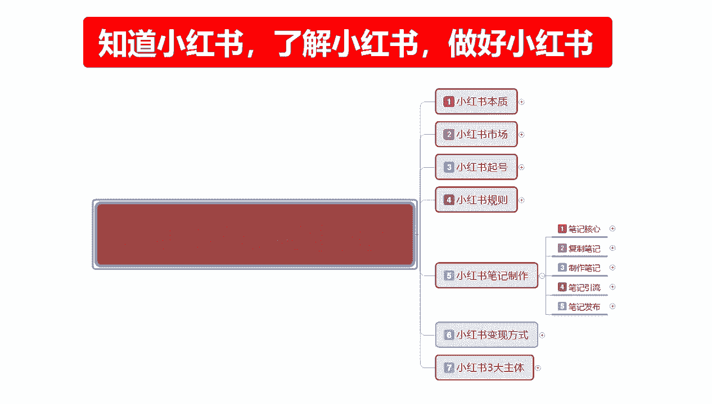

结合我们上节课啊，已经给大家讲到了我们的一个用户互动，这节课的话主要是给大家讲解一下，我们笔记制作里面，第二大组点标题的一个创作啊，之前给大家说过了，鼻翼的核心的话其实就是两个主要点。

其他的话都是附带的一个影响，第一个主要点的就是封面的一个设计，第二个的话就是标题的一个创作，这节课呢主要是给大家讲解一下，我们的一个标题创作，标题创作其实的话看着其实很简单，但是我们选词选内容的话。

他方式方方式，方法和多样性的话是非常重要的啊，首先标题的话应该简洁明了，适当的添加表情符号和颜色，因为小红书的标题的话，它没有那么多的一个限制啊，尤其是我们引流的一个标题，你商品标题的话不行。

商品品也标题的话，他还靠关键词的啊，然后呢他使用数字类的一个标题，针对特定的人群的一个标题，以增加冲击力度，懂意思吧，就是我们在创作标题的时候，你有时候的话，你在上面打个一些连贯性的数字的话。

其实我们在内心里面的想法，对于这些数字游戏的话，我们了解是比较多的，比方说520521，或者说是其他的呃，148等等，这种的话，你下意识的就会把这种标题的数字内容的话，把它更改为对应的数字。

你不管是骂人的也好啊，赞美的也好，他这个里面感性的也好，他在里面的话，就说我们对数字标题的话还是比较敏感，也有吸引力的啊，当然了，这种的话比较费脑筋的事情，呃，啧怎么说呢。

就是吸引特定人群的话还是比较好用的，但是你整体去推广的话，对于那种脑子笨的来说的话，看不懂好吧，有有利也有弊啊，嗯然后整个标题创作的话，其实在这里呢是给大家分了三个点，第一个是主题题突出。

第二个是内容明确，第三个是吸引力要强，这三个点的话，其实我们理解的话还是比较好理解的，内容有点大。

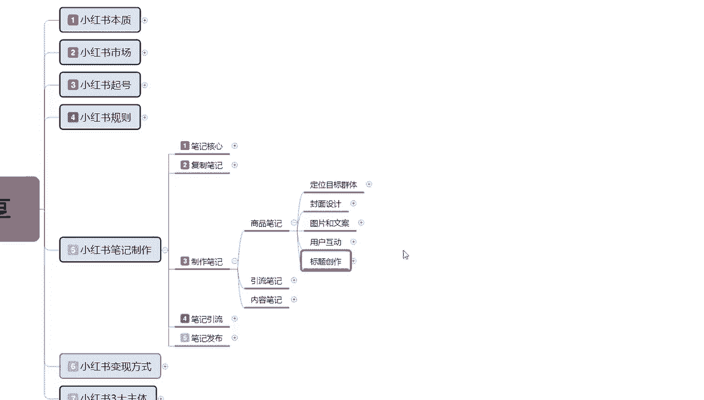

先给他说一下。

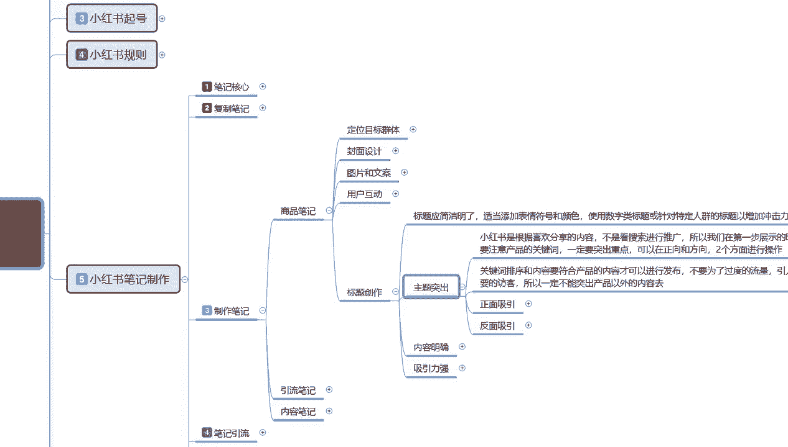

我们先了解一下啊，什么是主题突出，小红书的话，它是根据呃喜欢分享的一个内容啊，不要哦就说我们不要看搜索进行推广，所以我们嗯怎么说呢，就是小红书的主题，他的一个整体标题创作的话，笔记的一个标题也好。

你是商品笔记，搜索笔记，引流笔记，他所有的一个标题，它显示的位置是不一样的啊，我们在创作的时候，你要根据针对你所发布的一个位置和范围，进行推广，所以说不要看搜索进行推广啊，它是分类的，你的商品笔记的话。

他是在搜索里面的，你的引流笔记的话，他是在，就是推荐的一个流量，在这个里面的内容笔记，说实话你内容笔记他也有推荐流量，但主体来说的话基本上都是吸引粉丝，怎么说呢，就是吸引粉丝附带推荐流量啊。

看你的主题够不够吸引力度，所以我们在第一步展示的时候，就要注意产品的一个关键词，一定要突出重点啊，可以在正向和反向两个方面进行操作，什么意思呢，就是说呃关键词五我们在操作的时候。

他有正面介绍和反面介绍两个类型，正面介绍就是产品的好，在小红书上面的话，说实话它反面介绍用的稍微多一点，正面介绍的话反而没那么多，因为我们平常的话在不管是男性也好，女性也好，或者说其他的用户类型。

也我们所看的内容，很多都是介绍正面的一个因素，但是小红书上面的话，说实话他逆反心理的人占比35%以上，什么叫逆反心理，逆反心理的意思就是说好的看多了，我现在想看点坏的啊，我对社会的不满，我对生活的不满。

我想去了解这一方面的一个信息，或者说以防我以后上当受骗，去了解这方面的信息，避免踩坑的一些反向吸引力度，这个答应大家如果说明白意思的话，就说明白了，不明白的话，大家可以学一下啊，什么叫正面性。

什么叫反面形一样的道理的啊，待会的话我会给把给大家，把正面吸引和反面吸引的词汇给大家列举一下，大家可以去了解一下，当然这个词汇的话是网络上面，我给大家找的资料啊，我就不一一介绍了。

然后关键词的排序和内容的话，他要符合整个产品的一个内容，才可以进行发布啊，如果说我们发布商品的话，就是商品笔记，我们在发布的时候，一定要符合产品的一个内容特征去发布，就是产品标题。

为什么我刚刚之前给大家说，你的一个产品标题也好，引流标题也好，内容标题也好，他们都是不一样的，产品标题你要根据产品的实质情况去发布，内容和额和你的产品标题要相关，你不能说是我本来是卖女装的对吧。

我问连衣裙，你发个短袖的一个标题出去，那肯定是不行的，所以说你的标题要和你的产品匹配，系统才会收录你，如果说你的标题和产品不匹配的话，系统无法收入的，你的数你的数据量是错的，别人给你展示，你没有展。

就是相当于是没有点击，你的后续数据做不起来的，你拿冷门词，拿其他的词汇去做主标题的话，搜索出来的结果也不好，所以说我们要把主题突出，这里面的两个重点给大家啊详细的讲解一下，让大家整体明白一下。

然后这个正面吸引的一个词汇，和反面吸引的词汇嗯。

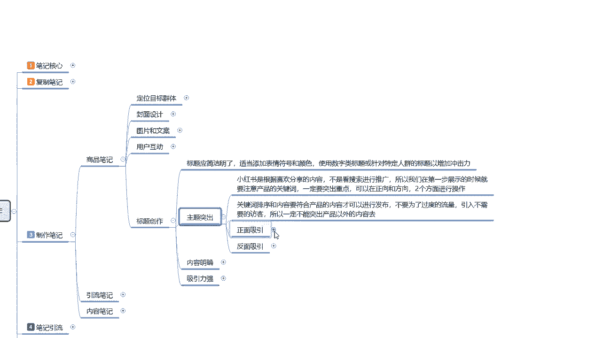

先展示给大家看一下吧，这两个词汇的内容是非常大的啊。

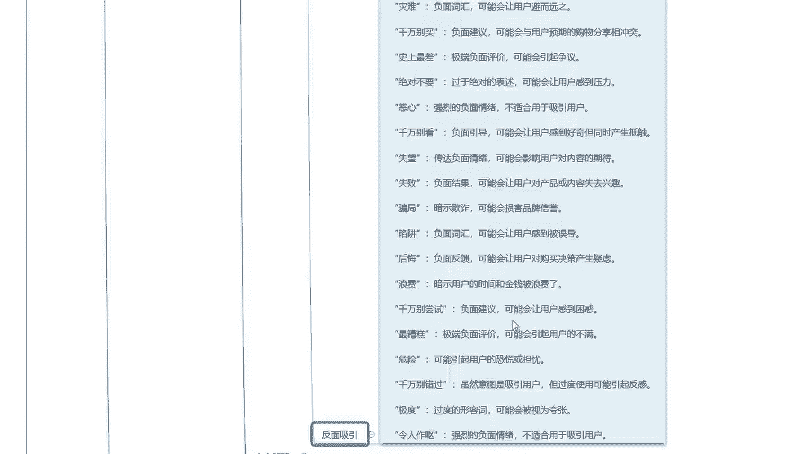

都而且这个词汇的整体数据的话，它是小红书上面使用比较多的啊。

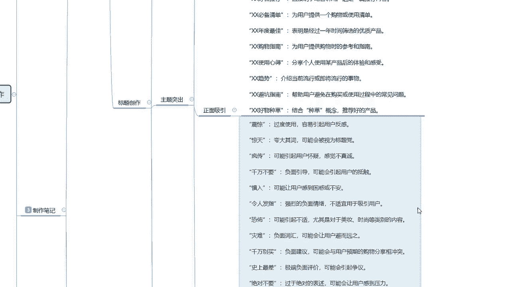

这个是我通过网络数据给大家找到的一些呃。

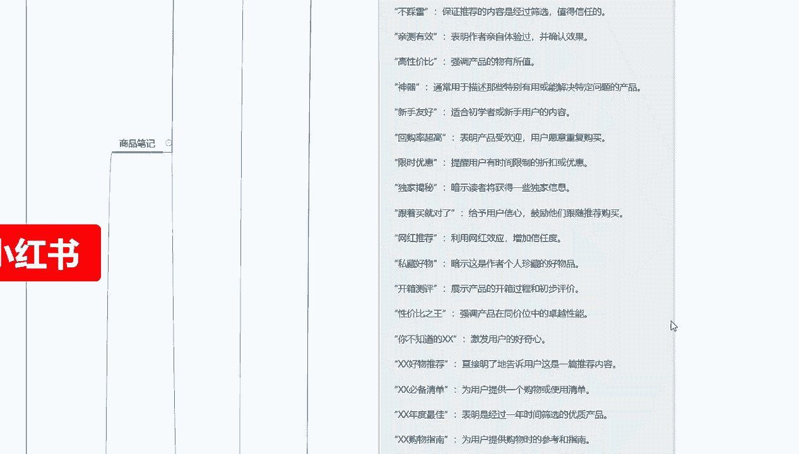

词汇组合，重赏种草这个词，我们对小红书有过一定了解的人，其实他并不陌生的，这个词语的话在小红书上面是非常流行的啊，表示推荐某样东西给别人，但实际情况是什么呢，就是说我要去收割这个草类啊，潮涨好了。

涨粗了，长大了，我们才能去收割这种词汇的话，说实话在小红书上面就相当嗯，我们下意识的认为啊，因为以前的话我们听词汇，听什么词汇，听多了歌唱什么叫割草呢，对不对，割有钱人的床哥，没钱人的草。

我通过一个项目，一个计划的话去进行割草，那割草的前提是你得有草，所以说它这个词汇里面是一个种草，但是很多人对这个词汇的话，他还是比较敏感的，所以说现在的话，这个词汇搜索词量和用词量比较大。

但是说实话我们做商品也好，做网红也好，做其他的一个推广也好，做网红用的比较多，做流量博主用的比较多，做商品的话基本上不会用这个词，因为它的弊端太大了啊，听着就像有点坑人的感觉是吧。

所以我们一定要把所有词汇的，一个词语给了解到，包括下面这个必备踩雷秘籍等等，我不光是给大家把组词汇列出来了，同时呢也给大家介绍了一部分的意思啊，因为这个内容的话实在是太多。

我单独给你们讲这些词汇的意思的话。

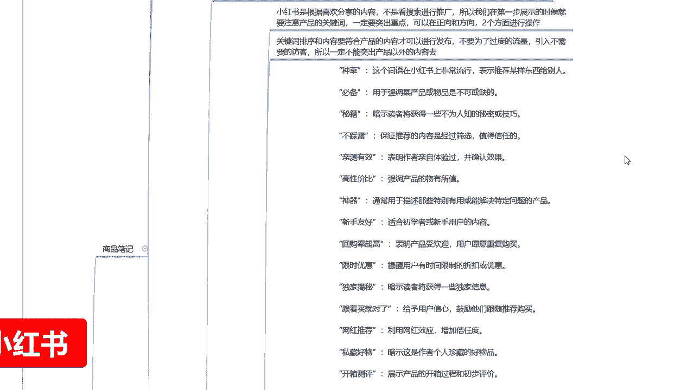

说实话我不是语文老师，我对吧，给大家讲这些东西的话，大家也不愿意听，所以说我就给大家简点击一下啊。

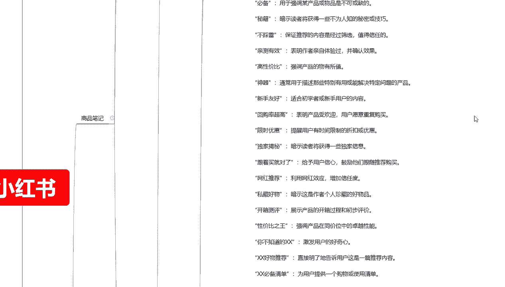

这里面的内容呢，我就不给大家一个一个去进行介绍了好吧。

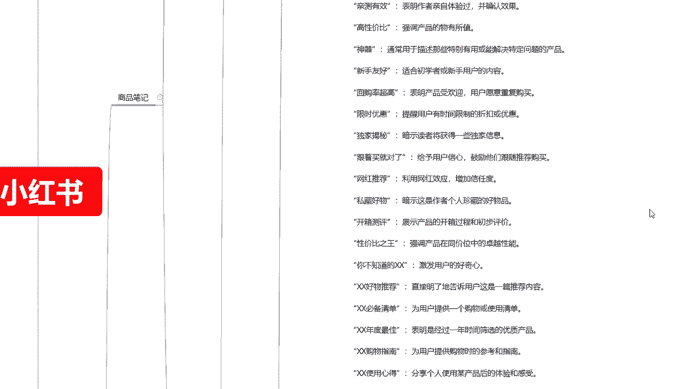

然后的话大家对这个里面的一个词汇内容，比较感兴趣的话啊，你们截个图自己保留一下，或者说是有时间慢慢的看，我呢从头到尾给大家从上面往下面拉一下。

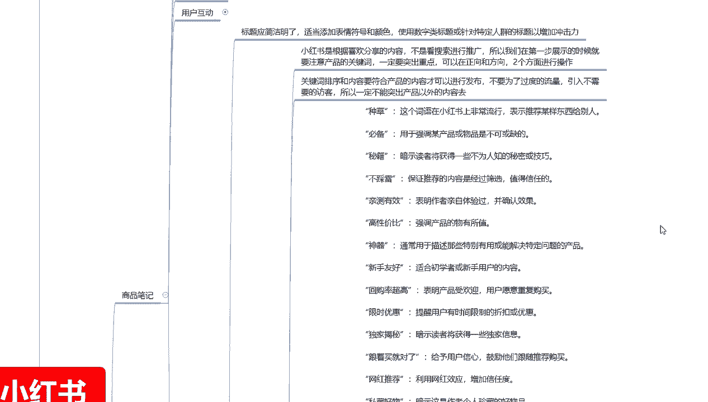

这个整体的一个词汇用表，大家主要的话就是说了解一下这个词汇，我们在什么时候，什么场合应该怎么去用，这个就靠我们大家自己去体会和体验了，好吧啧，额给大家把主词念一下啊，种草必备秘籍，不必踩雷，亲测有效。

这种的话他的一个词汇包括后面的整体效果，其实我这后面的话嗯，大家听我这么讲了这么多节课，能听到这的啊，对这些东西的话都是或多或少有一定了解的。

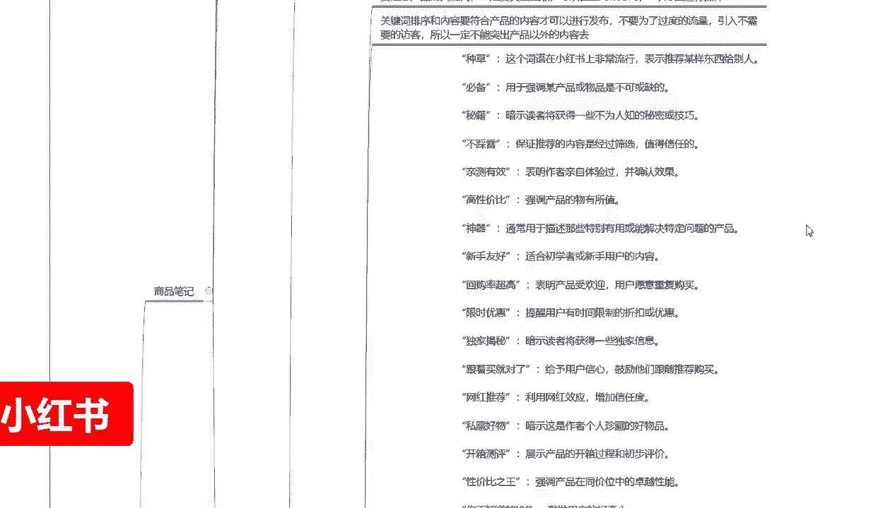

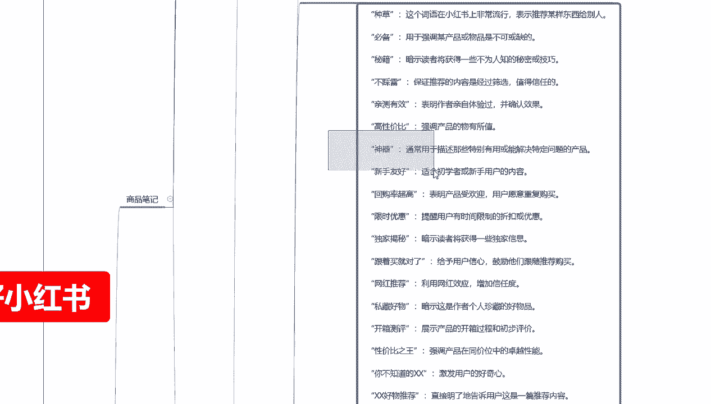

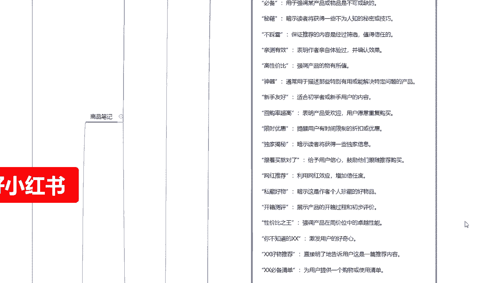

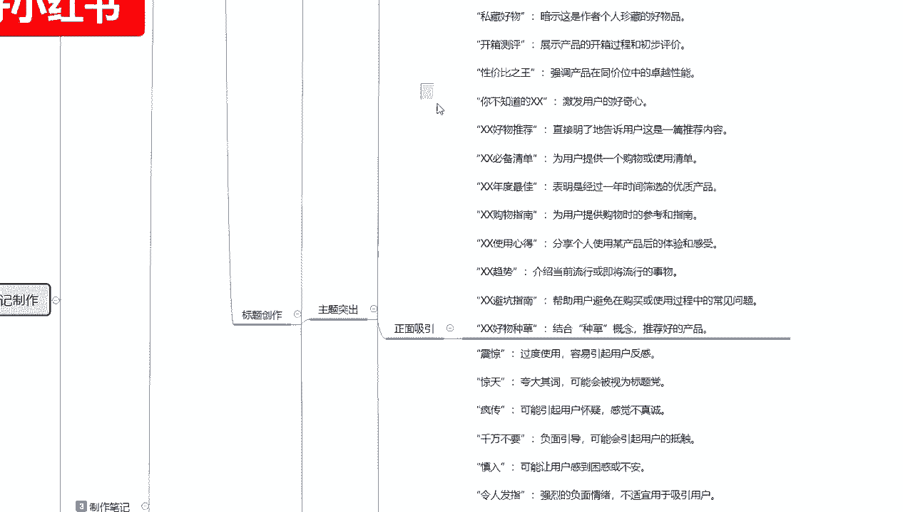

一直到趋势避坑指南，毫无种草到，这基本上就是正面词汇的一个结束啊。

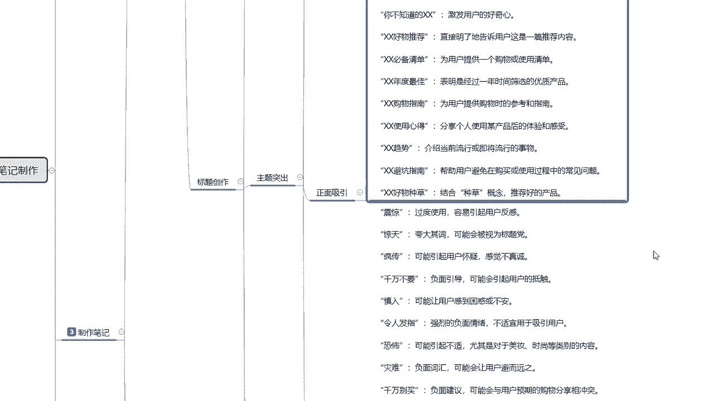

结束了我就把它给大家应该结的也截完了啊，就给关掉了。

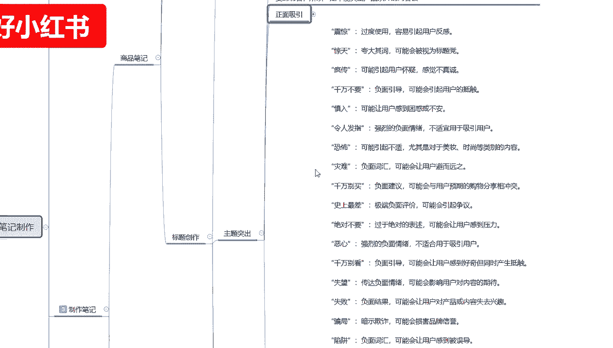

然后下面这些就是反面词汇，从正经开始。

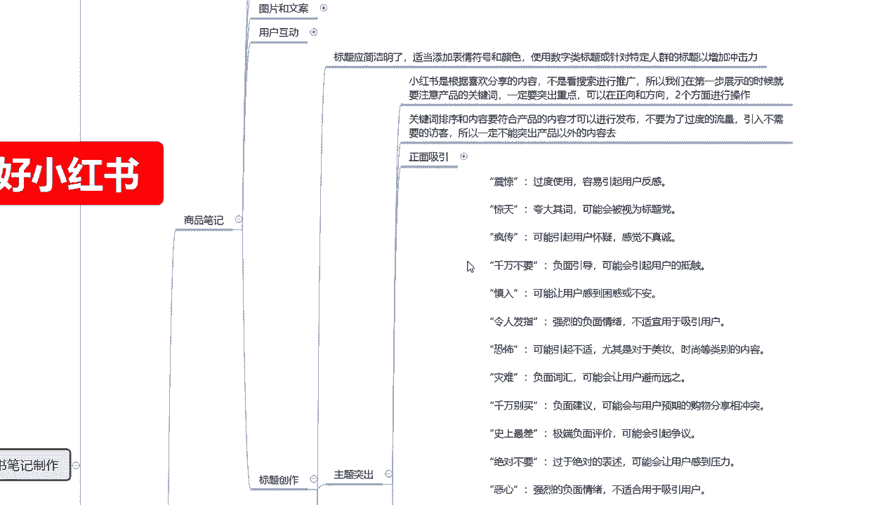

今天疯狂啊，一直往下面走到令人作呕，反面词汇给大家找的一个词组，具体有多少词组的话，我也没具体计算哈，只是说给大家把这个词汇列出来，在这个地方让大家对小红书上面的一些组词啊，进行了一个了解，当然了。

这些说话说实话，这些组词只是说做引流也好，做标题也好，或者说做商品笔记的一个内容吸引也好，他们只能说在里面用一到两个，也不能用，多用多了以后不好用的啊。

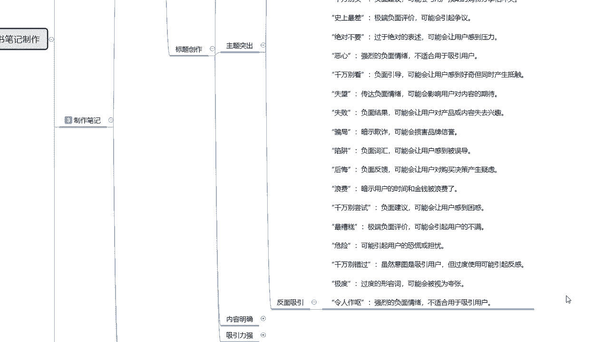

其他的词汇还是要靠我们自己想办法去弄的，这个呢就是主题突出。

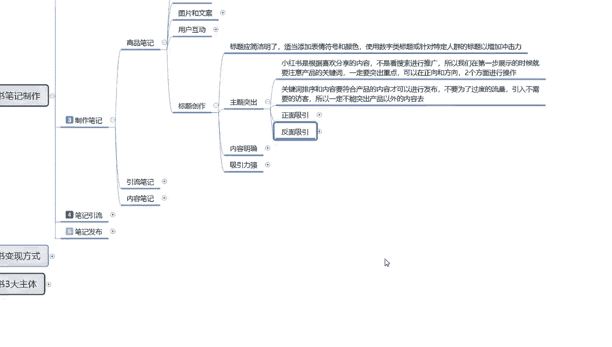

我们要在里面的话添加一个到两个的一个，正面性或者是反面性，让用户对标题产生浓厚的兴趣，然后进来观看我们的一个作品，也就是笔记，他现在还没到观看商品的时候，说实话小红书上面你要成交，要把商品做起来的话。

你要先把内容文案做好了以后，你再去做商品成交才可以，你这些东西你做不出来的话，你想把它做爆，难度非常大啊，那纯靠运气的一点技术含量都没有，说实话不好做，这个就是整个标题的一个嗯主题突出。

标题主图突出以后的话，说实话这里面还有一个内容明确和一个细腻，这两个的话就给大家做一个简单的介绍，主要的话就是说内容明确的话，就是对商品进行明确的一个介绍，或者使用方法嗯。

但是呢可以使用震正面和反面两个方向去操作。

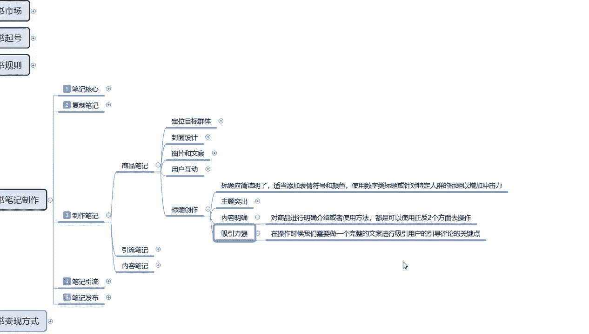

主题图书，选关键词啊，就说选我们的一个标题词汇的话，在正面和反面取消呃，做吸引，内容明确也可以用正面和反面，就是看你自己怎么介绍啊，他都是可以通过正反两个面方面来吸引的，说实话。

反面的吸引效果在小红书上面的话，占比35%不少了，而且这一帮人的话，他对反面吸引的效果额和认可的话，会比正面效果还要好看，他要怎么去用好吧，最后一点呢就是说在操作的时候，我们需要一个完整的文字。

能文案进行吸引用户的一个引导，评论的一个关键点，什么意思呢，就是说也要在标题上面挖坑，懂我意思吧，你不能说是把标题上面所有的内容全部打上去，以后，全部在标题上面显示，你要在标题上面挖坑。

让别人对你的标题感兴趣，我想知道后续一样看你一样看小说也好，或者是玩游戏也好，或者干其做其他的也好，你做完一个项目，还有下一个项目，你才能吸引住人对吧，那下一个项目是什么呢，我比较好奇。

我就需要点进去观看，这个就是标题的一个重点力，吸引力强，这整个标题的一个创作，我们把它了解清楚以后的话，就相当于是我们这整个的一个商品笔记啊。

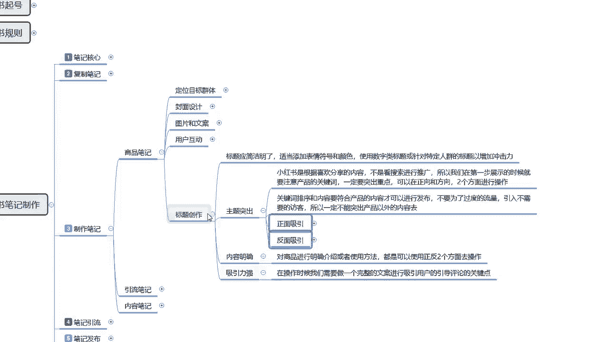

基础内容了解清楚了啊，大家要弄清楚啊，制作笔记里面，我们这个了解的只是商品笔记里面的一个，基础内容啊，定目标的群体，封面的一个设计，图片公关的一个设计，用户的一个互动，标题的一个创作。

这几个点做完以后你才知道什么叫商品笔记，文案笔记后续的一个内容的话，我会给大家讲解一下引流笔记啊，说实话我在给大家讲商品比商品笔记的时候，其实已经附带了很多引流笔记的内容，因为它是通用的。

我们后面的一个引流笔记也好，一个内容笔记也好，他们其实整体的话和商品比例差不多，只是说他定位的目标不一样，提供的价值不一样啊，标题的吸引力度，吸引的方式方向不一样啊，让大家进行了一个整体的一个了解。

好吧，下节课我开始给大家讲，笔记制作里面第二大主题，引流笔记的一个整体操作。

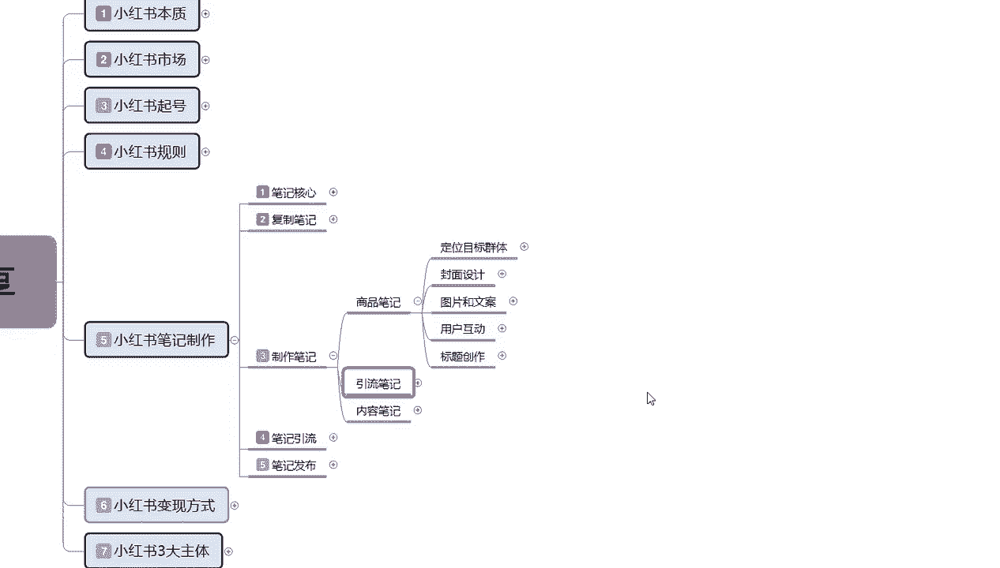