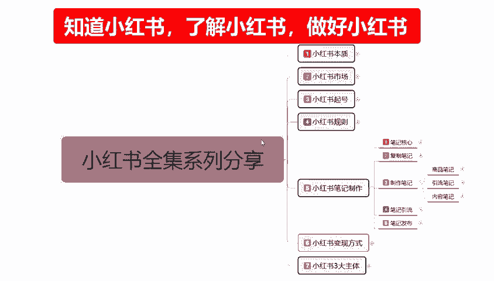
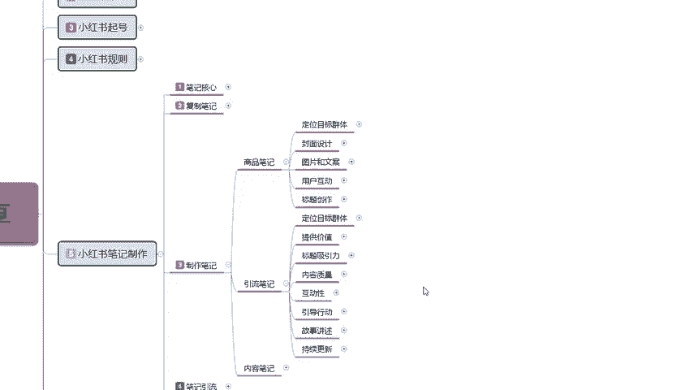
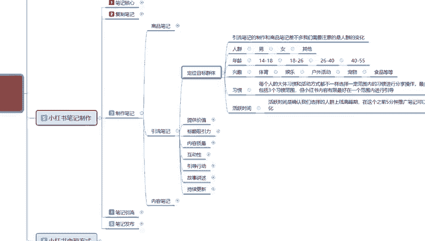
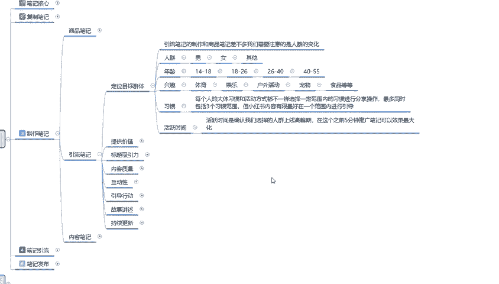

# 140分钟学会小红书运营-原来打造爆款笔记这么简单！！！小白零基础入门必学的小红书笔记公式拆解，最简单的起号教程，快来学！！！ - P25：24、小红书【引流笔记】制作：定位目标群体 - 有点像大哥Seven - BV1pY2vYcEf2

大家好，这一节给大家分享的是小红书全集系列第五大课时，小红书笔记制作的制作笔记内容。综合我们上一节课啊，已经给大家把商品笔记整体制作的一个内容和方式啊，包括我们的一个主图和选选词。

已经给大家进行了一个讲解。这节课的话主要就是给大家讲解一下引流笔记我们怎么去操作。引流笔记的内容说实话，它显示的是比商品笔记的5个重点要多。但其实它的内容的话是差不多嗯。

准确性来说的话。引流笔记的内容会比商品笔记的内容少一点。为什么？因为引流笔记的话，说说实话它和商品笔记共同之处有很多。主要的话就是说让大家了解一下引流笔记和商品笔记之间的一个不同啊。

首先我们来了解一下什么是引流笔记。引流笔记的话，在这个点啊，之前也给大家说过我们的一个笔记核心啊，父字笔记也好，或者其他的也好。因为我现在的话还没给大家讲，主要讲解到三呃小红书三大的一个。主体他们。

都是通过什么方式去操作的啊，这里的话给大家讲解一下引流笔记。首先第一个呢也是定位目标。群体。

引流笔记的一个定位目标群体啊，引流笔记的制作和商品笔记差不多。我们需要注意的是整体人群的一个变化啊，首先是人群男女其他。年龄性别这个其实基本上没有太大的一个变化，包括兴趣。啊。

体育、娱乐、户外活动、宠物食品等等啊，它整体的话就是一个习惯。每个人的大体习惯和活动方式它都是不一样。选择一定的范围的一个习惯进行操作，最多同时包括三个范围习惯。那小红书内容有限。

最好在一个范围内进行引导，什么意思呢？我们在选择他的兴趣的时候。好。最多选一个你我们去做引导。这个人群是最精准的。如果说你选了3个，你比方说体育也做，娱乐也做，户外也做。他们三个虽然说有关联。

对吧他们三个是有关联的。可以做，但说整体效果的话，说实话你没有单选一个出来单做的一个效果好。体育就是体育，娱乐就是娱乐，户外活动就是户外活动。虽然说他们三个有关联，但是他们的关联性的话没有那么强。啊。

最好的话就是选一个范围进行引导，然后活跃时间什么叫活跃时间？活跃时间是确认我们选择人群的上限高峰期。在这个之前5分钟推广笔记可以。效果最大化什么意思呢？就说我们在笔记制作完成以后。

我们的引流笔记制作完成以后，多的我就不跟大家讲了。因为上面这些东西的话，其实我已经给大家讲过了。活跃时间的一个。发布时间比小红书笔记发布的话，它有一个审核时间。对吧你这你的一个属性全部做完以后的话。

小红书它综综合的话，它还有一个审核时间，5分钟。之前推广效果是最好的，但是这个时间段我们说实话确实没办法，不是太好的去把握。因为你的小红书笔记做完以后的话，它还有一个时间审核。

这个时间审核长的时候能达到几个小时，甚至到一天到两天。短的时候。可能就2分钟到3分钟。所说这个点的话是非常不好把握的。在这里文化。我提醒大家一个点，就是说什么呢？一定要是新的笔记。

他才不会出现这个困难的情况。如果说你全是父制的那那一容的一个笔记，我们去操作的话，你根本没办法把握前5分钟的一个推广笔记时间。这个时间段大家在发布笔记的时候啊，你不管是引流商也好，商品也好。

其他笔记也好，其实都差不多。我们在发布的时候。提前半小时去把笔记做好。提前10分钟开始发布，基本上5分钟左右他都会推广出去，就可以达到在5。人群的一个高峰期，前5分钟进行一个引流。10分钟是控点。

10分钟以内，它不管是5分钟也好，2分钟也好，10分钟也好，在这个时间段发信发数据就可以了。就是你的笔记已经推出去了，小红书它会有一个强制弹框。懂意思吧，瞧不出它会有一个强制弹框。

强制弹框它的每针对每个人每个类型或者说。嗯。对你的。老粉丝、老用户对你的关注等等之类，至少你发布了新的一个小红书笔记，让大家对产品也好，对内容也好，对我们的一个话术话本也好。进行了一个下一步了解。

它会提示你的一个点击率。啊，而且人非常多。但是这个里面有一个点啊。呃，你们需要去卡什么呢？嗯。高峰期小红书预览高峰期。但是这个里面有一个点啊，他每个人群年龄阶段他所适用的一个高峰期时间段是不一样的啊。

14岁到18岁也好，18岁到26、26到44到55，他每个时间段的一个。高峰期时间段都不一样。你14到18，说实话。这帮人这帮小朋友也好，这帮学生也好啊，这帮无业游民也好，这帮修学的也好。

但是你要搞清楚，小红书14到18的也是女性。只是说他们有可能是不听话的女孩子那一半，她比较追求时尚。啊。追求刺激。追求内容。那么他们在这个时间点的话，他们会去上学。对吧你是要吸引学生，还是去吸引流浪子。

你要去考虑这个。18到26，那么你们要去考虑的是什么呢？是毕业的学生。啊，是刚入职没多久的一个员工。毕业一段时间了以后。一个妇女。还是家庭主妇，那26到40，那么他们的一个兴趣选择的话。

你是要考虑他们是做呃，结婚没有？啊。这个都是根据产品去选的，或者是根据我们自己体验的一个价值观去选的。你把这些东西选好以后的话，你再对应他们的年龄下年龄、时间线啊，浏览的高峰期。

什么时候有空闲时间可以去玩手机，玩手机才能看小红书。对不对？玩手机的时候，小红书的主动推广它的一个广告才能植入进去。你们。那我们要推广的时候，你要提前10分钟。啊，记得他小红书有一篇我感兴趣的六来了。

他才会点进来看，这也是小红书整个平台系统它所做的一种操作模式啊，为什么说现在能达到3亿的一个用户量，就是在这个地方他很会把握人心。啊。这个呢就是整体的一个目标定位群体啊，看我们说实话。

它和商品比的一个整体目标定位群体的话，其实大差不离，只是我们的一个选择重点不一样。好吧，最主要的就是注意一个点，活跃时间。你要弄清楚这帮人的活跃时间，然后再去发引流笔记。引流笔记的话，它不是商品笔记。

商品笔记需要去搜索引流笔记你需要靠什么？靠小红书平台主动的帮你去推。说说这个点才是最重要的活跃时间。那这一节分享呢就给大家讲到这，主体的内容的话嗯，让大家进行了解一下。下一节呢给大家讲解一下啊。

引流笔记里面的一个。提供价值的。

