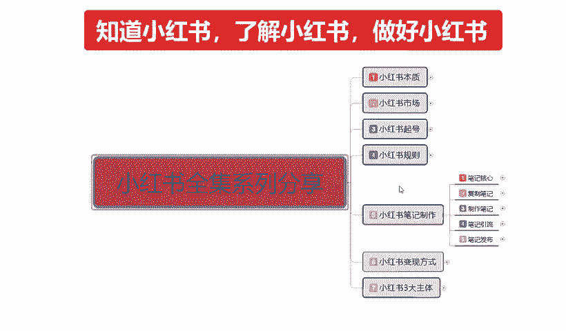
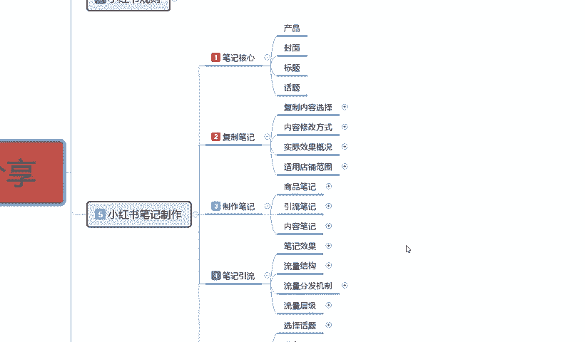
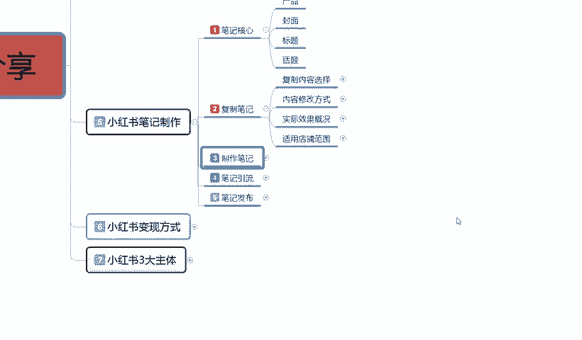
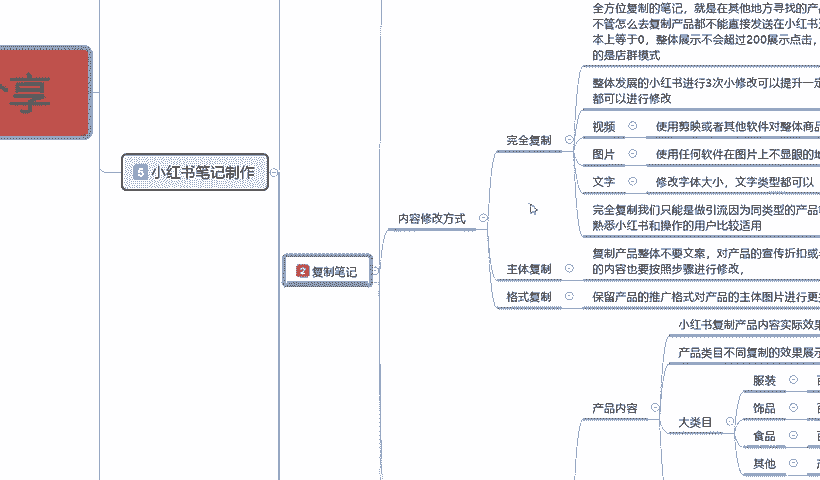
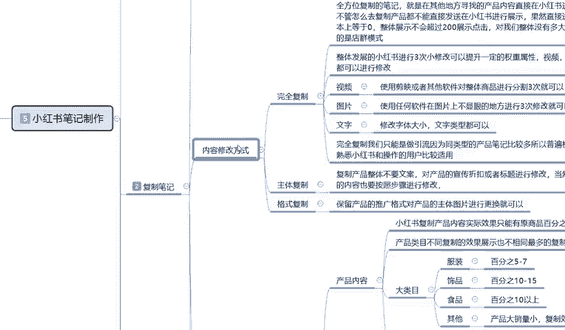
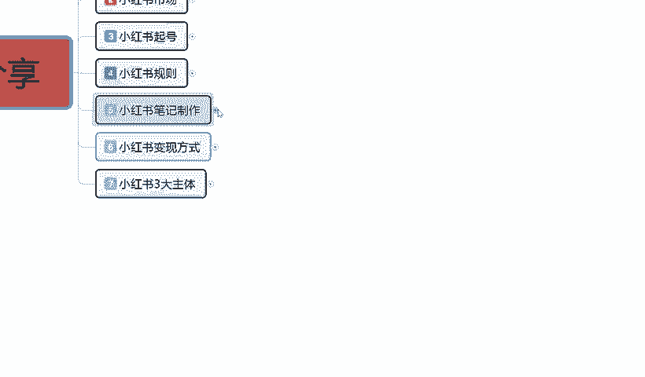
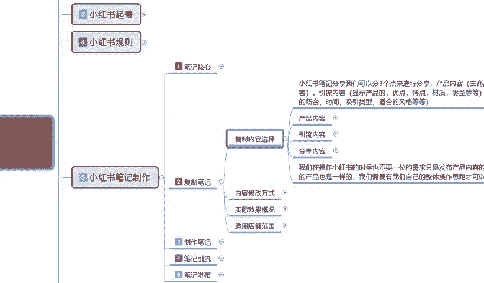
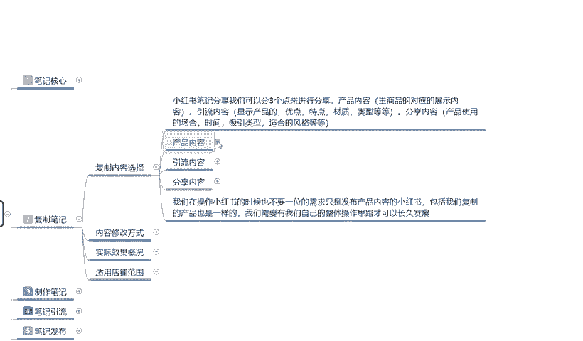
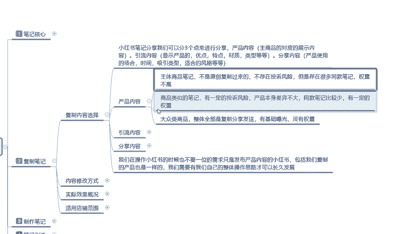

# 140分钟学会小红书运营-原来打造爆款笔记这么简单！！！小白零基础入门必学的小红书笔记公式拆解，最简单的起号教程，快来学！！！ - P26：14、新手小红书运营-小红书复制笔记：优质内容选择 - 红书教程1 - BV1o629YMEjv

大家好，今天给大家分享的是小红书全集系列。第五大课时的第二课啊。复制笔记的一个内容。整体来说的话呃，在上课之前呢，先给大家说点其他的啊，就说我们在了解笔记的时候。

因为上一节呢已经给大家讲过了笔记的一个整体核心。说实在的就是一个封面和一个标题。把这两个做好的话，后续的一些操作其实都是比较简单的。但是对我们新的一个小红书用户，或者说我们新刚入行的一些朋友来说的话。

虽然说我们了解这个封面和标题，但是我们自己的话就是说缺少资源的情况下，我们是没有办法去真正的自己去制作这种小红书笔记的。为什么？因为小红书笔记整体制作的话看是很简单，但是它其实选择性很多的。你封面也好。

标题也好，产品也好，话题也好，你要围绕你自己的组题去操作。你虽然说对自己的产品或者说。对类似的东西很熟悉。但是我们前期真要去操作的话，你首先你还得玩转小红书整体的一个规则。

就说我们在操作小红书笔记的时候。这整体里面的话，其实我们有多个选项，而不是单独的只有制作笔记这一个选项啊。包括之前给大家讲的我们的一个整体笔记核心。这里我要额外给大家讲的是什么呢？

就是我们小红书笔记制作对我们前期来说的话，我们不熟悉的情况下，你可以拿1到2个账号。人体熟悉一下。把自己的模式方式全部弄清楚以后。再自己重新再开一个账号，把这个账号拿去做组店。

如果说你觉得你的时间比较急啊，资金比较紧张之类的那你可以。怎么说呢？就说。先拿别人的作品。复读过来。进行修改以后再进行上传。这就是整体笔记里面。我们需要注意到的一些事项。小红主笔记制作这个里面的话。

我给大家分为5和。第一个是核心笔记，主要就是说让我们了解这个笔记的。重点在什么地方啊？我们的内容说实话，你前期的封面做不好，内容的话效果不大。就说我们在这个方面的话，你后面做的不差的情况下。

那你的笔迹想火起来的话其实很容易的。但是对于新手来说的话，我们没有这方面的资源。那我么我在这里呢给大家分享的就是说。四个部分。两三个部分呢是和笔记有关。最后一个笔记发布呢是给大家讲的一个技巧。

这里面复制笔记部分啊。复字比一副部分的话，说实话这个比较适合我们那个刚接触小红书没多久，或者说是对我们网络。运营这块不是太熟悉的人，不知道自己怎么去操作，怎么去了解的人去操作这个复字笔记可以。

如果说我们有一定基础的话，说实话有自己的商品，有自己的渠道，有自己的信息的话，自己去做用自作笔记这个方式。后续呢我会给大家。一个一个的进行讲解。第四个点就是第四大节的时候。

笔记引流它整体的话是讲我们这个笔记做出来以后，它得到的一个引流效果，包括最后一个笔记的一个。

发布方式啊，因为笔记的话，它发布方式它会给你那个流量的一个权重是不一样的。知道吧？你在什么时间段发在什么选择什么样的话题，选择什么样的发布时间，选择什么样的发布方式。他的权重都是不一样的。

所以说有些东西我们要慎重的去选择，好吧。那这节课呢直接步入我们的一个正题，主要呢是给大家讲解一下我们整体的一个复制笔记内容。说实话，复制笔记内容的话，我们在这里面进行讲解的话，可能内容会偏多啊。

我们能讲到什么地方就讲到什么地方。

太大。

那我们一票一条来吧。

今天给大家主要讲的就是说我们复制笔记的一个内容，复制内容的一个选择啊。小红书笔记分享，我们可以把它分为三个点来进行分享啊。第一个是产品内容，主要的话就是说针对我们主商品。

就是我在小红书上面我想去卖商品对应的一个展示内容。但是这部分展示的话，它只会在搜索页面进行展示。在我们的那个推荐页面里面，它不会进行展示的。这个大家要要弄清楚啊，就是主商品，就是商品笔记。

它只会在搜索页面进行展示，不会在主页面进行展示。主页面进行展示的那种商品的话，那都是和小红书有合作的，就是他花钱买的流量啊。这个我们暂时不考虑。第二个就是引流的。

如果说我们要做小红书的整体账号权重和商品权重的话，我们不光要做商商品。毕业就说我们店铺你看。争取卖货的话啊，你不光要做商品笔记，你还要做引流笔记，引流笔记你还要做内容笔记。这三个主点啊。

那什么是引流内容呢？引流内容的话，它就是说显示的是呃产品的特点、优点、材质类型等等。但是这个的话我们不发商品笔记，我们直接把这个产品相当于做了一个包装，做了一个介绍，对大进行宣传，发普通笔记就可以。啊。

就是发搜索推荐的那个笔记就行。分享内容也是发这个笔记。只是说他分他的一个内容的话，也是对产品或者对我们店铺对我们整个账号或对我自身的信誉进行的一个。优化和升级，这个叫内容分享啊。

产品的使用方式、场合、时间、性、类型、风格等等。通过这种方式我们就确认了啊，我们小红书，你不管是坐店也好，不坐店也好，它都有三个风格。你不坐店的话，那么只有两个。但是你坐垫的话基本上都是有三个风格。

这三个风格的话，就相当于是我们的一个产品内容，一个引流内容和一个分享内容。这三个点。那这三个点我们操作的时候，它的复杂程度的话，就又体现出来了。在这里呢我给大家是把它单独列了三条啊。

我们首先来看第一条产品的一个内容。

产品内容。主体商品的笔记的话就是说不是原创。我们这个给大家讲的复制内容啊，我不管大家是怎么想的，我说的这个是整体复制内容，但是我们可以把它使用到制作笔记里面去。其实内容是差不多的。

也就是说我们在复制笔记的时候，你也要围绕这三个点去找。知道吧？就是你不管卖什么产品，你一定要围绕这三个点去找，你不能说是别人做的好的，你把它复制过来，然后直接去发那样没有用的，知道吧？

也要围绕这三个点找。因为它的内容不同的话，你发布的一个方式是千万不能一样的。你发布方式错了，别人有效果，到你这来，那就没有效果了。所以说发布方式是很重要的。才在这里呢给大家分成了三个步骤啊。

进行的一个详细的一个讲解。产品内容主体商品笔记不是原创复制过来的啊，不存在投诉的一个风险。就说呃。这整个笔记的话给大家介绍的呢就是说我们产品的内容，主体商品笔记啊，不是原创复制过来的，什么意思呢？

我们我和他卖的产品差不多，但是我把他的所有东西全部呃负责，然后拿到我这边来了，然后我进行去卖，或者说是我这边没有货源，我去淘宝去1688，别人给的一些货源啊，拿着他们给我们的一些资料。

然后把这些资料稍微修改一下进行的一个更改，然后继续进行发布。这种的话它就不存在投诉风险嗯，但是呢它存在很多同款的一个笔记啊，整体权重的话就不搞了。这是复制产品，我们选择产品内容进行复制的时候。

就是本身我们商品的一个排名。本来的话就是说新品笔记你放上去虽然说都是在同一层级。但是如果说我们选择复制笔记的话，在同一级里面，我们有很多类似的一个。产品介绍，那你觉得你在1000个、1万个10万个里面。

你的产品能排上名吗？对吧？所以说我们在选择产品内容的时候啊，虽然说主体商品它不会遭到投诉，有权重，就是基础选种大概给你50到。200，但正常的话只有50到70个小眼睛，因为产品过多。

只有50到70个小眼睛。但这些小眼睛过来的话，它的转化率也不高，这就要看我们前期账号做的怎么样啊，你的选产品宣传做的怎么样。就是说我们主体商品我们实在是新什么啊，你刚接触不久的，实在是找不到资料了。

你可以用这种方式直接找主体商品那个比你去。找商家直接拿资料，然后进行修改，然后提交就行。这个就是产品的内容。然后商品的类似笔记的话，有一定的投诉风险就是。和我同商品。呃，类似，但是说。

我和他卖的有稍微有一点点区别，我把他的东西拿过来改成我的那一点区别，我把它修正以后。重新做我的产品，推广图，做我的产品，介绍文案，做我的一些方式。啊，这个的话它是有一定的投诉风险的产品本身差异不大啊。

但是同款比例比较少，有一定的权重量。这个权重量的话就看你复制的。选择。怎么说呢？就是他的笔记可能有2万到3万的展示，你把他的内容复制过来修改一下，那么到你手上的话可能就有2000左右。10%左右。

你做的好的情况下10%啊。你做的不好的情况下，那就不一定了。但是做的好的话，最最大效率也就是10%到20%之间。2000到4000的一个小眼睛数量，这个就不是展示数量啊，这个是小眼睛数量的啊。就是。

商品类似的比较。因为你的话不是从直接从厂家也好，或者从其他地方也好，网络上面没有这么多重复的一个产品。那么它的有一定的权重，权重量还是比比较不错的。对我们新店来说的话，呃，新的账号也好，新的店铺也好。

你去操作这种方式的话，还是非常不错的。第二。第二个打点就是说啊还有一点没给大家讲啊，就是大众的这个商品啊，人体全部都是父子分享发送，有技术曝光，但是没有权重，这个是什么意思呢？就是说呃。

我们在选商品的时候，你选择的文案文文件描述那种的话。你前期用可能有点效果，但是中后期用的话对你没有什么提升。你比方说。别人用VI制作的。你把AI的数据都给复制过来了，因为你自己不会用。

后期的话我可能会嗯有时间的话，单独给大家讲讲AI吧。AI这个这整体的话，对现在小红书来说的话还是比较方便的。我们不管是做笔记也好，做图片，做文案也好，都还算可以，好吧。就说大众类的一个商品，整体的话。

它全部都是负次发生风险的就是。小红书刚开始的，这两年可不进行了。就是从去年6月份以后吧，做电群的不行吗？但是在之前因为小红书它累计数据的时候，他做了很多电情。它的店群模式是什么？无线的发布产品。

无限的粘贴复制。那个时候发了很多重复类的一个笔记。重复的一个内容，虽然说很多都进行淘汰了，但是它的商品的一个权重属性的话，就基本上他把它的。起步阶段提高了，以前的起步阶段可能是0。

慢慢的12051100到我们这可能已经是51000了。啊，所以说它起步阶段的话，我们的起步阶段本来比别人慢一步。你现在要去做的话，那么你可能比别人慢十步，那你再不做可能慢50步100步。

因为它的后续权重会越来越高。所以说大大众的一个商品一个。包含性内容太多以后的话，它整体是没有权重的。就你发上去以后的话它是根据你你每天有2到5个笔记的一个发放量，但是我们基本上只发两个左右。

因为这个效果是最好的，你发多了也没用。那你两个权重的基础量的话，你发这种类似的一个复字。笔起出去吧。系统它只会根据你账号的权重给你基础。展示和曝光不会有额外的一个提充空间。就是这波流量展示完了。

这个笔记两天到3天就下架了，没用了啊，虽然说还在你的那个后台能看见，但是它没有权重。这个就是。产品内容。我们选择的时候也要把它选择清楚啊，你复制的时候，我说实话在这里的话，建议大家的话我们。做第二条啊。

做商品类似的一个笔记就可以，不要做完全遮盖的一个负责。因为那种的话，你想起号的话实在是不容易。除非说是你真的是对什么都不懂，你可以完全去你对美国不懂，对剪辑不懂，对AI不懂。对吧对小红书的一个系统不懂。

那你可以。完全复制，先把所有的数步骤了解清楚，一步一步做啊，先学习后强化也可以。只是说我们的一个节奏把它放慢一点，跟着边人走就行，也能做起来。就看大家的一个选择思路是什么样的，相信自己能做的啊。

我们就选第二条，不对自己没什么太大信心的，选第一条和第三条都行。好吧，这个呢就是整体的一个产品内容。嗯，因为时间的关系啊呃后续的内容呢，我会在下一节课给大家进行一个详细讲解。好吧，那这一节课呢就到这里。

