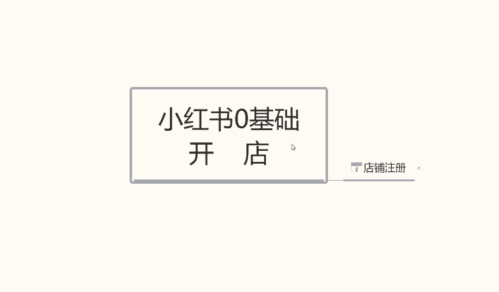
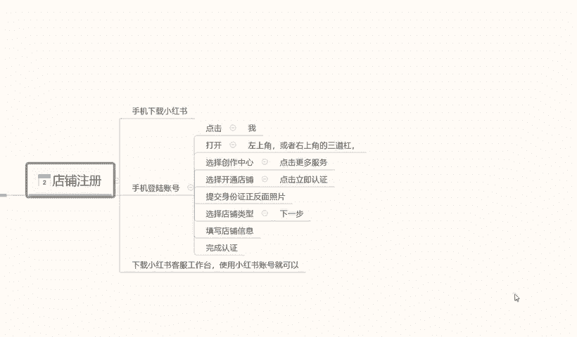

# 140分钟学会小红书运营-原来打造爆款笔记这么简单！！！小白零基础入门必学的小红书笔记公式拆解，最简单的起号教程，快来学！！！ - P3：1.小红书店铺注册 - 红书教程1 - BV1o629YMEjv

大家好，今天给大家分享个小红书零基础开店的第二课时啊，小红书的一个店铺注册。呃，废话不多说，那直接进入我们今天的一个内容。

店铺注册小红书店铺注册的话，相当于来说的话，还是有一需要我们注意的一些选项。因为它的一些店铺注册的内容的话，它不是很好找啊。在我们系台后台系统里面的话，它隐藏的比较深，它不像其他的呃。

其他的平台直接打开就可以注册。首先呢我们店铺注册的话，就是说我们的用个人的手机就可以啊。当然你如果说有备用的多余的手机，用工作的手机去操作的话也行。啊，用手机下载小红书。他的一个系统就可以了。

手机下载小红书系统以后的话，账号注册。首先我们手机号登录我们那个账号啊，账号登录进去以后的话，点击我们那个它这个的话其实和微信一样在。右下角啊点击我们的那个人物头像就可以。就被进入到我们的个人中心。

然后登录账号就行。登录账号的话呃，它这个里面的话有一个小红书注册。之前的话上节课内容也给大家讲过了我们的一些开店基础的一个准备，让家让大家是准备给我小红书注册的一个账号的，登录这个账号以后呢。

在右上角啊，点击我打开在右上角。或者是左上角它有一个三角的一个斜杠啊，点击这三条杠以后的话，选择创作创新。点击创作中心以后呢，然后点击更多的一个服务。更多服务进去以后的话，大概在。第三排。

选择开通店铺啊，就是第三个方框，它那里面的话是分为了四五个方框，每个方框里面的选项内容不一样啊，那个呢是设置我们的一个账号信息的，其他的不用管，直接选择我们的一个店铺开通就可以。然后点击进去以后。

它会显示一个界面。界面的话，它是以广告的形式推荐给我们的。我们在里面的话，它有一个点击立即认证就可以了。点击进去就可以注册账号，其他的东西的话，其实是不用看的，因为看了也没什么作用。

我们对我们新手来说的话，那些东西看不看无所谓啊，点击立即认证的以后的话，按照它的一个正常步骤走就可以了。然后提交我们之前准备提前准备好的一个材料，提交身份证的一个正反面，然后选择店铺的类型。

这个里面的话注意一点啊，店铺的类型的话，它是分为三个类型的个人点企业店或者说是啊旗舰店等等。这里面的话，我们正常前期操作啊，不管大家怎么样。如果说有熟悉的话，可能就不需要了解这一点了。如果说不。

熟悉的话啊，大家开个个人店就行了。因为个人店的话，本来就是让我们上手去实验操作的。本来做任何数据啊，我们不管是做电商也好，或者是做电下的店铺也好，我们大家都要有一个熟悉的过程。熟悉了以后的话。

我们再按照这个模式去操作就可以了。所以说大家一定就要注意的。我们前期开个个人店铺自己先把所有的流程熟悉或者再去操作。不然的话，我们所有的一个信息的话，基本上。就是我们前面用力过猛。

你后面就会对这些东西失去兴趣。为什么？因为我们前面已经失败，你后面再做的话，就会对自己产生不那么信任的一种感觉。就是说你做多了以后的话，你自己就放弃了。如我们在做任何东西的时候，一定要先把自己的一个。

基础确认。我们技术确认好了以后，我们有一定的基础了再去操作。所以说我给大家讲这些内容的话，就是我们按照步骤一步一步走，不要超之过急。前面的话我们没有必要直接就是说上来一一下投个几万呃，上10万。哎。

我非要把这个店做起来，没有必要啊。我们刚开始做店的话，投个两三千0块钱，三五千0块钱，其实是。花个一个多月，两个月时间，把整套流程熟悉了以后的话，后面会节约我们很多时间。所以说大家注意点啊。

然后记住我们的一个内容，手机号登录。到达我们的一个选择店铺类型啊，选个人店铺就行了，其他的不用选了。因为能看这个课程的基本上都是新楚。所以说大家了解一下就行啊，然后填写店铺的一个信息。这些信息的话。

后面是可以修改的，我们随便填写一下，把信息尽量填准确就行。尽量的话就是在后期不要去修改，修改的话嗯，影响是有，但不是很大啊，就是说没有必要啊，一次性弄好就行了。店铺信息填写完成以后呢。

我们再进入下一步啊，直接完成我们的一个认证完成。我们的一个小红铺店铺基本上呢就已经注册成功了。它注册成功的话是3天的有3天的一个反馈时间。但是基本上的话5到10分钟，它的反应对于其他平台来说的话。

会稍微慢一点。如果说我们去某多呀，或者说某宝去注册，或者说是。呃，其他的这种交易平台去网网络交易平台去做的话可能会快一点。但是小红书这边的话，因为它的系统还不是很完善，所以说我们有很多操作的空间。

但是呢它同时它的一个系统反应速度有点慢。快的话5到10分钟，慢的话可能要一天左右啊，基本上都在这个时间范围以内。他的店铺才会注册成功，注册成功利润以后的话，我们才会去操作项目。嗯。

也然后呢这节课最后一个点就是说我们把账号注册成功以后，在手机里面还要下载一个东西。这个东西呢叫小红书的一个客服工作台啊，客服工作台的话，它和小红书的店铺的话呃，是类似的。但是它是做我们售后的。

就是我们店铺里面来订单以后的话，会需要这个小红书的一个客服工作台，它直接在小红书里面操作啊，操作不了的，没办法去聊天沟通。它相当于是额外引流到了另外一个平台里面去做啊。

所以说大家一定要把那个小红书的客客服工作台给下一下啊，这个呢就是这一课的一个店铺注册内容。下节课呢给大家讲解一下小红书整体的一个店铺类型的一个区分啊。我们前面要做的话，我们到底去做什么店伺合我们。

