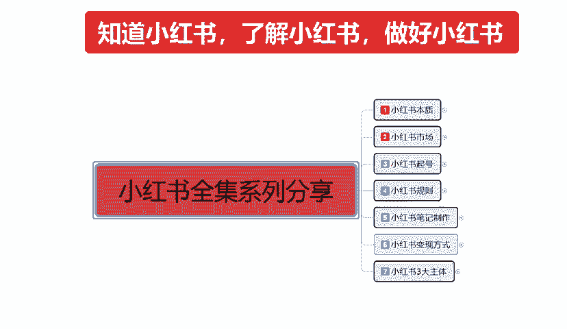
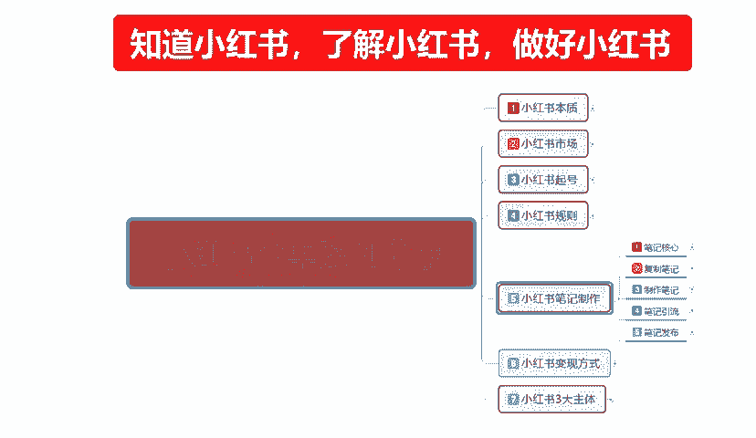
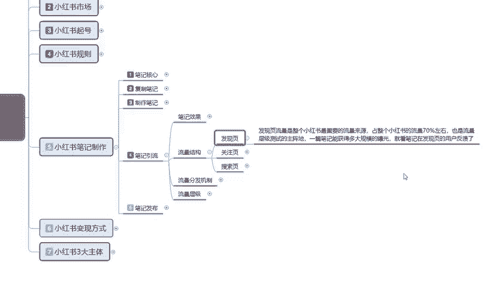
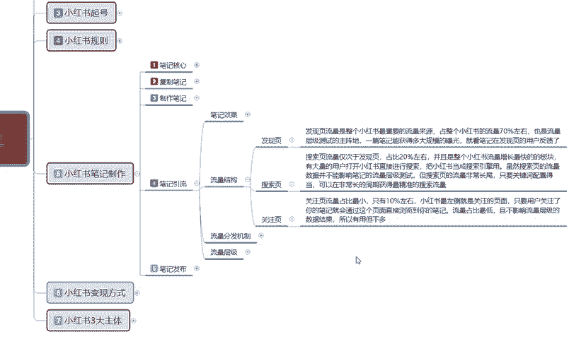
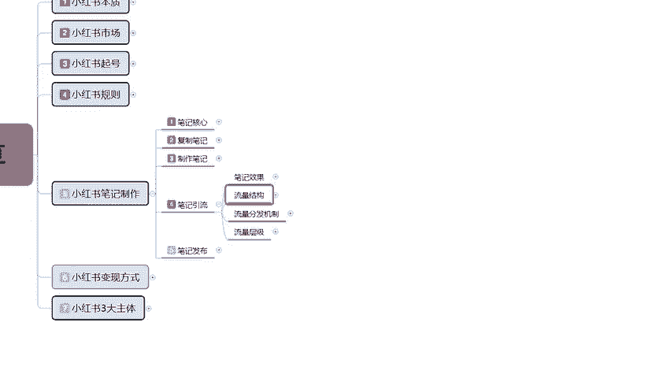

# 140分钟学会小红书运营-原来打造爆款笔记这么简单！！！小白零基础入门必学的小红书笔记公式拆解，最简单的起号教程，快来学！！！ - P40：28、小红书笔记引流：平台流量结构 - 红书教程1 - BV1o629YMEjv

大家好，这一节给大家分享的是小红书全集系列。第五大课时以及制作的内容分享。

这节课呢主要是给大家分享一下我们笔记引流的一个整体流量结构。

呃，废话不多说，直接开出我们的一个正题。什么是流量结构啊？这个流量结构的话呃，因为之前呢给大家说过流量的话，它是有一个呃笔记的一个整体引流效果。这节课给大家讲的流量结构呢是小红书整体流量分布和流量来源。

主要就是说让我们大家了解我们什么样的笔记投入到什么样的地方，他们能获得什么样的效果。小红芦笔记里面整体的一个流量结构的话，其实是分为三个点的。第一个是发现页，第二个是关注页，第三个是搜索页。

我们大家只需要把手机打开。就可以在手机上面啊第一个页面发现一个关注。一个一个发现。还有一个本地城市的一个页面显示。这个城本地城市页面显示呢，我在这上面呢是没有给大家进行标注的。

因为它的话是额外给大家进行讲解分析的。他这个的话，我们现在看到的是两个，一个发现，一个关注，还有旁边一个放大镜，那个是搜索。这次三个主页面啊，那个本地的页面的话，现在对我们来说它不是太适用。

它比较适用的话是做分析用的啊。我们在这个里面的话，你去发布产品，发布呃等等一些东西的话，它都是地域性的。它的一个搜索结构的话都是非常明显的。你比方说你在北京也好，上海也好，广州也好，深圳也好。

它都是地域性的，显示的是我们要做素材，我们做店铺也好，做属性也好，去找素材的话，去本地里面去找啊，他们喜欢的什么样的一个类型，本地人喜欢什么样的一个特色，本地人宣传的都有一些什么样的东西，去找素材。

去这个里面找可以。但是有一点啊。你们大家要弄清楚了。尽量少的去宣传地域内容。如除非你说你是做户外的一个博主。做美食的一个介绍。啊，北京哪哪拿什么东西好吃，上海什么地方东西好吃，对吧？

浙江杭州等其他省份的东西好吃，有什么评价，哪里吃花费少等等。你做这种博煮类的啊，你可以用这个。如果说我们要做商品，要做引流，要做推广，尽量不要去用这个地域的一个引流。因为他的一个笔记发布出去以后的话。

通过这种。地域形式的一个搜索的话，它会打乱你整个账号的标签。懂意思吧？就是因为它这个里面的话，它是显示离就近隔离位置越近，发布时间越短，效果比较好的那种展示，点击比较多的。他的暂时就越多。

所以说我们尽量的话就不要去做那个本地的一个呃，就是你当前所在区域的这一种。搜索比效果，它的话只能说做引导用的。你要去做这个方面的一个流量搜索的话，呃，只有特定的人特定的是物品能做特定的人特定的物品。

特定的人群能做。其他的你做这个的话，你说实话不好做啊，除非说是我是卖熟食的，完在抖音上面开个小的一个熟食店，把我的产品宣传一下，有谁要的话，我可以送货上门等等。你做这种啊，做本地的可以。

你要是想把它做大。卖到全国各地，那你就千万不能碰这个。因为这这这个的话是两种选项。你做了本地，你就不能做全国，你做了全国，你本地的市场，你就尽量要避免它。因为本地市场的话，它的一个整体属性是非常混乱的。

它里面什么内容都有。懂意思吧，就是他不是你所需要的人群。😡，你本来你卖吃的人，人家是专门来看美女的那跟你有啥关系啊，对不对？啊，看美女有可能不带点吃的啊，你要这么想，我也没办法，对吧？

比如说它的整体结构是不一样的。笔记引流这个整体流量结构的话，其实就是三个点。发现页、关注页和搜索页这三个重点啊。首先我们了解一下什么是发现页，发现页啊，它是它的一个流量。

是整个小红书最要最重要的一个流量来源，占整个小红红书流量的70%左右。也是流量层级测试的主阵地啊，一篇笔记能获得多大规模的一个曝光。就看笔记在发现页面的一个用户反馈。什么意思呢？之前也给大家讲过啊。

账号。权重。影响你店铺流量的一个。基础属性点，也就是说你每发一篇笔记，根据你账号权重，可能会给你12000。的一个基础曝光量，这基础曝光量70%左右的一个数据量基本上都在发行页。

但实际上是百分之百都在发行页，他不可能去关注页和搜索页。关注页和搜索页是。长期在小红书上面进行呃。浏览观察、沟通购物。所使用的。我们正常刚开始小红书，你账号也好，其他是属性也好。

你的小红书笔记发现以发送以后，基本上全部都是在发现页。它整个流量占比的话是70%，剩下30%的话，基本上都在关注页和搜索页里面啊，他们的目标是很明确的。人家不是来看你的，不是来看你这个这种新手小白的。

人家是来看成品的。那么他们有自己的一个全体目标。

这个就是发行页，关注页是什么呢？😡，搜索页。这个顺序按全错了啊，这个是搜索页。这一刻呢应该是这这一点呢应该是搜索页。搜索页的流量的话，它是仅次于发现页的，占比是20%左右。

就说那个放大镜旁边我们搜索商品的一个搜索概率的话，大概是有20%。并且是整个小红书流量增长最增长最快的一个板块。为什么小红书固定的人取进来的流量已经达到了3亿，它后续再进来的话，它的访客也不会那么多。

目前的话就是已经达到它的一个呃不能说承受上限啊，是容量上限。为什么？😡，中国就这么多人。已经有接。接近5分之1的人。超过5分之1的人进入小红书了，剩下的基本上抖音。买东西的就是淘宝。

拼多多、京东啊唯品会等等这些大型的一些呃交易市场。但是小红书它既然有3亿的一个流量。涌到这边来了，它后续的增长的话，它会放慢。因为了解过的知道的对小红书有兴趣的，他基本上陆陆续续已经参加的差不多了。

所以说他现在的流量是基本上是固定的。那么固定了以后，因为小红书它也有。好多年了啊。只是最近这一年开始推广的一个商品。它的商品慢慢显现出来以后的话，它3亿的一个用户量里面。但是搜索商品的用户量。

它正在慢慢的增加。它不像淘宝拼多多，他们是主推商品，不像抖音，它是主推类。小红书它是一个综合体，它推广这些东西的话，它也是需要有资金来源的。为什么说收现页搜索页仅次于发现页占比20%左右。

就是因为小红书的固定用户越来越多。就是它的前景是越来越好，而淘宝和拼多多在走下坡路，抖音它只是综合发展，他们也想往商品方面去发展，但是它不好发展。为什么他只能适合去做带活啊，做网红做博主。

你要是真想在抖音上面去开个店铺去卖产品的话，我说实话卖不出去。那都是人家网红跟厂家联合好了以后，直接有厂有厂家让网红帮忙宣传广告，给佣金赚钱的。啊，它和小红书不一样，小红书我们是给自己做的对吧？

我自己就是网红，我自己就是商家。这种模式是不一样的。所以说搜索页的流量20%占比，其实它整个消费观念的话是占百小红书70%的一个量。什么意思呢？就是小红书里面直接成交的一个概概率的话。

搜索页面占了70%。剩下30%就是在八线页和关注页里面进行成交的。他们会在这个里面看。观看笔记、观看视频，观看图片，观看内容，然后感觉对这个物品感兴趣，然后去做成交，他们才会在发现页和关注页里面去成认。

正常的搜索页的话，它的成交比例可能会超过70。到80甚至更多。不会低于这个概念。那么搜索页的整体流量占比比20%。我们前期账号创建以后的话，我们可以去抢他的市场嘛。不可以。啊，因为我们抢不到。

我们现在能做的只有发现。搜索页的市场的话是需要靠商品。就是你小红书账号起来以后，靠你的商品笔记去做推广。它的转化率高，那你的商品比例你前期没有权重的情况下，你没有关键词，没有搜索，没有成交，没有转化。

没有评价，没有评论，你都做不了。啊，这后期我会给教大家呃了解一下小红书的整体三大主体里面的一个商品。就是我在小红书上面，我不光看要创建账号，账号里面我还要有店铺，店铺里面我还卖商品。

商品的话它还要有权重。要综合这些数据才可以啊，这个就是搜索页，它整个业内流量占比的话是接近20%。最后一个是关注页。关注页虽然说它的量最小，但是它的人是最精准的啊，而且这部分人的兴趣爱好。

你把它适应了以后，你投其所好的话，你想把它去引做引流也好，做成交也好，其实都是非常容易的。关注的。数量也多，你做额外的引流啊，去推去其他的一些呃什么微信群啊，QQ群啊啊，微博呀等等去推广自己的产品。

推广自己的东西的话就比较好用一点啊，这帮人。怎么说呢？就是说关注页的话，你去做流量推广可以啊。关注页的流量占比的话是最小的只有10%，而且还不到。说实话，它的整体的话是在7%左右。

我只是说给大家列了一个大概的数据，让大家进行一个了解啊。小红书最左侧的就是关注注页页面啊。只要用户关注了你的笔记就会通过这一个页面，直接浏览到你的笔记，流量占比最低，且不影响流量的乘级数据啊。所以。

有用。但是不多不兑象不影响流量的一个成绩，是什么意思呢？就是。在关注页里面去观看你的产品所发布的一个流量笔记的话，它是不计入基术权重的。就比方说我有1万个关注，我一个笔记发出去以后。

这1万个人就都都来观看我这个篇笔记，我这篇笔记能报吗？答案是不能。因为你发现液的基础展示量。只有2000点击率可能不到5%，你怎么报，对吧？就算是你关主也给你把他的一个点击击小眼睛控制到1万以上。

他也报不了。啊，大家一定要明白这个点啊，当然你真要有一万的话，其实也已经算爆了。但是我们前期的话是没有那么多关注。啊，也能有个十几2十3十5十102003五百0就已经不错了。你要真要用。量变引起质变。

你起码要5000个关注以上，就是你的笔发出去，最少要有5块5000个人在一天或两天三天之内给你把关注数量点上去，他才有。不然的话。做发现液。发现也做好做搜索，搜索做好做关注。啊，这是顺序。

也是我们流量密码的一个钥匙。这个呢就是小红书整个平台的一个流量结构来源啊，主要是让大家了解一下，我们笔记做好以后，我们先做什么，再做什么，最后往什么地方去投去放。好吧，那这节课的分享呢就给大家讲到这儿。

下一节呢给大家讲解一下我们的一个流量分发机制。

刚刚讲的是流量的一个结构啊，下一节给大家讲流量分发机制。

