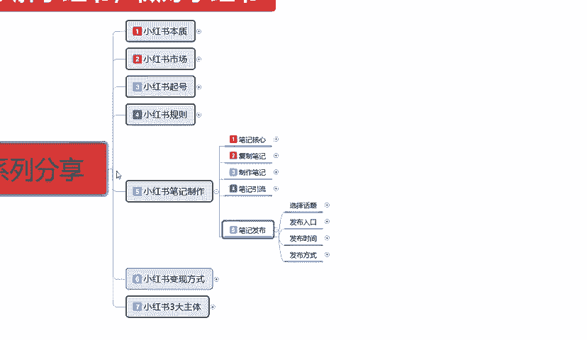
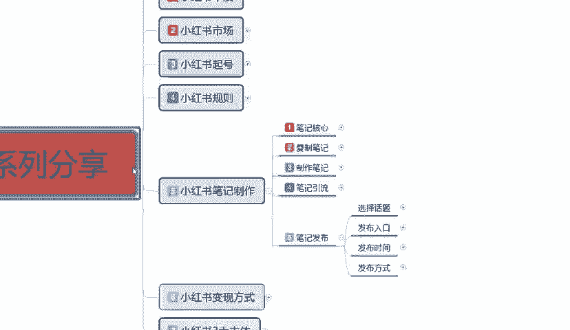
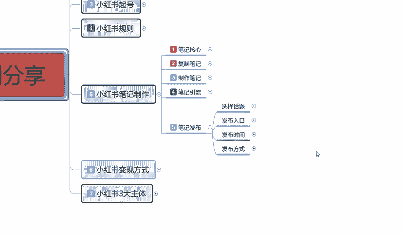
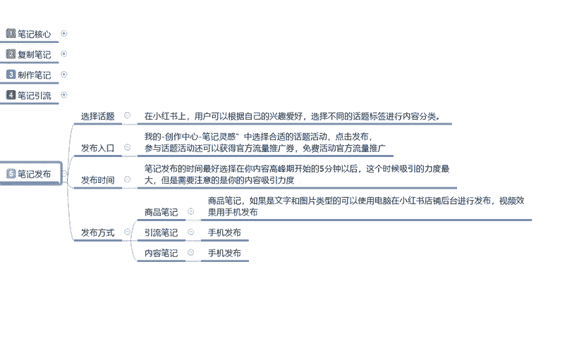
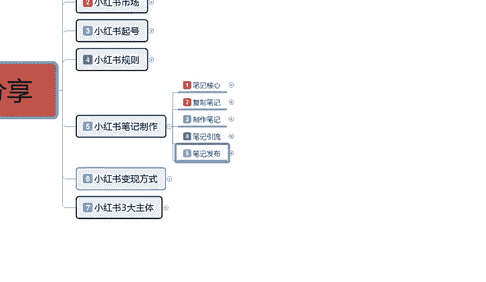
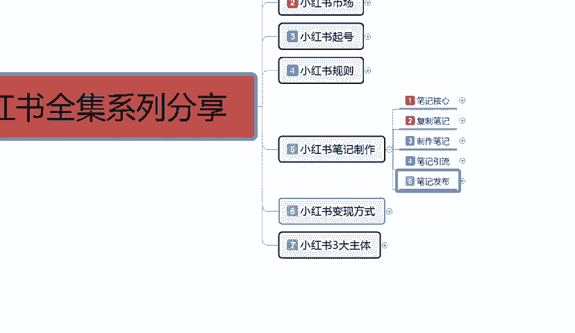
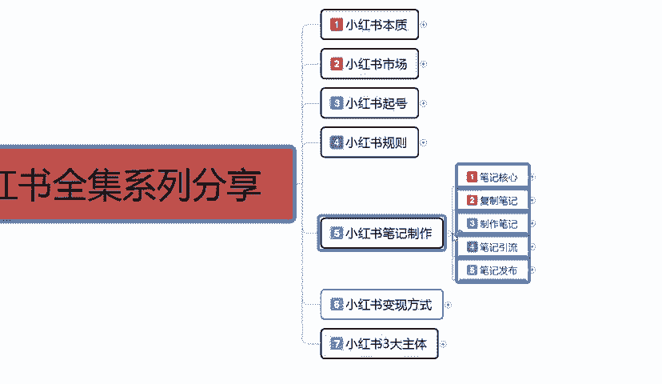
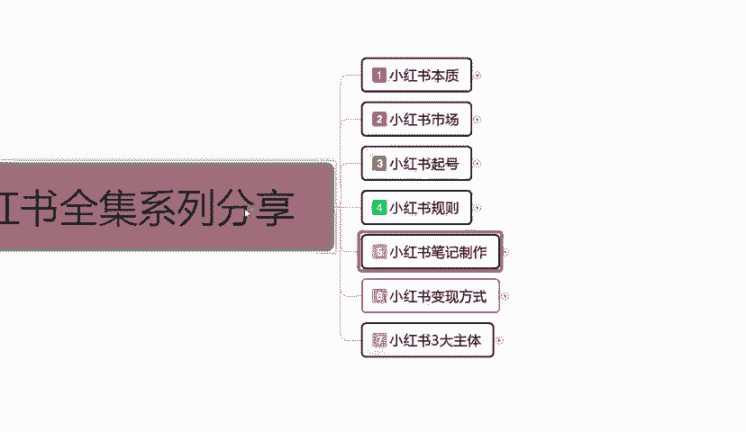
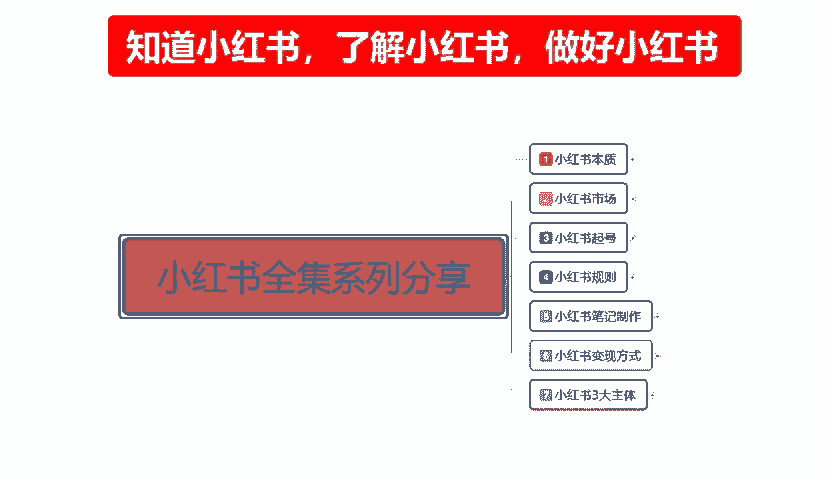

# 140分钟学会小红书运营-原来打造爆款笔记这么简单！！！小白零基础入门必学的小红书笔记公式拆解，最简单的起号教程，快来学！！！ - P43：31、新手小红书运营-小红书笔记发布 - 红书教程1 - BV1o629YMEjv

大家好，今天给大家分享的是小红书全集系列的一个课程。第五大节小红书笔记制作的最后一节课。笔记发布。这一课的话主要是给大家讲解一下我们这个。小红书啊，笔记做完以后，它里面笔记发布它都是有技巧的。

它不是说我们笔记做完了，然后跟着它的程序直接去发布就可以了。他说要根据我们的内容选择。对应的去发布啊，发布到你所需要的一个位置，而不是说我们随意的进行一个发布。它这个里面都是有权重上限的。

那么这节课呢我们就来了解一下啊，小红书笔记发布的一些呃注意细节和技巧。

首以我们来了解一下小红书笔记发布的话，我在这里呢是给大家分成了四个步骤。第一个呢是话题的一个选择。第二个是发布入口，第三个是发布时间。最后一个呢是发布方式。这几个的话其实看着是比较简单的。

但是我们在里面的话有很多需要注意的一些细节去我们去操作的。

首先呢是选择话题，在小红书上面，用户可以根据自己的一个兴趣爱好，选择不同的一个话题标签进行内容分类。就是我们账号前期呃。一个整体定位。比方说嗯食品美妆服装等等之类的，他。呃，就是兴趣爱好。

你正好创建初期的时候有个兴趣爱好，这个兴趣爱好的话，它是可以调整的。啊，当然了，我们也不要过分的经常的去修改。懂意思吧？就是说你的账号如果说已经创建好了我但是我现在的话。

我想选择的类目和我的兴趣爱好符合程度不高。我们可以去这个小红书后台系统里面用手机登录。点击我，然后那边有一个设置，点设置里面的话有一个兴趣爱好偏好设置啊，把我们的兴趣爱好偏好设置把它改成一个。

它里面有一个兴趣偏重选项，我们把它选择一个。然后的话选择对应我们商品笔记也好啊，引流笔记也好，内容笔记也好，就是我们所发布的笔记所需要对应的一个人群。然后再去发布。这个呢就是话题的一个选项。他的话。

如果说我们选择的一个。数据越少，它就越精准啊，挖不出去的话就是对应的人群，他喜爱程度的话就会高一点，整体提升我们的一个数据点击率。你的一个点击不起来的话，那个小眼睛数量撑不上去。

整体的一个笔记效果的话是暂示它有上限的，知道吧？就是根据我们账号权重来的，账号权重里面的话，它还有一个呃笔记引流的整体，它里面有一个笔记层级的。上一节课呢我也给大家讲过了啊，笔记成级分为8个层级。

你的书你的小红书笔记如果说没有问题的话，基本上都能到达第三第四层级。第五层级的话就要我们精心制作。啊最高的话也就是到达第五层级。不付费的情况下啊，你要付费的话，就第六第七第八都有可能。

只是说你没我们现在的话，你刚了解小红书不可能有那么大的能量。基本上如果说你是刚创建账号的话，就在第一第二成绩。大概半个月以后的话，会到第三层级。第四层级的话就需要时间的一个累积，慢慢的往上面走啊。

一直到第五层级。这个呢就是小红书，我们要注意的一个选择话题啊，就说我们前期为了做数据。把你的账号全重拉起来，你的话题。人数不要限制太多，知道吧？你就说我们现在有小红书平台给了你1000的展示量。

那1000的展示量，你要把1000的展示量尽可能的投入到我们选择的一个分类内容里面去。因为你投入到其他地方的话，它不可能给你太多的一个点击呢。所以我们在操作的时候，一定要把话题选择对了。

不然后续的话你不好弄。第二个就呢就是发布入口啊，发布入口的话其实是比较简单的。它的话就是说在我的操作中心里面有一个比基灵感中选择合适的一个话题，点击发布就可以。这里面的话。

它系统小红书平台系统里面有一个参与话取活动，还可以获得官方流量的一个推广券，免费活动的一个官方流量推广券啊。这个的话你当任务去做就可以了，不要把精品笔记往这个里面放，精品笔记往这个里面放也行啊。

但是尽量的话就是说我们推广笔记的时候，你不要太在意这个官官方的一个发布入口。你把它的任务完成以后的话，你正常发你的笔记就可以了。你不别能说是因为我为了完成任务而多发没有用的笔记。那样的话。

他会把你整个权重的话给打乱的，知道吧？就说你要做这个官方任务可以做。但是你的笔记一定要按照精美程度去做。先笔记内容的一个整体整体权重拉起来了以后，你再去考虑它这一部分的推广流量。不然的话。

他现在给了你推广的流流量，你的笔记效果达不到他的一个需求量。那后续的话他会降权的。他后续他就不会关注你了，他整个系统的话就把你筛选到不合格的一个范围以内。你后续发布的所有笔记的话，它都在这个范围以内。

你再想把它做起来就不好做了，懂意思吧？我们先要内容的一个整体质量，再去考虑完成官方的一个推广流量任务。第三个呢就是发布时间。比发布时间的话，最好呢是选择在我们内容的一个高峰期。开始前5分钟去发发布。

这个时候的话他的一个吸引力度是最大的。也就是说对同类产品感兴趣的人，他们在休息的时间逛小红书，观看他们所感兴趣的内容的时候，我们要提前5分钟入场。就是你的笔记要提前5分钟入场系统一个反应时间。

然后的话在这个高峰期的时候，它会刷新，它的数据虽然是是随时刷新的。但是同类型的一个人员数量在这个地方，提前5分钟入场。那有些朋友就可能会呃。比较不好把握这个时间。因为我们的笔记做出来以后的话。

你做完以后你去发布的话，他有时候审核时间在10分钟、20分钟、30分钟、50分钟。其实这个的话是可以避免的。你到3天到5天以后的话，你的整体笔记，你把它熟悉了以后，有自己的风格了以后。

你就可以卡这个时间。没有自己风格的时候审核时间市长，有自己的风格，图片的一个形式文案的一个形式文案的一个内容等等，把自己的风格体现出来以后，它系统审核的时间就会缩短。基本上的话就是5到10分钟。

快的话可能一两分钟就给你把它审核上去，然后直接一更新，它就有数据出来了。慢的时候可能要几个小时。但是几个小时的话，基本上都是我们账号刚创。刚创建，然后了解呃对小红书不是很了解。

然后的话随便编辑了以后发送上去它的系统读取你的一个小红书笔记的一个状态要很长时间。或者说是职业不过损。所以说发布时间卡时间段的话，其实我们把小猪了解一段时间，你有自己的程序以后的话，基本上都是很快的啊。

这个卡前5分钟的一个高峰期发笔记绝对是可以做到的。所以说大家一定要把这个啊给了解一下。然后呢，就是发布方式。发方式多话？商品笔记引流笔记和内容笔记啊，它不一定都是要手机发布的。

商品笔记建议大家是用电脑去发布啊。引流笔记和内容笔记用手机发布。为什么？商品笔记的话，它说实话它主要是编辑的一个商品，商品的内容详细细节的话，用电脑去编辑。它的效果会好很多。

如果说你用手机去编辑你的上面笔记的话，那些说实话，你编辑出来以后，你再去发布到手机上面。它整体的一个图片，我们先不说别的，它它图片的像素它都跟不上。懂意思吧？就是它整体的一个清晰度，它是跟不上的。

我们要做的话，其实引流笔记和内容笔记说实话，按照正常来算，也是应该用电脑发布。只是说在手机上面发布的话，它的一个流量效果好一点啊，匹配的。你用电脑发布，别人观看的时候，他不管是用手机观看。

用电脑观看小红书也好，它的一个形式的话都是偏向于电脑。手机发布就是偏向于手机。所以说引流笔记和内容笔记的话，一般都是用手机去发布啊。商品笔记也可以用手机发布。你编辑好了以后，把文案放进去。

放到我们的一个手机手机内存条里面，然后用手机再次进行编辑再发布就可以了。这个呢就是整体的一个笔记发布啊，同时呢也是我们这个小红书笔记制作最后一节啊，包括我前期给大家讲的，因为小红书我笔记制作。

我在上课之前呢，我就已经给大家说过了。这一整套课程的一个内容是非常多的。

你说他复杂是对于新手，对于我们对整个网络运营系统，网络营销的一种方式不熟悉的人，他可能会。怎么说呢？就是我讲的这一整套课程，他可能会不是太理解。所以说但是呢我在这里的话，建议大家呢把我这一整套课程。

多听几遍。啊，对你有很大的一个帮助。如果说你这个听得懂的朋友，他基本上就是了解这里面有一些技巧。只是说我再给你们补充一下，让你们整体了解一下。如果说你的小红书笔记这一课的话，说实话它是最重要的一节课。

你上面这几个不懂，我们可以慢慢学。但是这个你不懂的话，你后面你学都不好学。

所以说你要想把小红书做好，笔记制作是第一要义，因为它就是你的流量来源。

好吧，那么这一节的课呢就给大家分享到这儿，整个一个小红书笔记自作呢也就给大家分享完了。下一节呢是给大家。

啊，讲解一下小红书的一个变形方式。什么叫小红书的变现方式呢？就是说我们小红书的话，我们不光有卖商品变现这一个方式，而且小红书上面卖商品，说实在的，你要想靠它去变现的话，难度。嗯。不亚于平地起高楼。

因为你是没有整体数据的，你要在想在小红书上面，说实话，小红书3亿用户。你看见有多少店铺直接靠店铺做起来的啊，很少。好吧，那么这一期这一节的分享呢就给大家分享到这里。

